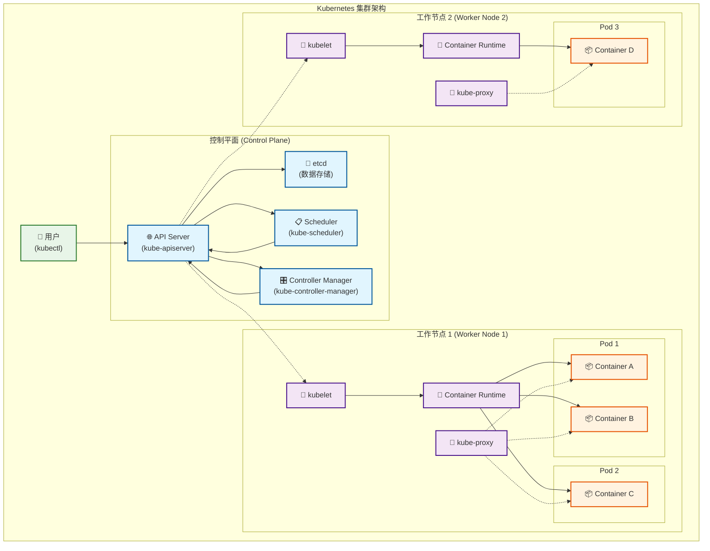
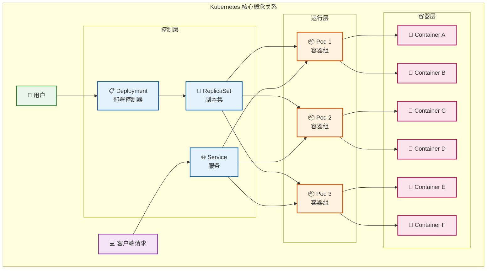
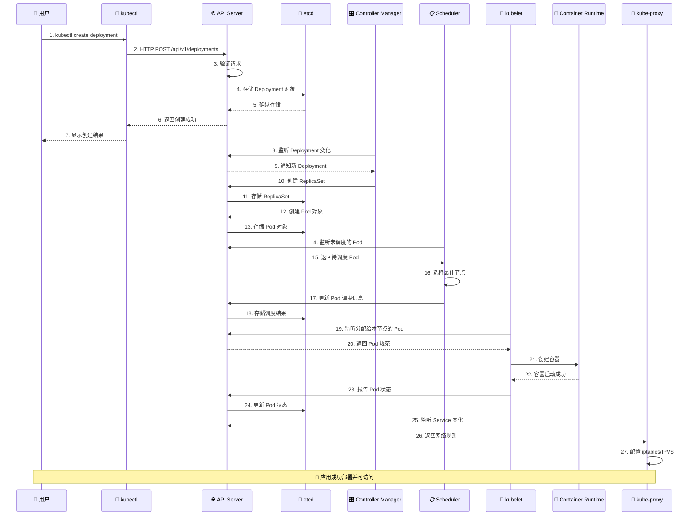

# 1. Kubernetes 架构

## 1.0 目录

- [1. Kubernetes 架构](#1-kubernetes-架构)
  - [1.0 目录](#10-目录)
  - [1.1 为什么选择 Kubernetes？](#11-为什么选择-kubernetes)
    - [1.1.1 传统部署方式的挑战](#111-传统部署方式的挑战)
    - [1.1.2 容器化的优势](#112-容器化的优势)
    - [1.1.3 Kubernetes 的价值](#113-kubernetes-的价值)
    - [1.1.4 Kubernetes 的核心优势](#114-kubernetes-的核心优势)
  - [1.2 Kubernetes 架构](#12-kubernetes-架构)
    - [1.2.1 整体架构概览](#121-整体架构概览)
    - [1.2.2 控制平面组件（Master 节点）](#122-控制平面组件master-节点)
      - [1.2.2.1 API Server（kube-apiserver）](#1221-api-serverkube-apiserver)
      - [1.2.2.2 etcd](#1222-etcd)
      - [1.2.2.3 Scheduler（kube-scheduler）](#1223-schedulerkube-scheduler)
      - [1.2.2.4 Controller Manager（kube-controller-manager）](#1224-controller-managerkube-controller-manager)
    - [1.2.3 工作节点组件（Worker 节点）](#123-工作节点组件worker-节点)
      - [1.2.3.1 kubelet](#1231-kubelet)
      - [1.2.3.2 kube-proxy](#1232-kube-proxy)
      - [1.2.3.3 Container Runtime](#1233-container-runtime)
    - [1.2.4 核心概念解释](#124-核心概念解释)
      - [1.2.4.1 Pod](#1241-pod)
      - [1.2.4.2 Service](#1242-service)
      - [1.2.4.3 Deployment](#1243-deployment)
  - [1.3 工作流程示例](#13-工作流程示例)
  - [1.4 小结](#14-小结)

## 1.1 为什么选择 Kubernetes？

### 1.1.1 传统部署方式的挑战

在传统的应用部署方式中，我们面临以下挑战：

- **资源利用率低**：应用直接运行在物理服务器上，资源无法充分利用
- **扩展困难**：需要手动配置和管理多台服务器
- **环境不一致**：开发、测试、生产环境差异导致"在我机器上能运行"的问题
- **故障恢复慢**：服务器故障时需要手动迁移应用
- **部署复杂**：应用更新和回滚过程繁琐且容易出错

### 1.1.2 容器化的优势

容器技术（如 Docker）解决了部分问题：

- **环境一致性**：应用和依赖打包在一起
- **资源隔离**：容器之间相互独立
- **快速启动**：秒级启动时间
- **轻量级**：比虚拟机更节省资源

### 1.1.3 Kubernetes 的价值

但是，当我们需要管理大量容器时，仍然面临挑战：

- 如何自动化容器的部署和管理？
- 如何实现容器的自动扩缩容？
- 如何处理容器故障和自愈？
- 如何实现负载均衡和服务发现？
- 如何管理配置和密钥？

**Kubernetes 就是为了解决这些问题而生的容器编排平台。**

### 1.1.4 Kubernetes 的核心优势

1. **自动化部署**：声明式配置，自动部署应用
2. **自动扩缩容**：根据负载自动调整容器数量
3. **自愈能力**：自动重启失败的容器，替换不健康的节点
4. **负载均衡**：自动分发流量到健康的容器
5. **服务发现**：自动发现和连接服务
6. **配置管理**：集中管理应用配置和密钥
7. **滚动更新**：零停机时间的应用更新
8. **回滚能力**：快速回滚到之前的版本

## 1.2 Kubernetes 架构

### 1.2.1 整体架构概览

Kubernetes 采用主从架构（Master-Worker），主要包含两类节点：

- **控制平面（Control Plane）**：管理集群的大脑
- **工作节点（Worker Nodes）**：运行应用容器的地方

### 1.2.2 控制平面组件（Master 节点）

#### 1.2.2.1 API Server（kube-apiserver）

- **作用**：Kubernetes 的前端，所有操作都通过 API Server
- **功能**：
  - 提供 RESTful API 接口
  - 验证和处理 API 请求
  - 更新 etcd 中的对象状态
  - 是集群的统一入口点
- **比喻**：就像公司的前台，所有人进出都要经过前台登记

#### 1.2.2.2 etcd

- **作用**：分布式键值存储，保存集群的所有数据
- **功能**：
  - 存储集群状态信息
  - 存储配置数据
  - 提供数据的一致性保证
- **比喻**：就像公司的档案室，记录所有重要信息

#### 1.2.2.3 Scheduler（kube-scheduler）

- **作用**：负责将 Pod 调度到合适的节点上
- **功能**：
  - 监听新创建的 Pod
  - 根据资源需求、约束条件选择最佳节点
  - 考虑亲和性、反亲和性等策略
- **比喻**：就像酒店的客房分配员，为客人安排最合适的房间

#### 1.2.2.4 Controller Manager（kube-controller-manager）

- **作用**：运行各种控制器，确保集群状态符合期望
- **主要控制器**：
  - **Node Controller**：监控节点状态
  - **Replication Controller**：确保 Pod 副本数量正确
  - **Endpoints Controller**：管理服务端点
  - **Service Account Controller**：管理服务账户
- **比喻**：就像工厂的质检员，不断检查产品是否符合标准

### 1.2.3 工作节点组件（Worker 节点）

#### 1.2.3.1 kubelet

- **作用**：节点上的主要代理，管理 Pod 的生命周期
- **功能**：
  - 接收 Pod 规范并确保容器运行
  - 监控 Pod 和容器的健康状态
  - 向 API Server 报告节点和 Pod 状态
  - 管理容器的存储和网络
- **比喻**：就像工地的包工头，负责具体的施工工作

#### 1.2.3.2 kube-proxy

- **作用**：网络代理，实现服务的负载均衡
- **功能**：
  - 维护网络规则
  - 实现服务到 Pod 的流量转发
  - 支持多种代理模式（iptables、IPVS 等）
- **比喻**：就像交通指挥员，指导流量走向正确的方向

#### 1.2.3.3 Container Runtime

- **作用**：负责运行容器的软件
- **常见类型**：
  - **Docker**：最流行的容器运行时
  - **containerd**：轻量级容器运行时
  - **CRI-O**：专为 Kubernetes 设计的运行时
- **比喻**：就像汽车的发动机，提供实际的动力

### 1.2.4 核心概念解释

#### 1.2.4.1 Pod

- **定义**：Kubernetes 中最小的部署单元
- **特点**：
  - 包含一个或多个容器
  - 共享网络和存储
  - 同一个 Pod 中的容器总是被调度到同一个节点
- **比喻**：就像一个小房间，里面可以住一个或几个室友

#### 1.2.4.2 Service

- **定义**：为 Pod 提供稳定的网络访问方式
- **作用**：
  - 提供负载均衡
  - 服务发现
  - 抽象 Pod 的变化
- **比喻**：就像公司的总机号码，不管员工怎么变动，客户都能打通

#### 1.2.4.3 Deployment

- **定义**：管理 Pod 副本的控制器
- **功能**：
  - 声明式更新
  - 滚动更新和回滚
  - 扩缩容管理
- **比喻**：就像生产线的管理员，确保产品按要求生产

## 1.3 工作流程示例

让我们通过一个简单的例子来理解 Kubernetes 的工作流程：

1. **用户提交应用**：通过 `kubectl` 命令提交一个 Deployment
2. **API Server 处理**：验证请求并存储到 etcd
3. **Controller 监听**：Deployment Controller 发现新的 Deployment
4. **创建 Pod**：Controller 创建相应的 Pod 对象
5. **调度 Pod**：Scheduler 选择合适的节点运行 Pod
6. **节点执行**：kubelet 接收到 Pod 规范，启动容器
7. **网络配置**：kube-proxy 配置网络规则
8. **状态报告**：各组件向 API Server 报告状态

## 1.4 小结

Kubernetes 通过这种分层的架构设计，实现了：

- **高可用性**：控制平面可以部署多个副本
- **可扩展性**：可以轻松添加更多工作节点
- **模块化**：各组件职责明确，便于维护
- **声明式管理**：用户只需描述期望状态，Kubernetes 负责实现

这种设计让 Kubernetes 成为了现代云原生应用的理想平台。
