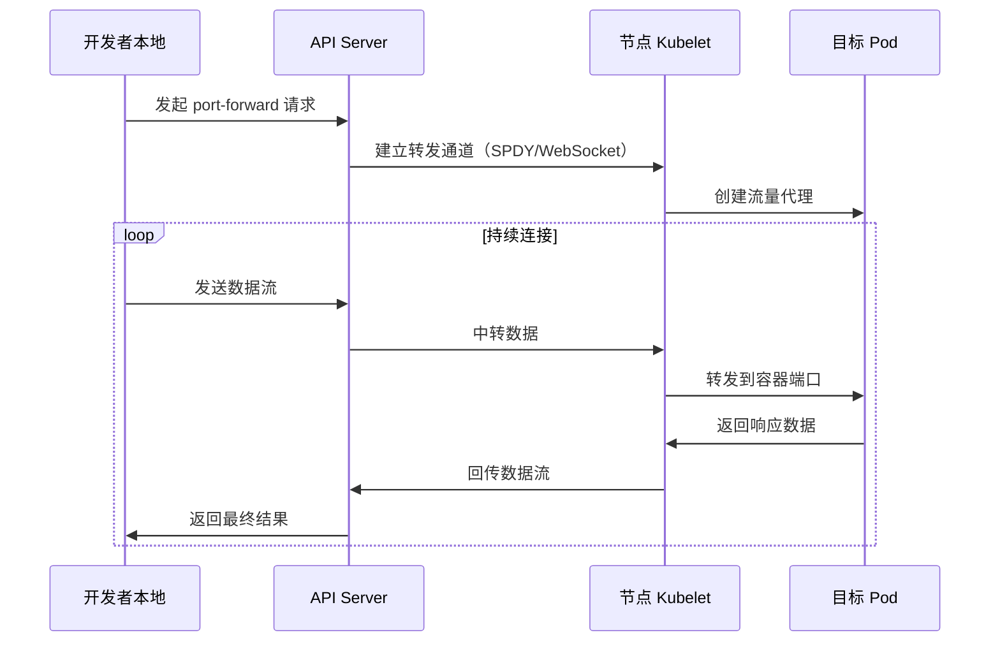

# Kubernetes 端口转发实战指南

## 1. 背景
### 1.1 Kubernetes 网络隔离性挑战
在 `Kubernetes` 集群中，所有资源都运行在私有网络空间（通常使用 `CNI` 插件构建 `overlay` 网络），这带来了以下调试难题：
- `Pod` 使用动态 `IP` 地址（生命周期短暂）
- `Service` 的 `ClusterIP` 仅在集群内部可达
- 生产环境通常禁用 `NodePort` 等暴露方式

### 1.2 典型使用场景
| **场景类型** | **具体案例** | **传统方案痛点** |
|----------|----------|--------------|
| **本地开发调试** | 访问未暴露的 `Web` 服务 `API` | 需要反复构建镜像部署 |
| **数据访问验证** | 连接临时数据库实例 | 暴露公网入口存在安全风险 |
| **故障排查** | 检查未配置监控的中间件 | 登录节点操作违反安全规范 |
| **CI/CD 流水线** | 自动化测试验证服务状态 | 依赖复杂网络配置 |

### 1.3 端口转发优势矩阵

| **特性**            | **kubectl port-forward**             | **NodePort** | **Ingress**       |
|---------------------|--------------------------------------|--------------|-------------------|
| 无需修改资源配置    | ✓                                    | ✗            | ✗                 |
| 临时性访问          | ✓                                    | ✗            | ✗                 |
| 支持TCP/UDP         | TCP               | ✓            | HTTP/HTTPS only   |
| 网络策略穿透        | ✓                                    | ✗            | ✗                 |

> **注意**：`kubectl port-forward` 目前仅支持 `TCP` 端口的转发，对 `UDP` 协议的支持正在 `GitHub` 的 `Issue` [Port-forward for UDP](https://github.com/kubernetes/kubernetes/issues/47862) 中进行跟踪。

## 2. kubectl port-forward 命令概述
### 2.1 命令语法详解

```bash
kubectl port-forward [TYPE/NAME] [LOCAL_PORT]:[REMOTE_PORT] [options]
```

**核心参数说明**

```bash
-n, --namespace string       指定命名空间（默认default）
--address stringArray        绑定地址（默认为127.0.0.1）
--pod-running-timeout duration 等待Pod运行的最长时间
```

### 2.2 多资源类型支持

```bash
# Pod 转发（直接访问指定Pod）
kubectl port-forward pod/nginx 8080:80

# Deployment 转发（自动选择最新Pod）
kubectl port-forward deployment/nginx 8080:80

# Service 转发（随机选择后端Pod）
kubectl port-forward svc/mysql 3306:3306

# StatefulSet 转发（指定序号Pod）
kubectl port-forward sts/redis-1 6379:6379
```

### 2.3 高级转发模式
#### 2.3.1 多端口转发

```bash
kubectl port-forward pod/nginx 8080:80 8443:443
```

#### 2.3.2 后台运行

```bash
# 使用 nohup 防止终端关闭后进程终止
nohup kubectl port-forward pod/nginx 8080:80 > portforward.log 2>&1 < /dev/null &
```

## 3. 端口转发原理剖析
### 3.1 流程图

**mermaid 语法：**



### 3.2 安全机制
1. **双向认证**：基于 `kubeconfig` 的客户端证书认证
2. **RBAC控制**：需要以下权限：
   
   ```yaml
   verbs: ["create"]
   resources: ["pods/portforward"]
   ```
3. **传输加密**：全程使用 `TLS 1.3` 加密

## 4. 实战说明
### 4.1 数据库访问（MySQL）

```bash
# 查看数据库Pod状态
kubectl get pods -l app=mysql --show-labels

# 建立端口转发
kubectl port-forward svc/mysql-service 3306:3306 --address 0.0.0.0 &

# 使用本地客户端连接
mysql -h 127.0.0.1 -u root -p -e "SHOW DATABASES;"
```

**验证结果：**

```sql
+--------------------+
| Database           |
+--------------------+
| information_schema |
| production_db      |
| metrics            |
+--------------------+
```

### 4.2 Web应用调试（React）

```bash
# 转发前端服务
kubectl port-forward deployment/frontend 3000:3000

# 转发后端API
kubectl port-forward svc/backend-api 8080:80

# 本地浏览器访问
open http://localhost:3000
```

### 4.3 监控系统对接（Prometheus）

```bash
# 转发监控端口
kubectl port-forward -n monitoring prometheus-server 9090:9090

# 访问本地Grafana配置
grafana-cli --address http://localhost:9090 admin reset-admin-password newpass
```

## 5. 故障排查与最佳实践
### 5.1 常见错误解决方案

| **错误现象**                                | **可能原因**        | **解决方案**                                                 |
|---------------------------------------------|---------------------|-------------------------------------------------------------|
| `unable to do port forwarding: pod not found` | **Pod未启动**        | **检查Pod状态**：`kubectl describe pod/[name]`              |
| `error: listen tcp 127.0.0.1:8080: bind: address already in use` | **端口冲突**        | **更换端口或杀死占用进程**：`lsof -i :8080`                |
| `error: timed out waiting for the condition` | **Pod启动超时**      | **增加超时参数**：`--pod-running-timeout=5m`               |

### 5.2 性能优化

1. **批量转发**：同时转发多个相关端口
   
   ```bash
   kubectl port-forward pod/nginx 80:80 443:443
   ```
2. **保持连接**：使用工具自动重连
   
   ```bash
   while true; do kubectl port-forward svc/redis 6379:6379; done
   ```
3. **网络诊断**：开启详细日志
   
   ```bash
   kubectl port-forward -v=9 pod/nginx 8080:80
   ```

### 5.3 安全加固建议
1. **最小权限原则**：创建专用 `ServiceAccount`
   
   ```yaml
   apiVersion: v1
   kind: ServiceAccount
   metadata:
     name: dev-portforward
   ---
   kind: Role
   rules:
   - apiGroups: [""]
     resources: ["pods/portforward"]
     verbs: ["create"]
   ```
2. **网络策略限制**：
   
   ```yaml
   apiVersion: networking.k8s.io/v1
   kind: NetworkPolicy
   metadata:
     name: restrict-portforward
   spec:
     podSelector: {}
     ingress:
     - from:
       - ipBlock:
           cidr: 192.168.1.0/24 # 只允许办公网络访问
   ```

## 6. Streaming 协议说明
### 6.1 SPDY
- `Kubernetes` 最初使用 **SPDY** 作为流式传输协议，支持 `kubectl exec`、`attach`、`port-forward` 等操作。
- `SPDY` 是 `Google` 开发的协议，但随着其被废弃，社区开始寻找替代方案。

### 6.2 HTTP/2
**HTTP/2** 是 SPDY 的继任者，具有以下优势：

  - 提供更好的性能（如多路复用、头部压缩）。
  - 支持流式传输和多路复用，适合 Streaming API 的场景。

**挑战**

- **复杂性**：`HTTP/2` 的实现比 `WebSocket` 更复杂。
- **兼容性**：需要在保留对旧版客户端支持的同时实现新的协议。
- **现状**：尽管 `HTTP/2` 具备技术能力，但 `Kubernetes` 并未默认在 `Streaming API` 中启用 `HTTP/2`。

> **注意**：`HTTP/2` 并未成为 `Kubernetes Streaming API` 的主流支持协议。

### 6.3 WebSocket
`Kubernetes` 最终选择了 **WebSocket** 作为 `Streaming API` 的流式传输协议，因为它：

  - 实现简单且轻量。
  - 提供全双工通信，具有良好的客户端兼容性。

> **注意**：自 **Kubernetes v1.31** 起，`WebSocket` 成为默认的流式传输协议。

## 7. 参考链接

- [**Use Port Forwarding to Access Applications in a Cluster**](https://kubernetes.io/docs/tasks/access-application-cluster/port-forward-access-application-cluster/)
- [**Kubernetes Enhancement Proposal (KEP) on WebSocket Migration**](https://github.com/kubernetes/enhancements/issues/4006)
- [**Kubernetes 1.31: Streaming Transitions from SPDY to WebSockets**](https://kubernetes.io/blog/2024/08/20/websockets-transition/)
- [**SPDY Deprecation Issue**](https://github.com/kubernetes/kubernetes/issues/7452)
- [**Port-forward for UDP**](https://github.com/kubernetes/kubernetes/issues/47862)