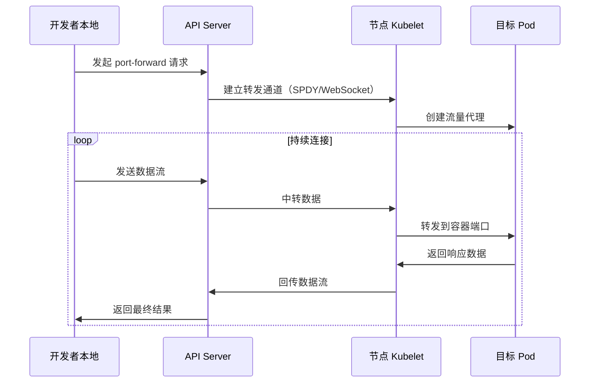
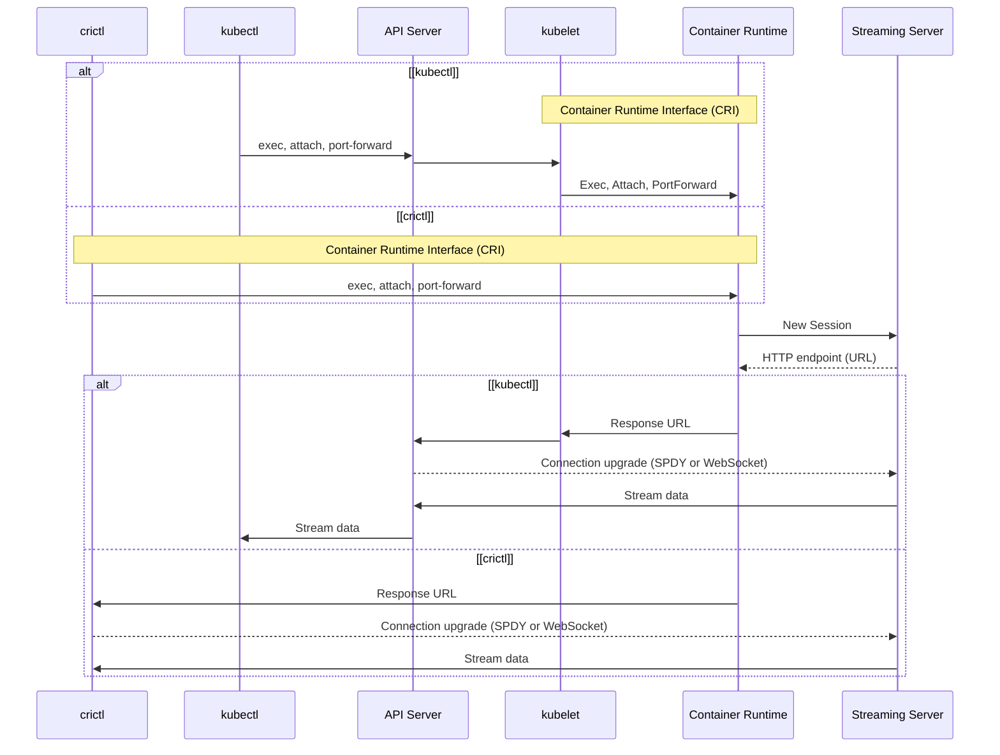

# Kubernetes 端口转发实战指南

## 1. 背景

### 1.1 Kubernetes 网络隔离性挑战

在 `Kubernetes` 集群中，所有资源都运行在私有网络空间（通常使用 `CNI` 插件构建 `overlay` 网络），这带来了以下调试难题：

- `Pod` 使用动态 `IP` 地址（生命周期短暂）
- `Service` 的 `ClusterIP` 仅在集群内部可达
- 生产环境通常禁用 `NodePort` 等暴露方式

### 1.2 典型使用场景

| **场景类型** | **具体案例** | **传统方案痛点** |
|----------|----------|--------------|
| **本地开发调试** | 访问未暴露的 `Web` 服务 `API` | 需要反复构建镜像部署 |
| **数据访问验证** | 连接临时数据库实例 | 暴露公网入口存在安全风险 |
| **故障排查** | 检查未配置监控的中间件 | 登录节点操作违反安全规范 |
| **CI/CD 流水线** | 自动化测试验证服务状态 | 依赖复杂网络配置 |

### 1.3 端口转发优势矩阵

| **特性**            | **kubectl port-forward**             | **NodePort** | **Ingress**       |
|---------------------|--------------------------------------|--------------|-------------------|
| 无需修改资源配置    | ✓                                    | ✗            | ✗                 |
| 临时性访问          | ✓                                    | ✗            | ✗                 |
| 支持TCP/UDP         | TCP               | ✓            | HTTP/HTTPS only   |
| 网络策略穿透        | ✓                                    | ✗            | ✗                 |

> **注意**：`kubectl port-forward` 目前仅支持 `TCP` 端口的转发，对 `UDP` 协议的支持正在 `GitHub` 的 `Issue` [Port-forward for UDP](https://github.com/kubernetes/kubernetes/issues/47862) 中进行跟踪。

## 2. kubectl port-forward 命令概述

### 2.1 命令语法详解

```bash
kubectl port-forward TYPE/NAME [options] [LOCAL_PORT:]REMOTE_PORT [...[LOCAL_PORT_N:]REMOTE_PORT_N]

Options:
      --address=[localhost]: Addresses to listen on (comma separated). Only accepts IP addresses or localhost as a
value. When localhost is supplied, kubectl will try to bind on both 127.0.0.1 and ::1 and will fail if neither of these
addresses are available to bind.
      --pod-running-timeout=1m0s: The length of time (like 5s, 2m, or 3h, higher than zero) to wait until at least one
pod is running
```

**核心参数说明**：

```bash
-n, --namespace string       指定命名空间（默认default）
--address stringArray        绑定地址（默认为127.0.0.1）
--pod-running-timeout duration 等待Pod运行的最长时间
```

### 2.2 多资源类型支持

```bash
# Pod 转发（直接访问指定Pod）
kubectl port-forward pod/nginx 8080:80

# Deployment 转发（自动选择最新Pod）
kubectl port-forward deployment/nginx 8080:80

# Service 转发（自动选择最新Pod）
kubectl port-forward service/mysql 3306:3306
```

> 注意：如果有多个 Pod 符合条件，则会自动选择一个 Pod。当选定的 Pod 终止时，转发会话结束，需要重新运行命令才能恢复转发。Pod 选择代码请参考：[attachablePodForObject](https://github.com/kubernetes/kubernetes/blob/58178e7f7aab455bc8de88d3bdd314b64141e7ee/staging/src/k8s.io/kubectl/pkg/polymorphichelpers/attachablepodforobject.go#L32)

```go
// attachablePodForObject returns the pod to which to attach given an object.
func attachablePodForObject(restClientGetter genericclioptions.RESTClientGetter, object runtime.Object, timeout time.Duration) (*corev1.Pod, error) {
 switch t := object.(type) {
 case *corev1.Pod:
  return t, nil
 }

 clientConfig, err := restClientGetter.ToRESTConfig()
 if err != nil {
  return nil, err
 }
 clientset, err := corev1client.NewForConfig(clientConfig)
 if err != nil {
  return nil, err
 }

 namespace, selector, err := SelectorsForObject(object)
 if err != nil {
  return nil, fmt.Errorf("cannot attach to %T: %v", object, err)
 }
 sortBy := func(pods []*corev1.Pod) sort.Interface { return sort.Reverse(podutils.ActivePods(pods)) }
 pod, _, err := GetFirstPod(clientset, namespace, selector.String(), timeout, sortBy)
 return pod, err
}
```

### 2.3 高级转发模式

#### 2.3.1 多端口转发

```bash
kubectl port-forward pod/nginx 8080:80 8443:443
```

#### 2.3.2 后台运行

```bash
# 使用 nohup 防止终端关闭后进程终止
nohup kubectl port-forward pod/nginx 8080:80 > portforward.log 2>&1 < /dev/null &
```

## 3. 端口转发原理剖析

### 3.1 流程图

#### 3.1.1 网络路径详解

数据包在端口转发过程中的完整路径：

```text
本地应用 → kubectl客户端 → API Server → kubelet → 容器运行时 → 目标容器
```

**网络层级说明**：

- **本地层**：开发者本地应用通过 `127.0.0.1:LOCAL_PORT` 发起请求
- **传输层**：kubectl 客户端通过 TLS 加密隧道与 API Server 通信
- **集群层**：API Server 将请求转发至目标节点的 kubelet
- **容器层**：kubelet 通过 CRI 接口与容器运行时交互，最终到达目标容器

**简化流程图：**



> 参考：[Container Runtime Interface streaming explained](https://kubernetes.io/blog/2024/05/01/cri-streaming-explained/)

**完整流程图：**



### 3.2 安全机制

1. **双向认证**：基于 `kubeconfig` 的客户端证书认证
2. **RBAC控制**：需要以下权限：

   ```yaml
   verbs: ["create"]
   resources: ["pods/portforward"]
   ```

3. **传输加密**：全程使用 `TLS 1.3` 加密

## 4. 实战说明

### 4.1 数据库访问（MySQL）

```bash
# 查看数据库Pod状态
kubectl get pods -l app=mysql --show-labels

# 建立端口转发
kubectl port-forward svc/mysql-service 3306:3306 --address 0.0.0.0 &

# 使用本地客户端连接
mysql -h 127.0.0.1 -u root -p -e "SHOW DATABASES;"
```

**验证结果：**

```sql
+--------------------+
| Database           |
+--------------------+
| information_schema |
| production_db      |
| metrics            |
+--------------------+
```

### 4.2 Web应用调试（React）

```bash
# 转发前端服务
kubectl port-forward deployment/frontend 3000:3000

# 转发后端API
kubectl port-forward svc/backend-api 8080:80

# 本地浏览器访问
open http://localhost:3000
```

### 4.3 监控系统对接（Prometheus）

```bash
# 转发监控端口
kubectl port-forward -n monitoring prometheus-server 9090:9090

# 访问本地Grafana配置
grafana-cli --address http://localhost:9090 admin reset-admin-password newpass
```

### 4.4 微服务调试

```bash
# 同时转发多个微服务端口
kubectl port-forward svc/user-service 8081:80 &
kubectl port-forward svc/order-service 8082:80 &
kubectl port-forward svc/payment-service 8083:80 &

# 验证服务间通信
curl http://localhost:8081/api/users/1
curl http://localhost:8082/api/orders?userId=1
curl http://localhost:8083/api/payments/status
```

### 4.5 日志系统访问

```bash
# 转发 Elasticsearch 端口
kubectl port-forward -n logging svc/elasticsearch 9200:9200

# 转发 Kibana 端口
kubectl port-forward -n logging svc/kibana 5601:5601

# 查询日志数据
curl -X GET "localhost:9200/_cat/indices?v"
curl -X GET "localhost:9200/app-logs-*/_search?q=ERROR"
```

## 5. 故障排查与最佳实践

### 5.1 常见错误解决方案

| **错误现象**                                | **可能原因**        | **解决方案**                                                 |
|---------------------------------------------|---------------------|-------------------------------------------------------------|
| `unable to do port forwarding: pod not found` | **Pod未启动**        | **检查Pod状态**：`kubectl describe pod/[name]`              |
| `error: listen tcp 127.0.0.1:8080: bind: address already in use` | **端口冲突**        | **更换端口或杀死占用进程**：`lsof -i :8080`                |
| `error: timed out waiting for the condition` | **Pod启动超时**      | **增加超时参数**：`--pod-running-timeout=5m`               |
| `error: connection refused` | **目标端口未监听**   | **验证容器端口**：`kubectl exec pod/[name] -- netstat -tlnp` |
| `error: lost connection to pod` | **网络中断**        | **检查网络策略**：`kubectl get networkpolicy`              |

#### 5.1.1 网络诊断命令

```bash
# 检查Pod网络连通性
kubectl exec -it pod/nginx -- netstat -tlnp

# 验证端口监听状态
kubectl exec -it pod/nginx -- ss -tlnp | grep :80

# 测试容器内部网络
kubectl exec -it pod/nginx -- curl -I localhost:80

# 检查DNS解析
kubectl exec -it pod/nginx -- nslookup kubernetes.default.svc.cluster.local

# 查看网络接口
kubectl exec -it pod/nginx -- ip addr show
```

### 5.2 性能优化

1. **批量转发**：同时转发多个相关端口

   ```bash
   kubectl port-forward pod/nginx 80:80 443:443
   ```

2. **保持连接**：使用工具自动重连

   ```bash
   while true; do kubectl port-forward svc/redis 6379:6379; done
   ```

3. **网络诊断**：开启详细日志

   ```bash
   kubectl port-forward -v=9 pod/nginx 8080:80
   ```

### 5.3 安全加固建议

1. **最小权限原则**：创建专用 `ServiceAccount`

   ```yaml
   apiVersion: v1
   kind: ServiceAccount
   metadata:
     name: dev-portforward
     namespace: development
   ---
   apiVersion: rbac.authorization.k8s.io/v1
   kind: Role
   metadata:
     namespace: development
     name: portforward-role
   rules:
   - apiGroups: [""]
     resources: ["pods/portforward"]
     verbs: ["create"]
   - apiGroups: [""]
     resources: ["services/portforward"]
     verbs: ["create"]
   ---
   apiVersion: rbac.authorization.k8s.io/v1
   kind: RoleBinding
   metadata:
     name: portforward-binding
     namespace: development
   subjects:
   - kind: ServiceAccount
     name: dev-portforward
     namespace: development
   roleRef:
     kind: Role
     name: portforward-role
     apiGroup: rbac.authorization.k8s.io
   ```

2. **网络策略限制**：

   ```yaml
   apiVersion: networking.k8s.io/v1
   kind: NetworkPolicy
   metadata:
     name: restrict-portforward
   spec:
     podSelector: {}
     ingress:
     - from:
       - ipBlock:
           cidr: 192.168.1.0/24 # 只允许办公网络访问
   ```

3. **审计日志配置**：

   ```yaml
   # /etc/kubernetes/audit-policy.yaml
   apiVersion: audit.k8s.io/v1
   kind: Policy
   rules:
   # 记录所有端口转发操作
   - level: Metadata
     namespaces: ["production", "staging"]
     resources:
     - group: ""
       resources: ["pods/portforward"]
     - group: ""
       resources: ["services/portforward"]
   # 记录敏感命名空间的详细信息
   - level: RequestResponse
     namespaces: ["kube-system"]
     resources:
     - group: ""
       resources: ["pods/portforward"]
   ```

4. **时间限制和会话管理**：

   ```bash
   # 设置端口转发超时时间
   timeout 300 kubectl port-forward pod/nginx 8080:80
   
   # 使用脚本自动清理僵尸进程
   #!/bin/bash
   PID=$(pgrep -f "kubectl port-forward")
   if [ ! -z "$PID" ]; then
       echo "Cleaning up port-forward processes: $PID"
       kill $PID
   fi
   ```

5. **IP地址绑定限制**：

   ```bash
   # 只绑定本地回环地址（默认行为）
   kubectl port-forward pod/nginx 8080:80 --address 127.0.0.1
   
   # 避免绑定所有接口（安全风险）
   # kubectl port-forward pod/nginx 8080:80 --address 0.0.0.0  # 不推荐
   ```

## 6. Streaming 协议说明

### 6.1 SPDY

- `Kubernetes` 最初使用 **SPDY** 作为流式传输协议，支持 `kubectl exec`、`attach`、`port-forward` 等操作。
- `SPDY` 是 `Google` 开发的协议，但随着其被废弃，社区开始寻找替代方案。

### 6.2 HTTP/2

**HTTP/2** 是 SPDY 的继任者，具有以下优势：

- 提供更好的性能（如多路复用、头部压缩）。
- 支持流式传输和多路复用，适合 Streaming API 的场景。

**挑战**:

- **复杂性**：`HTTP/2` 的实现比 `WebSocket` 更复杂。
- **兼容性**：需要在保留对旧版客户端支持的同时实现新的协议。
- **现状**：尽管 `HTTP/2` 具备技术能力，但 `Kubernetes` 并未默认在 `Streaming API` 中启用 `HTTP/2`。

> **注意**：`HTTP/2` 并未成为 `Kubernetes Streaming API` 的主流支持协议。

### 6.3 WebSocket

`Kubernetes` 最终选择了 **WebSocket** 作为 `Streaming API` 的流式传输协议，因为它：

- 实现简单且轻量。
- 提供全双工通信，具有良好的客户端兼容性。

> **注意**：自 **Kubernetes v1.31** 起，`WebSocket` 成为默认的流式传输协议。

## 7. 高级技巧与最佳实践

### 7.1 自动化脚本

```bash
#!/bin/bash
# port-forward-manager.sh - 端口转发管理脚本

set -e

# 配置文件
CONFIG_FILE="$HOME/.kube/port-forward.conf"

# 创建配置文件示例
if [ ! -f "$CONFIG_FILE" ]; then
    cat > "$CONFIG_FILE" << EOF
# 端口转发配置
# 格式: SERVICE_NAME:NAMESPACE:LOCAL_PORT:REMOTE_PORT
frontend:default:3000:80
backend:default:8080:8080
mysql:database:3306:3306
redis:cache:6379:6379
EOF
    echo "配置文件已创建: $CONFIG_FILE"
fi

# 启动所有端口转发
start_all() {
    echo "启动所有端口转发..."
    while IFS=':' read -r service namespace local_port remote_port; do
        [ "${service:0:1}" = "#" ] && continue  # 跳过注释行
        [ -z "$service" ] && continue           # 跳过空行
        
        echo "启动 $service ($namespace) $local_port:$remote_port"
        kubectl port-forward -n "$namespace" "svc/$service" "$local_port:$remote_port" &
        sleep 1
    done < "$CONFIG_FILE"
}

# 停止所有端口转发
stop_all() {
    echo "停止所有端口转发..."
    pkill -f "kubectl port-forward" || true
}

# 显示状态
status() {
    echo "当前端口转发进程:"
    pgrep -f "kubectl port-forward" | while read pid; do
        ps -p $pid -o pid,cmd --no-headers
    done
}

case "$1" in
    start)
        start_all
        ;;
    stop)
        stop_all
        ;;
    restart)
        stop_all
        sleep 2
        start_all
        ;;
    status)
        status
        ;;
    *)
        echo "用法: $0 {start|stop|restart|status}"
        exit 1
        ;;
esac
```

### 7.2 监控和告警

```bash
# 端口转发健康检查脚本
#!/bin/bash
# health-check.sh

check_port_forward() {
    local service=$1
    local port=$2
    local max_retries=3
    local retry=0
    
    while [ $retry -lt $max_retries ]; do
        if curl -s --connect-timeout 5 "http://localhost:$port/health" > /dev/null; then
            echo "✓ $service (port $port) is healthy"
            return 0
        fi
        retry=$((retry + 1))
        sleep 2
    done
    
    echo "✗ $service (port $port) is unhealthy"
    return 1
}

# 检查所有服务
check_port_forward "frontend" 3000
check_port_forward "backend" 8080
check_port_forward "database" 3306
```

## 8. 参考链接

### 8.1 官方文档

- [**Use Port Forwarding to Access Applications in a Cluster**](https://kubernetes.io/docs/tasks/access-application-cluster/port-forward-access-application-cluster/)
- [**Kubernetes Enhancement Proposal (KEP) on WebSocket Migration**](https://github.com/kubernetes/enhancements/issues/4006)
- [**Kubernetes 1.31: Streaming Transitions from SPDY to WebSockets**](https://kubernetes.io/blog/2024/08/20/websockets-transition/)
- [**Container Runtime Interface streaming explained**](https://kubernetes.io/blog/2024/05/01/cri-streaming-explained/)

### 8.2 技术深入

- [**SPDY Deprecation Issue**](https://github.com/kubernetes/kubernetes/issues/7452)
- [**Port-forward for UDP**](https://github.com/kubernetes/kubernetes/issues/47862)
- [**attachablePodForObject Source Code**](https://github.com/kubernetes/kubernetes/blob/master/staging/src/k8s.io/kubectl/pkg/polymorphichelpers/attachablepodforobject.go)
- [**Kubernetes RBAC Documentation**](https://kubernetes.io/docs/reference/access-authn-authz/rbac/)

### 8.3 安全最佳实践

- [**Kubernetes Security Best Practices**](https://kubernetes.io/docs/concepts/security/)
- [**Network Policies**](https://kubernetes.io/docs/concepts/services-networking/network-policies/)
- [**Auditing**](https://kubernetes.io/docs/tasks/debug-application-cluster/audit/)
