# containerd CRI Plugin 代码分析

本文档对 **containerd CRI Plugin** 进行了深入的代码分析，针对每个 `CRI` 接口绘制了详细的时序图，展示了调用关系和执行流程。

## 1. CRI 简介

### 1.1 什么是 CRI

**CRI**（`Container Runtime Interface`）是 `Kubernetes` 定义的与 `container runtime` 进行交互的接口。它是 `Kubernetes` 与容器运行时之间的标准化接口，使得 `Kubernetes` 能够支持多种不同的容器运行时，而无需修改 `Kubernetes` 核心代码。

CRI 接口主要包含两个服务：

- **RuntimeService**：负责管理 `Pod Sandbox` 和容器的生命周期
- **ImageService**：负责管理容器镜像的拉取、删除和查询

### 1.2 containerd 实现 CRI 的特点

`containerd` 在 **1.1** 版本直接将 `cri-containerd` 内置在 `containerd` 中，作为一个 `Plugin` 插件。这种设计具有以下特点：

1. **内置集成**：`CRI` 插件直接集成在 `containerd` 中，减少了额外的组件和通信开销
2. **标准兼容**：完全实现了 `Kubernetes CRI` 接口规范，确保与 `Kubernetes` 的完美兼容
3. **网络管理**：`CRI` 插件实现了 `Kubelet CRI` 接口中的 `Image Service` 和 `Runtime Service`，管理容器和镜像，调用 `CNI` 插件给 `Pod` 配置网络
4. **模块化架构**：采用插件化设计，各组件职责明确，便于维护和扩展
5. **高性能**：直接与 `containerd` 核心交互，避免了额外的网络调用，提供更好的性能

---

## 2. 整体架构

本章深入分析 `containerd CRI Plugin` 的整体架构设计，包括核心组件的职责分工、接口定义以及各组件间的协作关系。通过理解架构设计，可以更好地掌握 `CRI` 插件如何实现 `Kubernetes` 容器运行时接口规范。

### 2.1 整体架构图

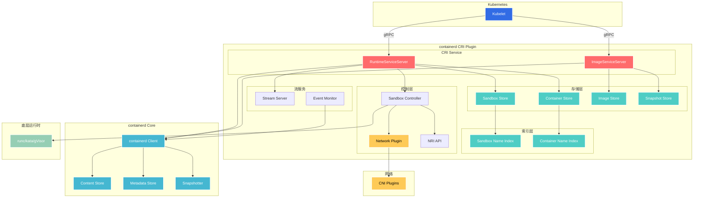

### 2.2 核心组件

`containerd CRI Plugin` 的核心组件包括：

- **CRIService**: 实现了 `RuntimeServiceServer` 和 `ImageServiceServer` 接口
- **Container Store**: 管理容器元数据和状态
- **Sandbox Store**: 管理 `Pod Sandbox` 元数据和状态
- **Image Store**: 管理镜像元数据
- **Network Plugin**: 处理网络配置
- **NRI (Node Resource Interface)**: 提供资源管理接口

#### 2.2.1 CRI 服务接口定义

**CRI 服务接口** (`pkg/cri/sbserver/service.go`)：

```go
// CRIService 是实现 CRI 远程服务的接口
type CRIService interface {
    runtime.RuntimeServiceServer  // 实现 Runtime Service 接口
    runtime.ImageServiceServer    // 实现 Image Service 接口
    io.Closer                     // 用于优雅关闭服务
    
    Run() error                   // 启动服务
    Register(*grpc.Server) error  // 注册 gRPC 服务
}
```

#### 2.2.2 CRI 服务结构体定义

**CRI 服务实现结构** (`pkg/cri/sbserver/service.go`)：

```go
// criService 实现 CRIService 接口
type criService struct {
    // 配置信息
    config criconfig.Config
    imageFSPath string
    
    // 操作系统接口
    os osinterface.OS
    
    // 存储组件
    sandboxStore       *sandboxstore.Store      // 沙箱存储
    containerStore     *containerstore.Store    // 容器存储
    imageStore         *imagestore.Store        // 镜像存储
    snapshotStore      *snapshotstore.Store     // 快照存储
    
    // 名称索引（确保唯一性）
    sandboxNameIndex   *registrar.Registrar     // 沙箱名称索引
    containerNameIndex *registrar.Registrar     // 容器名称索引
    
    // 沙箱控制器
    sandboxControllers map[criconfig.SandboxControllerMode]sandbox.Controller
    
    // 网络插件
    netPlugin map[string]cni.CNI
    
    // containerd 客户端
    client *containerd.Client
    
    // 流服务器（用于 exec/attach/logs）
    streamServer streaming.Server
    
    // 事件监控
    eventMonitor *eventMonitor
    
    // 初始化状态
    initialized atomic.Bool
    
    // CNI 网络配置监控
    cniNetConfMonitor map[string]*cniNetConfSyncer
    
    // 基础 OCI 规范
    baseOCISpecs map[string]*oci.Spec
    
    // 所有能力列表
    allCaps []string
    
    // 解包去重抑制器
    unpackDuplicationSuppressor kmutex.KeyedLocker
    
    // 容器事件通道
    containerEventsChan chan runtime.ContainerEventResponse
    
    // NRI API
    nri *nri.API
}
```

#### 2.2.3 CRI 服务初始化

**CRI 服务初始化** (`pkg/cri/sbserver/service.go`)：

```go
// NewCRIService 创建新的 CRI 服务实例
func NewCRIService(config criconfig.Config, client *containerd.Client, nri *nri.API) (CRIService, error) {
    var err error
    labels := label.NewStore()
    
    // 1. 创建 CRI 服务实例
    c := &criService{
        config:                      config,
        client:                      client,
        os:                          osinterface.RealOS{},
        sandboxStore:                sandboxstore.NewStore(labels),
        containerStore:              containerstore.NewStore(labels),
        imageStore:                  imagestore.NewStore(client),
        snapshotStore:               snapshotstore.NewStore(),
        sandboxNameIndex:            registrar.NewRegistrar(),
        containerNameIndex:          registrar.NewRegistrar(),
        initialized:                 atomic.NewBool(false),
        netPlugin:                   make(map[string]cni.CNI),
        unpackDuplicationSuppressor: kmutex.New(),
        sandboxControllers:          make(map[criconfig.SandboxControllerMode]sandbox.Controller),
    }
    
    // 2. 创建容器事件通道
    c.containerEventsChan = make(chan runtime.ContainerEventResponse, 1000)
    
    // 3. 验证快照服务
    if client.SnapshotService(c.config.containerdConfig.Snapshotter) == nil {
        return nil, fmt.Errorf("failed to find snapshotter %q", c.config.containerdConfig.Snapshotter)
    }
    
    // 4. 设置镜像文件系统路径
    c.imageFSPath = imageFSPath(config.containerdRootDir, config.containerdConfig.Snapshotter)
    
    // 5. 初始化平台相关组件
    if err := c.initPlatform(); err != nil {
        return nil, fmt.Errorf("initialize platform: %w", err)
    }
    
    // 6. 创建流服务器
    c.streamServer, err = newStreamServer(c, config.StreamServerAddress, config.StreamServerPort, config.StreamIdleTimeout)
    if err != nil {
        return nil, fmt.Errorf("failed to create stream server: %w", err)
    }
    
    // 7. 创建事件监控器
    c.eventMonitor = newEventMonitor(c)
    
    // 8. 初始化 CNI 网络配置监控
    c.cniNetConfMonitor = make(map[string]*cniNetConfSyncer)
    for name, i := range c.netPlugin {
        path := c.config.NetworkPluginConfDir
        if name != defaultNetworkPlugin {
            if rc, ok := c.config.Runtimes[name]; ok {
                path = rc.NetworkPluginConfDir
            }
        }
        if path != "" {
            m, err := newCNINetConfSyncer(path, i, c.cniLoadOptions())
            if err != nil {
                return nil, fmt.Errorf("failed to create cni conf monitor for %s: %w", name, err)
            }
            c.cniNetConfMonitor[name] = m
        }
    }
    
    // 9. 预加载基础 OCI 规范
    c.baseOCISpecs, err = loadBaseOCISpecs(&config)
    if err != nil {
        return nil, err
    }
    
    // 10. 加载沙箱控制器
    c.sandboxControllers[criconfig.ModePodSandbox] = podsandbox.New(config, client, c.sandboxStore, c.os, c, c.baseOCISpecs)
    c.sandboxControllers[criconfig.ModeShim] = client.SandboxController()
    
    // 11. 设置 NRI API
    c.nri = nri
    
    return c, nil
}
```

### 2.3 接口定义

CRI 接口遵循 gRPC 协议规范，主要分为两大服务类别：

#### 2.3.1 RuntimeService 接口

负责容器运行时的核心功能，包括：

- **版本信息**: `Version` - 返回运行时名称、版本和API版本
- **Pod Sandbox 管理**: `RunPodSandbox`、`StopPodSandbox`、`RemovePodSandbox`、`PodSandboxStatus`、`ListPodSandbox`
- **Container 管理**: `CreateContainer`、`StartContainer`、`StopContainer`、`RemoveContainer`、`ContainerStatus`、`ListContainers`
- **资源管理**: `UpdateContainerResources` - 更新容器资源配置
- **日志管理**: `ReopenContainerLog` - 重新打开容器日志文件
- **执行和流式操作**: `ExecSync`、`Exec`、`Attach`、`PortForward`
- **统计和监控**: `ContainerStats`、`ListContainerStats`、`PodSandboxStats`、`ListPodSandboxStats`
- **运行时配置**: `UpdateRuntimeConfig`、`Status` - 更新运行时配置和获取状态
- **检查点**: `CheckpointContainer` - 容器检查点功能
- **事件流**: `GetContainerEvents` - 获取容器事件流
- **指标**: `ListMetricDescriptors`、`ListPodSandboxMetrics` - 指标描述和Pod沙箱指标

#### 2.3.2 ImageService 接口

负责容器镜像的全生命周期管理：

- **镜像操作**: `ListImages`、`ImageStatus`、`PullImage`、`RemoveImage`
- **文件系统信息**: `ImageFsInfo`

这些接口通过 containerd CRI Plugin 实现，确保与 Kubernetes 的无缝集成。

---

## 3. Runtime Service 接口时序图

Runtime Service 是 CRI 规范中负责容器和 Pod 生命周期管理的核心服务。本章通过时序图详细分析各个关键接口的执行流程，包括 Pod 沙箱的创建、停止、删除，以及容器的创建、启动、停止和删除等操作。每个接口的分析都包含完整的调用链路和关键代码实现。

### 3.1 RunPodSandbox 时序图

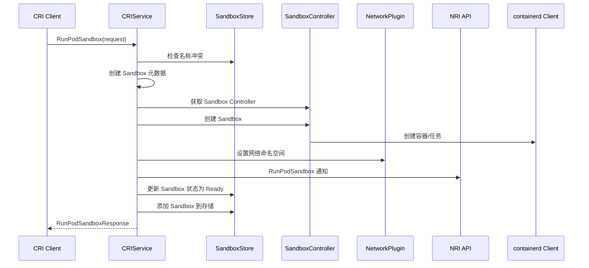

#### 3.1.1 关键代码说明

**RunPodSandbox 核心实现** (`pkg/cri/sbserver/sandbox_run.go`)：

```go
// RunPodSandbox 创建并启动 pod 级别的沙箱
func (c *criService) RunPodSandbox(ctx context.Context, r *runtime.RunPodSandboxRequest) (_ *runtime.RunPodSandboxResponse, retErr error) {
    config := r.GetConfig()
    id := util.GenerateID()
    
    // 1. 保留沙箱名称，避免并发创建
    name := makeSandboxName(config.GetMetadata())
    if err := c.sandboxNameIndex.Reserve(name, id); err != nil {
        return nil, err
    }
    
    // 2. 获取沙箱控制器
    controller, err := c.getSandboxController(config, r.GetRuntimeHandler())
    if err != nil {
        return nil, err
    }
    
    // 3. 创建并启动沙箱
    if _, err := controller.Create(ctx, sandboxID, opts...); err != nil {
        return nil, err
    }
    if err := controller.Start(ctx, sandboxID); err != nil {
        return nil, err
    }
    
    // 4. 设置网络
    if err := c.setupPodNetwork(ctx, sandbox); err != nil {
        return nil, err
    }
    
    return &runtime.RunPodSandboxResponse{PodSandboxId: id}, nil
}
```

**网络设置关键代码**：

```go
// setupPodNetwork 为 Pod 设置网络命名空间
func (c *criService) setupPodNetwork(ctx context.Context, sandbox *sandboxstore.Sandbox) error {
    // 获取网络插件并构建配置
    netPlugin := c.getNetworkPlugin(sandbox.RuntimeHandler)
    opts, err := cniNamespaceOpts(sandbox.ID, sandbox.Config)
    if err != nil {
        return err
    }
    
    // 调用 CNI 插件设置网络
    result, err := netPlugin.Setup(ctx, sandbox.ID, sandbox.NetNSPath, opts...)
    if err != nil {
        return err
    }
    
    logDebugCNIResult(ctx, sandbox.ID, result)
    return nil
}
```

### 3.2 StopPodSandbox 时序图

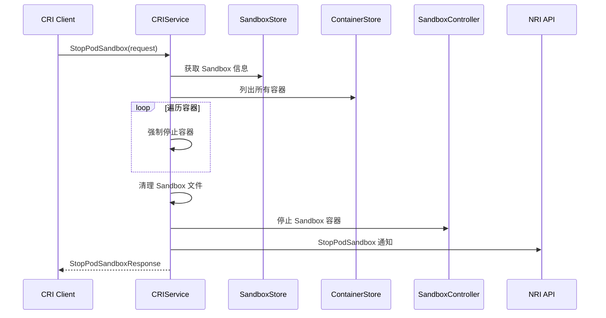

#### 3.2.1 关键代码说明

**StopPodSandbox 核心实现** (`pkg/cri/sbserver/sandbox_stop.go`)：

```go
// StopPodSandbox 停止 pod 级别的沙箱
func (c *criService) StopPodSandbox(ctx context.Context, r *runtime.StopPodSandboxRequest) (*runtime.StopPodSandboxResponse, error) {
    sandboxID := r.GetPodSandboxId()
    
    // 1. 获取沙箱信息
    sandbox, err := c.sandboxStore.Get(sandboxID)
    if err != nil {
        return nil, fmt.Errorf("failed to find sandbox %q: %w", sandboxID, err)
    }
    
    // 2. 停止沙箱中的所有容器
    containers := c.containerStore.List()
    for _, container := range containers {
        if container.SandboxID == sandboxID {
            if err := c.stopContainer(ctx, container, 0); err != nil {
                logrus.WithError(err).Errorf("Failed to stop container %q", container.ID)
            }
        }
    }
    
    // 3. 获取沙箱控制器并停止沙箱
    controller, err := c.getSandboxController(sandbox.Config, sandbox.RuntimeHandler)
    if err != nil {
        return nil, fmt.Errorf("failed to get sandbox controller: %w", err)
    }
    
    if err := controller.Stop(ctx, sandboxID); err != nil {
        return nil, fmt.Errorf("failed to stop sandbox %q: %w", sandboxID, err)
    }
    
    return &runtime.StopPodSandboxResponse{}, nil
}
```

**容器停止关键代码**：

```go
// stopContainer 停止指定容器
func (c *criService) stopContainer(ctx context.Context, container containerstore.Container, timeout int64) error {
    id := container.ID
    
    // 1. 获取 containerd 容器
    cntr, err := c.client.LoadContainer(ctx, id)
    if err != nil {
        return fmt.Errorf("failed to load container %q: %w", id, err)
    }
    
    // 2. 获取容器任务
    task, err := cntr.Task(ctx, nil)
    if err != nil {
        return fmt.Errorf("failed to load task for container %q: %w", id, err)
    }
    
    // 3. 发送 SIGTERM 信号
    if err := task.Kill(ctx, syscall.SIGTERM); err != nil {
        return fmt.Errorf("failed to send SIGTERM to container %q: %w", id, err)
    }
    
    // 4. 等待容器退出或超时后强制杀死
    exitCh, err := task.Wait(ctx)
    if err != nil {
        return fmt.Errorf("failed to wait for container %q: %w", id, err)
    }
    
    select {
    case <-exitCh:
        // 容器正常退出
    case <-time.After(time.Duration(timeout) * time.Second):
        // 超时，强制杀死容器
        if err := task.Kill(ctx, syscall.SIGKILL); err != nil {
            return fmt.Errorf("failed to kill container %q: %w", id, err)
        }
    }
    
    return nil
}
```

### 3.3 RemovePodSandbox 时序图

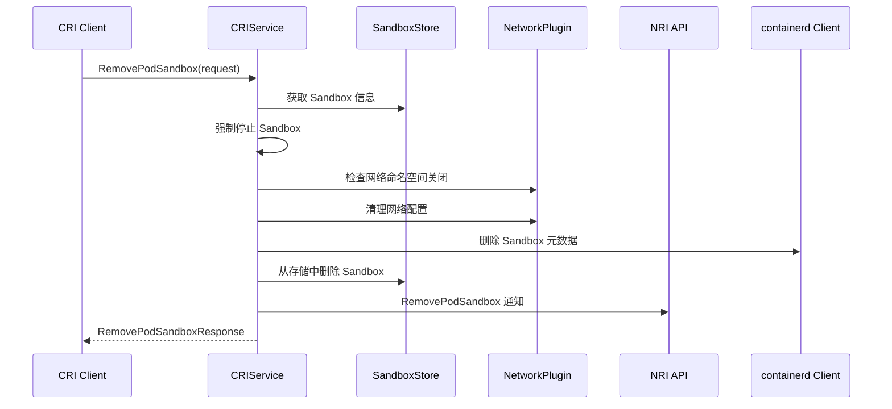

#### 3.3.1 关键代码说明

**RemovePodSandbox 核心实现** (`pkg/cri/sbserver/sandbox_remove.go`)：

```go
// RemovePodSandbox 删除 pod 级别的沙箱
func (c *criService) RemovePodSandbox(ctx context.Context, r *runtime.RemovePodSandboxRequest) (*runtime.RemovePodSandboxResponse, error) {
    sandboxID := r.GetPodSandboxId()
    
    // 1. 获取沙箱信息
    sandbox, err := c.sandboxStore.Get(sandboxID)
    if err != nil {
        return nil, fmt.Errorf("failed to find sandbox %q: %w", sandboxID, err)
    }
    
    // 2. 强制停止沙箱（如果仍在运行）
    if err := c.stopPodSandbox(ctx, sandboxID); err != nil {
        logrus.WithError(err).Errorf("Failed to stop sandbox %q", sandboxID)
    }
    
    // 3. 清理网络配置
    if err := c.teardownPodNetwork(ctx, sandbox); err != nil {
        logrus.WithError(err).Errorf("Failed to teardown network for sandbox %q", sandboxID)
    }
    
    // 4. 获取沙箱控制器并删除沙箱
    controller, err := c.getSandboxController(sandbox.Config, sandbox.RuntimeHandler)
    if err != nil {
        return nil, fmt.Errorf("failed to get sandbox controller: %w", err)
    }
    
    if err := controller.Delete(ctx, sandboxID); err != nil {
        return nil, fmt.Errorf("failed to delete sandbox %q: %w", sandboxID, err)
    }
    
    // 5. 从存储中删除沙箱
    if err := c.sandboxStore.Delete(sandboxID); err != nil {
        return nil, fmt.Errorf("failed to delete sandbox %q from store: %w", sandboxID, err)
    }
    
    // 6. 释放沙箱名称
    c.sandboxNameIndex.ReleaseByKey(sandboxID)
    
    return &runtime.RemovePodSandboxResponse{}, nil
}
```

**网络清理关键代码**：

```go
// teardownPodNetwork 清理 Pod 网络配置
func (c *criService) teardownPodNetwork(ctx context.Context, sandbox *sandboxstore.Sandbox) error {
    // 获取网络插件
    netPlugin := c.getNetworkPlugin(sandbox.RuntimeHandler)
    if netPlugin == nil {
        return errors.New("cni config not initialized")
    }
    
    // 构建 CNI 配置
    opts, err := cniNamespaceOpts(sandbox.ID, sandbox.Config)
    if err != nil {
        return fmt.Errorf("get cni namespace options: %w", err)
    }
    
    // 调用 CNI 插件清理网络
    if err := netPlugin.Remove(ctx, sandbox.ID, sandbox.NetNSPath, opts...); err != nil {
        return fmt.Errorf("failed to teardown network for sandbox %q: %w", sandbox.ID, err)
    }
    
    // 清理网络命名空间文件
    if sandbox.NetNSPath != "" {
        if err := unix.Unmount(sandbox.NetNSPath, unix.MNT_DETACH); err != nil {
            logrus.WithError(err).Warnf("Failed to unmount network namespace %q", sandbox.NetNSPath)
        }
        if err := os.Remove(sandbox.NetNSPath); err != nil {
            logrus.WithError(err).Warnf("Failed to remove network namespace file %q", sandbox.NetNSPath)
        }
    }
    
    return nil
}
```

### 3.4 CreateContainer 时序图

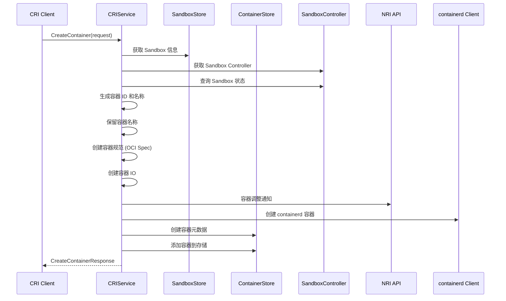

#### 3.4.1 关键代码说明

**CreateContainer 核心实现** (`pkg/cri/sbserver/container_create.go`)：

```go
// CreateContainer 创建一个新容器
func (c *criService) CreateContainer(ctx context.Context, r *runtime.CreateContainerRequest) (_ *runtime.CreateContainerResponse, retErr error) {
    config := r.GetConfig()
    sandboxID := r.GetPodSandboxId()
    
    // 1. 获取沙箱信息和控制器
    sandbox, err := c.sandboxStore.Get(sandboxID)
    if err != nil {
        return nil, err
    }
    
    // 2. 生成容器 ID 并保留名称
    id := util.GenerateID()
    name := makeContainerName(config.GetMetadata(), sandbox.Metadata)
    if err := c.containerNameIndex.Reserve(name, id); err != nil {
        return nil, err
    }
    
    // 3. 创建容器规范和 IO
    spec, err := c.buildContainerSpec(id, sandboxID, sandbox.Pid, sandbox.NetNSPath, config, r.GetSandboxConfig(), &image.ImageSpec, sandbox.RuntimeHandler)
    if err != nil {
        return nil, err
    }
    
    containerIO, err := cio.NewContainerIO(id, cio.WithNewFIFOs(filepath.Join(c.config.StateDir, "io"), config.GetTty(), config.GetStdin()))
    if err != nil {
        return nil, err
    }
    
    // 4. 创建 containerd 容器并添加到存储
    cntr, err := c.client.NewContainer(ctx, id, containerd.WithSpec(spec), containerd.WithContainerLabels(containerLabels))
    if err != nil {
        return nil, err
    }
    
    container, err := containerstore.NewContainer(config.GetMetadata(), spec, id, image.ID, image.ImageSpec, sandboxID, config, r.GetSandboxConfig(), containerIO)
    if err != nil {
        return nil, err
    }
    
    if err := c.containerStore.Add(container); err != nil {
        return nil, err
    }
    
    return &runtime.CreateContainerResponse{ContainerId: id}, nil
}
```

**容器规范构建关键代码**：

```go
// buildContainerSpec 构建容器的 OCI 规范
func (c *criService) buildContainerSpec(id, sandboxID string, sandboxPid uint32, sandboxNSPath string, config *runtime.ContainerConfig, sandboxConfig *runtime.PodSandboxConfig, imageConfig *imagespec.ImageConfig, runtimeHandler string) (*runtimespec.Spec, error) {
    // 1. 创建基础规范
    specOpts := []oci.SpecOpts{
        oci.WithImageConfig(imageConfig),
        oci.WithTTY(config.GetTty()),
        oci.WithUsername(config.GetImage().GetUsername()),
    }
    
    // 2. 设置命令和环境变量
    if len(config.GetCommand()) > 0 {
        specOpts = append(specOpts, oci.WithProcessArgs(config.GetCommand()...))
    } else if len(imageConfig.Cmd) > 0 {
        specOpts = append(specOpts, oci.WithProcessArgs(imageConfig.Cmd...))
    }
    
    env := append(imageConfig.Env, kubeEnvs...)
    for _, e := range config.GetEnvs() {
        env = append(env, e.GetKey()+"="+e.GetValue())
    }
    specOpts = append(specOpts, oci.WithEnv(env))
    
    // 3. 设置工作目录和挂载点
    if config.GetWorkingDir() != "" {
        specOpts = append(specOpts, oci.WithProcessCwd(config.GetWorkingDir()))
    } else if imageConfig.WorkingDir != "" {
        specOpts = append(specOpts, oci.WithProcessCwd(imageConfig.WorkingDir))
    }
    
    for _, mount := range config.GetMounts() {
        specOpts = append(specOpts, oci.WithMounts([]runtimespec.Mount{
            {
                Source:      mount.GetHostPath(),
                Destination: mount.GetContainerPath(),
                Type:        "bind",
                Options:     []string{"rbind", "rw"},
            },
        }))
    }
    
    return oci.GenerateSpec(ctx, nil, specOpts...)
}
```

### 3.5 StartContainer 时序图

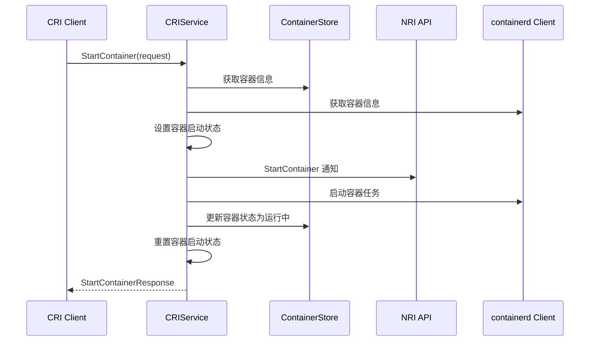

#### 3.5.1 关键代码说明

**StartContainer 核心实现** (`pkg/cri/sbserver/container_start.go`)：

```go
// StartContainer 启动容器
func (c *criService) StartContainer(ctx context.Context, r *runtime.StartContainerRequest) (*runtime.StartContainerResponse, error) {
    containerID := r.GetContainerId()
    
    // 1. 获取容器信息
    container, err := c.containerStore.Get(containerID)
    if err != nil {
        return nil, fmt.Errorf("failed to find container %q: %w", containerID, err)
    }
    
    // 2. 检查容器状态
    if container.Status.State() == runtime.ContainerState_CONTAINER_RUNNING {
        return &runtime.StartContainerResponse{}, nil
    }
    
    // 3. 获取 containerd 容器
    cntr, err := c.client.LoadContainer(ctx, containerID)
    if err != nil {
        return nil, fmt.Errorf("failed to load container %q: %w", containerID, err)
    }
    
    // 4. 设置容器启动状态
    if err := c.containerStore.UpdateStatus(containerID, containerstore.Status{
        State:     runtime.ContainerState_CONTAINER_RUNNING,
        StartedAt: time.Now().UnixNano(),
    }); err != nil {
        return nil, fmt.Errorf("failed to update container status: %w", err)
    }
    
    // 5. 创建并启动容器任务
    task, err := cntr.NewTask(ctx, container.IO.IOCreate, container.IO.IOAttach)
    if err != nil {
        return nil, fmt.Errorf("failed to create task for container %q: %w", containerID, err)
    }
    
    if err := task.Start(ctx); err != nil {
        return nil, fmt.Errorf("failed to start task for container %q: %w", containerID, err)
    }
    
    // 6. 启动容器监控
    go c.monitorContainer(ctx, containerID, task)
    
    return &runtime.StartContainerResponse{}, nil
}
```

**容器监控关键代码**：

```go
// monitorContainer 监控容器状态变化
func (c *criService) monitorContainer(ctx context.Context, containerID string, task containerd.Task) {
    // 等待容器退出
    exitCh, err := task.Wait(ctx)
    if err != nil {
        logrus.WithError(err).Errorf("Failed to wait for container %q", containerID)
        return
    }
    
    // 监听容器退出事件
    select {
    case exitStatus := <-exitCh:
        // 更新容器状态
        if err := c.containerStore.UpdateStatus(containerID, containerstore.Status{
            State:      runtime.ContainerState_CONTAINER_EXITED,
            ExitCode:   int32(exitStatus.ExitCode()),
            FinishedAt: time.Now().UnixNano(),
            Reason:     exitStatus.Error(),
        }); err != nil {
            logrus.WithError(err).Errorf("Failed to update container %q status", containerID)
        }
        
        // 清理容器任务
        if _, err := task.Delete(ctx); err != nil {
            logrus.WithError(err).Errorf("Failed to delete task for container %q", containerID)
        }
        
    case <-ctx.Done():
        logrus.Infof("Container monitor for %q cancelled", containerID)
    }
}
```

### 3.6 StopContainer 时序图

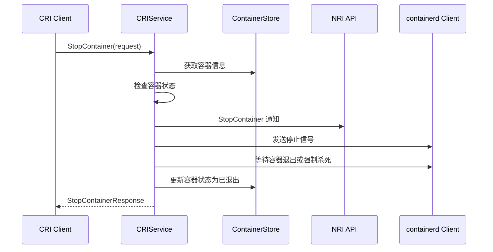

#### 3.6.1 关键代码说明

**StopContainer 核心实现** (`pkg/cri/sbserver/container_stop.go`)：

```go
// StopContainer 停止容器
func (c *criService) StopContainer(ctx context.Context, r *runtime.StopContainerRequest) (*runtime.StopContainerResponse, error) {
    containerID := r.GetContainerId()
    timeout := time.Duration(r.GetTimeout()) * time.Second
    
    // 1. 获取容器信息
    container, err := c.containerStore.Get(containerID)
    if err != nil {
        return nil, fmt.Errorf("failed to find container %q: %w", containerID, err)
    }
    
    // 2. 检查容器状态
    if container.Status.State() != runtime.ContainerState_CONTAINER_RUNNING {
        return &runtime.StopContainerResponse{}, nil
    }
    
    // 3. 获取 containerd 容器和任务
    cntr, err := c.client.LoadContainer(ctx, containerID)
    if err != nil {
        return nil, fmt.Errorf("failed to load container %q: %w", containerID, err)
    }
    
    task, err := cntr.Task(ctx, nil)
    if err != nil {
        return nil, fmt.Errorf("failed to load task for container %q: %w", containerID, err)
    }
    
    // 4. 优雅停止容器
    if err := c.stopContainerGracefully(ctx, task, timeout); err != nil {
        return nil, fmt.Errorf("failed to stop container %q: %w", containerID, err)
    }
    
    // 5. 更新容器状态
    if err := c.containerStore.UpdateStatus(containerID, containerstore.Status{
        State:      runtime.ContainerState_CONTAINER_EXITED,
        FinishedAt: time.Now().UnixNano(),
    }); err != nil {
        return nil, fmt.Errorf("failed to update container status: %w", err)
    }
    
    return &runtime.StopContainerResponse{}, nil
}
```

**优雅停止容器关键代码**：

```go
// stopContainerGracefully 优雅地停止容器
func (c *criService) stopContainerGracefully(ctx context.Context, task containerd.Task, timeout time.Duration) error {
    // 1. 发送 SIGTERM 信号
    if err := task.Kill(ctx, syscall.SIGTERM); err != nil {
        return fmt.Errorf("failed to send SIGTERM: %w", err)
    }
    
    // 2. 等待容器退出
    exitCh, err := task.Wait(ctx)
    if err != nil {
        return fmt.Errorf("failed to wait for task: %w", err)
    }
    
    // 3. 设置超时上下文
    timeoutCtx, cancel := context.WithTimeout(ctx, timeout)
    defer cancel()
    
    select {
    case exitStatus := <-exitCh:
        // 容器正常退出
        logrus.Infof("Container exited with code %d", exitStatus.ExitCode())
        return nil
        
    case <-timeoutCtx.Done():
        // 超时，强制杀死容器
        logrus.Warn("Container stop timeout, sending SIGKILL")
        if err := task.Kill(ctx, syscall.SIGKILL); err != nil {
            return fmt.Errorf("failed to send SIGKILL: %w", err)
        }
        
        // 等待强制杀死后的退出
        select {
        case <-exitCh:
            return nil
        case <-time.After(10 * time.Second):
            return errors.New("container failed to exit after SIGKILL")
        }
    }
}
```

### 3.7 RemoveContainer 时序图

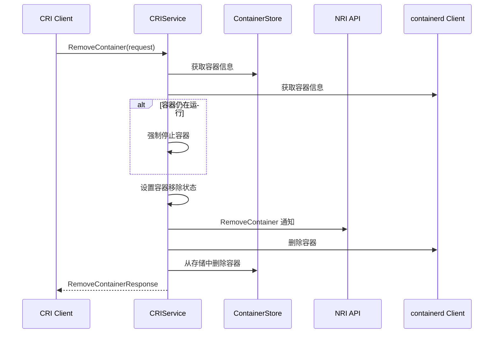

#### 3.7.1 关键代码说明

**RemoveContainer 核心实现** (`pkg/cri/sbserver/container_remove.go`)：

```go
// RemoveContainer 删除容器
func (c *criService) RemoveContainer(ctx context.Context, r *runtime.RemoveContainerRequest) (*runtime.RemoveContainerResponse, error) {
    containerID := r.GetContainerId()
    
    // 1. 获取容器信息
    container, err := c.containerStore.Get(containerID)
    if err != nil {
        return nil, fmt.Errorf("failed to find container %q: %w", containerID, err)
    }
    
    // 2. 强制停止容器（如果仍在运行）
    if container.Status.State() == runtime.ContainerState_CONTAINER_RUNNING {
        if err := c.stopContainer(ctx, container, 10); err != nil {
            logrus.WithError(err).Errorf("Failed to stop container %q", containerID)
        }
    }
    
    // 3. 获取 containerd 容器
    cntr, err := c.client.LoadContainer(ctx, containerID)
    if err != nil {
        return nil, fmt.Errorf("failed to load container %q: %w", containerID, err)
    }
    
    // 4. 删除容器任务（如果存在）
    task, err := cntr.Task(ctx, nil)
    if err == nil {
        if _, err := task.Delete(ctx, containerd.WithProcessKill); err != nil {
            logrus.WithError(err).Errorf("Failed to delete task for container %q", containerID)
        }
    }
    
    // 5. 删除 containerd 容器
    if err := cntr.Delete(ctx, containerd.WithSnapshotCleanup); err != nil {
        return nil, fmt.Errorf("failed to delete container %q: %w", containerID, err)
    }
    
    // 6. 清理容器 IO
    if container.IO != nil {
        container.IO.Close()
    }
    
    // 7. 从存储中删除容器
    if err := c.containerStore.Delete(containerID); err != nil {
        return nil, fmt.Errorf("failed to delete container %q from store: %w", containerID, err)
    }
    
    // 8. 释放容器名称
    c.containerNameIndex.ReleaseByKey(containerID)
    
    return &runtime.RemoveContainerResponse{}, nil
}
```

**容器清理关键代码**：

```go
// cleanupContainer 清理容器相关资源
func (c *criService) cleanupContainer(ctx context.Context, container containerstore.Container) error {
    containerID := container.ID
    
    // 1. 清理容器挂载点
    for _, mount := range container.Config.GetMounts() {
        if mount.GetHostPath() != "" {
            if err := unix.Unmount(mount.GetContainerPath(), unix.MNT_DETACH); err != nil {
                logrus.WithError(err).Warnf("Failed to unmount %q", mount.GetContainerPath())
            }
        }
    }
    
    // 2. 清理容器日志文件
    logPath := container.LogPath
    if logPath != "" {
        if err := os.Remove(logPath); err != nil && !os.IsNotExist(err) {
            logrus.WithError(err).Warnf("Failed to remove log file %q", logPath)
        }
    }
    
    // 3. 清理容器工作目录
    if container.RootfsPath != "" {
        if err := os.RemoveAll(container.RootfsPath); err != nil {
            logrus.WithError(err).Warnf("Failed to remove rootfs %q", container.RootfsPath)
        }
    }
    
    // 4. 清理容器网络配置
    if container.NetNSPath != "" {
        if err := os.Remove(container.NetNSPath); err != nil && !os.IsNotExist(err) {
            logrus.WithError(err).Warnf("Failed to remove netns file %q", container.NetNSPath)
        }
    }
    
    return nil
}
```

---

## 4. Image Service 接口时序图

**Image Service** 负责容器镜像的全生命周期管理，是 `CRI` 规范中的另一个核心服务。本章深入分析镜像相关接口的实现机制，包括镜像拉取、删除、列表查询、状态检查和文件系统信息获取等操作。通过时序图展示各接口与 `containerd` 底层存储、镜像仓库以及本地缓存的交互过程。

### 4.1 PullImage 时序图

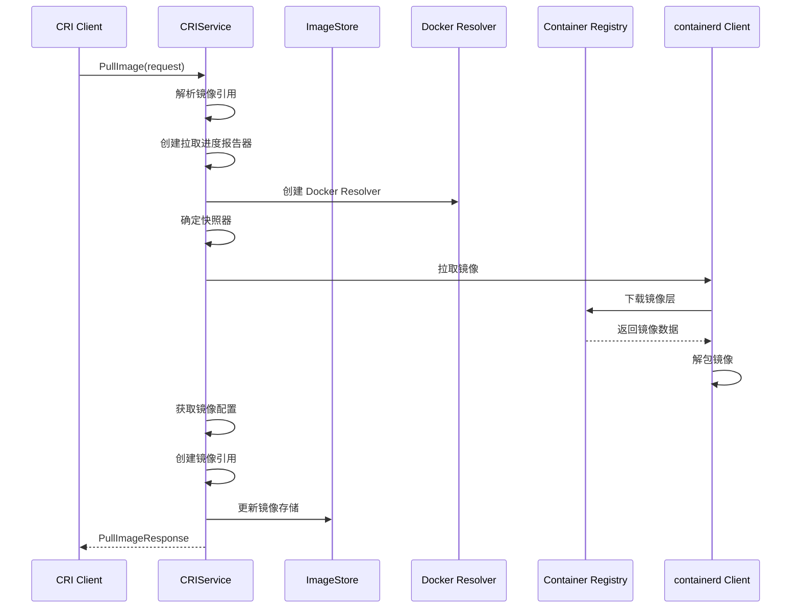

#### 4.1.1 关键代码说明

**PullImage 核心实现** (`pkg/cri/sbserver/image_pull.go`)：

```go
// PullImage 拉取镜像到本地
func (c *criService) PullImage(ctx context.Context, r *runtime.PullImageRequest) (_ *runtime.PullImageResponse, retErr error) {
    imageRef := r.GetImage().GetImage()
    
    // 1. 解析镜像引用并创建 Resolver
    namedRef, err := docker.ParseDockerRef(imageRef)
    if err != nil {
        return nil, err
    }
    
    resolver, err := c.newResolver(ctx, r.GetAuth())
    if err != nil {
        return nil, err
    }
    
    // 2. 配置拉取选项并拉取镜像
    snapshotter := c.config.containerdConfig.Snapshotter
    if snapshotter == "" {
        snapshotter = containerd.DefaultSnapshotter
    }
    
    pullOpts := []containerd.RemoteOpt{
        containerd.WithResolver(resolver),
        containerd.WithPullSnapshotter(snapshotter),
        containerd.WithPullUnpack,
    }
    
    image, err := c.client.Pull(ctx, namedRef.String(), pullOpts...)
    if err != nil {
        return nil, err
    }
    
    // 3. 获取镜像配置并更新存储
    configDesc, err := image.Config(ctx)
    if err != nil {
        return nil, err
    }
    
    imageID := configDesc.Digest.String()
    repoTags, repoDigests := parseImageReferences([]string{imageRef})
    
    if err := c.updateImage(ctx, imageID, repoTags, repoDigests); err != nil {
        return nil, err
    }
    
    return &runtime.PullImageResponse{
        ImageRef: imageID,
    }, nil
}
```

**认证解析关键代码**：

```go
// newResolver 创建 Docker 镜像仓库解析器
func (c *criService) newResolver(ctx context.Context, auth *runtime.AuthConfig) (remotes.Resolver, error) {
    // 1. 创建基础解析器选项
    resolverOpts := docker.ResolverOptions{
        Tracker: docker.NewInMemoryTracker(),
    }
    
    // 2. 处理认证信息
    if auth != nil {
        if auth.GetIdentityToken() != "" {
            resolverOpts.Credentials = func(string) (string, string, error) {
                return "", auth.GetIdentityToken(), nil
            }
        } else if auth.GetUsername() != "" {
            resolverOpts.Credentials = func(string) (string, string, error) {
                return auth.GetUsername(), auth.GetPassword(), nil
            }
        } else if auth.GetAuth() != "" {
            // 解码 base64 编码的认证信息
            decoded, err := base64.StdEncoding.DecodeString(auth.GetAuth())
            if err != nil {
                return nil, fmt.Errorf("failed to decode auth: %w", err)
            }
            
            parts := strings.SplitN(string(decoded), ":", 2)
            if len(parts) != 2 {
                return nil, errors.New("invalid auth format")
            }
            
            resolverOpts.Credentials = func(string) (string, string, error) {
                return parts[0], parts[1], nil
            }
        }
    }
    
    // 3. 设置 TLS 配置
    if c.config.Registry.TLS != nil {
        resolverOpts.Client = &http.Client{
            Transport: &http.Transport{
                TLSClientConfig: c.config.Registry.TLS,
            },
        }
    }
    
    return docker.NewResolver(resolverOpts), nil
}
```

**镜像存储更新关键代码**：

```go
// updateImage 更新镜像存储信息
func (c *criService) updateImage(ctx context.Context, imageID string, repoTags, repoDigests []string) error {
    // 1. 获取镜像信息
    image, err := c.client.GetImage(ctx, imageID)
    if err != nil {
        return fmt.Errorf("failed to get image: %w", err)
    }
    
    // 2. 获取镜像大小
    size, err := image.Size(ctx)
    if err != nil {
        return fmt.Errorf("failed to get image size: %w", err)
    }
    
    // 3. 创建镜像元数据
    imageInfo := imagestore.Image{
        ID:          imageID,
        RepoTags:    repoTags,
        RepoDigests: repoDigests,
        Size:        uint64(size),
        Spec:        image,
        CreatedAt:   time.Now(),
        UpdatedAt:   time.Now(),
    }
    
    // 4. 添加到镜像存储
    return c.imageStore.Add(imageInfo)
}
```

### 4.2 RemoveImage 时序图

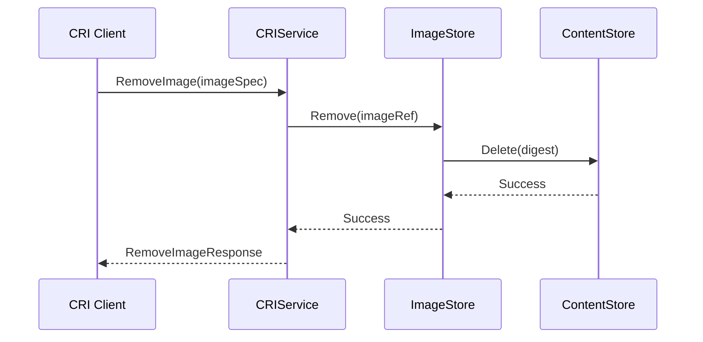

#### 4.2.1 关键代码说明

**RemoveImage 核心实现** (`pkg/cri/sbserver/image_remove.go`)：

```go
// RemoveImage 删除指定镜像
func (c *criService) RemoveImage(ctx context.Context, r *runtime.RemoveImageRequest) (*runtime.RemoveImageResponse, error) {
    imageRef := r.GetImage().GetImage()
    
    // 1. 解析镜像引用
    namedRef, err := docker.ParseDockerRef(imageRef)
    if err != nil {
        return nil, fmt.Errorf("failed to parse image reference %q: %w", imageRef, err)
    }
    
    // 2. 检查镜像是否被容器使用
    if err := c.checkImageInUse(ctx, namedRef.String()); err != nil {
        return nil, fmt.Errorf("image is in use: %w", err)
    }
    
    // 3. 从镜像存储中删除
    if err := c.imageStore.Delete(namedRef.String()); err != nil {
        return nil, fmt.Errorf("failed to delete from image store: %w", err)
    }
    
    // 4. 删除底层镜像数据
    if err := c.client.ImageService().Delete(ctx, namedRef.String()); err != nil {
        return nil, fmt.Errorf("failed to delete image: %w", err)
    }
    
    return &runtime.RemoveImageResponse{}, nil
}
```

**镜像使用检查关键代码**：

```go
// checkImageInUse 检查镜像是否被容器使用
func (c *criService) checkImageInUse(ctx context.Context, imageRef string) error {
    containers := c.containerStore.List()
    for _, container := range containers {
        if container.ImageRef == imageRef {
            return fmt.Errorf("image %q is used by container %q", imageRef, container.ID)
        }
    }
    return nil
}
```

### 4.3 ListImages 时序图

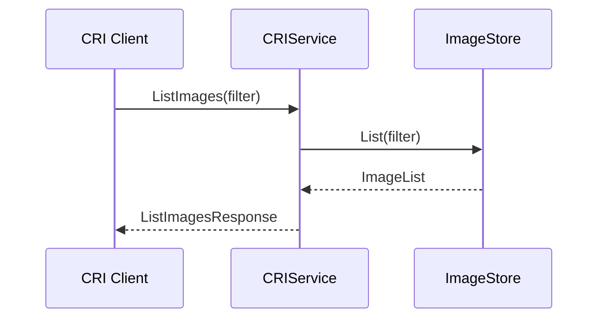

#### 4.3.1 关键代码说明

**ListImages 核心实现** (`pkg/cri/sbserver/image_list.go`)：

```go
// ListImages 列出所有镜像
func (c *criService) ListImages(ctx context.Context, r *runtime.ListImagesRequest) (*runtime.ListImagesResponse, error) {
    filter := r.GetFilter()
    
    // 1. 从镜像存储获取所有镜像
    images := c.imageStore.List()
    
    // 2. 应用过滤器
    var filteredImages []imagestore.Image
    for _, img := range images {
        if c.matchImageFilter(img, filter) {
            filteredImages = append(filteredImages, img)
        }
    }
    
    // 3. 转换为 CRI 格式
    var criImages []*runtime.Image
    for _, img := range filteredImages {
        criImage, err := c.toCRIImage(ctx, img)
        if err != nil {
            logrus.WithError(err).Warnf("Failed to convert image %q", img.ID)
            continue
        }
        criImages = append(criImages, criImage)
    }
    
    return &runtime.ListImagesResponse{
        Images: criImages,
    }, nil
}
```

**镜像过滤关键代码**：

```go
// matchImageFilter 检查镜像是否匹配过滤条件
func (c *criService) matchImageFilter(img imagestore.Image, filter *runtime.ImageFilter) bool {
    if filter == nil {
        return true
    }
    
    // 1. 按镜像引用过滤
    if filter.GetImage() != nil {
        imageRef := filter.GetImage().GetImage()
        if !c.matchImageRef(img, imageRef) {
            return false
        }
    }
    
    return true
}

// matchImageRef 检查镜像引用是否匹配
func (c *criService) matchImageRef(img imagestore.Image, ref string) bool {
    // 检查镜像 ID
    if img.ID == ref {
        return true
    }
    
    // 检查 RepoTags
    for _, tag := range img.RepoTags {
        if tag == ref {
            return true
        }
    }
    
    // 检查 RepoDigests
    for _, digest := range img.RepoDigests {
        if digest == ref {
            return true
        }
    }
    
    return false
}
```

### 4.4 ImageStatus 时序图

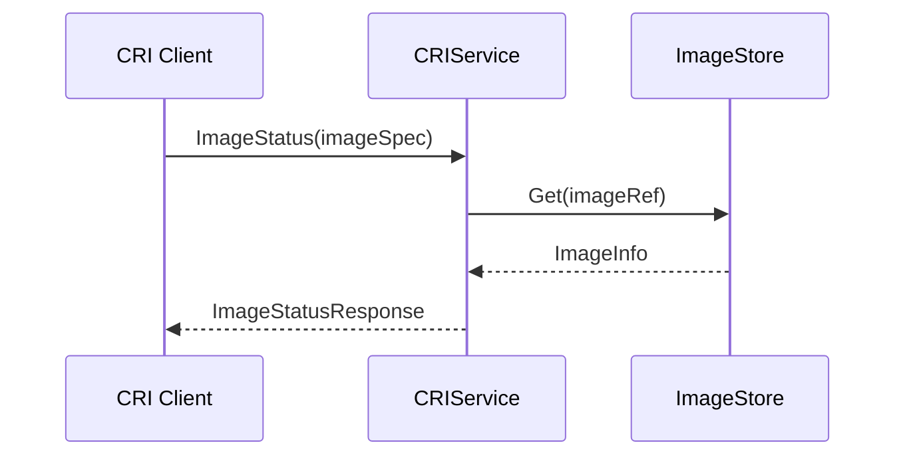

#### 4.4.1 关键代码说明

**ImageStatus 核心实现** (`pkg/cri/sbserver/image_status.go`)：

```go
// ImageStatus 获取镜像状态信息
func (c *criService) ImageStatus(ctx context.Context, r *runtime.ImageStatusRequest) (*runtime.ImageStatusResponse, error) {
    imageRef := r.GetImage().GetImage()
    
    // 1. 解析镜像引用
    namedRef, err := docker.ParseDockerRef(imageRef)
    if err != nil {
        return nil, fmt.Errorf("failed to parse image reference %q: %w", imageRef, err)
    }
    
    // 2. 从镜像存储查找镜像
    img, err := c.imageStore.Get(namedRef.String())
    if err != nil {
        if err == imagestore.ErrNotExist {
            return &runtime.ImageStatusResponse{}, nil
        }
        return nil, fmt.Errorf("failed to get image: %w", err)
    }
    
    // 3. 转换为 CRI 格式
    criImage, err := c.toCRIImage(ctx, img)
    if err != nil {
        return nil, fmt.Errorf("failed to convert image: %w", err)
    }
    
    return &runtime.ImageStatusResponse{
        Image: criImage,
    }, nil
}
```

**镜像格式转换关键代码**：

```go
// toCRIImage 将内部镜像格式转换为 CRI 格式
func (c *criService) toCRIImage(ctx context.Context, img imagestore.Image) (*runtime.Image, error) {
    // 1. 获取镜像配置
    config, err := img.Spec.Config(ctx)
    if err != nil {
        return nil, fmt.Errorf("failed to get image config: %w", err)
    }
    
    // 2. 解析镜像配置
    var ociConfig ocispec.Image
    if err := json.Unmarshal(config.Data, &ociConfig); err != nil {
        return nil, fmt.Errorf("failed to unmarshal image config: %w", err)
    }
    
    // 3. 构建 CRI 镜像对象
    criImage := &runtime.Image{
        Id:          img.ID,
        RepoTags:    img.RepoTags,
        RepoDigests: img.RepoDigests,
        Size_:       img.Size,
        Spec: &runtime.ImageSpec{
            Image: img.RepoTags[0],
        },
    }
    
    // 4. 设置用户信息
    if ociConfig.Config.User != "" {
        criImage.Username = ociConfig.Config.User
    }
    
    return criImage, nil
}
```

### 4.5 ImageFsInfo 时序图

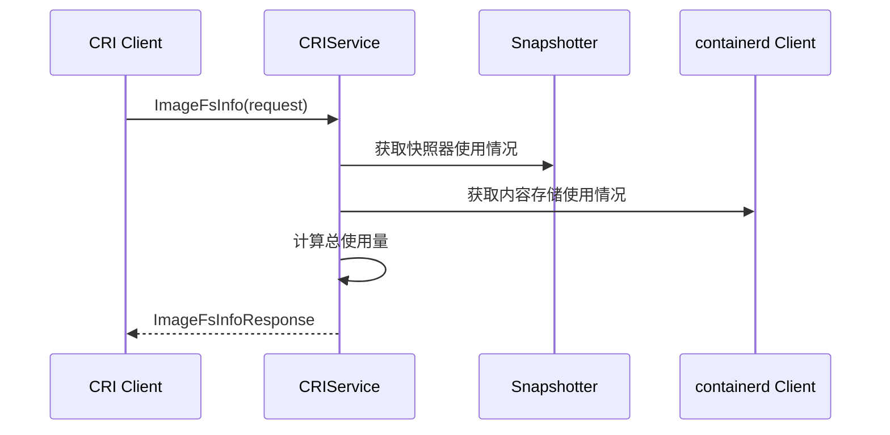

#### 4.5.1 关键代码说明

**ImageFsInfo 核心实现** (`pkg/cri/sbserver/imagefs_info.go`)：

```go
// ImageFsInfo 获取镜像文件系统使用信息
func (c *criService) ImageFsInfo(ctx context.Context, r *runtime.ImageFsInfoRequest) (*runtime.ImageFsInfoResponse, error) {
    // 1. 获取快照器使用情况
    snapshotter := c.config.containerdConfig.Snapshotter
    snapshotterUsage, err := c.getSnapshotterUsage(ctx, snapshotter)
    if err != nil {
        return nil, fmt.Errorf("failed to get snapshotter usage: %w", err)
    }
    
    // 2. 获取内容存储使用情况并计算总量
    contentUsage, err := c.getContentStoreUsage(ctx)
    if err != nil {
        return nil, err
    }
    
    totalUsed := snapshotterUsage.Size + contentUsage.Size
    totalInodes := snapshotterUsage.Inodes + contentUsage.Inodes
    
    // 3. 构建响应
    fsInfo := &runtime.FilesystemUsage{
        Timestamp: time.Now().UnixNano(),
        FsId: &runtime.FilesystemIdentifier{
            Mountpoint: c.config.containerdConfig.Root,
        },
        UsedBytes: &runtime.UInt64Value{Value: totalUsed},
        InodesUsed: &runtime.UInt64Value{Value: totalInodes},
    }
    
    return &runtime.ImageFsInfoResponse{
        ImageFilesystems: []*runtime.FilesystemUsage{fsInfo},
    }, nil
}
```

**存储使用量统计关键代码**：

```go
// getSnapshotterUsage 获取快照器存储使用量
func (c *criService) getSnapshotterUsage(ctx context.Context, snapshotter string) (*UsageInfo, error) {
    snapshotService := c.client.SnapshotService(snapshotter)
    
    // 1. 遍历所有快照并计算使用量
    var totalSize, totalInodes uint64
    err := snapshotService.Walk(ctx, func(ctx context.Context, info snapshots.Info) error {
        usage, err := snapshotService.Usage(ctx, info.Name)
        if err != nil {
            return nil
        }
        totalSize += uint64(usage.Size)
        totalInodes += uint64(usage.Inodes)
        return nil
    })
    if err != nil {
        return nil, err
    }
    
    return &UsageInfo{Size: totalSize, Inodes: totalInodes}, nil
}

// getContentStoreUsage 获取内容存储使用量
func (c *criService) getContentStoreUsage(ctx context.Context) (*UsageInfo, error) {
    contentStore := c.client.ContentStore()
    
    // 1. 遍历所有内容并计算使用量
    var totalSize, totalInodes uint64
    err := contentStore.Walk(ctx, func(info content.Info) error {
        totalSize += uint64(info.Size)
        totalInodes++
        return nil
    })
    if err != nil {
        return nil, err
    }
    
    return &UsageInfo{Size: totalSize, Inodes: totalInodes}, nil
}
```

## 5. 总结

**containerd CRI Plugin** 通过清晰的接口设计和模块化的架构，实现了对容器和镜像的完整生命周期管理。每个接口都有明确的职责分工，通过时序图可以清楚地看到各组件之间的交互关系和数据流向。

**主要特点**:

1. **模块化设计**: 各组件职责明确，便于维护和扩展
2. **状态管理**: 完善的状态机制确保操作的一致性
3. **错误处理**: 全面的错误处理和资源清理机制
4. **性能优化**: 多种优化策略提升系统性能
5. **标准兼容**: 完全符合 `CRI` 规范要求

**核心优势**:

- **高性能**: 基于 `containerd` 的高效容器运行时
- **可扩展**: 支持多种运行时和网络插件
- **稳定性**: 成熟的错误处理和恢复机制
- **兼容性**: 完全兼容 `Kubernetes CRI` 接口规范

这种设计使得 `containerd` 能够作为 `Kubernetes` 的可靠容器运行时，为云原生应用提供稳定高效的容器管理服务。
