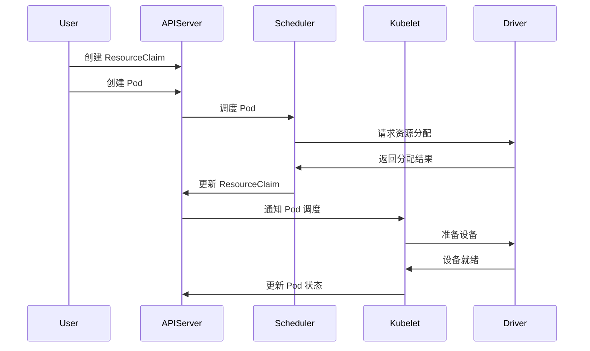

# Dynamic Resource Allocation in Kubernetes 入门指南

## 1. 概述

`Dynamic Resource Allocation` (DRA) 是 **Kubernetes 1.26** 版本引入的一项重要特性，旨在解决传统 `Device Plugin` 框架在硬件资源管理方面的局限性。随着 AI/ML 工作负载的快速发展和硬件加速器的广泛应用，传统的静态资源分配方式已无法满足现代云原生应用的复杂需求。

**重要更新**：在 **Kubernetes v1.34** 版本中，`DRA` 核心功能已正式发布为稳定版。`resource.k8s.io/v1` 接口已升级为稳定版并默认可用，这标志着 `DRA` 技术已经成熟并可以在生产环境中安全使用。

### 1.1 Kubernetes 资源管理的演进历程

`Kubernetes` 作为容器编排平台，其资源管理能力经历了从简单到复杂、从静态到动态的演进过程。最初，`Kubernetes` 主要关注 `CPU` 和 `内存` 等基础计算资源的管理，通过 `Resource Requests` 和 `Limits` 机制来保证工作负载的资源需求。随着云原生技术的发展和硬件加速器的普及，传统的资源管理方式逐渐暴露出局限性。

### 1.2 传统资源分配方式的局限性

传统的 `Kubernetes` 资源分配方式主要存在以下问题：

- **静态资源定义**：资源类型和数量需要在集群初始化时预先定义，缺乏动态调整能力
- **粗粒度资源管理**：无法精细化管理硬件设备的特定属性和配置
- **资源共享困难**：同一设备无法在多个容器或 `Pod` 之间安全共享
- **设备发现复杂**：缺乏统一的设备发现和管理机制
- **配置管理分散**：设备配置分散在不同的组件中，难以统一管理

### 1.3 DRA 技术的核心价值

`DRA` 提供了一种全新的资源管理范式，支持动态资源分配、精细化设备管理、灵活的资源共享以及统一的配置管理。通过引入 `DeviceClass`、`ResourceClaim`、`ResourceClaimTemplate` 和 `ResourceSlice` 等核心概念，DRA 为 Kubernetes 带来了下一代资源管理能力。

随着 AI/ML 工作负载的兴起、边缘计算的发展以及专用硬件加速器的普及，`Kubernetes` 需要一种更加灵活、强大的资源管理机制。`DRA` 正是在这种背景下应运而生的技术，它为现代云原生应用提供了强有力的技术支撑。

### 1.4 本文内容概览

本文将深入探讨 `DRA` 的核心概念、架构设计、实现原理和实际应用，为读者提供从理论到实践的完整指南。无论您是 `Kubernetes` 集群管理员、应用开发者还是硬件厂商，都能从本文中获得有价值的见解和实用的指导。

**主要内容包括：**

- **核心概念解析**：深入理解 `DRA` 的基本概念和组件架构
- **技术原理剖析**：详细分析资源分配流程和调度器集成机制
- **实践应用指南**：通过丰富的 `YAML` 配置示例学习实际应用
- **迁移策略指导**：提供从 `Device Plugin` 到 `DRA` 的完整迁移方案
- **最佳实践分享**：总结生产环境中的经验和注意事项

---

## 2. 从 Device Plugin 到 DRA 的演进

本章将介绍 `DRA` 技术的背景和演进历史，从传统的 `Device Plugin` 框架到 `DRA` 技术的发展过程。

### 2.1 Device Plugin 框架简介

#### 2.1.1 Device Plugin 的工作原理

`Device Plugin` 是 `Kubernetes` 提供的一种扩展机制，允许集群管理员向 `Kubernetes` 节点公告专用硬件资源。

`Device Plugin` 通过以下方式工作：

1. **设备发现**：`Device Plugin` 在节点上运行，负责发现和监控硬件设备
2. **资源注册**：向 kubelet 注册设备资源，包括设备类型和数量
3. **资源分配**：当 Pod 请求设备资源时，`Device Plugin` 负责分配具体的设备
4. **生命周期管理**：管理设备的分配、释放和健康检查

#### 2.1.2 支持的硬件类型

`Device Plugin` 框架支持多种硬件类型：

- **GPU 设备**：`NVIDIA GPU`、`AMD GPU`、`Intel GPU` 等
- **网络设备**：`SR-IOV 网络接口`、`DPDK 设备` 等
- **存储设备**：`NVMe SSD`、`高性能存储控制器` 等
- **AI 加速器**：`TPU`、`VPU`、`FPGA` 等专用 AI 芯片
- **其他专用硬件**：`加密卡`、`压缩卡` 等

#### 2.1.3 参考实现

目前业界有许多成熟的 `Device Plugin` 实现：

- **NVIDIA GPU Device Plugin**：支持 `NVIDIA GPU` 的发现和分配
- **Intel GPU Device Plugin**：支持 `Intel 集成显卡` 和 `独立显卡`
- **AMD GPU Device Plugin**：支持 `AMD GPU` 设备
- **SR-IOV Network Device Plugin**：支持 `SR-IOV 网络设备`
- **Intel QAT Device Plugin**：支持 `Intel QuickAssist 技术`

### 2.2 Device Plugin 框架的局限性

#### 2.2.1 资源管理的局限性

`Device Plugin` 框架虽然为 Kubernetes 提供了硬件设备管理能力，但在实际使用中暴露出以下局限性：

##### 2.2.1.1 静态资源定义

设备资源必须在节点启动时预先定义，无法动态调整。这种静态模式在现代云原生环境中存在明显不足：

```yaml
# Device Plugin 的静态资源定义示例
apiVersion: v1
kind: Node
metadata:
  name: gpu-node-1
status:
  capacity:
    nvidia.com/gpu: "4"  # 静态定义，无法动态调整
  allocatable:
    nvidia.com/gpu: "4"
```

**问题分析**：

- 无法根据工作负载需求动态调整设备配置
- 设备故障或维护时无法灵活重新分配资源
- 不支持设备的热插拔和动态发现

##### 2.2.1.2 粗粒度管理

`Device Plugin` 只能按设备数量进行分配，无法精细化管理设备属性：

```go
// Device Plugin 接口的局限性
type DevicePluginServer interface {
    // 只能返回设备列表，无法描述设备详细属性
    ListAndWatch(empty *Empty, stream DevicePlugin_ListAndWatchServer) error
    // 分配时只能指定设备 ID，无法传递配置参数
    Allocate(context.Context, *AllocateRequest) (*AllocateResponse, error)
}

// 设备信息结构体过于简单
type Device struct {
    ID     string            // 设备 ID
    Health string            // 健康状态
    // 缺少设备属性、配置参数等详细信息
}
```

**具体限制**：

- 无法描述 GPU 的内存大小、计算能力等属性
- 不支持设备的部分分配（如 GPU 虚拟化）
- 缺乏设备间的亲和性和反亲和性配置

##### 2.2.1.3 配置复杂性

设备配置分散在多个组件中，增加了管理复杂性：

```bash
# 配置分散在多个位置
# 1. kubelet 配置
echo 'KUBELET_EXTRA_ARGS="--feature-gates=DevicePlugins=true"' >> /etc/default/kubelet

# 2. Device Plugin DaemonSet
kubectl apply -f nvidia-device-plugin.yaml

# 3. 容器运行时配置
# /etc/docker/daemon.json
{
  "default-runtime": "nvidia",
  "runtimes": {
    "nvidia": {
      "path": "nvidia-container-runtime",
      "runtimeArgs": []
    }
  }
}

# 4. Pod 资源请求
apiVersion: v1
kind: Pod
spec:
  containers:
  - name: gpu-container
    resources:
      limits:
        nvidia.com/gpu: 1  # 只能请求数量，无法指定具体需求
```

##### 2.2.1.4 共享困难

同一设备难以在多个容器间安全共享：

```yaml
# Device Plugin 不支持设备共享
apiVersion: v1
kind: Pod
metadata:
  name: multi-container-pod
spec:
  containers:
  - name: container-1
    resources:
      limits:
        nvidia.com/gpu: 1  # 独占整个 GPU
  - name: container-2
    resources:
      limits:
        nvidia.com/gpu: 1  # 需要另一个 GPU，无法共享
```

**共享限制**：

- 无法实现 GPU 的时间片共享
- 不支持 MIG（Multi-Instance GPU）等虚拟化技术
- 缺乏资源隔离和 QoS 保证机制

##### 2.2.1.5 扩展性限制

添加新设备类型需要修改核心代码，扩展性受限：

```go
// 添加新设备类型需要修改 kubelet 源码
// pkg/kubelet/cm/devicemanager/manager.go
func (m *ManagerImpl) Start(activePods ActivePodsFunc, sourcesReady config.SourcesReady) error {
    // 硬编码的设备类型检查
    if strings.HasPrefix(resourceName, "nvidia.com/") {
        // NVIDIA GPU 处理逻辑
    } else if strings.HasPrefix(resourceName, "amd.com/") {
        // AMD GPU 处理逻辑
    }
    // 添加新厂商需要修改此处代码
}
```

#### 2.2.2 调度和分配的问题

`Device Plugin` 在调度和资源分配方面存在以下关键问题：

##### 2.2.2.1 调度器感知不足

调度器无法感知设备的详细属性和拓扑关系：

```go
// 当前调度器的设备感知能力有限
type NodeInfo struct {
    node                     *v1.Node
    pods                     []*v1.Pod
    requestedResource        *Resource  // 只包含资源数量
    nonzeroRequest          *Resource
    allocatableResource     *Resource
    // 缺少设备拓扑、属性等详细信息
}

// 调度决策时无法考虑设备特性
func (f *Fit) Filter(ctx context.Context, state *framework.CycleState, pod *v1.Pod, nodeInfo *framework.NodeInfo) *framework.Status {
    // 只能检查资源数量是否足够
    if nodeInfo.Allocatable.ScalarResources["nvidia.com/gpu"] < podRequest {
        return framework.NewStatus(framework.Unschedulable, "Insufficient GPU")
    }
    // 无法考虑 GPU 型号、内存大小、互联拓扑等因素
}
```

**具体问题**：

- 无法根据 GPU 型号匹配工作负载需求
- 不能考虑 NUMA 拓扑和设备间的互联关系
- 缺乏设备性能和功耗等调度因子

##### 2.2.2.2 分配策略单一

缺乏灵活的资源分配策略：

```yaml
# 当前只支持简单的数量分配
apiVersion: v1
kind: Pod
spec:
  containers:
  - name: ml-training
    resources:
      limits:
        nvidia.com/gpu: 2  # 只能指定数量，无法指定分配策略
      requests:
        nvidia.com/gpu: 2
```

**策略限制**：

- 无法指定设备分配的优先级策略
- 不支持设备的亲和性和反亲和性
- 缺乏基于工作负载特征的智能分配

##### 2.2.2.3 跨节点调度困难

难以实现跨节点的设备资源优化分配：

```go
// 当前调度器无法进行全局设备资源优化
func (pl *NodeResourcesFit) Score(ctx context.Context, state *framework.CycleState, pod *v1.Pod, nodeName string) (int64, *framework.Status) {
    // 只能基于单节点资源进行评分
    nodeInfo, err := pl.handle.SnapshotSharedLister().NodeInfos().Get(nodeName)
    
    // 无法考虑跨节点的设备资源分布和优化
    score := calculateNodeScore(nodeInfo.Allocatable, nodeInfo.Requested)
    return score, nil
}
```

##### 2.2.2.4 资源碎片化

容易产生资源碎片，降低集群利用率：

```bash
# 资源碎片化示例
# 节点 A：4 个 GPU，已分配 3 个，剩余 1 个
# 节点 B：4 个 GPU，已分配 3 个，剩余 1 个
# 节点 C：4 个 GPU，已分配 3 个，剩余 1 个

# 新的 Pod 需要 2 个 GPU，但无法调度到任何节点
# 尽管集群总共有 3 个空闲 GPU
kubectl get nodes -o custom-columns=NAME:.metadata.name,GPU-CAPACITY:.status.capacity.nvidia\.com/gpu,GPU-ALLOCATABLE:.status.allocatable.nvidia\.com/gpu
```

**碎片化问题**：

- 无法进行设备资源的重新平衡
- 不支持设备资源的动态迁移
- 缺乏集群级别的资源优化策略

### 2.3 DRA 的诞生背景

#### 2.3.1 云原生环境下资源管理的新需求

随着云原生技术的发展，对资源管理提出了新的需求：

1. **动态资源分配**：支持运行时动态调整资源配置
2. **精细化管理**：能够管理设备的详细属性和配置参数
3. **多租户支持**：支持安全的资源共享和隔离
4. **拓扑感知**：考虑硬件拓扑关系进行优化分配
5. **标准化接口**：提供统一的资源管理接口

#### 2.3.2 硬件加速器普及带来的挑战

现代数据中心中硬件加速器的普及带来了新的挑战：

- **设备类型多样化**：GPU、FPGA、AI 芯片等多种设备类型
- **配置复杂性增加**：不同设备需要不同的配置参数
- **性能优化需求**：需要根据工作负载特点优化设备配置
- **成本控制要求**：需要提高昂贵硬件的利用率

---

## 3. DRA 核心概念、组件与架构

### 3.1 核心资源

`DRA` 引入了四种核心 `Kubernetes` 资源对象来实现动态设备资源管理。这些资源对象相互协作，构成了完整的设备资源生命周期管理体系：

1. **DeviceClass**：定义设备类型和配置模板，类似于 `StorageClass` 的概念
2. **ResourceClaim**：表示对设备资源的具体请求，类似于 `PersistentVolumeClaim`
3. **ResourceClaimTemplate**：用于在 `Pod` 模板中动态创建 `ResourceClaim`
4. **ResourceSlice**：描述节点上可用的设备资源信息

这些资源对象通过声明式 API 提供了灵活、可扩展的设备资源管理能力，支持复杂的设备配置、动态分配和生命周期管理。相比传统的 `Device Plugin` 模式，`DRA` 的资源模型更加精细化，能够满足现代云原生应用对硬件资源的多样化需求。

#### 3.1.1 DeviceClass

**概念定义**：

`DeviceClass` 是 DRA 中的核心概念之一，它定义了一类设备的共同特征和配置参数。`DeviceClass` 类似于 `StorageClass`，为设备资源提供了抽象层。

**主要功能**：

1. **设备分类**：将具有相似特征的设备归为一类
2. **配置模板**：定义设备的默认配置参数
3. **选择条件**：指定设备选择的条件和约束
4. **驱动绑定**：关联特定的设备驱动程序

**配置示例**：

```yaml
apiVersion: resource.k8s.io/v1beta1
kind: DeviceClass
metadata:
  name: nvidia-a100-gpu
spec:
  # 设备选择条件
  selectors:
  - cel:
      expression: |
        device.driver == "nvidia.com/gpu" &&
        device.attributes["model"].string() == "A100" &&
        device.attributes["memory"].quantity() >= quantity("40Gi")
  
  # 配置参数
  config:
  - opaque:
      driver: nvidia.com/gpu
      parameters:
        compute-mode: "exclusive-process"
        mig-strategy: "mixed"
```

#### 3.1.2 ResourceClaim

**概念定义**：

`ResourceClaim` 表示对特定设备资源的请求，类似于 `PersistentVolumeClaim`。它描述了工作负载所需的设备类型、数量和配置要求。

**生命周期管理**：

1. **创建阶段**：用户或控制器创建 `ResourceClaim`
2. **绑定阶段**：调度器将 `ResourceClaim` 绑定到具体设备
3. **使用阶段**：`Pod` 使用分配的设备资源
4. **释放阶段**：`Pod` 结束后释放设备资源

**配置示例**：

```yaml
apiVersion: resource.k8s.io/v1beta1
kind: ResourceClaim
metadata:
  name: gpu-training-claim
  namespace: ml-team
spec:
  devices:
    requests:
    - name: training-gpu
      deviceClassName: nvidia-a100-gpu
      count: 2
      constraints:
      - attributes:
          numa-node: "0"
          nvlink-peers: "all"
  allocationMode: WaitForFirstConsumer
```

#### 3.1.3 ResourceClaimTemplate

**概念定义**：

`ResourceClaimTemplate` 用于在 `Pod` 模板中定义 `ResourceClaim` 的模板，支持动态创建 `ResourceClaim`。这对于 `Deployment`、`StatefulSet` 等控制器特别有用。

**使用场景**：

1. **批量部署**：为多个 `Pod` 实例创建独立的 `ResourceClaim`
2. **动态扩缩容**：支持根据负载动态调整 `Pod` 数量
3. **模板化管理**：简化资源声明的管理

**配置示例**：

```yaml
apiVersion: apps/v1
kind: Deployment
metadata:
  name: inference-service
spec:
  replicas: 3
  template:
    spec:
      resourceClaimTemplates:
      - name: inference-gpu
        spec:
          devices:
            requests:
            - name: gpu
              deviceClassName: nvidia-inference-gpu
              count: 1
```

#### 3.1.4 ResourceSlice

**概念定义**：

`ResourceSlice` 是由 `DRA` 设备驱动程序创建和管理的 `Kubernetes` 资源对象，用于向 `Kubernetes` API 服务器发布集群中可用的设备资源信息。它代表一个或多个附加到节点的资源（如设备），为调度器提供资源发现和分配的基础数据。

**核心功能**：

1. **资源发布**：向 `Kubernetes` 集群发布节点上可用的设备资源信息
2. **调度支持**：为调度器提供资源分配决策所需的设备信息
3. **资源池管理**：按资源池组织设备，一个池可能由单个或多个 `ResourceSlice` 表示
4. **动态更新**：当集群中的资源容量发生变化时，驱动程序会更新 `ResourceSlice`

**信息内容**：

1. **设备清单**：资源池中所有可用设备的列表和标识
2. **设备属性**：每个设备的详细属性信息，如型号、内存、计算能力、驱动版本等
3. **设备容量**：设备的可用资源容量，如内存大小、计算核心数等
4. **拓扑信息**：设备的物理拓扑关系，如 NUMA 节点、PCI 总线位置等
5. **节点关联**：设备所在的节点信息，用于调度器进行节点选择
6. **资源池信息**：设备所属的资源池标识和管理信息

**YAML 示例**：

```yaml
apiVersion: resource.k8s.io/v1beta1
kind: ResourceSlice
metadata:
  name: gpu-slice-node1
  # ResourceSlice 通常由驱动程序自动创建，无需手动管理
spec:
  # 设备列表
  devices:
  - name: "gpu-0"  # 设备唯一标识
    basic:
      attributes:
        # 设备属性，用于 CEL 表达式过滤
        "gpu-driver.example.com/model":
          string: "A100"
        "gpu-driver.example.com/memory":
          string: "80Gi"
        "gpu-driver.example.com/cuda-version":
          string: "12.0"
      capacity:
        # 设备容量信息
        memory: "80Gi"
        compute-units: "6912"
  - name: "gpu-1"
    basic:
      attributes:
        "gpu-driver.example.com/model":
          string: "A100"
        "gpu-driver.example.com/memory":
          string: "80Gi"
        "gpu-driver.example.com/cuda-version":
          string: "12.0"
      capacity:
        memory: "80Gi"
        compute-units: "6912"
  # 驱动程序标识
  driver: "gpu-driver.example.com"
  # 关联的节点名称
  nodeName: "worker-node-1"
  # 资源池信息
  pool:
    name: "gpu-pool-1"
    generation: 1
    resourceSliceCount: 2  # 该池总共有多少个 ResourceSlice
```

### 3.2 整体架构设计

#### 3.2.1 架构组件

DRA 的整体架构包含以下核心组件：

1. **API Server**：存储和管理 DRA 相关的 API 对象
2. **调度器**：负责资源分配和 Pod 调度决策
3. **Kubelet**：在节点上管理设备资源的分配和释放
4. **设备驱动程序**：负责设备发现、配置和管理
5. **控制器**：管理 ResourceClaim 的生命周期

#### 3.2.2 组件交互流程



### 3.3 资源分配流程

#### 3.3.1 分配阶段

1. **资源请求**：用户创建包含 ResourceClaim 的 Pod
2. **调度决策**：调度器评估可用资源并选择合适的节点
3. **资源预留**：在选定节点上预留所需的设备资源
4. **设备配置**：驱动程序配置设备以满足工作负载需求
5. **资源绑定**：将配置好的设备绑定到 Pod

#### 3.3.2 释放阶段

1. **Pod 终止**：Pod 生命周期结束
2. **资源清理**：驱动程序清理设备配置
3. **资源释放**：将设备标记为可用状态
4. **状态更新**：更新 ResourceSlice 中的设备状态

### 3.4 调度器集成

#### 3.4.1 调度扩展点

DRA 通过以下调度扩展点与 Kubernetes 调度器集成：

1. **PreFilter**：检查 ResourceClaim 的可用性
2. **Filter**：过滤不满足资源要求的节点
3. **Score**：根据资源分布对节点进行评分
4. **Reserve**：预留选定节点上的资源
5. **PreBind**：在绑定前进行最终检查

#### 3.4.2 调度策略

```yaml
apiVersion: kubescheduler.config.k8s.io/v1beta3
kind: KubeSchedulerConfiguration
profiles:
- schedulerName: dra-scheduler
  plugins:
    preFilter:
      enabled:
      - name: DynamicResources
    filter:
      enabled:
      - name: DynamicResources
    score:
      enabled:
      - name: DynamicResources
  pluginConfig:
  - name: DynamicResources
    args:
      scoringStrategy:
        type: LeastAllocated
        resources:
        - name: "nvidia.com/gpu"
          weight: 100
```

---

## 4. 实际应用场景与 YAML 配置实践

### 4.1 机器学习训练场景

机器学习训练是 `GPU` 资源的主要使用场景之一。在这种场景下，通常需要：

- **高性能 GPU**：支持 `CUDA` 计算能力 7.0 以上
- **大容量显存**：至少 16GB 以上的显存
- **多 GPU 协同**：支持 `NVLink` 或 `PCIe` 高速互联
- **长时间运行**：训练任务可能持续数小时到数天

**DeviceClass 配置示例**：

```yaml
# 机器学习训练专用 GPU DeviceClass
apiVersion: resource.k8s.io/v1beta1
kind: DeviceClass
metadata:
  name: ml-training-gpu
  labels:
    purpose: machine-learning
    performance-tier: high
spec:
  # 设备选择条件
  selectors:
  - cel:
      expression: |
        device.driver == "nvidia.com/gpu" &&
        device.attributes["compute-capability"].string() >= "7.0" &&
        device.attributes["memory"].quantity() >= quantity("16Gi") &&
        device.attributes["features"].list().contains("cuda") &&
        device.attributes["features"].list().contains("tensor-cores")
  
  # 配置参数
  config:
  - opaque:
      driver: nvidia.com/gpu
      parameters:
        # GPU 计算模式设置
        compute-mode: "exclusive-process"
        # 内存管理策略
        memory-strategy: "unified"
        # 功耗管理
        power-management: "adaptive"
        # 错误检查和纠正
        ecc-enabled: "true"
        # 性能模式
        performance-mode: "maximum"

---
# 高端 GPU 专用 DeviceClass（A100/H100）
apiVersion: resource.k8s.io/v1beta1
kind: DeviceClass
metadata:
  name: premium-ml-gpu
  labels:
    purpose: machine-learning
    performance-tier: premium
spec:
  selectors:
  - cel:
      expression: |
        device.driver == "nvidia.com/gpu" &&
        (
          device.attributes["model"].string().contains("A100") ||
          device.attributes["model"].string().contains("H100")
        ) &&
        device.attributes["memory"].quantity() >= quantity("40Gi") &&
        device.attributes["nvlink"].bool() == true
  
  config:
  - opaque:
      driver: nvidia.com/gpu
      parameters:
        compute-mode: "exclusive-process"
        mig-strategy: "disabled"  # 禁用 MIG 以获得最大性能
        nvlink-topology: "optimized"
        memory-clock: "maximum"
        gpu-clock: "maximum"
```

**ResourceClaim 配置示例**：

```yaml
# 单 GPU 训练任务的 ResourceClaim
apiVersion: resource.k8s.io/v1beta1
kind: ResourceClaim
metadata:
  name: single-gpu-training-claim
  namespace: ml-team
  labels:
    workload-type: training
    priority: high
spec:
  devices:
    requests:
    - name: training-gpu
      deviceClassName: ml-training-gpu
      count: 1
      # 额外约束条件
      constraints:
      - attributes:
          memory: "32Gi"  # 需要至少 32GB 显存
          compute-capability: "8.0"  # 需要 Ampere 架构
          numa-node: "0"  # 优先选择 NUMA 节点 0
  
  # 分配模式
  allocationMode: WaitForFirstConsumer

---
# 多 GPU 分布式训练的 ResourceClaim
apiVersion: resource.k8s.io/v1beta1
kind: ResourceClaim
metadata:
  name: multi-gpu-training-claim
  namespace: ml-team
  labels:
    workload-type: distributed-training
    priority: high
spec:
  devices:
    requests:
    - name: training-gpus
      deviceClassName: premium-ml-gpu
      count: 4  # 请求 4 个 GPU
      constraints:
      - attributes:
          # 确保所有 GPU 在同一节点
          topology-zone: "same-node"
          # 确保 GPU 之间有 NVLink 连接
          nvlink-peers: "all"
          # 内存要求
          memory: "40Gi"
  
  allocationMode: WaitForFirstConsumer
```

**Pod 配置示例**：

```yaml
# 单 GPU 训练 Pod
apiVersion: v1
kind: Pod
metadata:
  name: pytorch-training-single-gpu
  namespace: ml-team
  labels:
    app: pytorch-training
    gpu-count: "1"
spec:
  # 使用 ResourceClaim
  resourceClaims:
  - name: gpu-claim
    resourceClaimName: single-gpu-training-claim
  
  containers:
  - name: trainer
    image: pytorch/pytorch:2.0.1-cuda11.7-cudnn8-devel
    command: ["python", "train.py"]
    args:
    - "--model=resnet50"
    - "--dataset=/data/imagenet"
    - "--epochs=100"
    - "--batch-size=256"
    
    # 资源配置
    resources:
      claims:
      - name: gpu-claim
      requests:
        cpu: "8"
        memory: "32Gi"
        ephemeral-storage: "100Gi"
      limits:
        cpu: "16"
        memory: "64Gi"
        ephemeral-storage: "200Gi"
    
    # 环境变量
    env:
    - name: CUDA_VISIBLE_DEVICES
      valueFrom:
        resourceFieldRef:
          resource: claims.gpu-claim.devices
    - name: NVIDIA_VISIBLE_DEVICES
      valueFrom:
        resourceFieldRef:
          resource: claims.gpu-claim.devices
    - name: NCCL_DEBUG
      value: "INFO"
    
    # 卷挂载
    volumeMounts:
    - name: training-data
      mountPath: /data
      readOnly: true
    - name: model-output
      mountPath: /output
    - name: shared-memory
      mountPath: /dev/shm
  
  # 卷定义
  volumes:
  - name: training-data
    persistentVolumeClaim:
      claimName: imagenet-dataset-pvc
  - name: model-output
    persistentVolumeClaim:
      claimName: model-output-pvc
  - name: shared-memory
    emptyDir:
      medium: Memory
      sizeLimit: "8Gi"
  
  # 调度配置
  nodeSelector:
    accelerator: nvidia-gpu
    gpu-memory: "32gi-plus"
  
  tolerations:
  - key: "nvidia.com/gpu"
    operator: "Exists"
    effect: "NoSchedule"

---
# 多 GPU 分布式训练 Pod
apiVersion: v1
kind: Pod
metadata:
  name: pytorch-training-multi-gpu
  namespace: ml-team
  labels:
    app: pytorch-distributed-training
    gpu-count: "4"
spec:
  resourceClaims:
  - name: multi-gpu-claim
    resourceClaimName: multi-gpu-training-claim
  
  containers:
  - name: trainer
    image: pytorch/pytorch:2.0.1-cuda11.7-cudnn8-devel
    command: ["torchrun"]
    args:
    - "--nproc_per_node=4"
    - "--nnodes=1"
    - "--node_rank=0"
    - "train_distributed.py"
    - "--model=transformer"
    - "--dataset=/data/wikitext"
    
    resources:
      claims:
      - name: multi-gpu-claim
      requests:
        cpu: "32"
        memory: "128Gi"
        ephemeral-storage: "500Gi"
      limits:
        cpu: "64"
        memory: "256Gi"
        ephemeral-storage: "1Ti"
    
    env:
    - name: CUDA_VISIBLE_DEVICES
      valueFrom:
        resourceFieldRef:
          resource: claims.multi-gpu-claim.devices
    - name: WORLD_SIZE
      value: "4"
    - name: NCCL_SOCKET_IFNAME
      value: "eth0"
    - name: NCCL_IB_DISABLE
      value: "1"
    
    volumeMounts:
    - name: training-data
      mountPath: /data
    - name: model-checkpoint
      mountPath: /checkpoints
    - name: shared-memory
      mountPath: /dev/shm
  
  volumes:
  - name: training-data
    persistentVolumeClaim:
      claimName: wikitext-dataset-pvc
  - name: model-checkpoint
    persistentVolumeClaim:
      claimName: checkpoint-pvc
  - name: shared-memory
    emptyDir:
      medium: Memory
      sizeLimit: "32Gi"
```

### 4.2 AI 推理服务场景

AI 推理服务通常具有以下特点：

- **低延迟要求**：响应时间通常在毫秒级
- **高并发处理**：需要同时处理多个推理请求
- **资源共享**：多个推理服务可能共享同一个 GPU
- **弹性伸缩**：根据负载动态调整实例数量

**DeviceClass 配置示例**：

```yaml
# AI 推理专用 GPU DeviceClass
apiVersion: resource.k8s.io/v1beta1
kind: DeviceClass
metadata:
  name: ai-inference-gpu
  labels:
    purpose: inference
    performance-tier: optimized
spec:
  selectors:
  - cel:
      expression: |
        device.driver == "nvidia.com/gpu" &&
        device.attributes["compute-capability"].string() >= "6.1" &&
        device.attributes["memory"].quantity() >= quantity("8Gi") &&
        device.attributes["features"].list().contains("tensor-cores")
  
  config:
  - opaque:
      driver: nvidia.com/gpu
      parameters:
        # 推理优化模式
        compute-mode: "default"  # 允许多进程共享
        memory-strategy: "optimized"
        # 启用 MIG 支持多租户
        mig-strategy: "enabled"
        # 推理优化设置
        inference-optimization: "enabled"
        tensorrt-optimization: "enabled"

---
# MIG 分区 DeviceClass
apiVersion: resource.k8s.io/v1beta1
kind: DeviceClass
metadata:
  name: mig-inference-gpu
  labels:
    purpose: inference
    sharing-mode: mig
spec:
  selectors:
  - cel:
      expression: |
        device.driver == "nvidia.com/mig" &&
        device.attributes["mig-profile"].string() == "1g.5gb" &&
        device.attributes["parent-gpu"].string().contains("A100")
  
  config:
  - opaque:
      driver: nvidia.com/mig
      parameters:
        profile: "1g.5gb"
        compute-mode: "exclusive-thread"
        memory-protection: "enabled"
```

**Deployment 配置示例**：

```yaml
# AI 推理服务 Deployment
apiVersion: apps/v1
kind: Deployment
metadata:
  name: bert-inference-service
  namespace: ai-services
  labels:
    app: bert-inference
    model: bert-base
spec:
  replicas: 3
  selector:
    matchLabels:
      app: bert-inference
  
  template:
    metadata:
      labels:
        app: bert-inference
        model: bert-base
    spec:
      # 使用 ResourceClaimTemplate
      resourceClaimTemplates:
      - name: inference-gpu
        spec:
          devices:
            requests:
            - name: gpu
              deviceClassName: mig-inference-gpu
              count: 1
              constraints:
              - attributes:
                  memory: "5Gi"  # MIG 1g.5gb 分区
                  compute-units: "14"  # 对应的计算单元
      
      containers:
      - name: bert-server
        image: huggingface/transformers-pytorch-gpu:4.21.0
        command: ["python", "inference_server.py"]
        
        ports:
        - containerPort: 8080
          name: http
        - containerPort: 8081
          name: metrics
        
        resources:
          claims:
          - name: inference-gpu
          requests:
            cpu: "2"
            memory: "8Gi"
          limits:
            cpu: "4"
            memory: "16Gi"
        
        env:
        - name: MODEL_NAME
          value: "bert-base-uncased"
        - name: MAX_BATCH_SIZE
          value: "32"
        - name: MAX_SEQUENCE_LENGTH
          value: "512"
        - name: CUDA_VISIBLE_DEVICES
          valueFrom:
            resourceFieldRef:
              resource: claims.inference-gpu.devices
        
        # 健康检查
        livenessProbe:
          httpGet:
            path: /health
            port: 8080
          initialDelaySeconds: 30
          periodSeconds: 10
        
        readinessProbe:
          httpGet:
            path: /ready
            port: 8080
          initialDelaySeconds: 15
          periodSeconds: 5
        
        # 资源监控
        volumeMounts:
        - name: model-cache
          mountPath: /models
        - name: tmp-storage
          mountPath: /tmp
      
      volumes:
      - name: model-cache
        persistentVolumeClaim:
          claimName: model-cache-pvc
      - name: tmp-storage
        emptyDir:
          sizeLimit: "10Gi"
      
      # 调度优化
      affinity:
        podAntiAffinity:
          preferredDuringSchedulingIgnoredDuringExecution:
          - weight: 100
            podAffinityTerm:
              labelSelector:
                matchExpressions:
                - key: app
                  operator: In
                  values: ["bert-inference"]
              topologyKey: kubernetes.io/hostname

---
# 推理服务的 HPA
apiVersion: autoscaling/v2
kind: HorizontalPodAutoscaler
metadata:
  name: bert-inference-hpa
  namespace: ai-services
spec:
  scaleTargetRef:
    apiVersion: apps/v1
    kind: Deployment
    name: bert-inference-service
  
  minReplicas: 2
  maxReplicas: 10
  
  metrics:
  - type: Resource
    resource:
      name: cpu
      target:
        type: Utilization
        averageUtilization: 70
  
  - type: Pods
    pods:
      metric:
        name: inference_requests_per_second
      target:
        type: AverageValue
        averageValue: "100"
  
  behavior:
    scaleUp:
      stabilizationWindowSeconds: 60
      policies:
      - type: Percent
        value: 50
        periodSeconds: 60
    scaleDown:
      stabilizationWindowSeconds: 300
      policies:
      - type: Percent
        value: 10
        periodSeconds: 60
```

## 5. 总结与展望

### 5.1 DRA 技术总结

#### 5.1.1 核心优势

`DRA` 作为 `Kubernetes` 资源管理的重要演进，带来了以下核心优势：

**1. 灵活的资源管理**，`DRA` 提供了比传统 `Device Plugin` 更加灵活的资源管理机制：

- **动态资源发现**：支持运行时动态发现和注册新的设备资源
- **细粒度控制**：通过 `CEL` 表达式实现复杂的设备选择逻辑
- **多维度约束**：支持基于设备属性、拓扑关系等多维度的资源约束
- **资源共享**：支持设备的安全共享和分区使用

**2. 标准化的接口**，`DRA` 建立了统一的资源管理标准：

- **声明式 API**：通过 `DeviceClass` 和 `ResourceClaim` 提供声明式的资源管理接口
- **驱动程序标准**：定义了标准的 `DRA` 驱动程序接口，便于第三方厂商集成
- **跨平台兼容**：支持不同类型的硬件设备和云平台
- **版本演进**：提供了清晰的 `API` 版本演进路径

**3. 增强的调度能力**，`DRA` 显著提升了 `Kubernetes` 的调度能力：

- **拓扑感知调度**：支持基于设备拓扑关系的智能调度
- **资源预留**：支持资源的预分配和延迟绑定
- **多资源协调**：支持多种类型资源的协调分配
- **性能优化**：通过本地化调度减少资源访问延迟

#### 5.1.2 应用价值

**1. 企业级应用场景**，DRA 在企业级应用中展现出巨大价值：

- **AI/ML 工作负载**：为机器学习训练和推理提供精确的 `GPU` 资源管理
- **高性能计算**：支持科学计算和工程仿真的专用硬件资源
- **金融交易系统**：为高频交易提供低延迟网络和存储资源
- **媒体处理**：为视频编解码和图像处理提供专用加速器

**2. 运维管理优势**，`DRA` 简化了运维管理工作：

- **统一管理界面**：通过 `Kubernetes` 原生 API 管理所有类型的设备资源
- **自动化运维**：支持资源的自动发现、分配和回收
- **监控和告警**：提供完整的资源监控和告警机制
- **故障诊断**：提供丰富的调试和故障排查工具

**3. 成本效益**，`DRA` 帮助企业实现更好的成本控制：

- **资源利用率提升**：通过精确的资源分配提高硬件利用率
- **弹性伸缩**：支持根据负载动态调整资源分配
- **多租户支持**：安全地在多个团队间共享昂贵的硬件资源
- **投资保护**：支持现有硬件设备的平滑迁移和升级

### 5.2 结语

`DRA` 代表了 `Kubernetes` 资源管理技术的重要发展方向。作为云原生生态系统的重要组成部分，`DRA` 不仅解决了传统 `Device Plugin` 的局限性，更为企业级应用提供了更加灵活、高效、可扩展的资源管理解决方案。

随着人工智能、高性能计算、边缘计算等新兴技术的快速发展，对专用硬件资源的需求日益增长。`DRA` 技术的出现恰逢其时，为这些新兴应用场景提供了强有力的技术支撑。通过统一的资源抽象、灵活的调度策略和完善的生态系统，`DRA` 正在成为现代云原生基础设施的重要基石。

对于企业和技术团队而言，及早了解和掌握 `DRA` 技术，不仅有助于提升现有系统的资源利用效率，更能为未来的技术发展做好充分准备。我们相信，随着 `DRA` 技术的不断成熟和生态系统的日益完善，它将在云原生领域发挥越来越重要的作用，为数字化转型和技术创新提供强有力的支撑。

### 5.3 参考资料

1. **Kubernetes Dynamic Resource Allocation 官方文档**：<https://kubernetes.io/docs/concepts/scheduling-eviction/dynamic-resource-allocation/>
2. **Dynamic Resource Allocation in Kubernetes 技术博客**：<https://seifrajhi.github.io/blog/k8s-dynamic-resource-allocation-dra/>
3. **Kubernetes Enhancement Proposal (KEP) 3063：Dynamic Resource Allocation**：<https://github.com/kubernetes/enhancements/tree/master/keps/sig-node/3063-dynamic-resource-allocation>
4. **NVIDIA GPU Operator 文档**：<https://docs.nvidia.com/datacenter/cloud-native/gpu-operator/latest/>
5. **Intel Device Plugins for Kubernetes**：<https://github.com/intel/intel-device-plugins-for-kubernetes>
6. **Kubernetes 资源管理最佳实践指南**：<https://kubernetes.io/docs/concepts/configuration/manage-resources-containers/>
7. **Cloud Native Computing Foundation (CNCF) 相关技术报告**：<https://www.cncf.io/reports/>

---
