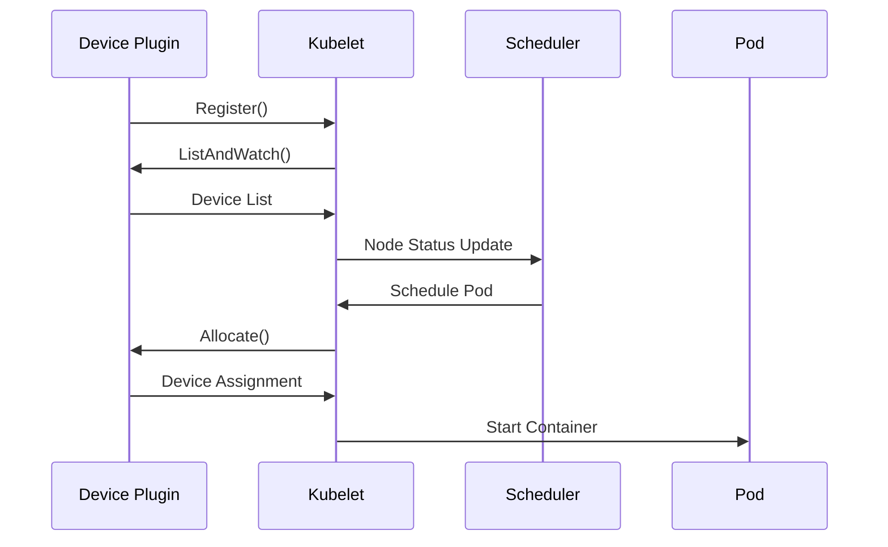

# Kubernetes 调度器扩展案例：GPU 资源调度

在现代云原生环境中，GPU 资源调度已成为支持机器学习、深度学习和高性能计算工作负载的关键需求。本章将通过一个完整的实际案例，展示如何扩展 Kubernetes 调度器来实现智能的 GPU 资源调度。

## 目录

- [Kubernetes 调度器扩展案例：GPU 资源调度](#kubernetes-调度器扩展案例gpu-资源调度)
  - [目录](#目录)
  - [1 需求分析](#1-需求分析)
    - [1.1 业务需求](#11-业务需求)
    - [1.2 技术需求](#12-技术需求)
    - [1.3 性能需求](#13-性能需求)
    - [1.4 运维需求](#14-运维需求)
    - [1.5 安全需求](#15-安全需求)
  - [2 GPU 资源表示](#2-gpu-资源表示)
    - [2.1 扩展资源定义](#21-扩展资源定义)
    - [2.2 Pod GPU 请求](#22-pod-gpu-请求)
    - [2.3 GPU 资源约束](#23-gpu-资源约束)
  - [3 GPU 资源发现](#3-gpu-资源发现)
    - [3.1 Device Plugin 工作原理](#31-device-plugin-工作原理)
    - [3.2 NVIDIA GPU Device Plugin 部署](#32-nvidia-gpu-device-plugin-部署)
    - [3.3 GPU 资源监控](#33-gpu-资源监控)
  - [4 自定义调度器扩展](#4-自定义调度器扩展)
    - [1 GPU Filter 插件实现](#1-gpu-filter-插件实现)
    - [2 GPU Score 插件实现](#2-gpu-score-插件实现)
    - [3 调度器配置](#3-调度器配置)
  - [5 GPU 工作负载示例](#5-gpu-工作负载示例)
    - [5.1 机器学习训练任务](#51-机器学习训练任务)
    - [5.2 推理服务](#52-推理服务)
  - [6 性能优化](#6-性能优化)
    - [6.1 调度性能优化](#61-调度性能优化)
    - [6.2 基础监控配置](#62-基础监控配置)
    - [6.3 简化监控部署](#63-简化监控部署)
  - [7 安全加固与访问控制](#7-安全加固与访问控制)
    - [7.1 RBAC 配置](#71-rbac-配置)
    - [7.2 基础资源隔离](#72-基础资源隔离)
  - [8 故障处理与恢复](#8-故障处理与恢复)
    - [8.1 基础健康检查](#81-基础健康检查)
    - [8.2 简化调度器部署](#82-简化调度器部署)
  - [9 总结与最佳实践](#9-总结与最佳实践)

## 1 需求分析

### 1.1 业务需求

**场景描述：**
某 AI 公司需要在 Kubernetes 集群中运行多种类型的 GPU 工作负载：

- **训练任务**：需要高性能 GPU（如 V100、A100），通常需要多卡并行
- **推理服务**：可以使用中等性能 GPU（如 T4、RTX 系列），延迟敏感
- **开发测试**：可以使用入门级 GPU，资源需求灵活

**挑战：**

1. **资源异构性**：集群中存在多种型号的 GPU
2. **调度复杂性**：需要考虑 GPU 类型、拓扑结构、利用率等因素
3. **资源利用率**：避免 GPU 资源浪费和碎片化
 **性能优化**：确保高优先级任务获得最佳资源

### 1.2 技术需求

**功能需求：**

- GPU 资源发现和管理
- 基于 GPU 类型的智能调度
- GPU 拓扑感知调度
- 资源利用率优化
- 多租户资源隔离

**非功能需求：**

- 调度延迟 < 100ms
- 支持 1000+ GPU 节点
- 99.9% 可用性
- 完整的监控和告警

### 1.3 性能需求

**调度性能指标：**

```yaml
# 性能目标
performance_targets:
  scheduling_latency:
    p50: "< 50ms"
    p95: "< 100ms"
    p99: "< 200ms"
  
  throughput:
    pods_per_second: "> 100"
    concurrent_scheduling: "> 50"
  
  resource_utilization:
    gpu_utilization: "> 80%"
    memory_utilization: "> 75%"
    
  availability:
    uptime: "99.9%"
    mttr: "< 5min"
```

### 1.4 运维需求

**监控需求：**

- GPU 资源使用率监控
- 调度性能指标跟踪
- 故障自动检测和告警

**运维需求：**

- 简化的部署和配置管理
- 基本的故障恢复机制
- 日志收集和问题排查

### 1.5 安全需求

**基础安全：**

- RBAC 访问控制
- 资源配额限制
- 基本的多租户隔离

## 2 GPU 资源表示

### 2.1 扩展资源定义

Kubernetes 使用扩展资源（Extended Resources）来表示 GPU：

```yaml
# 节点 GPU 资源示例
apiVersion: v1
kind: Node
metadata:
  name: gpu-node-1
  labels:
    accelerator: nvidia-tesla-v100
    gpu-count: "8"
    gpu-memory: "32Gi"
status:
  capacity:
    nvidia.com/gpu: "8"
    nvidia.com/gpu-memory: "256Gi"  # 8 * 32Gi
  allocatable:
    nvidia.com/gpu: "8"
    nvidia.com/gpu-memory: "256Gi"
```

### 2.2 Pod GPU 请求

```yaml
apiVersion: v1
kind: Pod
metadata:
  name: gpu-training-job
spec:
  containers:
  - name: tensorflow
    image: tensorflow/tensorflow:2.8.0-gpu
    resources:
      requests:
        nvidia.com/gpu: "4"  # 请求 4 块 GPU
        nvidia.com/gpu-memory: "128Gi"
      limits:
        nvidia.com/gpu: "4"
        nvidia.com/gpu-memory: "128Gi"
  nodeSelector:
    accelerator: nvidia-tesla-v100  # 指定 GPU 类型
```

### 2.3 GPU 资源约束

```yaml
# GPU 亲和性配置
apiVersion: v1
kind: Pod
metadata:
  name: multi-gpu-job
spec:
  affinity:
    nodeAffinity:
      requiredDuringSchedulingIgnoredDuringExecution:
        nodeSelectorTerms:
        - matchExpressions:
          - key: accelerator
            operator: In
            values: ["nvidia-tesla-v100", "nvidia-tesla-a100"]
          - key: gpu-count
            operator: Gt
            values: ["4"]
  containers:
  - name: training
    image: pytorch/pytorch:1.12.0-cuda11.3-cudnn8-runtime
    resources:
      requests:
        nvidia.com/gpu: "8"
```

## 3 GPU 资源发现

### 3.1 Device Plugin 工作原理

Kubernetes Device Plugin 框架负责 GPU 资源的发现和管理：



### 3.2 NVIDIA GPU Device Plugin 部署

```yaml
# NVIDIA Device Plugin DaemonSet
apiVersion: apps/v1
kind: DaemonSet
metadata:
  name: nvidia-device-plugin-daemonset
  namespace: kube-system
spec:
  selector:
    matchLabels:
      name: nvidia-device-plugin-ds
  updateStrategy:
    type: RollingUpdate
  template:
    metadata:
      labels:
        name: nvidia-device-plugin-ds
    spec:
      tolerations:
      - key: nvidia.com/gpu
        operator: Exists
        effect: NoSchedule
      priorityClassName: system-node-critical
      containers:
      - image: nvcr.io/nvidia/k8s-device-plugin:v0.12.0
        name: nvidia-device-plugin-ctr
        args: ["--fail-on-init-error=false"]
        securityContext:
          allowPrivilegeEscalation: false
          capabilities:
            drop: ["ALL"]
        volumeMounts:
        - name: device-plugin
          mountPath: /var/lib/kubelet/device-plugins
      volumes:
      - name: device-plugin
        hostPath:
          path: /var/lib/kubelet/device-plugins
      nodeSelector:
        accelerator: nvidia
```

### 3.3 GPU 资源监控

```bash
# GPU 资源查看命令
# 查看节点 GPU 资源
kubectl describe nodes | grep -A 5 "nvidia.com/gpu"

# 查看 GPU 使用情况
kubectl top nodes --selector=accelerator=nvidia

# 查看 GPU Pod 分布
kubectl get pods --all-namespaces -o wide \
  --field-selector spec.nodeName=gpu-node-1
```

## 4 自定义调度器扩展

### 1 GPU Filter 插件实现

```go
package main

import (
    "context"
    "fmt"
    "strconv"
    "strings"
    
    v1 "k8s.io/api/core/v1"
    "k8s.io/apimachinery/pkg/runtime"
    "k8s.io/kubernetes/pkg/scheduler/framework"
)

// GPUFilter 插件名称
const GPUFilterName = "GPUFilter"

// GPUFilter 插件结构
type GPUFilter struct {
    handle framework.Handle
}

// Name 返回插件名称
func (gf *GPUFilter) Name() string {
    return GPUFilterName
}

// Filter 实现过滤逻辑
func (gf *GPUFilter) Filter(
    ctx context.Context,
    state *framework.CycleState,
    pod *v1.Pod,
    nodeInfo *framework.NodeInfo,
) *framework.Status {
    node := nodeInfo.Node()
    if node == nil {
        return framework.NewStatus(framework.Error, "node not found")
    }
    
    // 检查 Pod 是否需要 GPU
    gpuRequest := getGPURequest(pod)
    if gpuRequest == 0 {
        return framework.NewStatus(framework.Success, "")
    }
    
    // 检查节点是否有 GPU
    nodeGPUCapacity := getNodeGPUCapacity(node)
    if nodeGPUCapacity == 0 {
        return framework.NewStatus(
            framework.UnschedulableAndUnresolvable,
            "node has no GPU resources",
        )
    }
    
    // 检查 GPU 类型匹配
    if !isGPUTypeMatched(pod, node) {
        return framework.NewStatus(
            framework.UnschedulableAndUnresolvable,
            "GPU type not matched",
        )
    }
    
    // 检查可用 GPU 数量
    availableGPU := getAvailableGPU(nodeInfo)
    if availableGPU < gpuRequest {
        return framework.NewStatus(
            framework.Unschedulable,
            fmt.Sprintf("insufficient GPU: need %d, available %d", 
                gpuRequest, availableGPU),
        )
    }
    
    return framework.NewStatus(framework.Success, "")
}

// 获取 Pod GPU 请求
func getGPURequest(pod *v1.Pod) int64 {
    var totalGPU int64
    for _, container := range pod.Spec.Containers {
        if gpuQuantity, ok := container.Resources.Requests["nvidia.com/gpu"]; ok {
            totalGPU += gpuQuantity.Value()
        }
    }
    return totalGPU
}

// 获取节点 GPU 容量
func getNodeGPUCapacity(node *v1.Node) int64 {
    if gpuQuantity, ok := node.Status.Capacity["nvidia.com/gpu"]; ok {
        return gpuQuantity.Value()
    }
    return 0
}

// 检查 GPU 类型匹配
func isGPUTypeMatched(pod *v1.Pod, node *v1.Node) bool {
    // 检查 Pod 是否指定了 GPU 类型
    if podGPUType, ok := pod.Spec.NodeSelector["accelerator"]; ok {
        if nodeGPUType, ok := node.Labels["accelerator"]; ok {
            return podGPUType == nodeGPUType
        }
        return false
    }
    return true // 如果 Pod 没有指定 GPU 类型，则认为匹配
}

// 获取节点可用 GPU 数量
func getAvailableGPU(nodeInfo *framework.NodeInfo) int64 {
    totalGPU := getNodeGPUCapacity(nodeInfo.Node())
    usedGPU := int64(0)
    
    // 计算已使用的 GPU
    for _, podInfo := range nodeInfo.Pods {
        usedGPU += getGPURequest(podInfo.Pod)
    }
    
    return totalGPU - usedGPU
}

// 插件工厂函数
func NewGPUFilter(obj runtime.Object, h framework.Handle) (framework.Plugin, error) {
    return &GPUFilter{handle: h}, nil
}
```

### 2 GPU Score 插件实现

```go
package main

import (
    "context"
    "fmt"
    "math"
    
    v1 "k8s.io/api/core/v1"
    "k8s.io/apimachinery/pkg/runtime"
    "k8s.io/kubernetes/pkg/scheduler/framework"
)

// GPUScore 插件名称
const GPUScoreName = "GPUScore"

// GPUScore 插件结构
type GPUScore struct {
    handle framework.Handle
}

// Name 返回插件名称
func (gs *GPUScore) Name() string {
    return GPUScoreName
}

// Score 实现评分逻辑
func (gs *GPUScore) Score(
    ctx context.Context,
    state *framework.CycleState,
    pod *v1.Pod,
    nodeName string,
) (int64, *framework.Status) {
    nodeInfo, err := gs.handle.SnapshotSharedLister().NodeInfos().Get(nodeName)
    if err != nil {
        return 0, framework.NewStatus(
            framework.Error,
            fmt.Sprintf("getting node %q from Snapshot: %v", nodeName, err),
        )
    }
    
    score := gs.calculateGPUScore(pod, nodeInfo)
    return score, framework.NewStatus(framework.Success, "")
}

// ScoreExtensions 返回评分扩展
func (gs *GPUScore) ScoreExtensions() framework.ScoreExtensions {
    return gs
}

// NormalizeScore 标准化评分
func (gs *GPUScore) NormalizeScore(
    ctx context.Context,
    state *framework.CycleState,
    pod *v1.Pod,
    scores framework.NodeScoreList,
) *framework.Status {
    // 找到最高分和最低分
    var maxScore, minScore int64 = 0, math.MaxInt64
    for _, nodeScore := range scores {
        if nodeScore.Score > maxScore {
            maxScore = nodeScore.Score
        }
        if nodeScore.Score < minScore {
            minScore = nodeScore.Score
        }
    }
    
    // 标准化到 0-100 范围
    if maxScore == minScore {
        for i := range scores {
            scores[i].Score = framework.MaxNodeScore
        }
    } else {
        for i := range scores {
            scores[i].Score = (scores[i].Score - minScore) * 
                framework.MaxNodeScore / (maxScore - minScore)
        }
    }
    
    return framework.NewStatus(framework.Success, "")
}

// 计算 GPU 评分
func (gs *GPUScore) calculateGPUScore(pod *v1.Pod, nodeInfo *framework.NodeInfo) int64 {
    node := nodeInfo.Node()
    
    // 基础分数
    var score int64 = 50
    
    // GPU 利用率评分（权重：40%）
    utilizationScore := gs.calculateUtilizationScore(nodeInfo)
    score += int64(float64(utilizationScore) * 0.4)
    
    // GPU 类型匹配评分（权重：30%）
    typeScore := gs.calculateTypeScore(pod, node)
    score += int64(float64(typeScore) * 0.3)
    
    // GPU 拓扑评分（权重：30%）
    topologyScore := gs.calculateTopologyScore(pod, nodeInfo)
    score += int64(float64(topologyScore) * 0.3)
    
    return score
}

// 计算利用率评分
func (gs *GPUScore) calculateUtilizationScore(nodeInfo *framework.NodeInfo) int64 {
    totalGPU := getNodeGPUCapacity(nodeInfo.Node())
    if totalGPU == 0 {
        return 0
    }
    
    usedGPU := int64(0)
    for _, podInfo := range nodeInfo.Pods {
        usedGPU += getGPURequest(podInfo.Pod)
    }
    
    utilization := float64(usedGPU) / float64(totalGPU)
    
    // 利用率在 60-80% 时评分最高
    if utilization >= 0.6 && utilization <= 0.8 {
        return 100
    } else if utilization < 0.6 {
        return int64(utilization * 100 / 0.6)
    } else {
        return int64((1.0 - utilization) * 100 / 0.2)
    }
}

// 计算类型匹配评分
func (gs *GPUScore) calculateTypeScore(pod *v1.Pod, node *v1.Node) int64 {
    if podGPUType, ok := pod.Spec.NodeSelector["accelerator"]; ok {
        if nodeGPUType, ok := node.Labels["accelerator"]; ok {
            if podGPUType == nodeGPUType {
                return 100 // 完全匹配
            }
            
            // 部分匹配逻辑（例如：V100 和 A100 都是高性能 GPU）
            if gs.isCompatibleGPUType(podGPUType, nodeGPUType) {
                return 70
            }
        }
        return 0 // 不匹配
    }
    return 50 // 没有指定类型
}

// 计算拓扑评分
func (gs *GPUScore) calculateTopologyScore(pod *v1.Pod, nodeInfo *framework.NodeInfo) int64 {
    gpuRequest := getGPURequest(pod)
    if gpuRequest <= 1 {
        return 100 // 单卡任务不需要考虑拓扑
    }
    
    // 检查节点是否支持 NVLink 或其他高速互联
    node := nodeInfo.Node()
    if nvlinkSupported, ok := node.Labels["gpu-interconnect"]; ok && nvlinkSupported == "nvlink" {
        return 100
    }
    
    return 50 // 默认评分
}

// 检查 GPU 类型兼容性
func (gs *GPUScore) isCompatibleGPUType(requested, available string) bool {
    // 定义 GPU 类型兼容性矩阵
    compatibility := map[string][]string{
        "nvidia-tesla-v100": {"nvidia-tesla-a100"},
        "nvidia-tesla-a100": {"nvidia-tesla-v100"},
        "nvidia-tesla-t4":   {"nvidia-rtx-3080", "nvidia-rtx-3090"},
    }
    
    if compatibleTypes, ok := compatibility[requested]; ok {
        for _, compatibleType := range compatibleTypes {
            if compatibleType == available {
                return true
            }
        }
    }
    
    return false
}

// 插件工厂函数
func NewGPUScore(obj runtime.Object, h framework.Handle) (framework.Plugin, error) {
    return &GPUScore{handle: h}, nil
}
```

### 3 调度器配置

```yaml
# GPU 调度器配置
apiVersion: kubescheduler.config.k8s.io/v1beta3
kind: KubeSchedulerConfiguration
profiles:
- schedulerName: gpu-scheduler
  plugins:
    filter:
      enabled:
      - name: GPUFilter
    score:
      enabled:
      - name: GPUScore
  pluginConfig:
  - name: GPUFilter
    args:
      gpuTypes:
      - nvidia-tesla-v100
      - nvidia-tesla-a100
      - nvidia-tesla-t4
      - nvidia-rtx-3080
      - nvidia-rtx-3090
  - name: GPUScore
    args:
      weights:
        utilization: 40
        typeMatch: 30
        topology: 30
```

## 5 GPU 工作负载示例

### 5.1 机器学习训练任务

```yaml
apiVersion: batch/v1
kind: Job
metadata:
  name: ml-training-job
  namespace: ml-team
spec:
  template:
    metadata:
      labels:
        app: ml-training
        workload-type: training
    spec:
      schedulerName: gpu-scheduler
      restartPolicy: Never
      containers:
      - name: tensorflow
        image: tensorflow/tensorflow:2.8.0-gpu
        command:
        - python
        - /app/train.py
        - --epochs=100
        - --batch-size=32
        - --gpu-count=4
        resources:
          requests:
            nvidia.com/gpu: "4"
            cpu: "8"
            memory: "32Gi"
          limits:
            nvidia.com/gpu: "4"
            cpu: "16"
            memory: "64Gi"
        env:
        - name: CUDA_VISIBLE_DEVICES
          value: "0,1,2,3"
        volumeMounts:
        - name: training-data
          mountPath: /data
        - name: model-output
          mountPath: /output
      nodeSelector:
        accelerator: nvidia-tesla-v100
        gpu-count: "8"  # 确保节点有足够的 GPU
      volumes:
      - name: training-data
        persistentVolumeClaim:
          claimName: training-data-pvc
      - name: model-output
        persistentVolumeClaim:
          claimName: model-output-pvc
```

### 5.2 推理服务

```yaml
apiVersion: apps/v1
kind: Deployment
metadata:
  name: inference-service
  namespace: ml-team
spec:
  replicas: 3
  selector:
    matchLabels:
      app: inference-service
  template:
    metadata:
      labels:
        app: inference-service
        workload-type: inference
    spec:
      schedulerName: gpu-scheduler
      containers:
      - name: inference
        image: pytorch/torchserve:0.6.0-gpu
        ports:
        - containerPort: 8080
        - containerPort: 8081
        resources:
          requests:
            nvidia.com/gpu: "1"
            cpu: "2"
            memory: "8Gi"
          limits:
            nvidia.com/gpu: "1"
            cpu: "4"
            memory: "16Gi"
        env:
        - name: CUDA_VISIBLE_DEVICES
          value: "0"
        livenessProbe:
          httpGet:
            path: /ping
            port: 8080
          initialDelaySeconds: 30
          periodSeconds: 10
        readinessProbe:
          httpGet:
            path: /ping
            port: 8080
          initialDelaySeconds: 10
          periodSeconds: 5
      nodeSelector:
        accelerator: nvidia-tesla-t4
---
apiVersion: v1
kind: Service
metadata:
  name: inference-service
  namespace: ml-team
spec:
  selector:
    app: inference-service
  ports:
  - name: inference
    port: 8080
    targetPort: 8080
  - name: management
    port: 8081
    targetPort: 8081
  type: LoadBalancer
```

## 6 性能优化

### 6.1 调度性能优化

**基本优化策略：**

```go
// 简化的性能优化配置
type GPUSchedulerConfig struct {
    // 批量处理配置
    BatchSize    int           `yaml:"batchSize"`
    BatchTimeout time.Duration `yaml:"batchTimeout"`
    
    // 缓存配置
    CacheSize    int           `yaml:"cacheSize"`
    CacheTTL     time.Duration `yaml:"cacheTTL"`
}

// 默认配置
var DefaultConfig = GPUSchedulerConfig{
    BatchSize:    20,
    BatchTimeout: 50 * time.Millisecond,
    CacheSize:    1000,
    CacheTTL:     5 * time.Minute,
}

// 简化的调度优化实现
func (gs *GPUScore) optimizeScheduling() {
    // 基本的缓存机制
    if cachedScore, exists := gs.scoreCache[nodeKey]; exists {
        return cachedScore
    }
    
    // 计算并缓存结果
    score := gs.calculateGPUScore(pod, nodeInfo)
    gs.scoreCache[nodeKey] = score
    return score
}
```

### 6.2 基础监控配置

**关键指标监控：**

```yaml
# 基础监控指标
apiVersion: v1
kind: ConfigMap
metadata:
  name: gpu-scheduler-metrics
data:
  metrics.yaml: |
    metrics:
      # 调度延迟
      scheduling_latency:
        enabled: true
        buckets: [0.01, 0.05, 0.1, 0.5, 1.0]
      
      # GPU 利用率
      gpu_utilization:
        enabled: true
        interval: 30s
      
      # 调度成功率
      scheduling_success_rate:
        enabled: true
```

**简化的性能监控：**

```go
// 基础性能监控
func (gs *GPUScore) Score(ctx context.Context, state *framework.CycleState, pod *v1.Pod, nodeName string) (int64, *framework.Status) {
    start := time.Now()
    defer func() {
        // 简单的延迟记录
        latency := time.Since(start)
        if latency > 100*time.Millisecond {
            klog.Warningf("Slow GPU scheduling: %v for pod %s", latency, pod.Name)
        }
    }()
    
    // 原有的评分逻辑
    nodeInfo, err := gs.handle.SnapshotSharedLister().NodeInfos().Get(nodeName)
    if err != nil {
        return 0, framework.NewStatus(framework.Error, err.Error())
    }
    
    score := gs.calculateGPUScore(pod, nodeInfo)
    return score, framework.NewStatus(framework.Success, "")
}
```

### 6.3 简化监控部署

```yaml
# 基础 GPU 监控
apiVersion: v1
kind: Service
metadata:
  name: gpu-scheduler-metrics
  namespace: kube-system
  labels:
    app: gpu-scheduler
spec:
  ports:
  - name: metrics
    port: 8080
    targetPort: 8080
  selector:
    app: gpu-scheduler
---
# 简化的告警规则
apiVersion: v1
kind: ConfigMap
metadata:
  name: gpu-alerts
data:
  alerts.yaml: |
    groups:
    - name: gpu-basic
      rules:
      - alert: GPUSchedulingLatencyHigh
        expr: gpu_scheduler_latency > 0.1
        annotations:
          summary: "GPU 调度延迟过高"
      
      - alert: GPUUtilizationLow
        expr: gpu_utilization < 60
        annotations:
          summary: "GPU 利用率偏低"
```

## 7 安全加固与访问控制

### 7.1 RBAC 配置

```yaml
# GPU 资源访问控制
apiVersion: rbac.authorization.k8s.io/v1
kind: ClusterRole
metadata:
  name: gpu-resource-manager
rules:
- apiGroups: [""]
  resources: ["nodes"]
  verbs: ["get", "list", "watch"]
- apiGroups: [""]
  resources: ["pods"]
  verbs: ["get", "list", "watch", "create", "update", "patch"]
- apiGroups: [""]
  resources: ["events"]
  verbs: ["create"]
- apiGroups: ["metrics.k8s.io"]
  resources: ["nodes", "pods"]
  verbs: ["get", "list"]
---
apiVersion: rbac.authorization.k8s.io/v1
kind: ClusterRole
metadata:
  name: gpu-resource-reader
rules:
- apiGroups: [""]
  resources: ["nodes"]
  verbs: ["get", "list"]
  resourceNames: []
- apiGroups: [""]
  resources: ["pods"]
  verbs: ["get", "list"]
  resourceNames: []
- apiGroups: ["metrics.k8s.io"]
  resources: ["nodes", "pods"]
  verbs: ["get", "list"]
---
apiVersion: rbac.authorization.k8s.io/v1
kind: RoleBinding
metadata:
  name: gpu-team-access
  namespace: ml-team
subjects:
- kind: User
  name: ml-engineer
  apiGroup: rbac.authorization.k8s.io
- kind: ServiceAccount
  name: ml-workload
  namespace: ml-team
roleRef:
  kind: ClusterRole
  name: gpu-resource-reader
  apiGroup: rbac.authorization.k8s.io
```

### 7.2 基础资源隔离

```yaml
# 简化的资源配额
apiVersion: v1
kind: ResourceQuota
metadata:
  name: gpu-quota-ml-team
  namespace: ml-team
spec:
  hard:
    nvidia.com/gpu: "4"  # 最多 4 块 GPU
    pods: "10"
    requests.cpu: "16"
    requests.memory: "64Gi"
---
# 基础资源限制
apiVersion: v1
kind: LimitRange
metadata:
  name: gpu-limits
  namespace: ml-team
spec:
  limits:
  - default:
      nvidia.com/gpu: "1"
      cpu: "2"
      memory: "8Gi"
    max:
      nvidia.com/gpu: "2"  # 单个 Pod 最多 2 块 GPU
      cpu: "8"
      memory: "32Gi"
    type: Container
```

## 8 故障处理与恢复

### 8.1 基础健康检查

**简化的健康检查脚本：**

```bash
#!/bin/bash
# gpu-health-check.sh

# 检查 GPU 节点状态
check_gpu_nodes() {
    echo "检查 GPU 节点状态..."
    kubectl get nodes -l accelerator=nvidia -o wide
    
    # 检查 GPU 资源
    kubectl describe nodes -l accelerator=nvidia | grep -A 5 "nvidia.com/gpu"
}

# 检查 GPU Pod 状态
check_gpu_pods() {
    echo "检查 GPU Pod 状态..."
    kubectl get pods --all-namespaces -o wide | grep -E "(gpu|nvidia)"
}

# 检查 Device Plugin 状态
check_device_plugin() {
    echo "检查 NVIDIA Device Plugin 状态..."
    kubectl get pods -n kube-system -l name=nvidia-device-plugin-ds
}

# 主函数
main() {
    check_gpu_nodes
    check_gpu_pods
    check_device_plugin
}

main
```

**基础故障恢复：**

```yaml
# GPU 节点故障恢复 Job
apiVersion: batch/v1
kind: Job
metadata:
  name: gpu-node-recovery
spec:
  template:
    spec:
      restartPolicy: OnFailure
      containers:
      - name: recovery
        image: nvidia/cuda:11.8-base-ubuntu20.04
        command:
        - /bin/bash
        - -c
        - |
          # 重启 NVIDIA 驱动
          nvidia-smi --gpu-reset
          
          # 检查 GPU 状态
          nvidia-smi
        securityContext:
          privileged: true
        volumeMounts:
        - name: dev
          mountPath: /dev
      volumes:
      - name: dev
        hostPath:
          path: /dev
      nodeSelector:
        accelerator: nvidia
```

### 8.2 简化调度器部署

```yaml
# 基础 GPU 调度器部署
apiVersion: apps/v1
kind: Deployment
metadata:
  name: gpu-scheduler
  namespace: kube-system
spec:
  replicas: 1  # 案例使用单副本
  selector:
    matchLabels:
      app: gpu-scheduler
  template:
    metadata:
      labels:
        app: gpu-scheduler
    spec:
      serviceAccountName: gpu-scheduler
      containers:
      - name: kube-scheduler
        image: k8s.gcr.io/kube-scheduler:v1.28.0
        command:
        - kube-scheduler
        - --config=/etc/kubernetes/scheduler-config.yaml
        - --v=2
        resources:
          requests:
            cpu: 100m
            memory: 128Mi
          limits:
            cpu: 200m
            memory: 256Mi
        volumeMounts:
        - name: config
          mountPath: /etc/kubernetes
        livenessProbe:
          httpGet:
            path: /healthz
            port: 10259
            scheme: HTTPS
          initialDelaySeconds: 30
      volumes:
      - name: config
        configMap:
          name: gpu-scheduler-config
```

## 9 总结与最佳实践

通过以上案例实现，我们展示了如何扩展 Kubernetes 调度器来支持 GPU 资源调度，主要包含以下核心功能：

**核心特性：**

- **智能过滤**：基于 GPU 类型、数量和可用性进行节点过滤
- **多维评分**：考虑利用率、类型匹配和拓扑结构的综合评分
- **资源管理**：通过 Device Plugin 实现 GPU 资源发现和分配
- **工作负载支持**：支持训练任务和推理服务的不同需求

**实践要点：**

1. **调度策略**：
   - 合理配置过滤和评分权重
   - 根据工作负载特点选择合适的 GPU 类型
   - 考虑 GPU 拓扑结构优化多卡任务性能

2. **资源配置**：
   - 设置合理的资源配额和限制
   - 使用 nodeSelector 指定 GPU 类型
   - 配置适当的容忍和亲和性规则

3. **监控运维**：
   - 监控调度延迟和 GPU 利用率
   - 定期检查 GPU 节点健康状态
   - 建立基础的告警机制

**扩展建议：**

- 可以进一步优化评分算法，加入更多业务相关因素
- 支持 GPU 共享和虚拟化技术
- 集成更完善的监控和可观测性工具
- 添加自动化的故障恢复机制

这个案例为在 Kubernetes 环境中部署 GPU 工作负载提供了一个完整的参考实现，可以根据实际需求进行调整和扩展。

---
