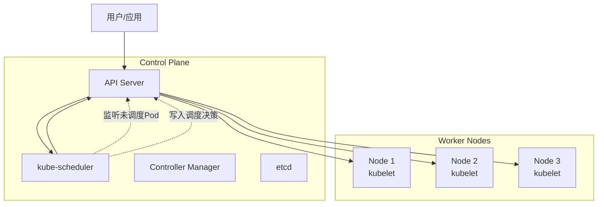
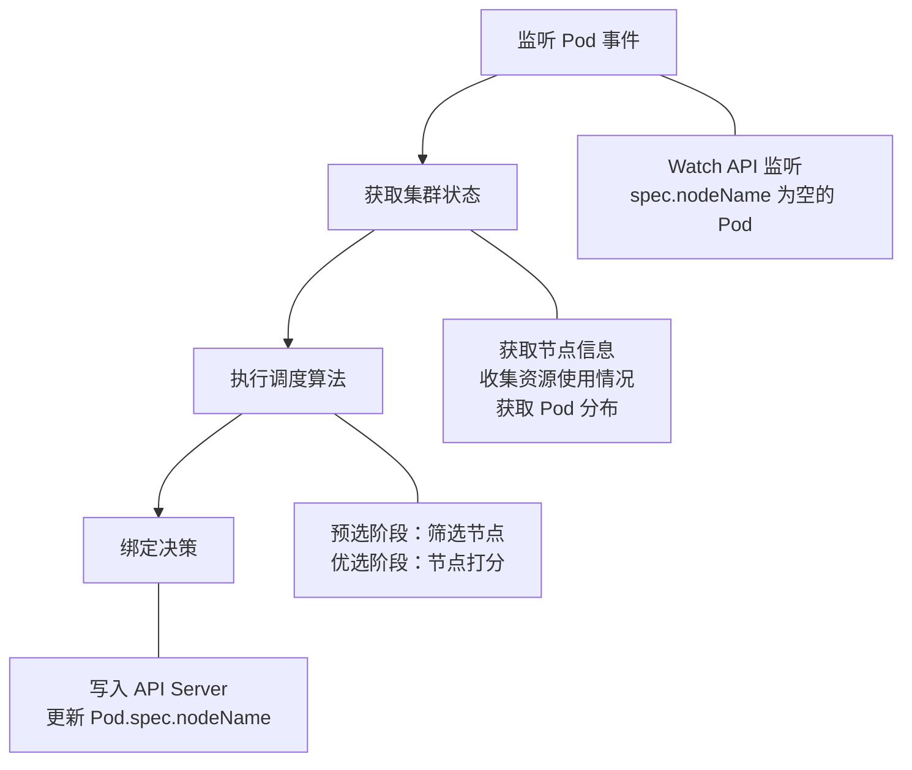
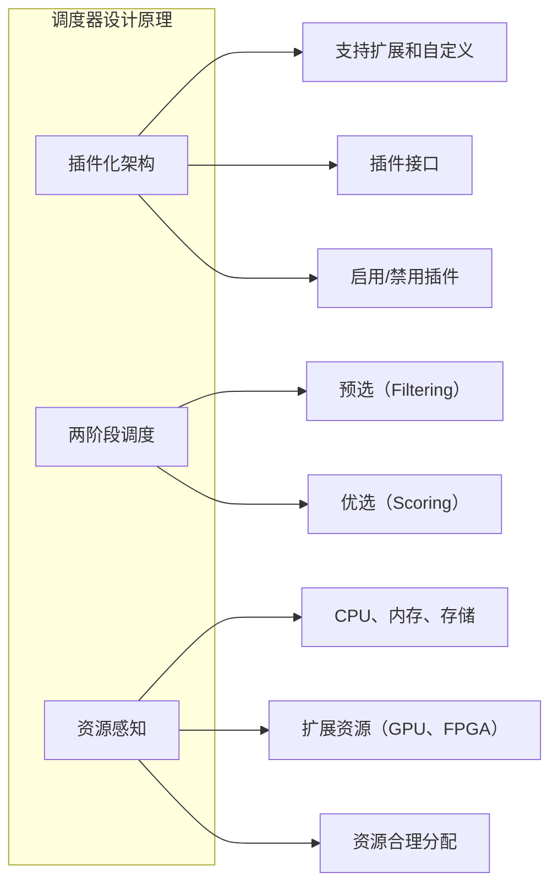
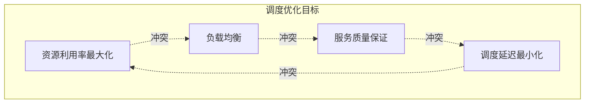
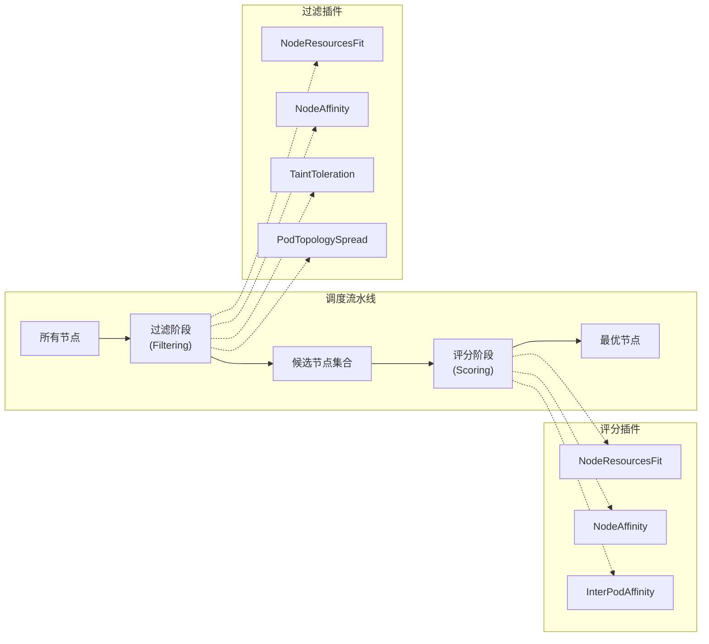
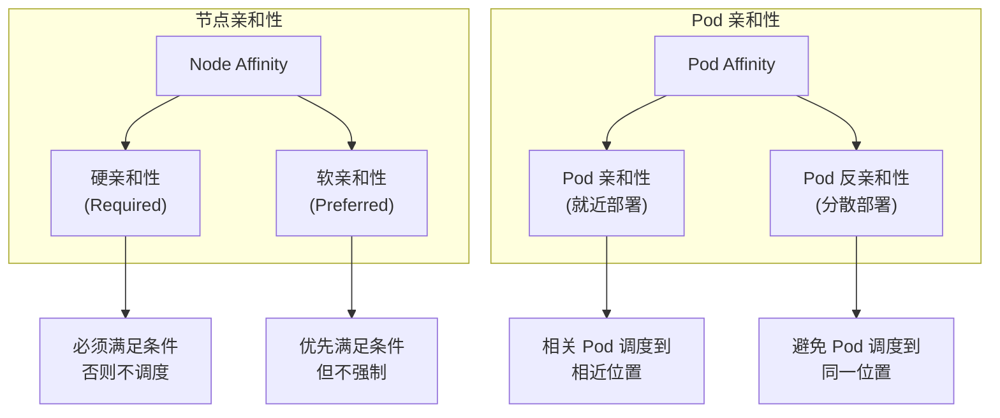
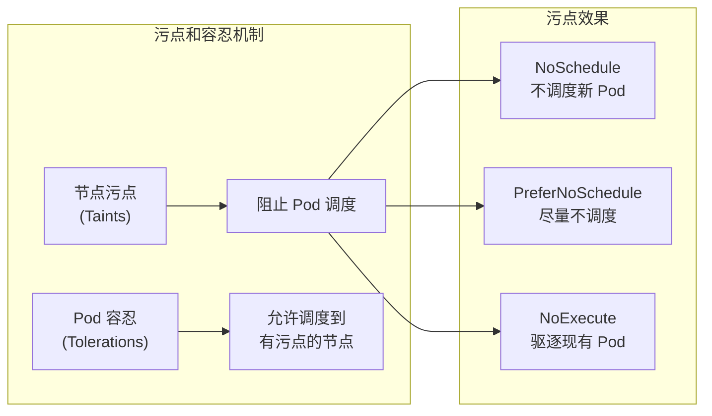
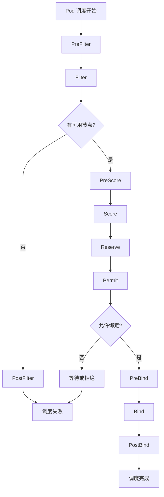
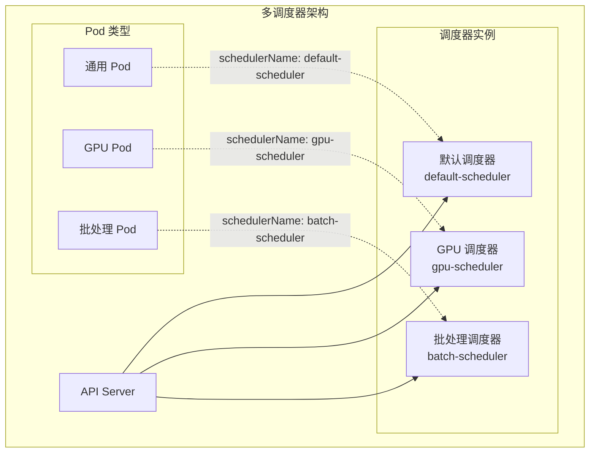

# Kubernetes 调度器介绍

## 目录

- [Kubernetes 调度器介绍](#kubernetes-调度器介绍)
  - [目录](#目录)
  - [1. Kubernetes 调度器概述](#1-kubernetes-调度器概述)
    - [1.1 调度器在 Kubernetes 架构中的位置和作用](#11-调度器在-kubernetes-架构中的位置和作用)
    - [1.2 调度器的基本工作流程](#12-调度器的基本工作流程)
    - [1.3 默认调度器的设计原理](#13-默认调度器的设计原理)
    - [1.4 调度理论基础](#14-调度理论基础)
      - [1.4.1 调度问题的数学建模](#141-调度问题的数学建模)
      - [1.4.2 多目标优化理论](#142-多目标优化理论)
      - [1.4.3 调度算法的计算复杂度](#143-调度算法的计算复杂度)
  - [2. 调度过程详解](#2-调度过程详解)
    - [2.1 调度流水线：过滤(Filtering)和评分(Scoring)](#21-调度流水线过滤filtering和评分scoring)
      - [2.1.1 过滤阶段（Filtering Phase）](#211-过滤阶段filtering-phase)
      - [2.1.2 评分阶段（Scoring Phase）](#212-评分阶段scoring-phase)
    - [2.2 常见的过滤策略](#22-常见的过滤策略)
      - [2.2.1 NodeResourcesFit](#221-noderesourcesfit)
      - [2.2.2 NodeAffinity](#222-nodeaffinity)
      - [2.2.3 PodTopologySpread](#223-podtopologyspread)
      - [2.2.4 TaintToleration](#224-tainttoleration)
    - [2.3 常见的评分策略](#23-常见的评分策略)
      - [2.3.1 NodeResourcesFit](#231-noderesourcesfit)
      - [2.3.2 NodeAffinity](#232-nodeaffinity)
      - [2.3.3 InterPodAffinity](#233-interpodaffinity)
    - [2.4 节点亲和性与反亲和性](#24-节点亲和性与反亲和性)
      - [2.4.1 节点亲和性（Node Affinity）](#241-节点亲和性node-affinity)
    - [2.5 Pod 亲和性与反亲和性](#25-pod-亲和性与反亲和性)
      - [2.5.1 Pod 亲和性（Pod Affinity）](#251-pod-亲和性pod-affinity)
      - [2.5.2 Pod 反亲和性（Pod Anti-Affinity）](#252-pod-反亲和性pod-anti-affinity)
    - [2.6 污点(Taints)和容忍(Tolerations)](#26-污点taints和容忍tolerations)
      - [2.6.1 污点（Taints）](#261-污点taints)
      - [2.6.2 容忍（Tolerations）](#262-容忍tolerations)
  - [3. 调度器配置与自定义](#3-调度器配置与自定义)
    - [3.1 调度配置文件介绍](#31-调度配置文件介绍)
      - [3.1.1 基本配置结构](#311-基本配置结构)
      - [3.1.2 常用配置选项](#312-常用配置选项)
    - [3.2 调度插件框架](#32-调度插件框架)
      - [3.2.1 插件扩展点](#321-插件扩展点)
      - [3.2.2 自定义插件开发](#322-自定义插件开发)
    - [3.3 多调度器部署](#33-多调度器部署)
      - [3.3.1 部署额外调度器](#331-部署额外调度器)
      - [3.3.2 指定调度器](#332-指定调度器)
      - [3.3.3 调度器选择策略](#333-调度器选择策略)
  - [4. 总结](#4-总结)
    - [4.1 调度器核心概念回顾](#41-调度器核心概念回顾)
    - [4.2 调度理论要点](#42-调度理论要点)
    - [4.3 实践指导原则](#43-实践指导原则)

## 1. Kubernetes 调度器概述

### 1.1 调度器在 Kubernetes 架构中的位置和作用

Kubernetes 调度器（kube-scheduler）是 Kubernetes 控制平面的核心组件之一，负责为新创建的 Pod 选择合适的节点进行部署。调度器在整个 Kubernetes 架构中扮演着至关重要的角色：

- **位置**：调度器作为独立的控制平面组件运行，通常部署在 Master 节点上
- **作用**：监听 API Server 中未调度的 Pod，根据调度策略为其选择最优的节点
- **交互**：与 API Server、kubelet 等组件协作完成 Pod 的生命周期管理



### 1.2 调度器的基本工作流程

调度器的工作流程可以分为以下几个关键步骤：



1. **监听 Pod 事件**
   - 调度器通过 Watch API 监听 API Server 中 `spec.nodeName` 为空的 Pod
   - 这些 Pod 被认为是待调度的 Pod

2. **获取集群状态**
   - 获取所有可用节点的信息
   - 收集节点的资源使用情况、标签、污点等信息
   - 获取已调度 Pod 的分布情况

3. **执行调度算法**
   - 预选阶段：筛选出满足 Pod 基本要求的节点
   - 优选阶段：对预选节点进行打分，选择最优节点

4. **绑定决策**
   - 将调度决策写入 API Server
   - 更新 Pod 的 `spec.nodeName` 字段

### 1.3 默认调度器的设计原理

默认调度器基于以下核心设计原理：



**插件化架构：**

- 调度器采用插件化设计，支持扩展和自定义
- 每个调度阶段都有对应的插件接口
- 支持启用/禁用特定插件

**两阶段调度：**

- **过滤（Filtering）**：过滤不满足条件的节点
- **评分（Scoring）**：对候选节点进行评分排序

**资源感知：**

- 考虑 CPU、内存、存储等资源需求
- 支持扩展资源类型（如 GPU、FPGA）
- 实现资源的合理分配和利用

### 1.4 调度理论基础

#### 1.4.1 调度问题的数学建模

调度问题本质上是一个**约束优化问题**，可以用数学模型表示：

**目标函数：**

```text
minimize: f(x) = Σ(wi × scorei(x))
其中：
- x 表示调度决策向量
- wi 表示第i个评分插件的权重
- scorei(x) 表示第i个插件的评分函数
```

**约束条件：**

- **资源约束**：Pod 资源需求 ≤ 节点可用资源
- **亲和性约束**：满足节点和 Pod 亲和性规则
- **反亲和性约束**：满足 Pod 分散部署要求
- **污点容忍约束**：Pod 必须容忍节点污点

#### 1.4.2 多目标优化理论

调度器需要同时优化多个相互冲突的目标：



**帕累托最优解：**

- 调度决策通常无法同时达到所有目标的最优值
- 需要在不同目标间进行权衡
- 通过加权评分实现多目标优化

#### 1.4.3 调度算法的计算复杂度

**时间复杂度分析：**

- **过滤阶段**：O(N × F)，其中 N 是节点数，F 是过滤插件数
- **评分阶段**：O(M × S)，其中 M 是候选节点数，S 是评分插件数
- **总体复杂度**：O(N × F + M × S)

**空间复杂度：**

- 节点信息缓存：O(N)
- Pod 调度状态：O(P)，其中 P 是待调度 Pod 数

**性能优化策略：**

- 并行执行过滤插件
- 节点信息缓存和增量更新
- 早期终止不满足条件的节点

---

## 2. 调度过程详解

### 2.1 调度流水线：过滤(Filtering)和评分(Scoring)

调度流水线是调度器的核心执行逻辑，分为两个主要阶段。

> **术语说明**：在 Kubernetes 早期版本中，这两个阶段被称为 Predicates（预选）和 Priorities（优选）。从 v1.19 开始，官方统一使用 Filtering（过滤）和 Scoring（评分）术语。



#### 2.1.1 过滤阶段（Filtering Phase）

过滤阶段的目标是筛选出能够运行 Pod 的节点集合：

- 并行执行多个过滤插件
- 任何一个插件返回失败，该节点被排除
- 如果没有节点通过过滤，Pod 将保持 Pending 状态

**过滤原理：**

- 基于硬约束条件进行节点筛选
- 采用"快速失败"策略提高效率
- 支持插件并行执行以减少调度延迟

#### 2.1.2 评分阶段（Scoring Phase）

评分阶段对过滤通过的节点进行评分：

- 每个评分插件为节点打分（0-100分）
- 计算加权总分
- 选择得分最高的节点

**评分原理：**

- 基于软约束条件进行节点优化选择
- 通过多维度评分实现负载均衡
- 支持自定义权重调整调度偏好

### 2.2 常见的过滤策略

#### 2.2.1 NodeResourcesFit

检查节点是否有足够的资源满足 Pod 的需求：

- CPU 请求量检查
- 内存请求量检查
- 存储请求量检查
- 扩展资源检查

#### 2.2.2 NodeAffinity

根据节点亲和性规则过滤节点：

```yaml
spec:
  affinity:
    nodeAffinity:
      requiredDuringSchedulingIgnoredDuringExecution:
        nodeSelectorTerms:
        - matchExpressions:
          - key: kubernetes.io/arch
            operator: In
            values:
            - amd64
```

#### 2.2.3 PodTopologySpread

确保 Pod 在拓扑域中的均匀分布：

- 可用区分布
- 节点分布
- 自定义拓扑域

#### 2.2.4 TaintToleration

检查 Pod 是否能容忍节点的污点：

```yaml
spec:
  tolerations:
  - key: "node-type"
    operator: "Equal"
    value: "gpu"
    effect: "NoSchedule"
```

### 2.3 常见的评分策略

#### 2.3.1 NodeResourcesFit

基于资源利用率进行评分，支持多种评分算法：

- **LeastAllocated**：优先选择资源使用率低的节点
  - 评分公式：`score = (capacity - allocated) / capacity × 100`
  - 适用于负载均衡场景
- **MostAllocated**：优先选择资源使用率高的节点
  - 评分公式：`score = allocated / capacity × 100`
  - 适用于资源整合场景
- **RequestedToCapacityRatio**：基于请求量与容量比例评分
  - 支持自定义评分曲线
  - 可针对不同资源类型设置不同权重

**资源评分理论：**

- 通过数学函数将资源使用情况映射为评分
- 支持多维资源的加权计算
- 考虑资源碎片化对调度效率的影响

#### 2.3.2 NodeAffinity

根据节点亲和性偏好进行评分：

```yaml
spec:
  affinity:
    nodeAffinity:
      preferredDuringSchedulingIgnoredDuringExecution:
      - weight: 80
        preference:
          matchExpressions:
          - key: node-type
            operator: In
            values:
            - ssd
```

**评分机制：**

- 满足偏好条件的节点获得对应权重的评分
- 支持多个偏好条件的组合评分
- 权重范围：1-100

#### 2.3.3 InterPodAffinity

基于 Pod 间亲和性进行评分：

- **Pod 反亲和性**：同一应用的 Pod 倾向于分散部署
  - 提高服务可用性
  - 避免单点故障
- **Pod 亲和性**：相关应用的 Pod 倾向于就近部署
  - 减少网络延迟
  - 提高数据传输效率

**调度公平性原理：**

- 通过拓扑域分散确保工作负载均匀分布
- 考虑现有 Pod 分布对新 Pod 调度的影响
- 平衡性能优化与高可用性需求

### 2.4 节点亲和性与反亲和性



#### 2.4.1 节点亲和性（Node Affinity）

节点亲和性允许 Pod 指定对节点的偏好：

**硬亲和性（Required）：**

```yaml
spec:
  affinity:
    nodeAffinity:
      requiredDuringSchedulingIgnoredDuringExecution:
        nodeSelectorTerms:
        - matchExpressions:
          - key: disktype
            operator: In
            values:
            - ssd
```

**软亲和性（Preferred）：**

```yaml
spec:
  affinity:
    nodeAffinity:
      preferredDuringSchedulingIgnoredDuringExecution:
      - weight: 100
        preference:
          matchExpressions:
          - key: zone
            operator: In
            values:
            - us-west-1a
```

### 2.5 Pod 亲和性与反亲和性

#### 2.5.1 Pod 亲和性（Pod Affinity）

使相关的 Pod 调度到相近的位置：

```yaml
spec:
  affinity:
    podAffinity:
      requiredDuringSchedulingIgnoredDuringExecution:
      - labelSelector:
          matchExpressions:
          - key: app
            operator: In
            values:
            - database
        topologyKey: kubernetes.io/hostname
```

#### 2.5.2 Pod 反亲和性（Pod Anti-Affinity）

使 Pod 分散部署，避免单点故障：

```yaml
spec:
  affinity:
    podAntiAffinity:
      requiredDuringSchedulingIgnoredDuringExecution:
      - labelSelector:
          matchExpressions:
          - key: app
            operator: In
            values:
            - web-server
        topologyKey: kubernetes.io/hostname
```

### 2.6 污点(Taints)和容忍(Tolerations)

污点和容忍机制实现了**节点选择性调度**，是 Kubernetes 中重要的调度约束机制。



**设计原理：**

- **默认拒绝策略**：节点默认拒绝所有不能容忍其污点的 Pod
- **精确匹配机制**：Pod 必须明确声明对特定污点的容忍
- **时间控制**：支持基于时间的容忍策略

#### 2.6.1 污点（Taints）

污点用于标记节点，阻止不合适的 Pod 调度到该节点：

```bash
# 添加污点
kubectl taint nodes node1 key1=value1:NoSchedule

# 移除污点
kubectl taint nodes node1 key1=value1:NoSchedule-
```

污点效果类型：

- **NoSchedule**：不调度新 Pod（硬约束）
- **PreferNoSchedule**：尽量不调度新 Pod（软约束）
- **NoExecute**：驱逐现有 Pod（运行时约束）

**污点匹配算法：**

- 污点由 `key=value:effect` 三元组组成
- 支持通配符匹配和精确匹配
- 多个污点采用逻辑 AND 关系

#### 2.6.2 容忍（Tolerations）

Pod 通过容忍来"容忍"节点的污点：

```yaml
spec:
  tolerations:
  - key: "key1"
    operator: "Equal"    # 精确匹配
    value: "value1"
    effect: "NoSchedule"
  - key: "key2"
    operator: "Exists"   # 存在性匹配
    effect: "NoExecute"
    tolerationSeconds: 3600  # 容忍时间
```

**容忍匹配规则：**

- **Equal 操作符**：key、value、effect 必须完全匹配
- **Exists 操作符**：只需 key 和 effect 匹配
- **空 effect**：匹配所有 effect 类型
- **tolerationSeconds**：仅对 NoExecute 效果有效，指定容忍时间

---

## 3. 调度器配置与自定义

### 3.1 调度配置文件介绍

Kubernetes 调度器支持通过配置文件进行自定义配置。配置文件采用 YAML 格式，允许用户：

- 启用/禁用特定插件
- 配置插件参数
- 设置调度器行为

#### 3.1.1 基本配置结构

```yaml
apiVersion: kubescheduler.config.k8s.io/v1beta3
kind: KubeSchedulerConfiguration
profiles:
- schedulerName: default-scheduler
  plugins:
    filter:
      enabled:
      - name: NodeResourcesFit
      - name: NodeAffinity
      disabled:
      - name: VolumeRestrictions
    score:
      enabled:
      - name: NodeResourcesFit
      - name: NodeAffinity
  pluginConfig:
  - name: NodeResourcesFit
    args:
      scoringStrategy:
        type: LeastAllocated
```

#### 3.1.2 常用配置选项

**资源配置：**

```yaml
pluginConfig:
- name: NodeResourcesFit
  args:
    scoringStrategy:
      type: LeastAllocated
      resources:
      - name: cpu
        weight: 1
      - name: memory
        weight: 1
```

**亲和性配置：**

```yaml
pluginConfig:
- name: InterPodAffinity
  args:
    hardPodAffinityWeight: 100
```

### 3.2 调度插件框架

调度器采用**插件化架构**设计，基于**责任链模式**实现可扩展的调度逻辑：

**设计原理：**

- **扩展点机制**：在调度流程的关键节点提供扩展接口
- **插件生命周期管理**：支持插件的动态加载和配置
- **状态传递**：通过 CycleState 在插件间传递调度状态
- **并发安全**：确保多个插件并发执行时的数据一致性



#### 3.2.1 插件扩展点

调度器提供 **10 个扩展点**，覆盖调度的完整生命周期：

1. **PreFilter**：预处理阶段
   - 预计算信息或检查前置条件
   - 可以提前终止不可调度的 Pod
   - 支持状态缓存以提高性能

2. **Filter**：过滤阶段
   - 决定节点是否适合 Pod
   - 实现硬约束条件检查
   - 支持并行执行以提高效率

3. **PostFilter**：后处理阶段
   - 当没有节点通过过滤时执行
   - 可以实现抢占逻辑
   - 支持调度失败的补救措施

4. **PreScore**：预评分阶段
   - 为评分阶段准备数据
   - 可以预计算评分所需的信息
   - 优化评分阶段的性能

5. **Score**：评分阶段
   - 为节点打分（0-100分）
   - 实现软约束条件
   - 支持多维度评分策略

6. **Reserve**：预留阶段
   - 为 Pod 预留资源
   - 防止资源竞争
   - 支持事务性资源分配

7. **Permit**：许可阶段
   - 可以延迟或拒绝绑定
   - 实现调度门控逻辑
   - 支持批量调度策略

8. **PreBind**：预绑定阶段
   - 执行绑定前的准备工作
   - 如存储卷挂载、网络配置
   - 确保节点就绪状态

9. **Bind**：绑定阶段
   - 将 Pod 绑定到节点
   - 更新 API Server 中的 Pod 状态
   - 通常由默认绑定器处理

10. **PostBind**：后绑定阶段
    - 执行绑定后的清理工作
    - 更新缓存和统计信息
    - 触发后续的自动化流程

#### 3.2.2 自定义插件开发

开发自定义插件需要实现相应的接口：

```go
type FilterPlugin interface {
    Plugin
    Filter(ctx context.Context, state *CycleState, pod *v1.Pod, nodeInfo *NodeInfo) *Status
}

type ScorePlugin interface {
    Plugin
    Score(ctx context.Context, state *CycleState, pod *v1.Pod, nodeName string) (int64, *Status)
}
```

### 3.3 多调度器部署

Kubernetes 支持**多调度器并行运行**，实现调度策略的差异化和专业化：

**设计原理：**

- **调度器隔离**：每个调度器独立运行，避免相互干扰
- **资源竞争处理**：通过乐观锁机制处理多调度器的资源竞争
- **负载分担**：不同类型的工作负载使用专门的调度器
- **故障隔离**：单个调度器故障不影响其他调度器



#### 3.3.1 部署额外调度器

```yaml
apiVersion: apps/v1
kind: Deployment
metadata:
  name: custom-scheduler
  namespace: kube-system
spec:
  replicas: 1
  selector:
    matchLabels:
      app: custom-scheduler
  template:
    metadata:
      labels:
        app: custom-scheduler
    spec:
      containers:
      - name: kube-scheduler
        image: k8s.gcr.io/kube-scheduler:v1.28.0
        command:
        - kube-scheduler
        - --config=/etc/kubernetes/scheduler-config.yaml
        - --v=2
        volumeMounts:
        - name: config
          mountPath: /etc/kubernetes
      volumes:
      - name: config
        configMap:
          name: scheduler-config
```

#### 3.3.2 指定调度器

Pod 可以通过 `schedulerName` 字段指定使用的调度器：

```yaml
apiVersion: v1
kind: Pod
metadata:
  name: my-pod
spec:
  schedulerName: custom-scheduler
  containers:
  - name: app
    image: nginx
```

#### 3.3.3 调度器选择策略

**调度器分类：**

- **默认调度器**：适用于大多数通用场景
  - 平衡性能和资源利用率
  - 支持标准的调度策略
- **专用调度器**：针对特定工作负载优化
  - GPU 调度器：优化 GPU 资源分配
  - 批处理调度器：支持作业队列和优先级
  - 实时调度器：保证延迟敏感应用的调度
- **多租户调度器**：为不同租户提供隔离的调度策略
  - 资源配额隔离
  - 调度策略定制

**多调度器优势：**

- **策略专业化**：不同应用使用最适合的调度策略
- **资源专门化**：特殊资源（如 GPU、FPGA）的专门调度
- **租户隔离**：多租户环境下的调度隔离和安全
- **渐进式升级**：调度器的灰度升级和 A/B 测试
- **故障容错**：单点故障不影响整体调度能力

---

## 4. 总结

### 4.1 调度器核心概念回顾

Kubernetes 调度器是一个复杂的**约束优化系统**，其核心概念包括：

- **两阶段调度**：过滤（Filtering）+ 评分（Scoring）
- **插件化架构**：10 个扩展点覆盖完整调度生命周期
- **多目标优化**：平衡资源利用率、负载均衡、服务质量等目标
- **约束满足**：处理硬约束（过滤）和软约束（评分）

### 4.2 调度理论要点

1. **数学建模**：调度问题本质是约束优化问题
2. **算法复杂度**：时间复杂度 O(N×F + M×S)，需要性能优化
3. **多目标权衡**：通过帕累托最优实现目标平衡
4. **公平性保证**：通过拓扑分散和反亲和性确保负载均衡

### 4.3 实践指导原则

- **理解约束层次**：硬约束（必须满足）vs 软约束（优化目标）
- **合理配置权重**：根据业务需求调整评分插件权重
- **监控调度性能**：关注调度延迟、成功率、资源利用率
- **渐进式优化**：从默认配置开始，逐步优化调度策略

通过深入理解这些概念和原理，可以更好地设计和优化 Kubernetes 集群的调度策略，提高应用性能和资源利用效率。
