# Spring Boot Operator 开发教学指南

本文将介绍如何基于 `Kubernetes Operator` 模式开发一个用于管理 `Spring Boot` 应用的 `Spring Boot Operator`，实现对应用的自动部署、升级、回滚等生命周期管理操作。

通过本项目实践，读者将深入理解 `Operator` 的设计理念与开发流程，并掌握在 `Kubernetes` 环境中实现应用自动化运维的关键技术。

## 目录

- [Spring Boot Operator 开发教学指南](#spring-boot-operator-开发教学指南)
  - [目录](#目录)
  - [1. 课程概述](#1-课程概述)
    - [1.1 适用读者](#11-适用读者)
    - [1.2 学习目标](#12-学习目标)
    - [1.3 前置知识要求](#13-前置知识要求)
    - [1.4 学习时间安排](#14-学习时间安排)
  - [2. Kubernetes Operator 基础](#2-kubernetes-operator-基础)
    - [2.1 Operator 概念与定义](#21-operator-概念与定义)
      - [2.1.1 什么是 Operator](#211-什么是-operator)
      - [2.1.2 Operator Pattern 核心原理](#212-operator-pattern-核心原理)
    - [2.2 Operator 架构与组件](#22-operator-架构与组件)
      - [2.2.1 架构概览](#221-架构概览)
      - [2.2.2 核心组件详解](#222-核心组件详解)
    - [2.3 Operator 的优势与应用场景](#23-operator-的优势与应用场景)
      - [2.3.1 技术优势](#231-技术优势)
      - [2.3.2 适用场景](#232-适用场景)
    - [2.4 开发框架选择](#24-开发框架选择)
      - [2.4.1 主流 Operator 框架概览](#241-主流-operator-框架概览)
      - [2.4.2 主要框架对比](#242-主要框架对比)
      - [2.4.3 框架选择决策树](#243-框架选择决策树)
      - [2.4.4 本教程选择 Kubebuilder 的原因](#244-本教程选择-kubebuilder-的原因)
    - [2.5 本章总结与下一步学习指引](#25-本章总结与下一步学习指引)
  - [3. Spring Boot 应用特点分析](#3-spring-boot-应用特点分析)
    - [3.1 Spring Boot 应用的典型架构](#31-spring-boot-应用的典型架构)
      - [3.1.1 Spring Boot 核心特点](#311-spring-boot-核心特点)
    - [3.2 Spring Boot 在 Kubernetes 中的部署挑战](#32-spring-boot-在-kubernetes-中的部署挑战)
      - [3.2.1 Spring Boot 应用部署流程](#321-spring-boot-应用部署流程)
      - [3.2.2 主要部署挑战](#322-主要部署挑战)
    - [3.3 为什么需要 Spring Boot Operator](#33-为什么需要-spring-boot-operator)
      - [3.3.1 传统部署 vs Operator 部署对比](#331-传统部署-vs-operator-部署对比)
      - [3.3.2 Spring Boot Operator 的核心价值](#332-spring-boot-operator-的核心价值)
    - [3.4 本章总结与下一步学习指引](#34-本章总结与下一步学习指引)
  - [4. 实验驱动的 Spring Boot Operator 开发](#4-实验驱动的-spring-boot-operator-开发)
    - [4.1 实验环境准备](#41-实验环境准备)
      - [4.1.1 环境要求](#411-环境要求)
      - [4.1.2 项目初始化](#412-项目初始化)
    - [4.2 Operator 功能规划](#42-operator-功能规划)
    - [4.3 实验一：基础 Operator 设计与实现](#43-实验一基础-operator-设计与实现)
      - [4.3.1 设计目标](#431-设计目标)
      - [4.3.2 API 设计思路](#432-api-设计思路)
      - [4.3.3 实验步骤](#433-实验步骤)
      - [4.3.4 测试验证](#434-测试验证)
    - [4.4 实验二：配置管理功能](#44-实验二配置管理功能)
      - [4.4.1 设计目标](#441-设计目标)
      - [4.4.2 实验二架构设计](#442-实验二架构设计)
      - [4.4.3 配置变更检测流程图](#443-配置变更检测流程图)
      - [4.4.4 API 扩展设计](#444-api-扩展设计)
      - [4.4.5 实验步骤](#445-实验步骤)
      - [4.4.6 测试验证](#446-测试验证)
    - [4.5 实验三：服务暴露和 Ingress](#45-实验三服务暴露和-ingress)
      - [4.5.1 设计目标](#451-设计目标)
      - [4.5.2 实验三架构设计](#452-实验三架构设计)
      - [4.5.3 服务类型选择策略](#453-服务类型选择策略)
      - [4.5.4 API 扩展设计](#454-api-扩展设计)
      - [4.5.5 实验步骤](#455-实验步骤)
      - [4.5.6 测试验证](#456-测试验证)
    - [4.6 综合实验：完整的微服务应用](#46-综合实验完整的微服务应用)
      - [4.6.1 实验目标](#461-实验目标)
      - [4.6.2 实验架构](#462-实验架构)
      - [4.6.3 微服务通信流程](#463-微服务通信流程)
      - [4.6.4 实验步骤](#464-实验步骤)
    - [4.7 本章总结与下一步学习指引](#47-本章总结与下一步学习指引)
      - [4.7.1 核心知识点回顾](#471-核心知识点回顾)
      - [4.7.2 实际应用建议](#472-实际应用建议)
      - [4.7.3 下一步学习路径](#473-下一步学习路径)
  - [5. 生产环境最佳实践](#5-生产环境最佳实践)
    - [5.1 故障排除指南](#51-故障排除指南)
      - [5.1.1 故障排除决策树](#511-故障排除决策树)
      - [5.1.2 快速诊断检查清单](#512-快速诊断检查清单)
      - [5.1.3 故障排除流程图](#513-故障排除流程图)
      - [5.1.4 常见问题诊断](#514-常见问题诊断)
      - [5.1.5 网络问题诊断流程](#515-网络问题诊断流程)
      - [5.1.6 性能问题诊断流程](#516-性能问题诊断流程)
      - [5.1.7 故障排除最佳实践](#517-故障排除最佳实践)
      - [5.1.8 Reconcile 循环问题](#518-reconcile-循环问题)
      - [5.1.9 调试工具和技巧](#519-调试工具和技巧)
    - [5.2 性能调优指南](#52-性能调优指南)
      - [5.2.1 Controller 性能优化](#521-controller-性能优化)
      - [5.2.2 Reconcile 逻辑优化](#522-reconcile-逻辑优化)
    - [5.3 监控和日志集成](#53-监控和日志集成)
      - [5.3.1 Prometheus 监控集成](#531-prometheus-监控集成)
      - [5.3.2 结构化日志配置](#532-结构化日志配置)
    - [5.4 安全最佳实践](#54-安全最佳实践)
      - [5.4.1 RBAC 最小权限原则](#541-rbac-最小权限原则)
      - [5.4.2 镜像安全](#542-镜像安全)
      - [5.4.3 网络安全](#543-网络安全)
      - [5.4.4 敏感信息管理](#544-敏感信息管理)
    - [5.5 代码质量提升](#55-代码质量提升)
      - [5.5.1 代码质量提升要点](#551-代码质量提升要点)
  - [6. 总结](#6-总结)
    - [6.1 学习路径总览](#61-学习路径总览)
    - [6.2 技术栈总览](#62-技术栈总览)
    - [6.3 核心收获](#63-核心收获)
    - [6.4 扩展方向](#64-扩展方向)
    - [6.5 关键要点回顾](#65-关键要点回顾)
    - [6.6 进阶实践项目建议](#66-进阶实践项目建议)
      - [6.6.1 入门级项目](#661-入门级项目)
      - [6.6.2 进阶级项目](#662-进阶级项目)
      - [6.6.3 专家级项目](#663-专家级项目)
    - [6.7 学习资源指引](#67-学习资源指引)
      - [6.7.1 官方文档与规范](#671-官方文档与规范)
      - [6.7.2 社区资源与案例](#672-社区资源与案例)
      - [6.7.3 学习平台与课程](#673-学习平台与课程)
      - [6.7.4 开发工具与环境](#674-开发工具与环境)
  - [附录](#附录)
    - [附录 A：故障排除详细命令](#附录-a故障排除详细命令)
      - [A.1 快速诊断检查清单](#a1-快速诊断检查清单)
    - [附录 B：安全配置详细示例](#附录-b安全配置详细示例)
      - [B.1 RBAC 最小权限配置](#b1-rbac-最小权限配置)
      - [B.2 镜像安全配置](#b2-镜像安全配置)
    - [附录 C：代码质量提升参考](#附录-c代码质量提升参考)
      - [C.1 完善代码注释示例](#c1-完善代码注释示例)
      - [C.2 错误处理和重试机制](#c2-错误处理和重试机制)

---

## 1. 课程概述

### 1.1 适用读者

本教程面向具备一定开发经验的技术人员，特别是：

- 有 `Kubernetes` 实践经验的运维工程师
- 熟悉 `Spring Boot` 开发的后端工程师
- 希望深入学习云原生技术的架构师

### 1.2 学习目标

完成本教程后，您将能够：

- **理解核心概念**：深入掌握 `Kubernetes Operator` 的设计原理和工作机制
- **掌握开发方法**：使用 `Kubebuilder` 框架为 `Spring Boot` 应用创建专用 `Operator`
- **实现自动化管理**：独立开发一个完整的 Spring Boot Operator，实现应用的自动化部署、配置管理、故障恢复等功能
- **应用生产实践**：掌握 Operator 在生产环境中的部署、监控和维护最佳实践

### 1.3 前置知识要求

**必备技能（熟练掌握）：**

- `Kubernetes` 基础概念和操作（Pod、Service、Deployment、ConfigMap 等）
- `Spring Boot` 应用开发和部署经验
- `YAML` 配置文件编写和调试
- `Docker` 容器化技术基础

**推荐技能（基础了解）：**

- `Go` 语言基础语法（用于理解 Operator 代码结构）
- `Helm` 包管理工具使用经验
- 云原生生态系统基本概念

### 1.4 学习时间安排

- **总学习时间**：约 8-12 小时
- **理论学习**：2-3 小时（第1-3章）
- **实践开发**：4-6 小时（第4章实验）
- **生产实践**：2-3 小时（第5-6章）

---

## 2. Kubernetes Operator 基础

### 2.1 Operator 概念与定义

#### 2.1.1 什么是 Operator

`Kubernetes Operator` 是一种扩展 `Kubernetes API` 的方法，它将人类操作员的知识编码到软件中，使应用程序能够自动管理自己。

**Operator 的定义和作用：**

- `Operator` 是一个应用程序特定的控制器，它扩展了 `Kubernetes API` 来创建、配置和管理复杂有状态应用程序的实例
- 它将运维人员的领域知识编码到软件中，实现应用程序的自动化管理
- `Operator` 可以处理应用程序的整个生命周期，包括安装、升级、备份、故障恢复等

#### 2.1.2 Operator Pattern 核心原理

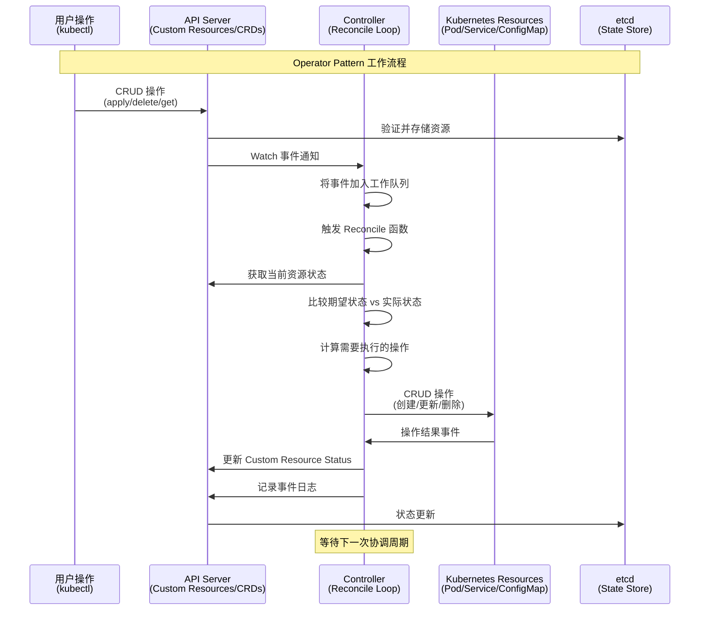

**控制循环详细流程：**

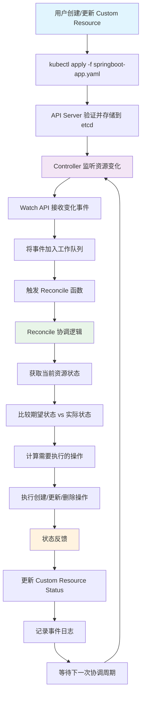

**Operator Pattern 的核心思想：**

- **声明式 API**：用户声明期望的状态，Operator 负责实现这个状态
- **控制循环**：持续监控实际状态与期望状态的差异，并采取行动消除差异
- **领域知识封装**：将特定应用程序的运维知识封装在代码中
- **事件驱动**：基于 Kubernetes 事件机制，响应资源变化
- **最终一致性**：通过持续协调确保系统最终达到期望状态

**Controller 和 Custom Resource 的关系：**

- Custom Resource (CR)：定义应用程序的期望状态
- Controller：监控 CR 的变化，并执行相应的操作来达到期望状态
- 两者结合形成了完整的 Operator 模式

**最小化 Operator 示例：**

以下是一个简化的 Spring Boot Operator 工作示例：

```yaml
# 1. 用户创建 Custom Resource
apiVersion: springboot.tutorial.example.com/v1
kind: SpringBootApp
metadata:
  name: my-app
spec:
  image: "my-app:v1.0.0"
  replicas: 3
  port: 8080
```

```go
// 2. Controller 监听并处理
func (r *SpringBootAppReconciler) Reconcile(ctx context.Context, req ctrl.Request) (ctrl.Result, error) {
    // 获取 SpringBootApp 资源
    var app springbootv1.SpringBootApp
    if err := r.Get(ctx, req.NamespacedName, &app); err != nil {
        return ctrl.Result{}, client.IgnoreNotFound(err)
    }
    
    // 创建或更新 Deployment
    deployment := &appsv1.Deployment{
        ObjectMeta: metav1.ObjectMeta{
            Name:      app.Name,
            Namespace: app.Namespace,
        },
        Spec: appsv1.DeploymentSpec{
            Replicas: &app.Spec.Replicas,
            Template: corev1.PodTemplateSpec{
                Spec: corev1.PodSpec{
                    Containers: []corev1.Container{{
                        Name:  "app",
                        Image: app.Spec.Image,
                        Ports: []corev1.ContainerPort{{
                            ContainerPort: app.Spec.Port,
                        }},
                    }},
                },
            },
        },
    }
    
    // 应用更改
    return ctrl.Result{}, r.Client.Create(ctx, deployment)
}
```

这个示例展示了 Operator Pattern 的核心：用户声明期望状态（SpringBootApp），Controller 自动创建相应的 Kubernetes 资源（Deployment）来实现这个状态。

### 2.2 Operator 架构与组件

#### 2.2.1 架构概览

**Kubernetes Operator 架构概览：**

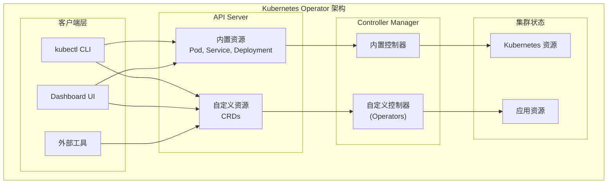

Operator 通过这种分层架构实现了声明式管理模式，用户通过客户端定义期望状态，Controller 持续监控并调节实际状态以匹配期望状态。

#### 2.2.2 核心组件详解

Operator 采用分层架构设计，主要包含以下核心组件：

**CRD (Custom Resource Definition)**：

- 定义自定义资源的结构和验证规则
- 扩展 Kubernetes API，支持领域特定的资源类型

**Controller**：

- 监听资源变化事件，实现协调逻辑
- 将实际状态调整为期望状态
- 封装领域专家知识和最佳实践

**RBAC (Role-Based Access Control)**：

- 定义 Operator 的权限范围
- 确保安全的资源访问控制

**Custom Resource Definition (CRD)：**

- **定义新的 Kubernetes 资源类型**：扩展 Kubernetes API，使其能够理解应用程序特定的概念
- **Schema 定义**：使用 OpenAPI v3 规范定义资源结构
- **验证规则**：内置字段验证、格式检查、枚举值限制
- **版本管理**：支持多版本 API，提供版本转换机制
- **子资源支持**：Status 子资源、Scale 子资源等

```yaml
# CRD 示例结构
apiVersion: apiextensions.k8s.io/v1
kind: CustomResourceDefinition
metadata:
  name: springbootapps.springboot.tutorial.example.com
spec:
  group: springboot.tutorial.example.com
  versions:
  - name: v1
    served: true
    storage: true
    schema:
      openAPIV3Schema:
        type: object
        properties:
          spec:
            type: object
            properties:
              image:
                type: string
                pattern: '^[a-zA-Z0-9._/-]+:[a-zA-Z0-9._-]+$'
              replicas:
                type: integer
                minimum: 1
                maximum: 100
```

**Controller（控制器）：**

- **业务逻辑核心**：实现特定应用的管理逻辑
- **事件监听**：Watch API 监听资源变化事件
- **协调循环**：Reconcile 函数实现期望状态与实际状态的协调
- **错误处理**：重试机制、指数退避、错误分类
- **状态管理**：更新 Custom Resource 的 Status 字段
- **指标暴露**：Prometheus 指标，监控 Controller 性能

**OLM（Operator Lifecycle Manager）：**

- **安装管理**：自动化 Operator 的安装和配置
- **升级策略**：支持自动升级、手动升级、回滚
- **依赖解析**：处理 Operator 之间的依赖关系
- **权限管理**：自动创建和管理 RBAC 规则
- **版本兼容性**：确保 API 版本兼容性
- **安全策略**：镜像签名验证、安全扫描

### 2.3 Operator 的优势与应用场景

#### 2.3.1 技术优势

**Operator vs 传统运维方式对比：**

| 对比维度 | 传统运维方式 | Operator 方式 | 优势体现 |
|----------|-------------|---------------|----------|
| **自动化程度** | 手动执行脚本和命令 | 声明式配置管理 | 减少人为错误，提高一致性 |
| **故障响应** | 人工监控，被动响应 | 24/7 自动监控和响应 | 实时响应，降低故障影响 |
| **知识传承** | 依赖个人经验和文档 | 专家知识编码到软件中 | 标准化最佳实践，降低门槛 |
| **运维复杂度** | 手动操作，容易出错 | 自动化运维流程 | 降低运维门槛，提高效率 |
| **生产就绪性** | 依赖运维经验 | 内置生产级特性 | 开箱即用的企业级能力 |

**核心技术优势：**

**自动化运维：**

- 减少手动操作，降低人为错误
- 实现 24/7 自动化监控和响应
- 提高运维效率和可靠性

**领域特定知识的封装：**

- 将专家知识编码到软件中
- 标准化最佳实践
- 降低运维门槛

**声明式配置管理：**

- 用户只需声明期望状态
- 系统自动处理实现细节
- 提供一致的用户体验

#### 2.3.2 适用场景

**有状态应用管理：**

- **数据库集群**：MySQL、PostgreSQL、MongoDB 等数据库的集群管理、备份恢复、故障转移
- **消息队列**：Kafka、RabbitMQ 等消息中间件的集群部署、配置管理、监控告警
- **缓存和搜索**：Redis、Elasticsearch 等缓存和搜索引擎的集群运维、数据迁移
- **存储系统**：Ceph、MinIO 等分布式存储的自动化部署和运维管理

**复杂应用生命周期：**

- **多组件应用协调**：微服务架构中的服务依赖管理和启动顺序控制
- **数据备份恢复**：自动化数据库备份、跨区域复制、灾难恢复
- **版本升级回滚**：蓝绿部署、金丝雀发布、自动回滚机制
- **配置热更新**：应用配置变更的无停机更新

**最佳实践封装：**

- **运维知识标准化**：将数据库调优、监控告警等专家经验固化为代码
- **统一操作接口**：通过 CRD 提供一致的管理 API，屏蔽底层复杂性
- **降低运维门槛**：让开发团队也能轻松管理复杂的基础设施组件

### 2.4 开发框架选择

**学习目标：**

- 了解主流 Operator 开发框架的特点和适用场景
- 掌握框架选择的决策依据
- 理解本教程选择 Kubebuilder 的原因

在 Kubernetes 生态系统中，有多种框架可以用于开发 Operator。选择合适的框架对于项目的成功至关重要。

#### 2.4.1 主流 Operator 框架概览

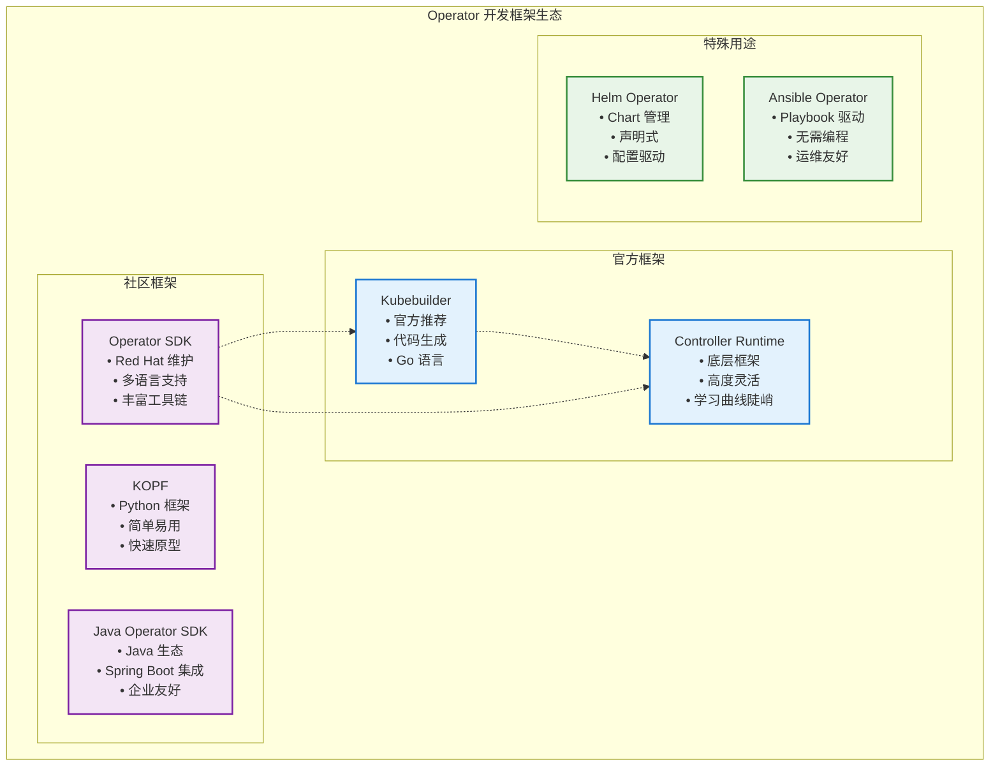

#### 2.4.2 主要框架对比

| 框架 | 语言 | 适用场景 | 核心特点 |
|------|------|----------|----------|
| **Kubebuilder** | Go | 复杂 Operator 开发 | 官方支持、功能完整 |
| **Operator SDK** | Go/多语言 | 企业级快速开发 | 工具链丰富、多语言支持 |
| **Java Operator SDK** | Java | Java 生态项目 | Spring Boot 集成 |
| **KOPF** | Python | 快速原型开发 | 简单易用、开发快速 |

#### 2.4.3 框架选择决策树

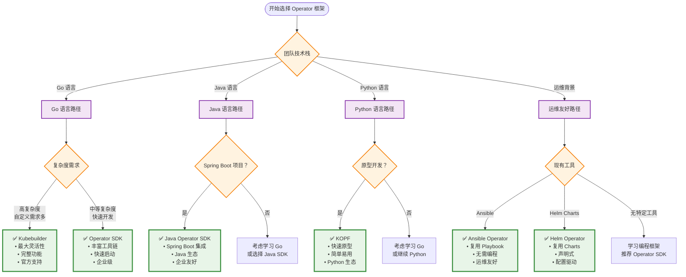

#### 2.4.4 本教程选择 Kubebuilder 的原因

在本教程中，我们选择 **Kubebuilder** 作为主要的开发框架，原因如下：

**技术优势：**

- **官方支持**：由 Kubernetes 官方维护，与 Kubernetes API 保持最佳兼容性
- **完整功能**：支持所有 Kubernetes 特性，包括 Admission Webhooks、多版本 API 等
- **代码生成**：提供完整的脚手架和代码生成工具，减少样板代码
- **测试支持**：内置 Envtest 框架，支持集成测试

**学习价值：**

- **深度理解**：通过 Kubebuilder 可以深入理解 Kubernetes Controller 的工作原理
- **最佳实践**：体现了 Kubernetes 社区的最佳实践和设计模式
- **可扩展性**：为复杂场景提供了足够的灵活性和扩展能力

**生产就绪：**

- **性能优秀**：Go 语言的高性能特性，适合生产环境
- **社区活跃**：大量的生产案例和社区支持
- **文档完善**：官方文档详细，学习资源丰富

> **💡 学习建议**：虽然本教程使用 Kubebuilder，但建议读者了解其他框架的特点，根据实际项目需求选择最合适的框架。对于 Java 开发团队，Java Operator SDK 可能是更好的选择；对于快速原型开发，KOPF 或 Helm Operator 可能更合适。

### 2.5 本章总结与下一步学习指引

**本章核心知识点回顾：**

1. **Operator 概念理解**：掌握了 Operator Pattern 的核心思想和工作原理，理解了声明式 API 和控制循环的重要性
2. **架构组件认知**：深入了解了 Operator 的四层架构（客户端层、API Server 层、Controller Manager 层、集群状态层）及各组件职责
3. **技术优势分析**：认识了 Operator 相比传统运维方式的核心优势，包括自动化、标准化、可扩展性等
4. **应用场景识别**：明确了 Operator 适用的典型场景，如有状态应用、复杂运维、多环境部署等
5. **开发框架选择**：对比了主流 Operator 开发框架，理解了 Kubebuilder 的技术优势和选择理由

**实际应用建议：**

- 在决定开发 Operator 前，先评估应用的复杂度和运维需求，避免过度工程化
- 对于简单的无状态应用，传统的 Deployment + Service 可能已经足够
- 建议从简单的 Operator 开始实践，逐步积累经验后再处理复杂场景
- 重视测试和监控，确保 Operator 的稳定性和可观测性

**下一步学习路径：**

接下来第三章将聚焦 Spring Boot 应用的特点分析，您将学习到：

- Spring Boot 微服务架构的核心特点和组件构成
- Spring Boot 应用在 Kubernetes 中的部署挑战和痛点
- 传统部署方式与 Operator 部署方式的对比分析
- Spring Boot Operator 的核心价值和解决方案

建议在进入下一章之前，确保对 Operator Pattern 的工作原理有清晰理解，这将为后续的 Spring Boot Operator 开发奠定坚实基础。

---

## 3. Spring Boot 应用特点分析

**学习目标：**

通过本章学习，您将能够：

- 深入理解 Spring Boot 微服务架构的核心特点和组件构成
- 掌握 Spring Boot 应用在 Kubernetes 环境中的配置管理和监控机制
- 识别并分析 Spring Boot 应用在 Kubernetes 中部署的主要挑战和痛点
- 理解传统部署方式与 Operator 部署方式的本质差异和优劣对比
- 认识 Spring Boot Operator 的核心价值和解决方案，为后续实践奠定理论基础

### 3.1 Spring Boot 应用的典型架构

Spring Boot 是构建企业级 Java 应用程序的流行框架，具有以下特点：

#### 3.1.1 Spring Boot 核心特点

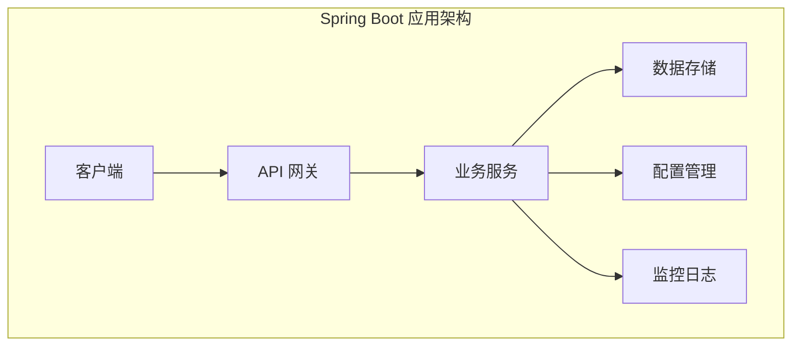

**核心特点：**

- **自动配置**：基于约定优于配置的原则，减少样板代码
- **内嵌服务器**：内置 Tomcat/Jetty，支持独立运行
- **生产就绪**：内置健康检查、指标收集、外部化配置
- **微服务友好**：天然支持微服务架构和云原生部署

**配置管理（application.properties/yml）：**

```yaml
# application.yml 示例
server:
  port: 8080
  servlet:
    context-path: /api

spring:
  datasource:
    url: jdbc:mysql://localhost:3306/demo
    username: ${DB_USERNAME:root}
    password: ${DB_PASSWORD:password}
  jpa:
    hibernate:
      ddl-auto: update
    show-sql: true

logging:
  level:
    com.example: DEBUG
  pattern:
    console: "%d{yyyy-MM-dd HH:mm:ss} - %msg%n"

management:
  endpoints:
    web:
      exposure:
        include: health,info,metrics,prometheus
  endpoint:
    health:
      show-details: always
```

**健康检查端点：**

- Spring Boot Actuator 提供了丰富的监控端点
- `/actuator/health` - 应用健康状态
- `/actuator/info` - 应用信息
- `/actuator/metrics` - 应用指标
- 支持自定义健康检查指标

**监控和指标收集：**

- 集成 Micrometer 指标库
- 支持 Prometheus、Grafana 等监控系统
- 提供 JVM 指标、HTTP 请求指标、数据库连接池指标等
- 支持分布式链路追踪（如 Zipkin、Jaeger）

### 3.2 Spring Boot 在 Kubernetes 中的部署挑战

#### 3.2.1 Spring Boot 应用部署流程

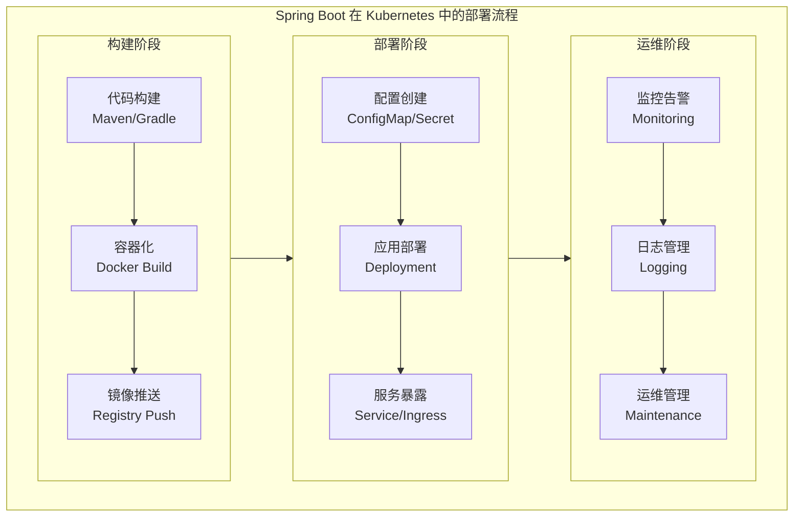

#### 3.2.2 主要部署挑战

**核心挑战：**

- **配置管理复杂**：多环境配置、敏感信息安全、配置热更新
- **服务发现困难**：微服务间通信、动态实例管理、负载均衡
- **运维成本高**：手动部署、故障处理、版本管理

### 3.3 为什么需要 Spring Boot Operator

#### 3.3.1 传统部署 vs Operator 部署对比

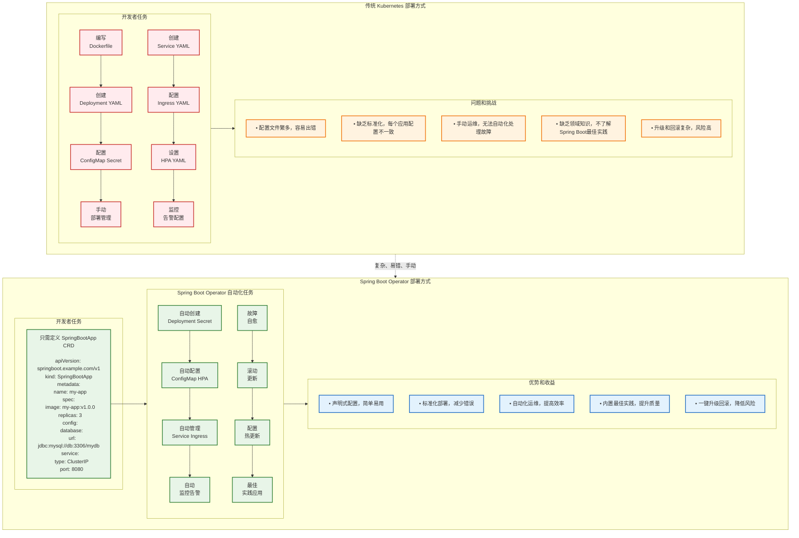

#### 3.3.2 Spring Boot Operator 的核心价值

**1. 简化部署流程：**

- **声明式配置**：将复杂的部署步骤封装成简单的声明式配置，开发者只需关注业务逻辑
- **依赖管理**：自动处理依赖关系和部署顺序，确保服务按正确顺序启动
- **一键操作**：提供一键部署和升级能力，支持批量操作和环境迁移
- **错误预防**：减少部署错误和不一致性，通过验证机制确保配置正确性

**2. 标准化配置管理：**

- **最佳实践模板**：提供 Spring Boot 应用的最佳实践配置模板，包含性能优化和安全配置
- **统一规范**：统一配置格式和命名规范，提高团队协作效率
- **自动生成**：自动生成 ConfigMap 和 Secret，支持多环境配置管理
- **版本控制**：支持配置的版本管理和回滚，确保配置变更可追溯

**3. 自动化运维任务：**

- **智能扩缩容**：基于应用指标（CPU、内存、QPS）自动扩缩容，优化资源利用率
- **故障自愈**：自动故障检测和恢复，包括健康检查失败重启、依赖服务恢复等
- **数据管理**：自动备份和数据迁移，支持数据库版本升级和迁移
- **监控集成**：自动监控告警配置，集成 Prometheus、Grafana 等监控系统

**4. 提供最佳实践：**

- **部署模式**：内置 Spring Boot 应用的部署最佳实践，包括蓝绿部署、金丝雀发布等
- **健康检查**：自动配置健康检查和就绪探针，确保服务可用性
- **性能优化**：优化资源配置和性能参数，包括 JVM 参数、连接池配置等
- **安全策略**：集成安全策略和网络策略，确保应用安全运行

### 3.4 本章总结与下一步学习指引

**本章核心知识点回顾：**

1. **Spring Boot 微服务架构理解**：掌握了 Spring Boot 在微服务架构中的四层结构（客户端层、网关层、业务服务层、基础设施层）及其特点
2. **Kubernetes 部署挑战识别**：深入分析了配置管理、服务发现、运维自动化等关键挑战
3. **Operator 价值认知**：理解了 Spring Boot Operator 相比传统部署方式的核心优势和解决方案
4. **技术方案对比**：通过可视化对比图清晰认识了传统部署与 Operator 部署的差异

**实际应用建议：**

- 在评估是否采用 Spring Boot Operator 时，重点考虑团队的技术栈复杂度和运维自动化需求
- 对于大规模微服务部署场景，Operator 的标准化和自动化优势更加明显
- 建议先从简单的应用场景开始实践，逐步积累 Operator 开发和运维经验

**下一步学习路径：**

接下来第四章将进入实践环节，通过实验驱动的方式学习 Spring Boot Operator 的具体开发实现。您将学习到：

- 如何搭建 Operator 开发环境和工具链
- 如何设计和实现 Custom Resource Definition (CRD)
- 如何开发 Controller 逻辑和业务处理流程
- 如何进行测试、部署和运维管理

建议在进入下一章之前，确保对本章的核心概念有清晰理解，特别是 Operator Pattern 的工作原理和 Spring Boot 应用的部署挑战。

---

## 4. 实验驱动的 Spring Boot Operator 开发

**学习目标：**

通过本章学习，您将能够：

- 掌握 Operator SDK 和 Kubebuilder 的使用方法，具备独立开发 Operator 的能力
- 理解 Custom Resource Definition (CRD) 的设计原则和最佳实践
- 实现完整的 Controller 协调逻辑，包括资源创建、更新、删除和状态管理
- 掌握 Spring Boot 应用在 Kubernetes 中的配置管理、服务暴露和监控集成
- 构建生产级别的微服务 Operator，支持复杂的部署和运维场景
- 具备 Operator 测试、调试和故障排查的实践技能

**实验依赖关系：**

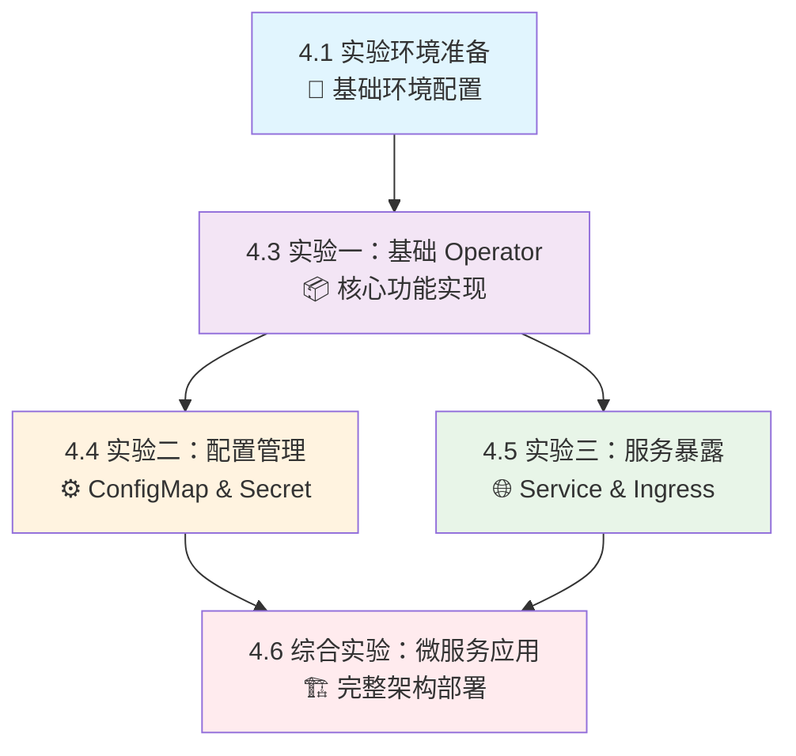

**实验进度建议：**

- **初学者**：按顺序完成所有实验，每个实验预计 2-3 小时
- **有经验者**：可跳过基础环境准备，重点关注实验二、三的高级功能
- **架构师**：重点学习综合实验的微服务架构设计和最佳实践

本章采用实验驱动的教学方式，通过循序渐进的实验来学习 Spring Boot Operator 的设计和实现。每个实验都包含设计思路、实现步骤和验证方法。

> **📁 完整实验代码**：本章所有实验的完整代码和配置文件已整理在 [`code-examples`](./code-examples/) 目录中，按实验分类组织。每个实验目录包含完整的源代码、配置文件和部署脚本，可直接运行验证。详细的使用说明请参考 [`code-examples/README.md`](./code-examples/README.md)。

### 4.1 实验环境准备

在开始实验之前，我们需要准备开发环境：

#### 4.1.1 环境要求

**必需软件：**

- Go 1.19+
- Docker Desktop
- kubectl
- Kind 或 Minikube（本地 Kubernetes 集群）

**安装步骤：**

1. **安装 Operator SDK**

   ```bash
   # macOS
   brew install operator-sdk
   
   # 或者直接下载
   curl -LO https://github.com/operator-framework/operator-sdk/releases/latest/download/operator-sdk_darwin_amd64
   chmod +x operator-sdk_darwin_amd64
   sudo mv operator-sdk_darwin_amd64 /usr/local/bin/operator-sdk
   ```

2. **安装 Kind**

   ```bash
   go install sigs.k8s.io/kind@v0.20.0
   ```

3. **创建本地集群**

   ```bash
   # 创建集群配置文件
   cat <<EOF > kind-config.yaml
   kind: Cluster
   apiVersion: kind.x-k8s.io/v1alpha4
   nodes:
   - role: control-plane
     kubeadmConfigPatches:
     - |
       kind: InitConfiguration
       nodeRegistration:
         kubeletExtraArgs:
           node-labels: "ingress-ready=true"
     extraPortMappings:
     - containerPort: 80
       hostPort: 80
       protocol: TCP
     - containerPort: 443
       hostPort: 443
       protocol: TCP
   EOF
   
   # 创建集群
   kind create cluster --config=kind-config.yaml --name=operator-lab
   
   # 验证集群
   kubectl cluster-info
   kubectl get nodes
   ```

#### 4.1.2 项目初始化

```bash
# 创建项目目录
mkdir springboot-operator-tutorial
cd springboot-operator-tutorial

# 初始化 Go 模块
go mod init github.com/example/springboot-operator

# 初始化 Operator 项目
operator-sdk init --domain=tutorial.example.com --repo=github.com/example/springboot-operator
```

### 4.2 Operator 功能规划

我们的 Spring Boot Operator 将提供以下核心功能：

**应用部署和更新：**

- 自动创建和管理 Deployment 资源
- 支持滚动更新和回滚
- 镜像版本管理和升级策略
- 副本数量自动调整

**配置管理：**

- 自动生成 ConfigMap 和 Secret
- 支持多环境配置切换
- 配置热更新和应用重启
- 配置模板和变量替换

**健康检查配置：**

- 自动配置 livenessProbe 和 readinessProbe
- 基于 Spring Boot Actuator 的健康检查
- 自定义健康检查端点
- 启动时间和超时配置

**服务暴露：**

- 自动创建 Service 资源
- 支持 ClusterIP、NodePort、LoadBalancer 类型
- Ingress 配置和路由规则
- 服务发现和负载均衡

**数据库连接管理：**

- 数据库连接配置自动化
- 连接池参数优化
- 数据库密码安全管理
- 多数据源支持

**监控配置：**

- Prometheus 指标暴露
- 自定义监控指标
- 告警规则配置
- 日志收集和分析

### 4.3 实验一：基础 Operator 设计与实现

> **📂 实验代码位置**：[`code-examples/experiment-1-basic-operator/`](./code-examples/experiment-1-basic-operator/)

**🎯 实验学习目标：**

- **理论掌握**：深入理解 Operator Pattern 的核心概念和工作原理
- **技能获得**：掌握 Operator SDK 和 Kubebuilder 的基本使用方法
- **实践能力**：能够独立设计和实现简单的 Custom Resource Definition
- **编程技能**：学会编写 Controller 协调逻辑和资源管理代码
- **调试能力**：具备基本的 Operator 测试和故障排查技能

**📋 前置条件检查：**

- ✅ 已完成 4.1 节的环境准备（Go、Docker、kubectl、Kind）
- ✅ 对 Kubernetes 基础概念有清晰理解（Pod、Deployment、Service）
- ✅ 具备基本的 Go 语言编程能力
- ✅ 熟悉 YAML 配置文件的编写和调试

**⏱️ 预计完成时间：** 2-3 小时

**🎁 预期收获：**

完成本实验后，您将获得：

1. **可运行的基础 Operator**：能够管理 Spring Boot 应用的生命周期
2. **CRD 设计经验**：理解如何设计符合 Kubernetes 规范的自定义资源
3. **Controller 开发技能**：掌握协调循环的实现和最佳实践
4. **实践项目基础**：为后续高级功能实验奠定代码基础

#### 4.3.1 设计目标

在第一个实验中，我们将设计并实现一个最基础的 Spring Boot Operator，它能够：

- 定义 SpringBootApp 自定义资源
- 根据 SpringBootApp 创建对应的 Deployment
- 管理应用的基本生命周期

#### 4.3.2 API 设计思路

**设计原则：**

1. **简单性**：从最基本的功能开始
2. **可扩展性**：为后续功能预留扩展空间
3. **声明式**：用户只需声明期望状态

**API 结构设计：**

核心 API 结构包括 `SpringBootAppSpec`（期望状态）和 `SpringBootAppStatus`（当前状态）两部分：

> **📁 API 定义代码**：详细的 API 定义请查看 [`springbootapp_types.go`](code-examples/experiment-1-basic-operator/springbootapp_types.go)

#### 4.3.3 实验步骤

**步骤 1：创建 API：**

```bash
# 创建 SpringBootApp API
operator-sdk create api --group=springboot --version=v1 --kind=SpringBootApp --resource --controller
```

**步骤 2：定义 API 结构：**

编辑 `api/v1/springbootapp_types.go`，定义核心数据结构：

> **📁 API 结构定义**：包含所有 kubebuilder 注解和完整结构定义的代码请查看 [`springbootapp_types.go`](code-examples/experiment-1-basic-operator/springbootapp_types.go)

**步骤 3：实现基础 Controller：**

编辑 `controllers/springbootapp_controller.go`，实现核心协调逻辑：

**核心功能包括：**

- `reconcileDeployment()` - 管理应用部署
- `reconcileService()` - 管理服务暴露
- `updateStatus()` - 更新资源状态

> **📁 Controller 实现代码**：包含完整实现细节的 Controller 代码请查看 [`springbootapp_controller.go`](code-examples/experiment-1-basic-operator/springbootapp_controller.go)

**步骤 4：生成 CRD 和部署文件：**

```bash
# 生成 CRD
make manifests

# 生成代码
make generate

# 构建并推送镜像（可选，用于生产环境）
make docker-build docker-push IMG=<your-registry>/springboot-operator:tag
```

**步骤 5：部署到集群：**

```bash
# 安装 CRD
make install

# 运行 Controller（开发模式）
make run
```

#### 4.3.4 测试验证

**创建测试应用：**

> **📁 测试应用配置**：查看完整的测试应用 YAML 配置 [`springboot_v1_springbootapp.yaml`](code-examples/experiment-1-basic-operator/config/samples/springboot_v1_springbootapp.yaml)

**部署测试：**

```bash
# 应用测试资源
kubectl apply -f config/samples/springboot_v1_springbootapp.yaml

# 查看创建的资源
kubectl get springbootapp
kubectl get deployment
kubectl get service
kubectl get pods

# 查看应用状态
kubectl describe springbootapp demo-app
```

**验收标准：**

1. ✅ SpringBootApp 资源创建成功
2. ✅ 自动创建对应的 Deployment 和 Service
3. ✅ Pod 正常启动并处于 Running 状态
4. ✅ SpringBootApp 状态正确反映实际情况
5. ✅ 修改 replicas 能触发 Deployment 更新

### 4.4 实验二：配置管理功能

> **📂 实验代码位置**：[`code-examples/experiment-2-config-management/`](./code-examples/experiment-2-config-management/)

**🎯 实验学习目标：**

- **配置管理掌握**：深入理解 Kubernetes 中 ConfigMap 和 Secret 的使用模式
- **热更新机制**：掌握配置变更检测和应用自动重启的实现方法
- **API 扩展技能**：学会扩展现有 CRD 以支持新功能
- **事件监听能力**：理解 Kubernetes Watch 机制和事件处理
- **生产实践**：掌握配置管理的最佳实践和安全考虑

**📋 前置条件检查：**

- ✅ **必须完成实验一**：需要基础 Operator 代码作为扩展基础
- ✅ 理解 ConfigMap 和 Secret 的基本概念和使用方法
- ✅ 熟悉 Spring Boot 的配置文件结构（application.yml/properties）
- ✅ 了解环境变量在容器中的作用机制

**🔗 依赖关系：**

```text
实验一（基础 Operator）→ 实验二（配置管理）
     ↓                        ↓
  CRD 基础结构          扩展配置字段
  Controller 框架       增加配置逻辑
  基础测试环境          配置热更新测试
```

**⏱️ 预计完成时间：** 2-3 小时

**🎁 预期收获：**

完成本实验后，您将获得：

1. **配置管理 Operator**：支持 ConfigMap/Secret 的完整配置管理功能
2. **热更新能力**：配置变更时自动触发应用重启的机制
3. **API 设计经验**：学会如何优雅地扩展现有 API 结构
4. **监听机制理解**：掌握 Kubernetes 资源变更监听的实现方法
5. **生产级特性**：具备处理复杂配置场景的能力

#### 4.4.1 设计目标

在第二个实验中，我们将为 Operator 添加配置管理功能：

- 支持通过 ConfigMap 管理应用配置
- 支持环境变量注入
- 配置变更时自动重启应用

#### 4.4.2 实验二架构设计

**配置管理核心功能：**

- **ConfigMap 管理**：自动创建和更新应用配置文件
- **Secret 管理**：安全存储敏感信息（数据库密码、API Key）
- **环境变量注入**：动态设置 Spring Boot 配置
- **配置变更检测**：监听配置变化并触发滚动更新

#### 4.4.3 配置变更检测流程图


#### 4.4.4 API 扩展设计

**扩展 SpringBootAppSpec：**

> **📁 API 扩展定义**：查看完整的配置管理 API 扩展定义 [`springbootapp_types_extended.go`](code-examples/experiment-2-config-management/api/v1/springbootapp_types_extended.go)

#### 4.4.5 实验步骤

**步骤 1：更新 API 定义：**

修改 `api/v1/springbootapp_types.go`，添加配置管理相关字段：

> **📁 完整 API 定义**：查看包含配置管理字段的完整 API 定义 [`springbootapp_types.go`](code-examples/experiment-2-config-management/api/v1/springbootapp_types.go)

**步骤 2：更新 Controller 实现：**

修改 `controllers/springbootapp_controller.go`，增加配置管理功能：

**主要增强功能：**

- 环境变量动态注入
- ConfigMap 文件挂载
- Spring Boot 配置路径自动设置
- 配置变更检测和热更新

> **📁 配置管理 Controller**：查看包含配置管理功能的完整 Controller 实现 [springbootapp_controller.go](code-examples/experiment-2-config-management/controllers/springbootapp_controller.go)

**步骤 3：添加 ConfigMap 监听：**

更新 Controller 的 `SetupWithManager` 方法以监听 ConfigMap 变化，实现配置热更新：

**配置热更新机制：**

- 监听 ConfigMap 变化事件
- 自动触发相关应用的重新部署
- 支持配置的动态更新

> **📁 ConfigMap 监听实现**：查看包含 ConfigMap 监听和热更新功能的完整实现 [springbootapp_controller.go](code-examples/experiment-2-config-management/controllers/springbootapp_controller.go)

#### 4.4.6 测试验证

**步骤 1：创建配置文件：**

> **📁 配置文件示例**：查看 ConfigMap 配置示例 [`config-demo.yaml`](code-examples/experiment-2-config-management/config/config-demo.yaml)

**步骤 2：创建带配置的应用：**

> **📁 应用配置示例**：查看带配置管理的 SpringBootApp 示例 [`springboot-app-with-config.yaml`](code-examples/experiment-2-config-management/config/springboot-app-with-config.yaml)

**步骤 3：部署和测试：**

```bash
# 重新生成和部署 CRD
make manifests && make install

# 部署配置和应用
kubectl apply -f config-demo.yaml
kubectl apply -f springboot-app-with-config.yaml

# 验证部署状态
kubectl get springbootapp demo-app-with-config
kubectl get pods -l app=demo-app-with-config

# 验证配置挂载
kubectl exec <pod-name> -- cat /app/config/application.yml
```

**步骤 4：测试配置热更新：**

```bash
# 更新 ConfigMap 触发重启
kubectl patch configmap demo-config --patch='{
  "data": {
    "application.yml": "server:\n  port: 8080\nspring:\n  application:\n    name: demo-app-updated"
  }
}'

# 观察应用重启和验证新配置
kubectl get pods -l app=demo-app-with-config -w
```

**验收标准：**

1. ✅ SpringBootApp 支持 ConfigMap 配置引用
2. ✅ 配置文件正确挂载到指定路径
3. ✅ 环境变量正确注入到容器
4. ✅ ConfigMap 变更触发应用重启
5. ✅ 可选配置（optional: true）正常工作

### 4.5 实验三：服务暴露和 Ingress

> **📂 实验代码位置**：[`code-examples/experiment-3-service-ingress/`](./code-examples/experiment-3-service-ingress/)

**🎯 实验学习目标：**

- **网络服务掌握**：深入理解 Kubernetes 中不同 Service 类型的使用场景和配置方法
- **Ingress 管理**：掌握 Ingress 资源的创建、配置和 TLS 证书管理
- **流量路由**：理解域名路由、路径分发和负载均衡的实现机制
- **生产部署**：学会为微服务应用配置完整的网络访问方案
- **故障排查**：具备网络连接问题的诊断和解决能力

**📋 前置条件检查：**

- ✅ **必须完成实验一**：需要基础 Operator 代码作为扩展基础
- ✅ 理解 Kubernetes Service 的基本概念和类型差异
- ✅ 熟悉 Ingress Controller 的工作原理（建议安装 Nginx Ingress）
- ✅ 了解 DNS 解析和域名配置的基本知识
- ✅ 具备基本的网络调试技能（curl、ping、nslookup）

**🔗 依赖关系：**

```text
实验一（基础 Operator）→ 实验三（服务暴露）
     ↓                        ↓
  基础 Service 创建      多类型 Service 支持
  简单端口暴露          Ingress 规则管理
  集群内访问            外部流量接入
```

**💡 独立性说明：** 实验三可以独立于实验二进行，两者在功能上相互独立但可以组合使用。

**⏱️ 预计完成时间：** 2-3 小时

**🎁 预期收获：**

完成本实验后，您将获得：

1. **完整网络方案**：支持多种 Service 类型和 Ingress 配置的网络访问能力
2. **生产级暴露**：掌握域名、TLS、路径路由等生产环境必需的网络特性
3. **灵活配置能力**：能够根据不同场景选择合适的服务暴露方式
4. **网络调试技能**：具备排查和解决网络连接问题的实践能力
5. **架构设计经验**：理解微服务网络架构的设计原则和最佳实践

#### 4.5.1 设计目标

在第三个实验中，我们将添加服务暴露功能：

- 支持多种 Service 类型（ClusterIP、NodePort、LoadBalancer）
- 支持 Ingress 配置
- 支持自定义域名和路径

#### 4.5.2 实验三架构设计

**服务暴露核心功能：**

- **Service 管理**：支持 ClusterIP、NodePort、LoadBalancer 类型
- **Ingress 配置**：自动创建 Ingress 规则和 TLS 证书
- **域名管理**：支持自定义域名和路径路由
- **负载均衡**：与各种 Ingress Controller 集成

#### 4.5.3 服务类型选择策略

| 服务类型 | 适用场景 | 特点 |
|---------|---------|------|
| **ClusterIP** | 内部服务通信 | 仅集群内访问，性能最佳 |
| **NodePort** | 开发测试环境 | 通过节点端口访问，需手动负载均衡 |
| **LoadBalancer** | 生产环境 | 云厂商负载均衡器，自动分配公网 IP |
| **Ingress** | HTTP/HTTPS 服务 | 域名路由、TLS 终止、路径分发 |

#### 4.5.4 API 扩展设计

**扩展 SpringBootAppSpec：**

**核心设计思路：**

- 支持多种 Service 类型（ClusterIP、NodePort、LoadBalancer）
- 灵活的 Ingress 配置，支持自定义域名和路径
- TLS 证书管理和自动化配置

> **📁 服务暴露 API 定义**：查看包含 Service 和 Ingress 配置的完整 API 定义 [springbootapp_types.go](code-examples/experiment-3-service-ingress/api/v1/springbootapp_types.go)

#### 4.5.5 实验步骤

**步骤 1：更新 API 定义：**

在 `api/v1/springbootapp_types.go` 中添加服务暴露相关字段，支持多种 Service 类型和 Ingress 配置。

**步骤 2：更新 Controller 实现：**

修改 `controllers/springbootapp_controller.go`，添加 Service 和 Ingress 管理功能：

**主要功能增强：**

- 支持多种 Service 类型（ClusterIP、NodePort、LoadBalancer）
- Ingress 资源的创建和管理
- TLS 配置和注解支持
- 动态端口和路径配置

> **📁 服务暴露 Controller**：查看包含 Service 和 Ingress 管理功能的完整 Controller 实现 [springbootapp_controller.go](code-examples/experiment-3-service-ingress/controllers/springbootapp_controller.go)

#### 4.5.6 测试验证

**步骤 1：创建 NodePort 服务测试：**

> **📁 NodePort 服务示例**：查看 NodePort 服务配置示例 [`springboot-app-nodeport.yaml`](code-examples/experiment-3-service-ingress/config/springboot-app-nodeport.yaml)

**步骤 2：创建 Ingress 测试：**

> **📁 Ingress 配置示例**：查看带 Ingress 配置的 SpringBootApp 示例 [springboot-app-ingress.yaml](code-examples/experiment-3-service-ingress/config/springboot-app-ingress.yaml)

**步骤 3：部署和测试：**

```bash
# 重新生成和部署 CRD
make manifests && make install

# 测试 NodePort 服务
kubectl apply -f springboot-app-nodeport.yaml
kubectl get service demo-app-nodeport
kubectl port-forward service/demo-app-nodeport 8080:8080

# 测试 Ingress（需要先安装 Nginx Ingress Controller）
kubectl apply -f springboot-app-ingress.yaml
kubectl get ingress demo-app-ingress

# 配置本地域名解析并测试
echo "127.0.0.1 demo-app.local" | sudo tee -a /etc/hosts
curl -H "Host: demo-app.local" http://localhost/api/
```

**验收标准：**

1. ✅ 支持不同类型的 Service（ClusterIP、NodePort、LoadBalancer）
2. ✅ 支持自定义端口配置
3. ✅ Ingress 资源正确创建和配置
4. ✅ 支持自定义域名和路径
5. ✅ 支持 TLS 配置
6. ✅ 支持 Ingress 注解

### 4.6 综合实验：完整的微服务应用

> **📂 实验代码位置**：[`code-examples/experiment-4-microservices/`](./code-examples/experiment-4-microservices/)

**🎯 实验学习目标：**

- **微服务架构掌握**：理解完整微服务系统的架构设计和组件协作关系
- **生产级部署**：掌握多服务协同部署、配置管理和网络互联的实现方法
- **系统集成能力**：学会整合前面实验的所有功能，构建完整的解决方案
- **运维实践**：具备微服务系统的监控、日志、故障排查等运维技能
- **架构设计思维**：培养从单体应用到微服务架构的设计和迁移能力

**📋 前置条件检查：**

- ✅ **必须完成实验一**：基础 Operator 功能是必需的
- ✅ **强烈建议完成实验二和三**：配置管理和服务暴露功能将被综合使用
- ✅ 理解微服务架构的基本概念和设计原则
- ✅ 熟悉 API Gateway 的作用和配置方法
- ✅ 了解服务间通信和服务发现的基本机制
- ✅ 具备一定的系统架构设计经验

**🔗 依赖关系：**

```text
实验一（基础 Operator）     ← 必需基础
     ↓
实验二（配置管理）         ← 推荐完成
     ↓
实验三（服务暴露）         ← 推荐完成
     ↓
实验四（综合微服务）       ← 集成所有功能
     ↓
完整的生产级 Spring Boot Operator
```

**🏗️ 架构复杂度：** ⭐⭐⭐⭐⭐ （最高级别）

**⏱️ 预计完成时间：** 3-4 小时

**🎁 预期收获：**

完成本实验后，您将获得：

1. **生产级 Operator**：具备完整功能的 Spring Boot Operator，可用于生产环境
2. **微服务架构经验**：深入理解微服务系统的设计、部署和运维
3. **系统集成能力**：掌握复杂系统的组件集成和协调管理
4. **运维自动化技能**：具备大规模微服务系统的自动化运维能力
5. **架构设计思维**：培养从业务需求到技术实现的完整架构设计能力
6. **实战项目经验**：获得可以写入简历的完整 Operator 开发项目经验

#### 4.6.1 实验目标

通过一个综合实验，部署一个完整的微服务应用，包括：

- 用户服务（User Service）
- 订单服务（Order Service）
- 网关服务（Gateway Service）
- 配置管理
- 服务发现
- 监控和日志

#### 4.6.2 实验架构

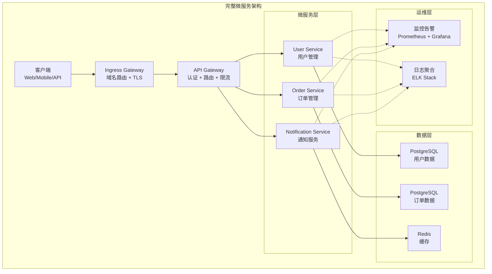

#### 4.6.3 微服务通信流程

**请求处理流程：**

1. **客户端请求** → Ingress Controller 接收 HTTP 请求
2. **路由转发** → Gateway Service 进行认证和路由
3. **服务调用** → 根据请求类型调用相应的微服务
4. **数据操作** → 微服务访问数据库或缓存
5. **响应聚合** → Gateway 聚合响应并返回客户端

#### 4.6.4 实验步骤

**步骤 1：创建命名空间和配置：**

> **📁 微服务命名空间和配置**：查看微服务架构的命名空间和配置示例 [microservices-namespace.yaml](code-examples/experiment-4-microservices/config/microservices-namespace.yaml)

**步骤 2：部署微服务应用：**

> **📁 微服务应用部署**：查看完整的微服务应用部署配置 [microservices-apps.yaml](code-examples/experiment-4-microservices/config/microservices-apps.yaml)

**步骤 3：部署和测试：**

```bash
# 创建命名空间和配置
kubectl apply -f microservices-namespace.yaml

# 部署微服务应用
kubectl apply -f microservices-apps.yaml

# 查看部署状态
kubectl get springbootapp -n microservices
kubectl get pods -n microservices
kubectl get ingress -n microservices

# 测试网关访问
echo "127.0.0.1 api.microservices.local" | sudo tee -a /etc/hosts
curl -H "Host: api.microservices.local" http://localhost/api/users/health
```

**验收标准：**

1. ✅ 所有微服务成功部署并运行
2. ✅ 服务间通信正常
3. ✅ API Gateway 正确路由请求
4. ✅ 配置管理功能正常
5. ✅ Ingress 和域名解析工作正常
6. ✅ 监控和日志收集正常
7. ✅ 系统整体性能符合预期

### 4.7 本章总结与下一步学习指引

#### 4.7.1 核心知识点回顾

通过本章的实验驱动学习，您已经掌握了以下核心技能：

**技术实现层面：**

- **Operator 开发全流程**：从 CRD 设计到 Controller 实现的完整开发周期
- **Kubebuilder 框架精通**：熟练使用 Kubebuilder 进行 Operator 开发和测试
- **Kubernetes 资源管理**：深入理解 Deployment、Service、ConfigMap、Ingress 等资源的编程式管理
- **配置管理最佳实践**：掌握 ConfigMap、Secret 的动态管理和变更检测机制
- **服务暴露策略**：理解不同 Service 类型和 Ingress 配置的适用场景
- **微服务架构实现**：具备设计和实现完整微服务系统的能力

**架构设计层面：**

- **声明式 API 设计**：能够设计符合 Kubernetes 风格的自定义资源 API
- **控制器模式精通**：深入理解 Controller 的工作原理和最佳实践
- **系统集成思维**：具备将多个组件集成为完整解决方案的能力
- **生产级考量**：了解生产环境部署的关键要素和注意事项

#### 4.7.2 实际应用建议

**在生产环境中应用时，请注意：**

1. **安全性加固**：
   - 实施 RBAC 最小权限原则
   - 使用 Pod Security Standards
   - 定期更新依赖和基础镜像

2. **可观测性增强**：
   - 集成 Prometheus 监控
   - 配置结构化日志
   - 实施分布式链路追踪

3. **高可用性设计**：
   - Controller 多副本部署
   - 实施优雅关闭和故障恢复
   - 配置资源限制和健康检查

4. **运维自动化**：
   - 集成 CI/CD 流水线
   - 实施自动化测试
   - 配置告警和故障自愈

#### 4.7.3 下一步学习路径

**进阶技术方向：**

1. **Operator 高级特性**：
   - Webhook 开发（Admission Controller）
   - 自定义调度器集成
   - 多集群 Operator 管理

2. **云原生生态集成**：
   - Service Mesh 集成（Istio/Linkerd）
   - GitOps 工作流（ArgoCD/Flux）
   - 策略引擎集成（OPA Gatekeeper）

3. **企业级功能扩展**：
   - 多租户支持
   - 成本优化和资源调度
   - 合规性和审计功能

**实践项目建议：**

1. **扩展当前 Operator**：
   - 添加数据库 Operator 功能
   - 实现蓝绿部署和金丝雀发布
   - 集成外部系统（如消息队列、缓存）

2. **开发新的 Operator**：
   - 数据库 Operator（PostgreSQL/MySQL）
   - 中间件 Operator（Redis/RabbitMQ）
   - 监控 Operator（Prometheus/Grafana）

3. **贡献开源社区**：
   - 参与 Kubernetes SIG 讨论
   - 贡献 Operator Framework 项目
   - 分享最佳实践和经验

**学习资源推荐：**

- 📚 **官方文档**：Kubernetes Operator Pattern、Kubebuilder Book
- 🎥 **视频课程**：CNCF 官方培训、KubeCon 演讲
- 💻 **实践平台**：OperatorHub.io、Kubernetes Playground
- 🤝 **社区参与**：Kubernetes Slack、Reddit r/kubernetes

恭喜您完成了 Spring Boot Operator 的完整学习旅程！您现在已经具备了开发生产级 Kubernetes Operator 的核心技能。继续实践和探索，您将在云原生领域取得更大的成就。

---

## 5. 生产环境最佳实践

### 5.1 故障排除指南

#### 5.1.1 故障排除决策树

**问题分类与诊断流程：**

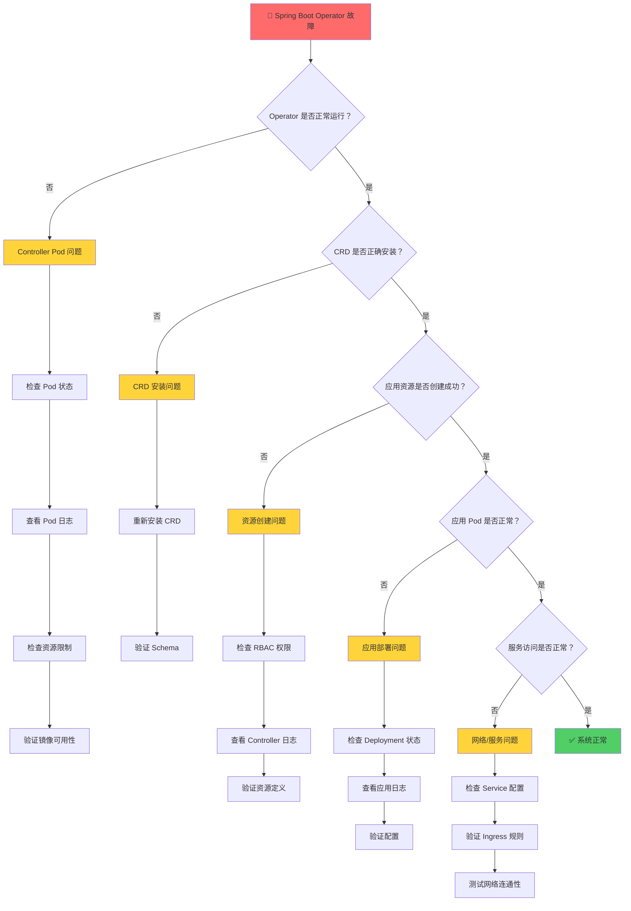

#### 5.1.2 快速诊断检查清单

**诊断步骤：**

1. **基础环境检查**：验证 Operator 命名空间、Pod 状态、CRD 安装
2. **Controller 健康检查**：检查 Controller Pod 状态、日志、事件
3. **应用资源检查**：验证 SpringBootApp 资源、相关 Kubernetes 资源

> 📋 **详细诊断命令请参考附录 A：故障排除命令参考**

#### 5.1.3 故障排除流程图

**Controller 启动问题诊断：**

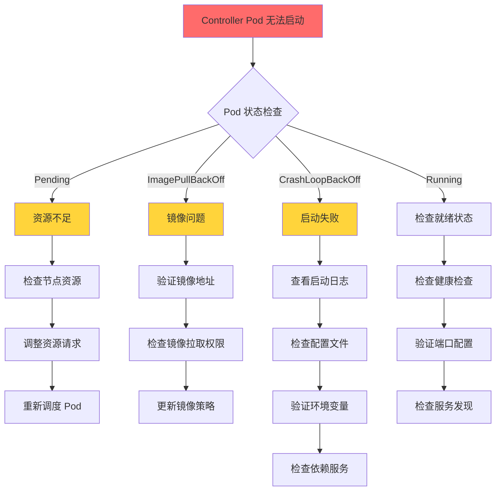

**应用部署问题诊断：**

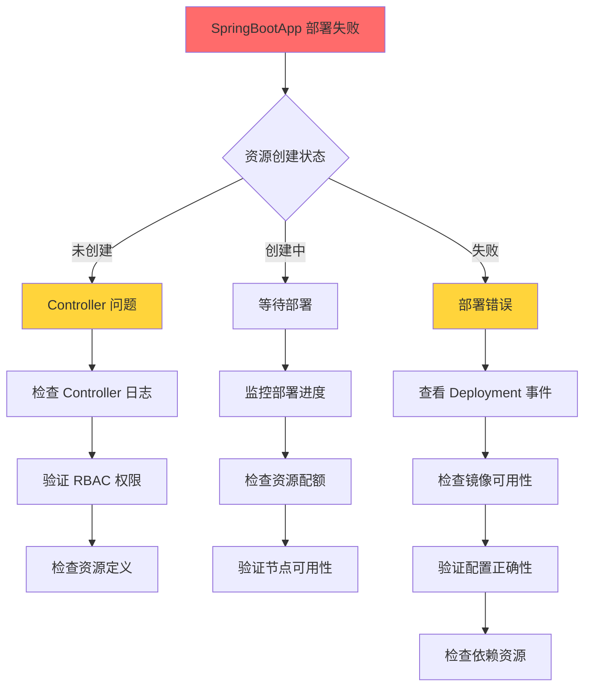

#### 5.1.4 常见问题诊断

**CRD 相关问题：**

```bash
# 检查 CRD 是否正确安装
kubectl get crd springbootapps.springboot.tutorial.example.com

# 查看 CRD 详细信息
kubectl describe crd springbootapps.springboot.tutorial.example.com

# 验证 CRD Schema
kubectl get crd springbootapps.springboot.tutorial.example.com -o yaml
```

**Controller 启动问题：**

```bash
# 查看 Controller Pod 状态
kubectl get pods -n springboot-operator-system

# 查看 Controller 日志
kubectl logs -n springboot-operator-system deployment/springboot-operator-controller-manager

# 查看 Controller 事件
kubectl describe pod -n springboot-operator-system <controller-pod-name>
```

**RBAC 权限问题：**

```bash
# 检查 ServiceAccount
kubectl get serviceaccount -n springboot-operator-system

# 检查 ClusterRole 和 ClusterRoleBinding
kubectl get clusterrole | grep springboot-operator
kubectl get clusterrolebinding | grep springboot-operator

# 验证权限
kubectl auth can-i create deployments --as=system:serviceaccount:springboot-operator-system:springboot-operator-controller-manager
```

#### 5.1.5 网络问题诊断流程

**服务访问问题诊断：**

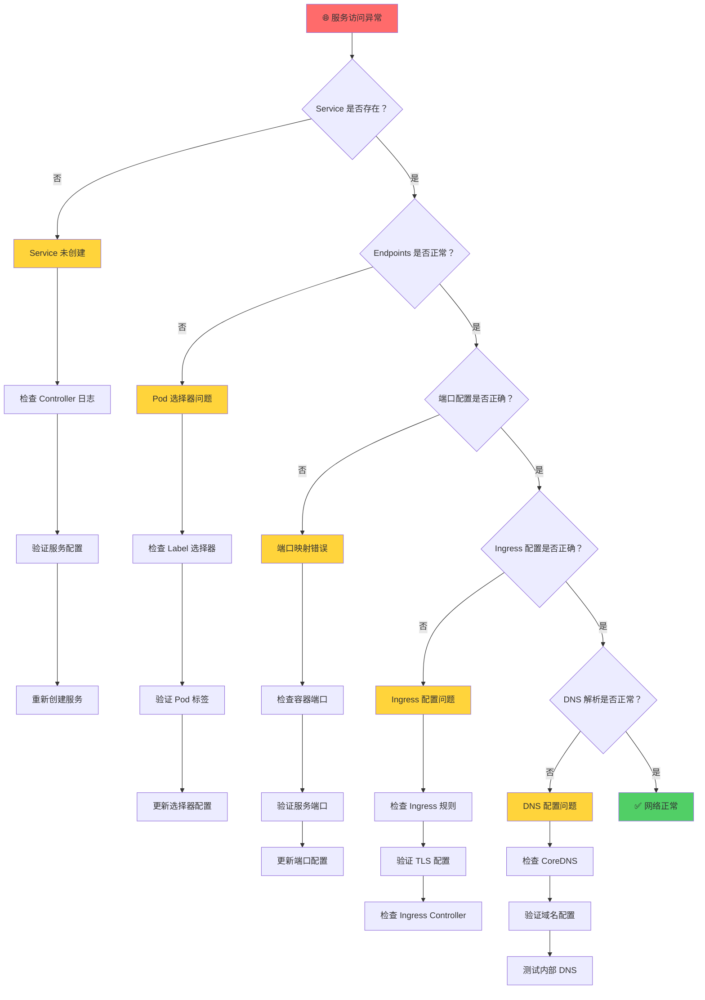

**网络连通性测试命令：**

```bash
# 1. 测试 Pod 内部连通性
kubectl exec -it <pod-name> -- curl http://localhost:8080/actuator/health

# 2. 测试 Service 连通性
kubectl run test-pod --image=curlimages/curl --rm -it --restart=Never -- curl http://<service-name>.<namespace>.svc.cluster.local:8080

# 3. 测试 Ingress 连通性
curl -H "Host: <your-domain>" http://<ingress-ip>/actuator/health

# 4. 检查 DNS 解析
kubectl exec -it <pod-name> -- nslookup <service-name>.<namespace>.svc.cluster.local
```

#### 5.1.6 性能问题诊断流程

**应用性能问题诊断：**

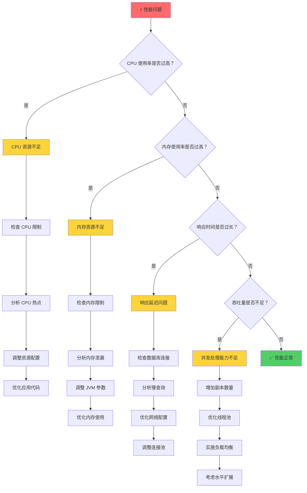

**性能监控命令：**

```bash
# 1. 查看资源使用情况
kubectl top pods -n <namespace>
kubectl top nodes

# 2. 查看详细资源指标
kubectl describe pod <pod-name> | grep -A 5 "Requests\|Limits"

# 3. 查看应用指标（如果启用了 metrics）
curl http://<service-endpoint>/actuator/metrics
curl http://<service-endpoint>/actuator/prometheus

# 4. 查看 JVM 信息
curl http://<service-endpoint>/actuator/metrics/jvm.memory.used
curl http://<service-endpoint>/actuator/metrics/jvm.gc.pause
```

#### 5.1.7 故障排除最佳实践

**🔧 诊断工具箱：**

```bash
#!/bin/bash
# Spring Boot Operator 故障诊断脚本

echo "=== Spring Boot Operator 健康检查 ==="

# 1. 基础环境检查
echo "1. 检查 Operator 状态..."
kubectl get pods -n springboot-operator-system
kubectl get crd | grep springboot

# 2. 应用资源检查
echo "2. 检查应用资源..."
kubectl get springbootapp -A
kubectl get deployment,service,ingress -l app.kubernetes.io/managed-by=springboot-operator

# 3. 事件检查
echo "3. 检查相关事件..."
kubectl get events --sort-by='.lastTimestamp' | grep -i "springboot\|error\|failed"

# 4. 日志检查
echo "4. 检查 Controller 日志..."
kubectl logs -n springboot-operator-system deployment/springboot-operator-controller-manager --tail=20

echo "=== 检查完成 ==="
```

**📋 问题记录模板：**

```yaml
# 故障报告模板
issue_report:
  timestamp: "2024-01-15T10:30:00Z"
  severity: "high|medium|low"
  category: "controller|networking|performance|configuration"
  
  environment:
    kubernetes_version: "v1.28.0"
    operator_version: "v1.0.0"
    cluster_info: "3 nodes, 16GB RAM each"
  
  symptoms:
    - "应用无法启动"
    - "服务访问超时"
    - "Controller 日志报错"
  
  investigation_steps:
    - "检查 Pod 状态"
    - "查看 Controller 日志"
    - "验证网络连通性"
  
  root_cause: "RBAC 权限配置错误"
  
  resolution:
    - "更新 ClusterRole 权限"
    - "重启 Controller Pod"
    - "验证应用正常运行"
  
  prevention:
    - "添加权限验证脚本"
    - "完善监控告警"
```

#### 5.1.8 Reconcile 循环问题

**无限循环问题：**

```go
// 错误示例：可能导致无限循环
func (r *SpringBootAppReconciler) Reconcile(ctx context.Context, req ctrl.Request) (ctrl.Result, error) {
    // 获取资源
    var app springbootv1.SpringBootApp
    if err := r.Get(ctx, req.NamespacedName, &app); err != nil {
        return ctrl.Result{}, client.IgnoreNotFound(err)
    }
    
    // 错误：每次都更新状态，导致无限循环
    app.Status.Phase = "Running"
    if err := r.Status().Update(ctx, &app); err != nil {
        return ctrl.Result{}, err
    }
    
    return ctrl.Result{}, nil
}

// 正确示例：避免无限循环
func (r *SpringBootAppReconciler) Reconcile(ctx context.Context, req ctrl.Request) (ctrl.Result, error) {
    var app springbootv1.SpringBootApp
    if err := r.Get(ctx, req.NamespacedName, &app); err != nil {
        return ctrl.Result{}, client.IgnoreNotFound(err)
    }
    
    // 检查状态是否需要更新
    if app.Status.Phase != "Running" {
        app.Status.Phase = "Running"
        if err := r.Status().Update(ctx, &app); err != nil {
            return ctrl.Result{}, err
        }
    }
    
    return ctrl.Result{}, nil
}
```

**资源创建失败：**

```go
// 添加详细的错误处理和重试逻辑
func (r *SpringBootAppReconciler) createDeployment(ctx context.Context, app *springbootv1.SpringBootApp) error {
    deployment := &appsv1.Deployment{
        ObjectMeta: metav1.ObjectMeta{
            Name:      app.Name,
            Namespace: app.Namespace,
        },
        Spec: appsv1.DeploymentSpec{
            // ... deployment spec
        },
    }
    
    // 设置 OwnerReference
    if err := ctrl.SetControllerReference(app, deployment, r.Scheme); err != nil {
        return fmt.Errorf("failed to set controller reference: %w", err)
    }
    
    // 创建 Deployment
    if err := r.Create(ctx, deployment); err != nil {
        if apierrors.IsAlreadyExists(err) {
            // 资源已存在，检查是否需要更新
            return r.updateDeployment(ctx, app, deployment)
        }
        return fmt.Errorf("failed to create deployment: %w", err)
    }
    
    return nil
}
```

#### 5.1.9 调试工具和技巧

**启用详细日志：**

```yaml
# 在 Controller Manager 中启用详细日志
apiVersion: apps/v1
kind: Deployment
metadata:
  name: springboot-operator-controller-manager
spec:
  template:
    spec:
      containers:
      - name: manager
        args:
        - --leader-elect
        - --zap-log-level=debug  # 启用调试日志
        - --zap-development=true # 开发模式
```

**使用事件记录：**

```go
// 在 Controller 中记录事件
func (r *SpringBootAppReconciler) Reconcile(ctx context.Context, req ctrl.Request) (ctrl.Result, error) {
    var app springbootv1.SpringBootApp
    if err := r.Get(ctx, req.NamespacedName, &app); err != nil {
        return ctrl.Result{}, client.IgnoreNotFound(err)
    }
    
    // 记录事件
    r.Recorder.Event(&app, corev1.EventTypeNormal, "Reconciling", "Starting reconciliation")
    
    // 执行业务逻辑
    if err := r.reconcileDeployment(ctx, &app); err != nil {
        r.Recorder.Event(&app, corev1.EventTypeWarning, "ReconcileError", err.Error())
        return ctrl.Result{}, err
    }
    
    r.Recorder.Event(&app, corev1.EventTypeNormal, "Reconciled", "Successfully reconciled")
    return ctrl.Result{}, nil
}
```

### 5.2 性能调优指南

#### 5.2.1 Controller 性能优化

**工作队列配置：**

```go
// 优化工作队列配置
func (r *SpringBootAppReconciler) SetupWithManager(mgr ctrl.Manager) error {
    return ctrl.NewControllerManagedBy(mgr).
        For(&springbootv1.SpringBootApp{}).
        Owns(&appsv1.Deployment{}).
        Owns(&corev1.Service{}).
        WithOptions(controller.Options{
            MaxConcurrentReconciles: 5, // 并发处理数量
            RateLimiter: workqueue.NewItemExponentialFailureRateLimiter(
                time.Millisecond*100, // 基础延迟
                time.Second*30,       // 最大延迟
            ),
        }).
        Complete(r)
}
```

**资源监听优化：**

```go
// 使用字段选择器和标签选择器减少监听范围
func (r *SpringBootAppReconciler) SetupWithManager(mgr ctrl.Manager) error {
    return ctrl.NewControllerManagedBy(mgr).
        For(&springbootv1.SpringBootApp{}).
        Owns(&appsv1.Deployment{}).
        Watches(
            &source.Kind{Type: &corev1.ConfigMap{}},
            &handler.EnqueueRequestForOwner{
                IsController: true,
                OwnerType:    &springbootv1.SpringBootApp{},
            },
            builder.WithPredicates(predicate.Funcs{
                // 只监听特定标签的 ConfigMap
                CreateFunc: func(e event.CreateEvent) bool {
                    return e.Object.GetLabels()["app.kubernetes.io/managed-by"] == "springboot-operator"
                },
                UpdateFunc: func(e event.UpdateEvent) bool {
                    return e.ObjectNew.GetLabels()["app.kubernetes.io/managed-by"] == "springboot-operator"
                },
            }),
        ).
        Complete(r)
}
```

**内存和 CPU 优化：**

```yaml
# Controller Manager 资源限制
apiVersion: apps/v1
kind: Deployment
metadata:
  name: springboot-operator-controller-manager
spec:
  template:
    spec:
      containers:
      - name: manager
        resources:
          limits:
            cpu: 500m
            memory: 512Mi
          requests:
            cpu: 100m
            memory: 128Mi
        env:
        - name: GOGC
          value: "100"  # Go GC 调优
        - name: GOMEMLIMIT
          value: "450MiB"  # Go 内存限制
```

#### 5.2.2 Reconcile 逻辑优化

**避免不必要的 API 调用：**

```go
// 优化前：每次都检查所有资源
func (r *SpringBootAppReconciler) Reconcile(ctx context.Context, req ctrl.Request) (ctrl.Result, error) {
    // 获取 SpringBootApp
    var app springbootv1.SpringBootApp
    if err := r.Get(ctx, req.NamespacedName, &app); err != nil {
        return ctrl.Result{}, client.IgnoreNotFound(err)
    }
    
    // 每次都创建/更新所有资源
    if err := r.reconcileDeployment(ctx, &app); err != nil {
        return ctrl.Result{}, err
    }
    if err := r.reconcileService(ctx, &app); err != nil {
        return ctrl.Result{}, err
    }
    if err := r.reconcileIngress(ctx, &app); err != nil {
        return ctrl.Result{}, err
    }
    
    return ctrl.Result{}, nil
}

// 优化后：基于状态和变更进行条件处理
func (r *SpringBootAppReconciler) Reconcile(ctx context.Context, req ctrl.Request) (ctrl.Result, error) {
    var app springbootv1.SpringBootApp
    if err := r.Get(ctx, req.NamespacedName, &app); err != nil {
        return ctrl.Result{}, client.IgnoreNotFound(err)
    }
    
    // 检查资源是否需要更新
    if r.needsDeploymentUpdate(&app) {
        if err := r.reconcileDeployment(ctx, &app); err != nil {
            return ctrl.Result{}, err
        }
    }
    
    if r.needsServiceUpdate(&app) {
        if err := r.reconcileService(ctx, &app); err != nil {
            return ctrl.Result{}, err
        }
    }
    
    return ctrl.Result{}, nil
}
```

**使用缓存减少 API 调用：**

```go
// 使用本地缓存存储资源状态
type SpringBootAppReconciler struct {
    client.Client
    Scheme   *runtime.Scheme
    Recorder record.EventRecorder
    
    // 添加缓存
    resourceCache sync.Map
}

func (r *SpringBootAppReconciler) getDeployment(ctx context.Context, name, namespace string) (*appsv1.Deployment, error) {
    key := fmt.Sprintf("%s/%s", namespace, name)
    
    // 检查缓存
    if cached, ok := r.resourceCache.Load(key); ok {
        if deployment, ok := cached.(*appsv1.Deployment); ok {
            return deployment, nil
        }
    }
    
    // 从 API Server 获取
    var deployment appsv1.Deployment
    if err := r.Get(ctx, types.NamespacedName{Name: name, Namespace: namespace}, &deployment); err != nil {
        return nil, err
    }
    
    // 更新缓存
    r.resourceCache.Store(key, &deployment)
    return &deployment, nil
}
```

### 5.3 监控和日志集成

#### 5.3.1 Prometheus 监控集成

**Controller 指标暴露：**

```go
// 添加自定义指标
var (
    reconcileTotal = prometheus.NewCounterVec(
        prometheus.CounterOpts{
            Name: "springboot_operator_reconcile_total",
            Help: "Total number of reconciliations",
        },
        []string{"controller", "result"},
    )
    
    reconcileDuration = prometheus.NewHistogramVec(
        prometheus.HistogramOpts{
            Name: "springboot_operator_reconcile_duration_seconds",
            Help: "Duration of reconciliations",
        },
        []string{"controller"},
    )
    
    managedApps = prometheus.NewGaugeVec(
        prometheus.GaugeOpts{
            Name: "springboot_operator_managed_apps",
            Help: "Number of managed SpringBoot applications",
        },
        []string{"namespace", "status"},
    )
)

func init() {
    metrics.Registry.MustRegister(reconcileTotal, reconcileDuration, managedApps)
}

// 在 Reconcile 函数中记录指标
func (r *SpringBootAppReconciler) Reconcile(ctx context.Context, req ctrl.Request) (ctrl.Result, error) {
    start := time.Now()
    defer func() {
        reconcileDuration.WithLabelValues("springbootapp").Observe(time.Since(start).Seconds())
    }()
    
    var app springbootv1.SpringBootApp
    if err := r.Get(ctx, req.NamespacedName, &app); err != nil {
        if apierrors.IsNotFound(err) {
            reconcileTotal.WithLabelValues("springbootapp", "not_found").Inc()
            return ctrl.Result{}, nil
        }
        reconcileTotal.WithLabelValues("springbootapp", "error").Inc()
        return ctrl.Result{}, err
    }
    
    // 执行协调逻辑
    if err := r.reconcileApp(ctx, &app); err != nil {
        reconcileTotal.WithLabelValues("springbootapp", "error").Inc()
        return ctrl.Result{}, err
    }
    
    reconcileTotal.WithLabelValues("springbootapp", "success").Inc()
    managedApps.WithLabelValues(app.Namespace, string(app.Status.Phase)).Set(1)
    
    return ctrl.Result{}, nil
}
```

**ServiceMonitor 配置：**

```yaml
apiVersion: monitoring.coreos.com/v1
kind: ServiceMonitor
metadata:
  name: springboot-operator-metrics
  namespace: springboot-operator-system
spec:
  selector:
    matchLabels:
      control-plane: controller-manager
  endpoints:
  - port: https
    scheme: https
    tlsConfig:
      insecureSkipVerify: true
    path: /metrics
    interval: 30s
---
apiVersion: v1
kind: Service
metadata:
  name: springboot-operator-controller-manager-metrics-service
  namespace: springboot-operator-system
  labels:
    control-plane: controller-manager
spec:
  ports:
  - name: https
    port: 8443
    protocol: TCP
    targetPort: https
  selector:
    control-plane: controller-manager
```

**Grafana Dashboard 配置：**

```json
{
  "dashboard": {
    "title": "Spring Boot Operator",
    "panels": [
      {
        "title": "Reconciliation Rate",
        "type": "graph",
        "targets": [
          {
            "expr": "rate(springboot_operator_reconcile_total[5m])",
            "legendFormat": "{{result}}"
          }
        ]
      },
      {
        "title": "Reconciliation Duration",
        "type": "graph",
        "targets": [
          {
            "expr": "histogram_quantile(0.95, rate(springboot_operator_reconcile_duration_seconds_bucket[5m]))",
            "legendFormat": "95th percentile"
          }
        ]
      },
      {
        "title": "Managed Applications",
        "type": "stat",
        "targets": [
          {
            "expr": "sum(springboot_operator_managed_apps)",
            "legendFormat": "Total Apps"
          }
        ]
      }
    ]
  }
}
```

#### 5.3.2 结构化日志配置

**使用 logr 进行结构化日志：**

```go
// 配置结构化日志
func (r *SpringBootAppReconciler) Reconcile(ctx context.Context, req ctrl.Request) (ctrl.Result, error) {
    log := log.FromContext(ctx).WithValues(
        "springbootapp", req.NamespacedName,
        "reconcileID", uuid.New().String(),
    )
    
    log.Info("Starting reconciliation")
    
    var app springbootv1.SpringBootApp
    if err := r.Get(ctx, req.NamespacedName, &app); err != nil {
        if apierrors.IsNotFound(err) {
            log.Info("SpringBootApp not found, probably deleted")
            return ctrl.Result{}, nil
        }
        log.Error(err, "Failed to get SpringBootApp")
        return ctrl.Result{}, err
    }
    
    log = log.WithValues(
        "generation", app.Generation,
        "resourceVersion", app.ResourceVersion,
    )
    
    // 记录应用状态变化
    if app.Status.Phase != "Running" {
        log.Info("Application status changed", 
            "oldPhase", app.Status.Phase, 
            "newPhase", "Running",
        )
    }
    
    log.Info("Reconciliation completed successfully")
    return ctrl.Result{}, nil
}
```

**日志聚合配置（Fluentd）：**

```yaml
apiVersion: v1
kind: ConfigMap
metadata:
  name: fluentd-config
data:
  fluent.conf: |
    <source>
      @type tail
      path /var/log/containers/springboot-operator-controller-manager-*.log
      pos_file /var/log/fluentd-springboot-operator.log.pos
      tag kubernetes.springboot-operator
      format json
      time_key time
      time_format %Y-%m-%dT%H:%M:%S.%NZ
    </source>
    
    <filter kubernetes.springboot-operator>
      @type parser
      key_name log
      reserve_data true
      <parse>
        @type json
      </parse>
    </filter>
    
    <match kubernetes.springboot-operator>
      @type elasticsearch
      host elasticsearch.logging.svc.cluster.local
      port 9200
      index_name springboot-operator
      type_name _doc
    </match>
```

### 5.4 安全最佳实践

#### 5.4.1 RBAC 最小权限原则

**核心原则：**

- **最小权限**：只授予 Operator 必需的最小权限集合
- **资源隔离**：限制 Operator 只能操作特定的资源类型
- **命名空间隔离**：使用 Role 而非 ClusterRole 限制操作范围
- **定期审计**：定期检查和更新权限配置

> 📋 **详细 RBAC 配置示例请参考附录 B：安全配置参考**

#### 5.4.2 镜像安全

**安全要求：**

- **镜像签名**：使用 Cosign 等工具对镜像进行签名验证
- **漏洞扫描**：集成镜像安全扫描到 CI/CD 流程
- **最小化镜像**：使用 distroless 或 alpine 基础镜像
- **非 root 用户**：容器以非特权用户身份运行

#### 5.4.3 网络安全

**网络策略：**

- **网络隔离**：使用 NetworkPolicy 限制 Pod 间通信
- **TLS 加密**：启用 HTTPS 和内部服务间 TLS 通信
- **入口控制**：配置 Ingress 安全策略和 WAF 规则

**网络策略配置：**

```yaml
apiVersion: networking.k8s.io/v1
kind: NetworkPolicy
metadata:
  name: springboot-operator-netpol
  namespace: springboot-operator-system
spec:
  podSelector:
    matchLabels:
      control-plane: controller-manager
  policyTypes:
  - Ingress
  - Egress
  ingress:
  # 只允许来自监控系统的访问
  - from:
    - namespaceSelector:
        matchLabels:
          name: monitoring
    ports:
    - protocol: TCP
      port: 8443
  egress:
  # 允许访问 Kubernetes API Server
  - to: []
    ports:
    - protocol: TCP
      port: 443
  # 允许 DNS 解析
  - to:
    - namespaceSelector:
        matchLabels:
          name: kube-system
    ports:
    - protocol: UDP
      port: 53
```

**TLS 配置：**

```yaml
# 为 Webhook 配置 TLS
apiVersion: v1
kind: Secret
metadata:
  name: webhook-server-certs
  namespace: springboot-operator-system
type: kubernetes.io/tls
data:
  tls.crt: # base64 encoded certificate
  tls.key: # base64 encoded private key
---
apiVersion: admissionregistration.k8s.io/v1
kind: ValidatingAdmissionWebhook
metadata:
  name: springboot-operator-validating-webhook
webhooks:
- name: vspringbootapp.kb.io
  clientConfig:
    service:
      name: springboot-operator-webhook-service
      namespace: springboot-operator-system
      path: /validate-springboot-tutorial-example-com-v1-springbootapp
    caBundle: # base64 encoded CA certificate
  rules:
  - operations: ["CREATE", "UPDATE"]
    apiGroups: ["springboot.tutorial.example.com"]
    apiVersions: ["v1"]
    resources: ["springbootapps"]
  admissionReviewVersions: ["v1", "v1beta1"]
  sideEffects: None
  failurePolicy: Fail
```

#### 5.4.4 敏感信息管理

**使用 External Secrets Operator：**

```yaml
apiVersion: external-secrets.io/v1beta1
kind: SecretStore
metadata:
  name: vault-backend
  namespace: springboot-apps
spec:
  provider:
    vault:
      server: "https://vault.example.com"
      path: "secret"
      version: "v2"
      auth:
        kubernetes:
          mountPath: "kubernetes"
          role: "springboot-operator"
          serviceAccountRef:
            name: "springboot-operator-sa"
---
apiVersion: external-secrets.io/v1beta1
kind: ExternalSecret
metadata:
  name: database-credentials
  namespace: springboot-apps
spec:
  refreshInterval: 1h
  secretStoreRef:
    name: vault-backend
    kind: SecretStore
  target:
    name: database-secret
    creationPolicy: Owner
  data:
  - secretKey: username
    remoteRef:
      key: database
      property: username
  - secretKey: password
    remoteRef:
      key: database
      property: password
```

**Pod Security Standards：**

```yaml
apiVersion: v1
kind: Namespace
metadata:
  name: springboot-apps
  labels:
    pod-security.kubernetes.io/enforce: restricted
    pod-security.kubernetes.io/audit: restricted
    pod-security.kubernetes.io/warn: restricted
```

### 5.5 代码质量提升

> **💡 实验回顾**：在前面的实验中，我们专注于功能实现。本节将展示如何将实验代码提升到生产级别的质量标准。

#### 5.5.1 代码质量提升要点

**核心改进要点：**

1. **结构化错误处理**：定义明确的错误类型，根据错误性质采用不同的重试策略
2. **智能状态管理**：只在状态真正变化时更新，减少不必要的 API 调用
3. **详细的日志记录**：提供足够的上下文信息，便于问题排查
4. **事件记录**：为运维人员提供清晰的操作历史

> **🔧 实践建议**：将这些质量提升技巧应用到前面实验的代码中，逐步提升代码的生产就绪度。
> 📋 **详细代码示例请参考附录 C：代码质量提升参考**

---

## 6. 总结

通过这些实验，我们完成了一个功能完整的 Spring Boot Operator 的开发和测试：

> **🎯 完整代码**：所有实验的代码和配置文件都在 [`code-examples`](./code-examples/) 目录中。

### 6.1 学习路径总览

**三阶段学习路径：**

1. **理论基础阶段**：掌握 Operator 概念、CRD 设计、Controller 模式和 Spring Boot 基础
2. **实践开发阶段**：完成基础 Operator、配置管理、服务暴露和微服务架构实验
3. **生产应用阶段**：学习性能优化、安全加固、监控告警和故障恢复

### 6.2 技术栈总览

**核心技术栈：**

- **开发框架**：Kubebuilder + Go 语言
- **容器化**：Docker + Kubernetes
- **配置管理**：ConfigMap + Secret
- **服务暴露**：Service + Ingress
- **权限控制**：RBAC + ServiceAccount

### 6.3 核心收获

通过本教程的学习，你已经掌握了：

- **理论基础**：Operator Pattern 核心原理、CRD 设计、Controller 模式、微服务架构
- **实践技能**：Kubebuilder 开发、Go 语言 Kubernetes 编程、配置管理、服务暴露
- **工程能力**：项目组织、测试验证、部署运维、问题排查

### 6.4 扩展方向

- **功能增强**：自动扩缩容、蓝绿部署、金丝雀发布、多环境管理
- **运维集成**：监控告警、日志聚合、链路追踪、安全加固
- **生态集成**：服务网格、GitOps、多集群管理、云原生集成

### 6.5 关键要点回顾

1. **声明式 API 设计**：以用户意图为中心，API 简洁明了
2. **幂等性保证**：确保 Reconcile 逻辑幂等，避免副作用
3. **智能错误处理**：分类错误，实现合理的重试机制
4. **完善状态管理**：提供清晰的状态反馈和进度跟踪
5. **性能优化**：减少不必要的 API 调用，提升响应速度
6. **安全第一**：遵循最小权限原则，保护敏感信息
7. **可观测性**：集成监控、日志和链路追踪
8. **测试覆盖**：建立完整测试体系，保证代码质量

现在你已经具备了开发生产级 Spring Boot Operator 的完整技能。继续实践探索，将这些知识应用到实际项目中！

### 6.6 进阶实践项目建议

以下项目按照难度递增建议进行实践：

#### 6.6.1 入门级项目

**1. 配置管理 Operator：**

- **目标**：为现有 Spring Boot 应用开发配置管理 Operator
- **功能**：支持 ConfigMap/Secret 自动注入、配置热更新
- **技能点**：CRD 设计、基础 Controller 逻辑、配置管理
- **预计时间**：1-2 周

**2. 数据库连接 Operator：**

- **目标**：自动管理应用的数据库连接配置
- **功能**：数据库实例发现、连接池配置、健康检查
- **技能点**：外部资源集成、状态管理、错误处理
- **预计时间**：2-3 周

#### 6.6.2 进阶级项目

**3. 微服务部署 Operator：**

- **目标**：支持多环境的微服务应用部署和管理
- **功能**：环境隔离、服务发现、负载均衡、蓝绿部署
- **技能点**：复杂状态机、多资源协调、部署策略
- **预计时间**：4-6 周

**4. 监控集成 Operator：**

- **目标**：自动配置应用监控和告警
- **功能**：Prometheus 集成、Grafana 仪表板、告警规则
- **技能点**：第三方系统集成、监控最佳实践
- **预计时间**：3-4 周

#### 6.6.3 专家级项目

**5. 应用生命周期管理平台：**

- **目标**：企业级应用全生命周期管理解决方案
- **功能**：CI/CD 集成、多集群部署、灰度发布、回滚策略
- **技能点**：复杂架构设计、性能优化、安全加固
- **预计时间**：8-12 周

**6. 云原生数据平台 Operator：**

- **目标**：管理分布式数据处理工作负载
- **功能**：数据管道编排、资源弹性伸缩、数据血缘追踪
- **技能点**：大数据生态集成、复杂调度逻辑
- **预计时间**：10-16 周

### 6.7 学习资源指引

#### 6.7.1 官方文档与规范

**核心文档：**

- [Kubebuilder 官方文档](https://book.kubebuilder.io/) - Operator 开发权威指南
- [Kubernetes API 参考](https://kubernetes.io/docs/reference/kubernetes-api/) - API 设计规范
- [Operator Pattern 官方文档](https://kubernetes.io/docs/concepts/extend-kubernetes/operator/) - 设计模式详解
- [Controller Runtime 文档](https://pkg.go.dev/sigs.k8s.io/controller-runtime) - 底层框架文档

**最佳实践：**

- [CNCF Operator 白皮书](https://github.com/cncf/tag-app-delivery/blob/main/operator-wg/whitepaper/Operator-WhitePaper_v1-0.md)
- [Kubernetes Operator 最佳实践](https://cloud.google.com/blog/products/containers-kubernetes/best-practices-for-building-kubernetes-operators-and-stateful-apps)
- [Red Hat Operator 开发指南](https://docs.openshift.com/container-platform/latest/operators/operator_sdk/osdk-about.html)

#### 6.7.2 社区资源与案例

**优秀案例学习：**

- [OperatorHub.io](https://operatorhub.io/) - 生产级 Operator 案例库
- [Awesome Operators](https://github.com/operator-framework/awesome-operators) - 精选 Operator 项目
- [Kubernetes SIGs](https://github.com/kubernetes-sigs) - 官方特殊兴趣小组项目

**开源项目参考：**

- [Prometheus Operator](https://github.com/prometheus-operator/prometheus-operator) - 监控系统 Operator
- [Istio Operator](https://github.com/istio/istio/tree/master/operator) - 服务网格 Operator
- [Strimzi Kafka Operator](https://github.com/strimzi/strimzi-kafka-operator) - 消息队列 Operator
- [Zalando Postgres Operator](https://github.com/zalando/postgres-operator) - 数据库 Operator

#### 6.7.3 学习平台与课程

**在线课程：**

- [Cloud Native Computing Foundation (CNCF) 培训](https://www.cncf.io/certification/training/)
- [Kubernetes 官方培训](https://kubernetes.io/training/)
- [Red Hat OpenShift 开发者课程](https://developers.redhat.com/learn)

**技术博客与文章：**

- [Kubernetes Blog](https://kubernetes.io/blog/) - 官方技术博客
- [CNCF Blog](https://www.cncf.io/blog/) - 云原生技术趋势
- [Container Journal](https://containerjournal.com/) - 容器技术资讯

#### 6.7.4 开发工具与环境

**开发环境：**

- [Kind](https://kind.sigs.k8s.io/) - 本地 Kubernetes 集群
- [Minikube](https://minikube.sigs.k8s.io/) - 轻量级 Kubernetes
- [k3s](https://k3s.io/) - 边缘计算 Kubernetes

**调试工具：**

- [kubectl](https://kubernetes.io/docs/reference/kubectl/) - 命令行工具
- [Lens](https://k8slens.dev/) - Kubernetes IDE
- [k9s](https://k9scli.io/) - 终端 UI 工具
- [Telepresence](https://www.telepresence.io/) - 本地开发调试

**监控工具：**

- [Prometheus](https://prometheus.io/) - 监控系统
- [Grafana](https://grafana.com/) - 可视化平台
- [Jaeger](https://www.jaegertracing.io/) - 分布式追踪

---

## 附录

### 附录 A：故障排除详细命令

#### A.1 快速诊断检查清单

**检查 Operator 命名空间和 Pod：**

```bash
# 检查 Operator 命名空间
kubectl get ns springboot-operator-system

# 检查 Controller Manager Pod
kubectl get pods -n springboot-operator-system
kubectl describe pod -n springboot-operator-system -l control-plane=controller-manager

# 查看 Controller 日志
kubectl logs -n springboot-operator-system -l control-plane=controller-manager -f
```

**检查 CRD 安装状态：**

```bash
# 验证 CRD 是否正确安装
kubectl get crd springbootapps.springboot.example.com
kubectl describe crd springbootapps.springboot.example.com

# 检查 CRD 版本和字段
kubectl get crd springbootapps.springboot.example.com -o yaml
```

**检查基础权限：**

```bash
# 验证 ServiceAccount
kubectl get sa -n springboot-operator-system

# 检查 ClusterRole 和 ClusterRoleBinding
kubectl get clusterrole | grep springboot
kubectl get clusterrolebinding | grep springboot

# 详细查看权限配置
kubectl describe clusterrole springboot-operator-manager-role
```

**检查 Controller 健康状态：**

```bash
# 检查 Controller 指标端点
kubectl port-forward -n springboot-operator-system svc/springboot-operator-controller-manager-metrics-service 8080:8443
curl -k https://localhost:8080/metrics

# 检查健康检查端点
curl http://localhost:8081/healthz
curl http://localhost:8081/readyz
```

**检查应用资源：**

```bash
# 查看 SpringBootApp 资源
kubectl get springbootapps -A
kubectl describe springbootapp <app-name> -n <namespace>

# 检查相关的 Deployment 和 Service
kubectl get deploy,svc -l app.kubernetes.io/managed-by=springboot-operator

# 查看事件
kubectl get events --sort-by=.metadata.creationTimestamp
```

### 附录 B：安全配置详细示例

#### B.1 RBAC 最小权限配置

**ClusterRole 示例：**

```yaml
apiVersion: rbac.authorization.k8s.io/v1
kind: ClusterRole
metadata:
  name: springboot-operator-manager-role
rules:
# SpringBootApp 资源权限
- apiGroups: ["springboot.example.com"]
  resources: ["springbootapps"]
  verbs: ["create", "delete", "get", "list", "patch", "update", "watch"]
- apiGroups: ["springboot.example.com"]
  resources: ["springbootapps/status"]
  verbs: ["get", "patch", "update"]
# 核心资源权限（最小化）
- apiGroups: [""]
  resources: ["pods"]
  verbs: ["get", "list", "watch"]
- apiGroups: ["apps"]
  resources: ["deployments"]
  verbs: ["create", "delete", "get", "list", "patch", "update", "watch"]
- apiGroups: [""]
  resources: ["services"]
  verbs: ["create", "delete", "get", "list", "patch", "update", "watch"]
# 事件记录权限
- apiGroups: [""]
  resources: ["events"]
  verbs: ["create", "patch"]
```

**Role 和 RoleBinding 示例：**

```yaml
apiVersion: rbac.authorization.k8s.io/v1
kind: Role
metadata:
  namespace: springboot-apps
  name: springboot-operator-namespace-role
rules:
- apiGroups: [""]
  resources: ["configmaps", "secrets"]
  verbs: ["get", "list", "watch"]
---
apiVersion: rbac.authorization.k8s.io/v1
kind: RoleBinding
metadata:
  name: springboot-operator-namespace-binding
  namespace: springboot-apps
subjects:
- kind: ServiceAccount
  name: springboot-operator-controller-manager
  namespace: springboot-operator-system
roleRef:
  kind: Role
  name: springboot-operator-namespace-role
  apiGroup: rbac.authorization.k8s.io
```

#### B.2 镜像安全配置

**镜像签名验证（Cosign 策略）：**

```yaml
apiVersion: v1
kind: ConfigMap
metadata:
  name: cosign-policy
  namespace: springboot-operator-system
data:
  policy.yaml: |
    apiVersion: v1alpha1
    kind: ClusterImagePolicy
    metadata:
      name: springboot-image-policy
    spec:
      images:
      - glob: "registry.example.com/springboot/*"
      authorities:
      - keyless:
          url: https://fulcio.sigstore.dev
          identities:
          - issuer: https://accounts.google.com
            subject: ".*@example\.com$"
```

**容器安全配置：**

```yaml
apiVersion: apps/v1
kind: Deployment
metadata:
  name: secure-springboot-app
spec:
  template:
    spec:
      securityContext:
        runAsNonRoot: true
        runAsUser: 1000
        fsGroup: 2000
        seccompProfile:
          type: RuntimeDefault
      containers:
      - name: app
        image: registry.example.com/springboot/app:v1.0.0
        securityContext:
          allowPrivilegeEscalation: false
          readOnlyRootFilesystem: true
          runAsNonRoot: true
          runAsUser: 1000
          capabilities:
            drop:
            - ALL
        resources:
          limits:
            memory: "512Mi"
            cpu: "500m"
          requests:
            memory: "256Mi"
            cpu: "250m"
        volumeMounts:
        - name: tmp
          mountPath: /tmp
        - name: cache
          mountPath: /app/cache
      volumes:
      - name: tmp
        emptyDir: {}
      - name: cache
        emptyDir: {}
```

### 附录 C：代码质量提升参考

#### C.1 完善代码注释示例

**对比：实验代码 vs 生产代码：**

```go
// ❌ 实验代码：注释简单
func (r *SpringBootAppReconciler) Reconcile(ctx context.Context, req ctrl.Request) (ctrl.Result, error) {
    // 获取资源
    var app springbootv1.SpringBootApp
    if err := r.Get(ctx, req.NamespacedName, &app); err != nil {
        return ctrl.Result{}, client.IgnoreNotFound(err)
    }
    // 处理逻辑...
}

// ✅ 生产代码：注释详细规范
// Reconcile 是核心协调函数，处理 SpringBootApp 资源的生命周期
// 参数:
//   ctx: 上下文，用于取消和超时控制  
//   req: 包含需要协调的资源的命名空间和名称
// 返回值:
//   ctrl.Result: 控制重新入队的行为
//   error: 协调过程中的错误
func (r *SpringBootAppReconciler) Reconcile(ctx context.Context, req ctrl.Request) (ctrl.Result, error) {
    log := log.FromContext(ctx).WithValues("springbootapp", req.NamespacedName)
    
    // 步骤 1: 获取 SpringBootApp 实例
    var app springbootv1.SpringBootApp
    if err := r.Get(ctx, req.NamespacedName, &app); err != nil {
        if apierrors.IsNotFound(err) {
            log.Info("SpringBootApp resource not found, probably deleted")
            return ctrl.Result{}, nil
        }
        log.Error(err, "Failed to get SpringBootApp")
        return ctrl.Result{}, err
    }
    // 后续步骤...
}
```

#### C.2 错误处理和重试机制

**智能重试策略：**

```go
// 定义错误类型，便于分类处理
var (
    ErrResourceNotReady   = errors.New("resource not ready")
    ErrInvalidSpec        = errors.New("invalid specification")
    ErrExternalDependency = errors.New("external dependency unavailable")
)

// 根据错误类型决定重试策略
func (r *SpringBootAppReconciler) Reconcile(ctx context.Context, req ctrl.Request) (ctrl.Result, error) {
    if err := r.doReconcile(ctx, &app); err != nil {
        switch {
        case errors.Is(err, ErrResourceNotReady):
            // 资源未就绪，短时间后重试
            return ctrl.Result{RequeueAfter: 30 * time.Second}, nil
        case errors.Is(err, ErrInvalidSpec):
            // 规格无效，记录错误但不重试
            r.Recorder.Event(&app, corev1.EventTypeWarning, "InvalidSpec", err.Error())
            return ctrl.Result{}, nil
        case errors.Is(err, ErrExternalDependency):
            // 外部依赖不可用，较长时间后重试
            return ctrl.Result{RequeueAfter: 5 * time.Minute}, nil
        default:
            return ctrl.Result{}, err
        }
    }
    return ctrl.Result{}, nil
}
```

**状态管理优化：**

```go
// 只在状态真正变化时更新，避免不必要的 API 调用
func (r *SpringBootAppReconciler) updateStatus(ctx context.Context, app *springbootv1.SpringBootApp) error {
    newStatus := r.calculateStatus(app)
    
    // 比较状态是否发生变化
    if !reflect.DeepEqual(app.Status, newStatus) {
        app.Status = newStatus
        return r.Status().Update(ctx, app)
    }
    return nil
}
```

---
