# Operator 开发教学指南

## 目录

- [Operator 开发教学指南](#operator-开发教学指南)
  - [目录](#目录)
  - [1. 课程概述](#1-课程概述)
    - [1.1 学习目标](#11-学习目标)
    - [1.2 前置知识](#12-前置知识)
  - [2. Kubernetes Operator 基础](#2-kubernetes-operator-基础)
    - [2.1 什么是 Operator](#21-什么是-operator)
      - [2.1.1 Operator 架构概览](#211-operator-架构概览)
      - [2.1.2 Operator Pattern 核心原理](#212-operator-pattern-核心原理)
    - [2.2 Operator 的组成部分](#22-operator-的组成部分)
      - [2.2.1 Operator 组件架构图](#221-operator-组件架构图)
      - [2.2.2 组件详细说明](#222-组件详细说明)
    - [2.3 Operator 的优势](#23-operator-的优势)
  - [3. Spring Boot 应用特点分析](#3-spring-boot-应用特点分析)
    - [3.1 Spring Boot 应用的典型架构](#31-spring-boot-应用的典型架构)
      - [3.1.1 Spring Boot 微服务架构图](#311-spring-boot-微服务架构图)
    - [3.2 Spring Boot 在 Kubernetes 中的部署挑战](#32-spring-boot-在-kubernetes-中的部署挑战)
      - [3.2.1 Spring Boot 应用部署流程图](#321-spring-boot-应用部署流程图)
      - [3.2.2 主要部署挑战分析](#322-主要部署挑战分析)
    - [3.3 为什么需要 Spring Boot Operator](#33-为什么需要-spring-boot-operator)
      - [3.3.1 传统部署 vs Operator 部署对比](#331-传统部署-vs-operator-部署对比)
      - [3.3.2 Spring Boot Operator 的核心价值](#332-spring-boot-operator-的核心价值)
  - [4. 实验驱动的 Spring Boot Operator 开发](#4-实验驱动的-spring-boot-operator-开发)
    - [4.1 实验环境准备](#41-实验环境准备)
      - [4.1.1 环境要求](#411-环境要求)
      - [4.1.2 项目初始化](#412-项目初始化)
    - [4.2 Operator 功能规划](#42-operator-功能规划)
    - [4.3 实验一：基础 Operator 设计与实现](#43-实验一基础-operator-设计与实现)
      - [4.3.1 设计目标](#431-设计目标)
      - [4.3.2 API 设计思路](#432-api-设计思路)
      - [4.3.3 实验步骤](#433-实验步骤)
      - [4.3.4 测试验证](#434-测试验证)
    - [4.4 实验二：配置管理功能](#44-实验二配置管理功能)
      - [4.4.1 设计目标](#441-设计目标)
      - [4.4.2 实验二架构设计图](#442-实验二架构设计图)
      - [4.4.3 配置变更检测流程图](#443-配置变更检测流程图)
      - [4.4.4 API 扩展设计](#444-api-扩展设计)
      - [4.4.5 实验步骤](#445-实验步骤)
      - [4.4.6 测试验证](#446-测试验证)
    - [4.5 实验三：服务暴露和 Ingress](#45-实验三服务暴露和-ingress)
      - [4.5.1 设计目标](#451-设计目标)
      - [4.5.2 实验三架构设计图](#452-实验三架构设计图)
      - [4.5.3 服务类型选择流程图](#453-服务类型选择流程图)
      - [4.5.4 API 扩展设计](#454-api-扩展设计)
      - [4.5.5 实验步骤](#455-实验步骤)
      - [4.5.6 测试验证](#456-测试验证)
    - [4.6 综合实验：完整的微服务应用](#46-综合实验完整的微服务应用)
      - [4.6.1 实验目标](#461-实验目标)
      - [4.6.2 实验架构](#462-实验架构)
      - [4.6.3 微服务通信流程图](#463-微服务通信流程图)
      - [4.6.4 实验步骤](#464-实验步骤)
  - [5. 总结](#5-总结)
    - [5.1 学习路径总览](#51-学习路径总览)
    - [5.2 技术栈总览](#52-技术栈总览)
    - [5.3 核心收获](#53-核心收获)
      - [理论知识](#理论知识)
      - [实践技能](#实践技能)
      - [工程能力](#工程能力)
    - [5.4 扩展方向](#54-扩展方向)
      - [功能增强](#功能增强)
      - [运维集成](#运维集成)
      - [生态集成](#生态集成)
    - [5.5 最佳实践总结](#55-最佳实践总结)
      - [开发阶段](#开发阶段)
      - [部署阶段](#部署阶段)
      - [运维阶段](#运维阶段)

## 1. 课程概述

### 1.1 学习目标

- 理解 Kubernetes Operator 的核心概念
- 掌握为 Spring Boot 应用创建 Operator 的方法
- 学会使用 Operator SDK 开发自定义 Operator
- 实现 Spring Boot 应用的自动化部署和管理

### 1.2 前置知识

- Kubernetes 基础概念（Pod、Service、Deployment 等）
- Spring Boot 应用开发基础
- YAML 配置文件编写
- Go 语言基础（可选，用于 Operator 开发）

## 2. Kubernetes Operator 基础

### 2.1 什么是 Operator

Kubernetes Operator 是一种扩展 Kubernetes API 的方法，它将人类操作员的知识编码到软件中，使应用程序能够自动管理自己。

#### 2.1.1 Operator 架构概览

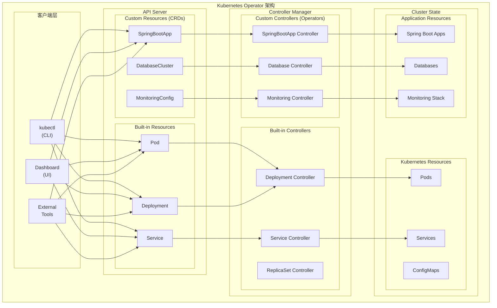

**Operator 的定义和作用：**

- Operator 是一个应用程序特定的控制器，它扩展了 Kubernetes API 来创建、配置和管理复杂有状态应用程序的实例
- 它将运维人员的领域知识编码到软件中，实现应用程序的自动化管理
- Operator 可以处理应用程序的整个生命周期，包括安装、升级、备份、故障恢复等

#### 2.1.2 Operator Pattern 核心原理

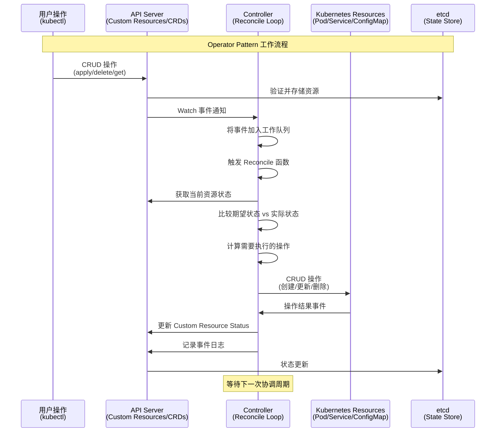

**控制循环详细流程：**

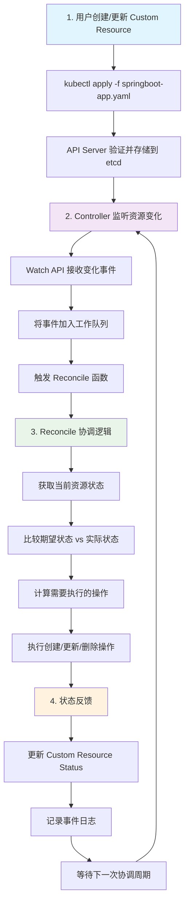

**Operator Pattern 的核心思想：**

- **声明式 API**：用户声明期望的状态，Operator 负责实现这个状态
- **控制循环**：持续监控实际状态与期望状态的差异，并采取行动消除差异
- **领域知识封装**：将特定应用程序的运维知识封装在代码中
- **事件驱动**：基于 Kubernetes 事件机制，响应资源变化
- **最终一致性**：通过持续协调确保系统最终达到期望状态

**Controller 和 Custom Resource 的关系：**

- Custom Resource (CR)：定义应用程序的期望状态
- Controller：监控 CR 的变化，并执行相应的操作来达到期望状态
- 两者结合形成了完整的 Operator 模式

### 2.2 Operator 的组成部分

#### 2.2.1 Operator 组件架构图

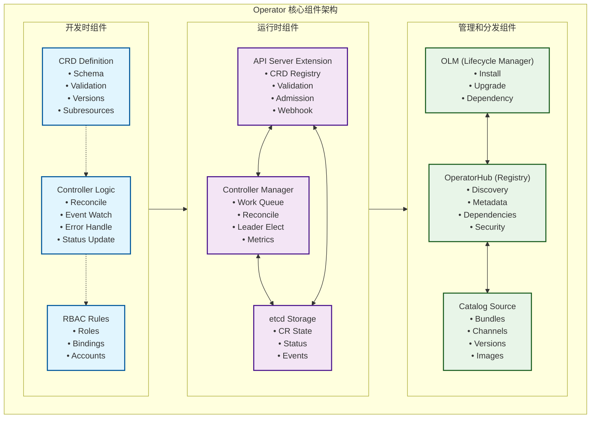

#### 2.2.2 组件详细说明

**Custom Resource Definition (CRD)：**

- **定义新的 Kubernetes 资源类型**：扩展 Kubernetes API，使其能够理解应用程序特定的概念
- **Schema 定义**：使用 OpenAPI v3 规范定义资源结构
- **验证规则**：内置字段验证、格式检查、枚举值限制
- **版本管理**：支持多版本 API，提供版本转换机制
- **子资源支持**：Status 子资源、Scale 子资源等

```yaml
# CRD 示例结构
apiVersion: apiextensions.k8s.io/v1
kind: CustomResourceDefinition
metadata:
  name: springbootapps.springboot.tutorial.example.com
spec:
  group: springboot.tutorial.example.com
  versions:
  - name: v1
    served: true
    storage: true
    schema:
      openAPIV3Schema:
        type: object
        properties:
          spec:
            type: object
            properties:
              image:
                type: string
                pattern: '^[a-zA-Z0-9._/-]+:[a-zA-Z0-9._-]+$'
              replicas:
                type: integer
                minimum: 1
                maximum: 100
```

**Custom Controller：**

- **业务逻辑核心**：实现特定应用的管理逻辑
- **事件监听**：Watch API 监听资源变化事件
- **协调循环**：Reconcile 函数实现期望状态与实际状态的协调
- **错误处理**：重试机制、指数退避、错误分类
- **状态管理**：更新 Custom Resource 的 Status 字段
- **指标暴露**：Prometheus 指标，监控 Controller 性能

**Operator Lifecycle Manager (OLM)：**

- **安装管理**：自动化 Operator 的安装和配置
- **升级策略**：支持自动升级、手动升级、回滚
- **依赖解析**：处理 Operator 之间的依赖关系
- **权限管理**：自动创建和管理 RBAC 规则
- **版本兼容性**：确保 API 版本兼容性
- **安全策略**：镜像签名验证、安全扫描

### 2.3 Operator 的优势

**自动化运维：**

- 减少手动操作，降低人为错误
- 实现 24/7 自动化监控和响应
- 提高运维效率和可靠性

**领域特定知识的封装：**

- 将专家知识编码到软件中
- 标准化最佳实践
- 降低运维门槛

**声明式配置管理：**

- 用户只需声明期望状态
- 系统自动处理实现细节
- 提供一致的用户体验

## 3. Spring Boot 应用特点分析

### 3.1 Spring Boot 应用的典型架构

Spring Boot 是构建企业级 Java 应用程序的流行框架，具有以下特点：

#### 3.1.1 Spring Boot 微服务架构图

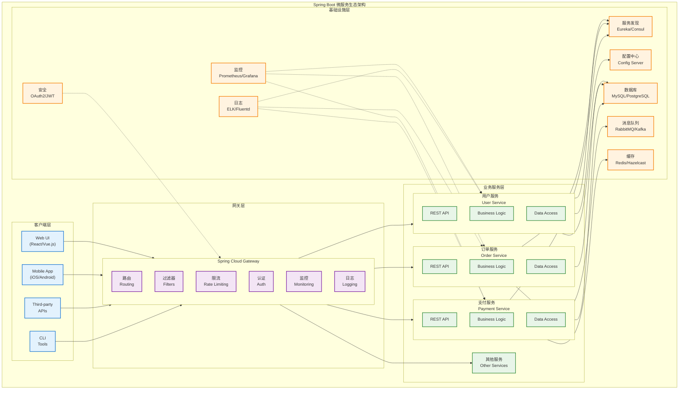

**微服务架构特点：**

- **独立部署**：Spring Boot 天然支持微服务架构模式，每个服务都是独立的、可部署的单元
- **服务通信**：服务间通过 REST API、gRPC 或消息队列进行通信
- **服务发现**：支持服务注册与发现（如 Eureka、Consul、Kubernetes Service Discovery）
- **数据隔离**：每个微服务拥有独立的数据存储
- **技术栈自由**：不同服务可以使用不同的技术栈和数据库

**配置管理（application.properties/yml）：**

```yaml
# application.yml 示例
server:
  port: 8080
  servlet:
    context-path: /api

spring:
  datasource:
    url: jdbc:mysql://localhost:3306/demo
    username: ${DB_USERNAME:root}
    password: ${DB_PASSWORD:password}
  jpa:
    hibernate:
      ddl-auto: update
    show-sql: true

logging:
  level:
    com.example: DEBUG
  pattern:
    console: "%d{yyyy-MM-dd HH:mm:ss} - %msg%n"

management:
  endpoints:
    web:
      exposure:
        include: health,info,metrics,prometheus
  endpoint:
    health:
      show-details: always
```

**健康检查端点：**

- Spring Boot Actuator 提供了丰富的监控端点
- `/actuator/health` - 应用健康状态
- `/actuator/info` - 应用信息
- `/actuator/metrics` - 应用指标
- 支持自定义健康检查指标

**监控和指标收集：**

- 集成 Micrometer 指标库
- 支持 Prometheus、Grafana 等监控系统
- 提供 JVM 指标、HTTP 请求指标、数据库连接池指标等
- 支持分布式链路追踪（如 Zipkin、Jaeger）

### 3.2 Spring Boot 在 Kubernetes 中的部署挑战

#### 3.2.1 Spring Boot 应用部署流程图

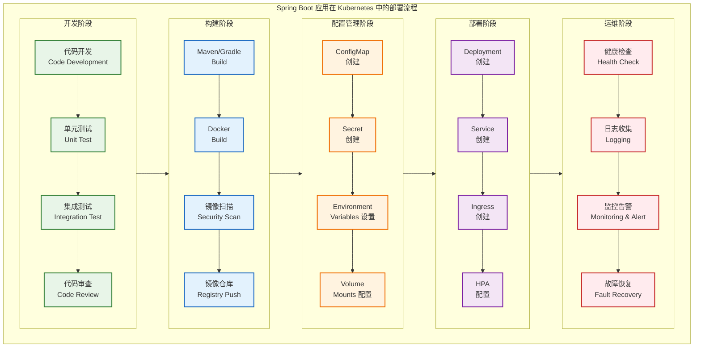

#### 3.2.2 主要部署挑战分析

**1. 配置文件管理挑战：**

- **多环境配置**：不同环境（开发、测试、生产）需要不同的配置，传统方式难以管理
- **敏感信息安全**：敏感信息（数据库密码、API 密钥）需要安全存储，避免明文暴露
- **配置热更新**：配置变更需要重启应用或支持热更新，影响服务可用性
- **配置版本管理**：配置文件版本管理和回滚机制复杂
- **配置一致性**：多实例部署时确保配置同步和一致性

**2. 服务发现挑战：**

- **服务注册发现**：微服务间需要相互发现和通信，传统注册中心与K8s机制冲突
- **动态实例管理**：服务实例的动态注册和注销，处理Pod重启和扩缩容
- **负载均衡策略**：负载均衡和故障转移机制需要与K8s Service集成
- **网络策略**：跨命名空间、跨集群的服务通信复杂性
- 跨命名空间的服务访问

**数据库连接管理：**

- 数据库连接池配置优化
- 数据库密码和连接信息的安全管理
- 数据库迁移和版本管理
- 多数据源配置和事务管理

**日志收集：**

- 容器化环境下的日志收集策略
- 结构化日志格式
- 日志聚合和分析
- 日志轮转和存储管理

**滚动更新策略：**

- 零停机部署
- 蓝绿部署和金丝雀发布
- 健康检查和就绪探针配置
- 回滚策略和版本管理

### 3.3 为什么需要 Spring Boot Operator

#### 3.3.1 传统部署 vs Operator 部署对比

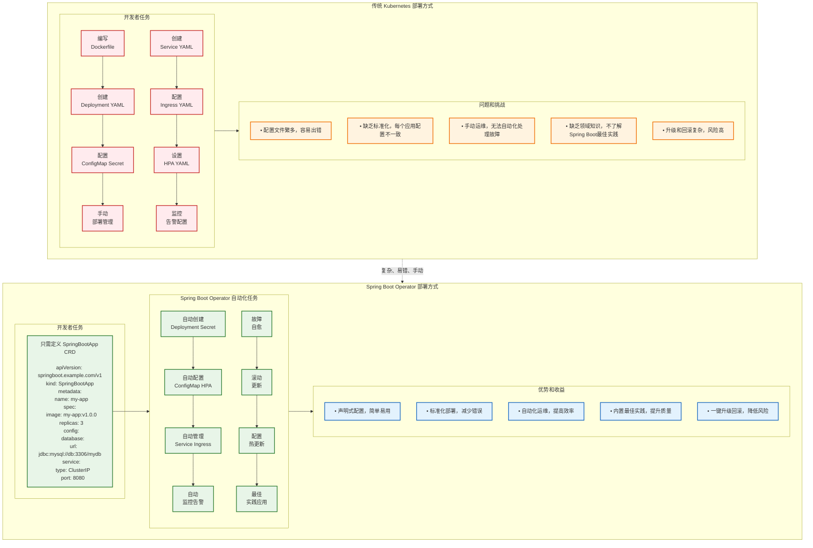

#### 3.3.2 Spring Boot Operator 的核心价值

**1. 简化部署流程：**

- **声明式配置**：将复杂的部署步骤封装成简单的声明式配置，开发者只需关注业务逻辑
- **依赖管理**：自动处理依赖关系和部署顺序，确保服务按正确顺序启动
- **一键操作**：提供一键部署和升级能力，支持批量操作和环境迁移
- **错误预防**：减少部署错误和不一致性，通过验证机制确保配置正确性

**2. 标准化配置管理：**

- **最佳实践模板**：提供 Spring Boot 应用的最佳实践配置模板，包含性能优化和安全配置
- **统一规范**：统一配置格式和命名规范，提高团队协作效率
- **自动生成**：自动生成 ConfigMap 和 Secret，支持多环境配置管理
- **版本控制**：支持配置的版本管理和回滚，确保配置变更可追溯

**3. 自动化运维任务：**

- **智能扩缩容**：基于应用指标（CPU、内存、QPS）自动扩缩容，优化资源利用率
- **故障自愈**：自动故障检测和恢复，包括健康检查失败重启、依赖服务恢复等
- **数据管理**：自动备份和数据迁移，支持数据库版本升级和迁移
- **监控集成**：自动监控告警配置，集成 Prometheus、Grafana 等监控系统

**4. 提供最佳实践：**

- **部署模式**：内置 Spring Boot 应用的部署最佳实践，包括蓝绿部署、金丝雀发布等
- **健康检查**：自动配置健康检查和就绪探针，确保服务可用性
- **性能优化**：优化资源配置和性能参数，包括 JVM 参数、连接池配置等
- **安全策略**：集成安全策略和网络策略，确保应用安全运行

## 4. 实验驱动的 Spring Boot Operator 开发

本章采用实验驱动的教学方式，通过循序渐进的实验来学习 Spring Boot Operator 的设计和实现。每个实验都包含设计思路、实现步骤和验证方法。

> **📁 完整实验代码**：本章所有实验的完整代码和配置文件已整理在 [`code-examples`](./code-examples/) 目录中，按实验分类组织。每个实验目录包含完整的源代码、配置文件和部署脚本，可直接运行验证。详细的使用说明请参考 [`code-examples/README.md`](./code-examples/README.md)。

### 4.1 实验环境准备

在开始实验之前，我们需要准备开发环境：

#### 4.1.1 环境要求

**必需软件：**

- Go 1.19+
- Docker Desktop
- kubectl
- Kind 或 Minikube（本地 Kubernetes 集群）

**安装步骤：**

1. **安装 Operator SDK**

   ```bash
   # macOS
   brew install operator-sdk
   
   # 或者直接下载
   curl -LO https://github.com/operator-framework/operator-sdk/releases/latest/download/operator-sdk_darwin_amd64
   chmod +x operator-sdk_darwin_amd64
   sudo mv operator-sdk_darwin_amd64 /usr/local/bin/operator-sdk
   ```

2. **安装 Kind**

   ```bash
   go install sigs.k8s.io/kind@v0.20.0
   ```

3. **创建本地集群**

   ```bash
   # 创建集群配置文件
   cat <<EOF > kind-config.yaml
   kind: Cluster
   apiVersion: kind.x-k8s.io/v1alpha4
   nodes:
   - role: control-plane
     kubeadmConfigPatches:
     - |
       kind: InitConfiguration
       nodeRegistration:
         kubeletExtraArgs:
           node-labels: "ingress-ready=true"
     extraPortMappings:
     - containerPort: 80
       hostPort: 80
       protocol: TCP
     - containerPort: 443
       hostPort: 443
       protocol: TCP
   EOF
   
   # 创建集群
   kind create cluster --config=kind-config.yaml --name=operator-lab
   
   # 验证集群
   kubectl cluster-info
   kubectl get nodes
   ```

#### 4.1.2 项目初始化

```bash
# 创建项目目录
mkdir springboot-operator-tutorial
cd springboot-operator-tutorial

# 初始化 Go 模块
go mod init github.com/example/springboot-operator

# 初始化 Operator 项目
operator-sdk init --domain=tutorial.example.com --repo=github.com/example/springboot-operator
```

### 4.2 Operator 功能规划

我们的 Spring Boot Operator 将提供以下核心功能：

**应用部署和更新：**

- 自动创建和管理 Deployment 资源
- 支持滚动更新和回滚
- 镜像版本管理和升级策略
- 副本数量自动调整

**配置管理：**

- 自动生成 ConfigMap 和 Secret
- 支持多环境配置切换
- 配置热更新和应用重启
- 配置模板和变量替换

**健康检查配置：**

- 自动配置 livenessProbe 和 readinessProbe
- 基于 Spring Boot Actuator 的健康检查
- 自定义健康检查端点
- 启动时间和超时配置

**服务暴露：**

- 自动创建 Service 资源
- 支持 ClusterIP、NodePort、LoadBalancer 类型
- Ingress 配置和路由规则
- 服务发现和负载均衡

**数据库连接管理：**

- 数据库连接配置自动化
- 连接池参数优化
- 数据库密码安全管理
- 多数据源支持

**监控配置：**

- Prometheus 指标暴露
- 自定义监控指标
- 告警规则配置
- 日志收集和分析

### 4.3 实验一：基础 Operator 设计与实现

> **📂 实验代码位置**：[`code-examples/experiment-1-basic-operator/`](./code-examples/experiment-1-basic-operator/)

#### 4.3.1 设计目标

在第一个实验中，我们将设计并实现一个最基础的 Spring Boot Operator，它能够：

- 定义 SpringBootApp 自定义资源
- 根据 SpringBootApp 创建对应的 Deployment
- 管理应用的基本生命周期

#### 4.3.2 API 设计思路

**设计原则：**

1. **简单性**：从最基本的功能开始
2. **可扩展性**：为后续功能预留扩展空间
3. **声明式**：用户只需声明期望状态

**API 结构设计：**

核心 API 结构包括 `SpringBootAppSpec`（期望状态）和 `SpringBootAppStatus`（当前状态）两部分：

> **📁 API 定义代码**：详细的 API 定义请查看 [`springbootapp_types.go`](code-examples/experiment-1-basic-operator/springbootapp_types.go)

#### 4.3.3 实验步骤

**步骤 1：创建 API：**

```bash
# 创建 SpringBootApp API
operator-sdk create api --group=springboot --version=v1 --kind=SpringBootApp --resource --controller
```

**步骤 2：定义 API 结构：**

编辑 `api/v1/springbootapp_types.go`，定义核心数据结构：

> **📁 API 结构定义**：包含所有 kubebuilder 注解和完整结构定义的代码请查看 [`springbootapp_types.go`](code-examples/experiment-1-basic-operator/springbootapp_types.go)

**步骤 3：实现基础 Controller：**

编辑 `controllers/springbootapp_controller.go`，实现核心协调逻辑：

**核心功能包括：**

- `reconcileDeployment()` - 管理应用部署
- `reconcileService()` - 管理服务暴露
- `updateStatus()` - 更新资源状态

> **📁 Controller 实现代码**：包含完整实现细节的 Controller 代码请查看 [`springbootapp_controller.go`](code-examples/experiment-1-basic-operator/springbootapp_controller.go)

**步骤 4：生成 CRD 和部署文件：**

```bash
# 生成 CRD
make manifests

# 生成代码
make generate

# 构建并推送镜像（可选，用于生产环境）
make docker-build docker-push IMG=<your-registry>/springboot-operator:tag
```

**步骤 5：部署到集群：**

```bash
# 安装 CRD
make install

# 运行 Controller（开发模式）
make run
```

#### 4.3.4 测试验证

**创建测试应用：**

> **📁 测试应用配置**：查看完整的测试应用 YAML 配置 [`springboot_v1_springbootapp.yaml`](code-examples/experiment-1-basic-operator/config/samples/springboot_v1_springbootapp.yaml)

**部署测试：**

```bash
# 应用测试资源
kubectl apply -f config/samples/springboot_v1_springbootapp.yaml

# 查看创建的资源
kubectl get springbootapp
kubectl get deployment
kubectl get service
kubectl get pods

# 查看应用状态
kubectl describe springbootapp demo-app
```

**验收标准：**

1. ✅ SpringBootApp 资源创建成功
2. ✅ 自动创建对应的 Deployment 和 Service
3. ✅ Pod 正常启动并处于 Running 状态
4. ✅ SpringBootApp 状态正确反映实际情况
5. ✅ 修改 replicas 能触发 Deployment 更新

### 4.4 实验二：配置管理功能

> **📂 实验代码位置**：[`code-examples/experiment-2-config-management/`](./code-examples/experiment-2-config-management/)

#### 4.4.1 设计目标

在第二个实验中，我们将为 Operator 添加配置管理功能：

- 支持通过 ConfigMap 管理应用配置
- 支持环境变量注入
- 配置变更时自动重启应用

#### 4.4.2 实验二架构设计图

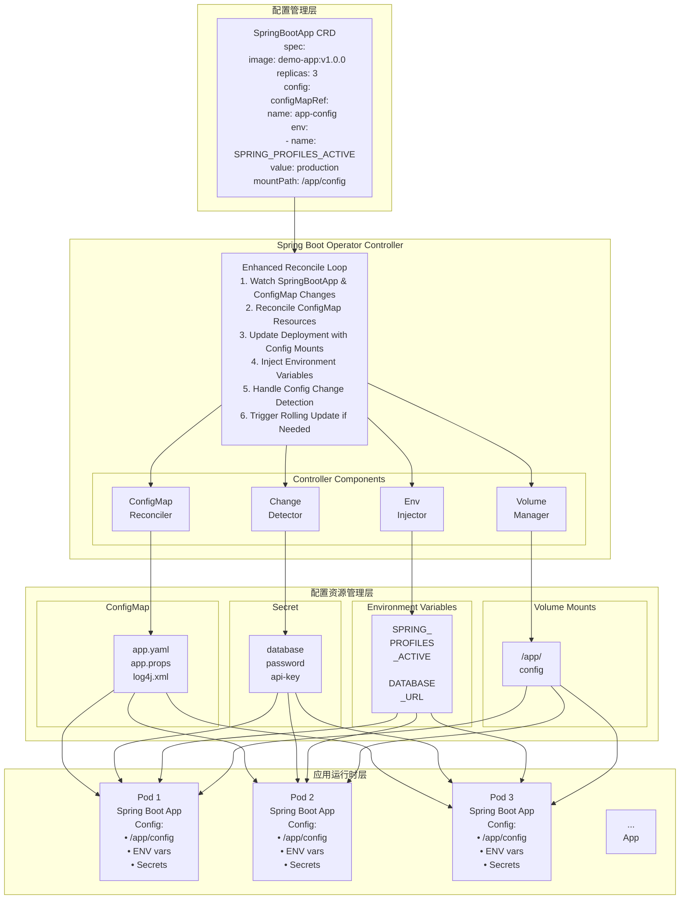

#### 4.4.3 配置变更检测流程图

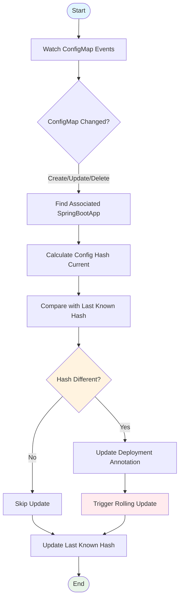

#### 4.4.4 API 扩展设计

**扩展 SpringBootAppSpec：**

> **📁 API 扩展定义**：查看完整的配置管理 API 扩展定义 [`springbootapp_types_extended.go`](code-examples/experiment-2-config-management/api/v1/springbootapp_types_extended.go)

#### 4.4.5 实验步骤

**步骤 1：更新 API 定义：**

修改 `api/v1/springbootapp_types.go`，添加配置管理相关字段：

> **📁 完整 API 定义**：查看包含配置管理字段的完整 API 定义 [`springbootapp_types.go`](code-examples/experiment-2-config-management/api/v1/springbootapp_types.go)

**步骤 2：更新 Controller 实现：**

修改 `controllers/springbootapp_controller.go`，增加配置管理功能：

**主要增强功能：**

- 环境变量动态注入
- ConfigMap 文件挂载
- Spring Boot 配置路径自动设置
- 配置变更检测和热更新

> **📁 配置管理 Controller**：查看包含配置管理功能的完整 Controller 实现 [springbootapp_controller.go](code-examples/experiment-2-config-management/controllers/springbootapp_controller.go)

**步骤 3：添加 ConfigMap 监听：**

更新 Controller 的 `SetupWithManager` 方法以监听 ConfigMap 变化，实现配置热更新：

**配置热更新机制：**

- 监听 ConfigMap 变化事件
- 自动触发相关应用的重新部署
- 支持配置的动态更新

> **📁 ConfigMap 监听实现**：查看包含 ConfigMap 监听和热更新功能的完整实现 [springbootapp_controller.go](code-examples/experiment-2-config-management/controllers/springbootapp_controller.go)

#### 4.4.6 测试验证

**步骤 1：创建配置文件：**

> **📁 配置文件示例**：查看 ConfigMap 配置示例 [`config-demo.yaml`](code-examples/experiment-2-config-management/config/config-demo.yaml)

**步骤 2：创建带配置的应用：**

> **📁 应用配置示例**：查看带配置管理的 SpringBootApp 示例 [`springboot-app-with-config.yaml`](code-examples/experiment-2-config-management/config/springboot-app-with-config.yaml)

**步骤 3：部署和测试：**

```bash
# 重新生成和部署 CRD
make manifests && make install

# 部署配置和应用
kubectl apply -f config-demo.yaml
kubectl apply -f springboot-app-with-config.yaml

# 验证部署状态
kubectl get springbootapp demo-app-with-config
kubectl get pods -l app=demo-app-with-config

# 验证配置挂载
kubectl exec <pod-name> -- cat /app/config/application.yml
```

**步骤 4：测试配置热更新：**

```bash
# 更新 ConfigMap 触发重启
kubectl patch configmap demo-config --patch='{
  "data": {
    "application.yml": "server:\n  port: 8080\nspring:\n  application:\n    name: demo-app-updated"
  }
}'

# 观察应用重启和验证新配置
kubectl get pods -l app=demo-app-with-config -w
```

**验收标准：**

1. ✅ SpringBootApp 支持 ConfigMap 配置引用
2. ✅ 配置文件正确挂载到指定路径
3. ✅ 环境变量正确注入到容器
4. ✅ ConfigMap 变更触发应用重启
5. ✅ 可选配置（optional: true）正常工作

### 4.5 实验三：服务暴露和 Ingress

> **📂 实验代码位置**：[`code-examples/experiment-3-service-ingress/`](./code-examples/experiment-3-service-ingress/)

#### 4.5.1 设计目标

在第三个实验中，我们将添加服务暴露功能：

- 支持多种 Service 类型（ClusterIP、NodePort、LoadBalancer）
- 支持 Ingress 配置
- 支持自定义域名和路径

#### 4.5.2 实验三架构设计图

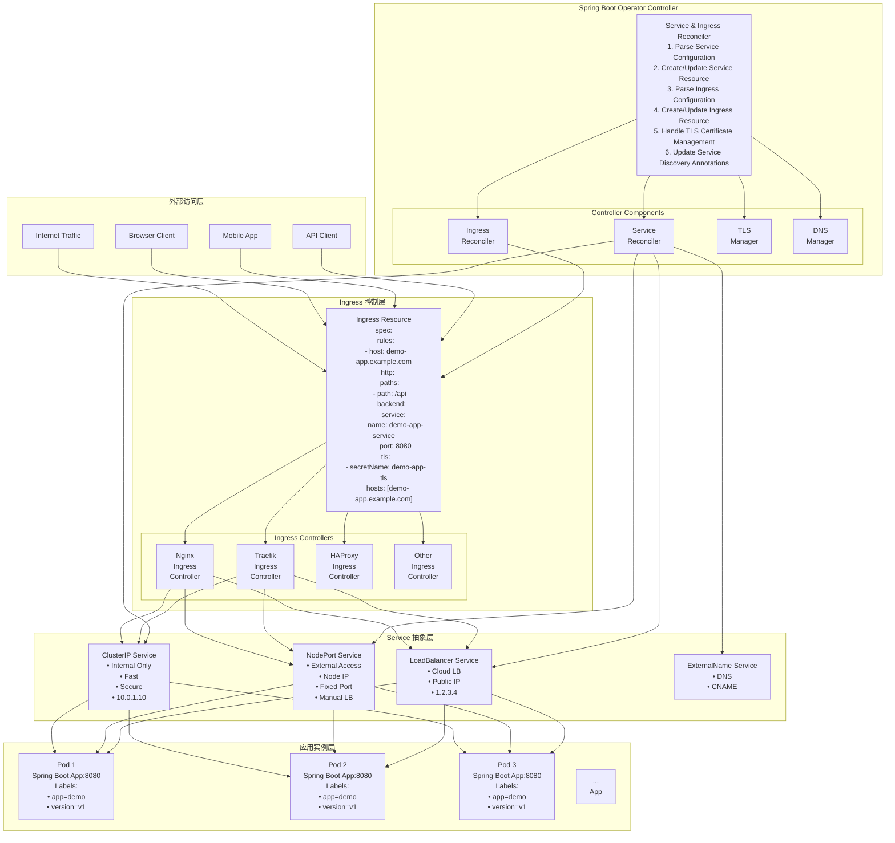

#### 4.5.3 服务类型选择流程图

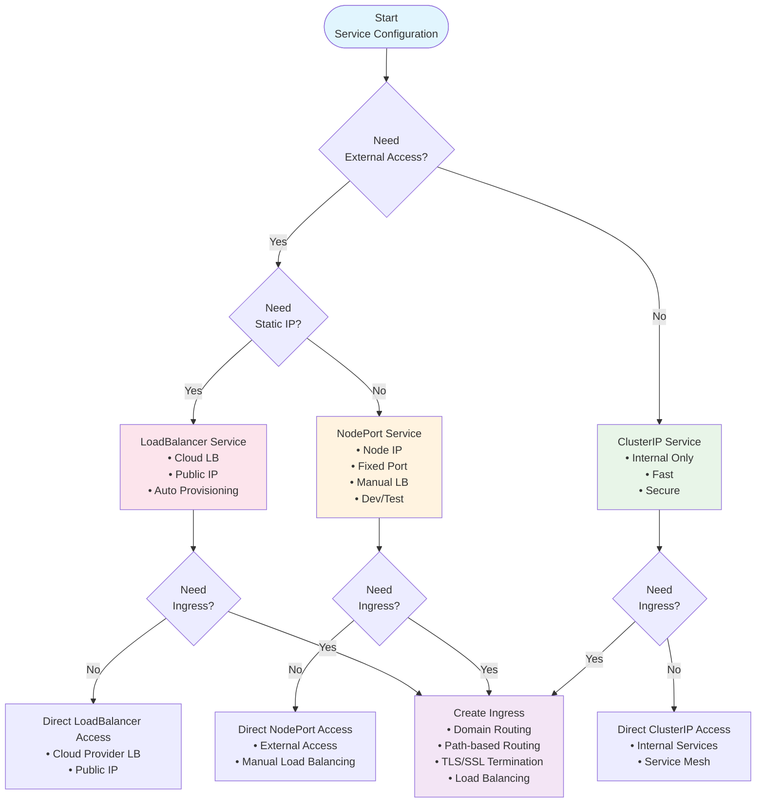

#### 4.5.4 API 扩展设计

**扩展 SpringBootAppSpec：**

**核心设计思路：**

- 支持多种 Service 类型（ClusterIP、NodePort、LoadBalancer）
- 灵活的 Ingress 配置，支持自定义域名和路径
- TLS 证书管理和自动化配置

> **📁 服务暴露 API 定义**：查看包含 Service 和 Ingress 配置的完整 API 定义 [springbootapp_types.go](code-examples/experiment-3-service-ingress/api/v1/springbootapp_types.go)

#### 4.5.5 实验步骤

**步骤 1：更新 API 定义：**

在 `api/v1/springbootapp_types.go` 中添加服务暴露相关字段，支持多种 Service 类型和 Ingress 配置。

**步骤 2：更新 Controller 实现：**

修改 `controllers/springbootapp_controller.go`，添加 Service 和 Ingress 管理功能：

**主要功能增强：**

- 支持多种 Service 类型（ClusterIP、NodePort、LoadBalancer）
- Ingress 资源的创建和管理
- TLS 配置和注解支持
- 动态端口和路径配置

> **📁 服务暴露 Controller**：查看包含 Service 和 Ingress 管理功能的完整 Controller 实现 [springbootapp_controller.go](code-examples/experiment-3-service-ingress/controllers/springbootapp_controller.go)

#### 4.5.6 测试验证

**步骤 1：创建 NodePort 服务测试：**

> **📁 NodePort 服务示例**：查看 NodePort 服务配置示例 [`springboot-app-nodeport.yaml`](code-examples/experiment-3-service-ingress/config/springboot-app-nodeport.yaml)

**步骤 2：创建 Ingress 测试：**

> **📁 Ingress 配置示例**：查看带 Ingress 配置的 SpringBootApp 示例 [springboot-app-ingress.yaml](code-examples/experiment-3-service-ingress/config/springboot-app-ingress.yaml)

**步骤 3：部署和测试：**

```bash
# 重新生成和部署 CRD
make manifests && make install

# 测试 NodePort 服务
kubectl apply -f springboot-app-nodeport.yaml
kubectl get service demo-app-nodeport
kubectl port-forward service/demo-app-nodeport 8080:8080

# 测试 Ingress（需要先安装 Nginx Ingress Controller）
kubectl apply -f springboot-app-ingress.yaml
kubectl get ingress demo-app-ingress

# 配置本地域名解析并测试
echo "127.0.0.1 demo-app.local" | sudo tee -a /etc/hosts
curl -H "Host: demo-app.local" http://localhost/api/
```

**验收标准：**

1. ✅ 支持不同类型的 Service（ClusterIP、NodePort、LoadBalancer）
2. ✅ 支持自定义端口配置
3. ✅ Ingress 资源正确创建和配置
4. ✅ 支持自定义域名和路径
5. ✅ 支持 TLS 配置
6. ✅ 支持 Ingress 注解

### 4.6 综合实验：完整的微服务应用

> **📂 实验代码位置**：[`code-examples/experiment-4-microservices/`](./code-examples/experiment-4-microservices/)

#### 4.6.1 实验目标

通过一个综合实验，部署一个完整的微服务应用，包括：

- 用户服务（User Service）
- 订单服务（Order Service）
- 网关服务（Gateway Service）
- 配置管理
- 服务发现
- 监控和日志

#### 4.6.2 实验架构

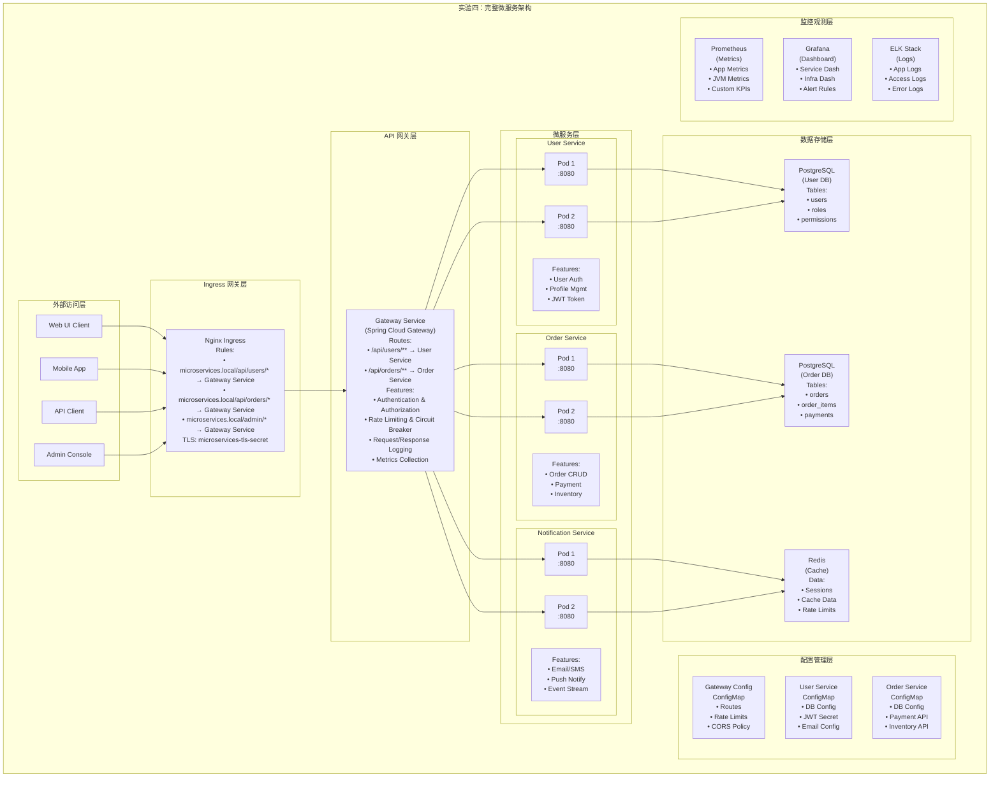

#### 4.6.3 微服务通信流程图

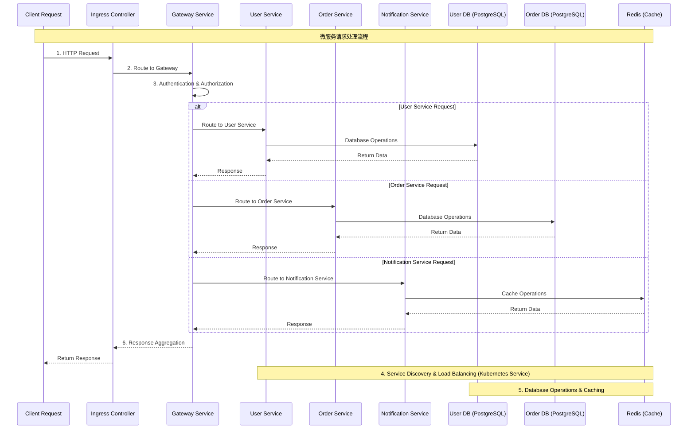

#### 4.6.4 实验步骤

**步骤 1：创建命名空间和配置：**

> **📁 微服务命名空间和配置**：查看微服务架构的命名空间和配置示例 [microservices-namespace.yaml](code-examples/experiment-4-microservices/config/microservices-namespace.yaml)

**步骤 2：部署微服务应用：**

> **📁 微服务应用部署**：查看完整的微服务应用部署配置 [microservices-apps.yaml](code-examples/experiment-4-microservices/config/microservices-apps.yaml)

**步骤 3：部署和测试：**

```bash
# 创建命名空间和配置
kubectl apply -f microservices-namespace.yaml

# 部署微服务应用
kubectl apply -f microservices-apps.yaml

# 查看部署状态
kubectl get springbootapp -n microservices
kubectl get pods -n microservices
kubectl get ingress -n microservices

# 测试网关访问
echo "127.0.0.1 api.microservices.local" | sudo tee -a /etc/hosts
curl -H "Host: api.microservices.local" http://localhost/api/users/health
```

## 5. 总结

通过这些实验，我们完成了一个功能完整的 Spring Boot Operator 的开发和测试：

> **🎯 完整代码**：所有实验的代码和配置文件都在 [`code-examples`](./code-examples/) 目录中。

### 5.1 学习路径总览

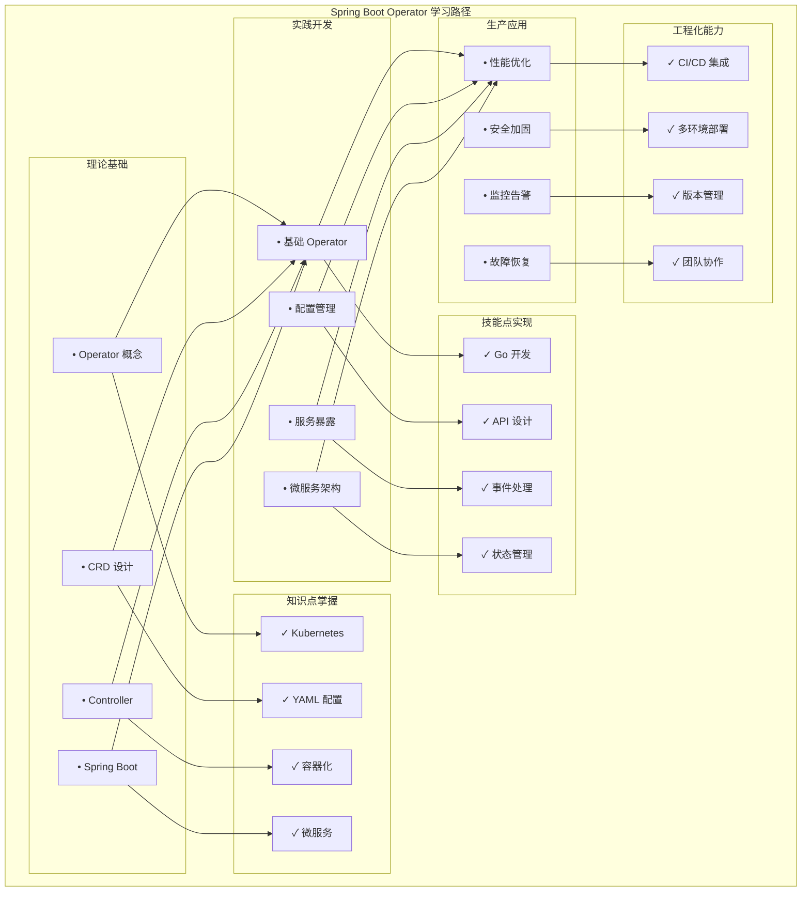

### 5.2 技术栈总览

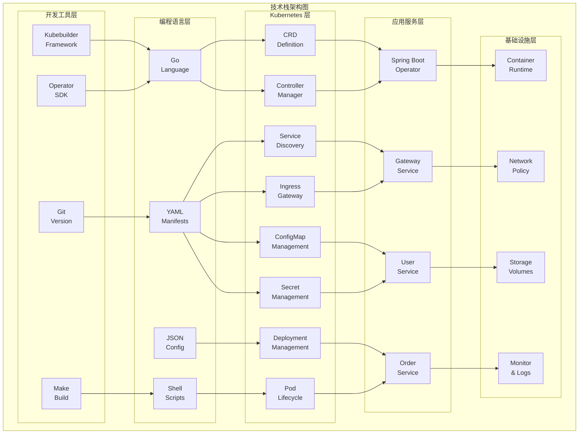

### 5.3 核心收获

#### 理论知识

- **Operator 模式**：理解了 Kubernetes Operator 的设计理念和工作原理
- **CRD 设计**：掌握了自定义资源定义的最佳实践
- **Controller 模式**：学会了事件驱动的控制器开发
- **微服务架构**：了解了云原生微服务的部署和管理

#### 实践技能

- **Go 语言开发**：使用 Kubebuilder 框架进行 Operator 开发
- **Kubernetes API**：熟练使用 client-go 操作 Kubernetes 资源
- **配置管理**：实现了 ConfigMap 和 Secret 的自动化管理
- **服务暴露**：掌握了 Service 和 Ingress 的配置和管理

#### 工程能力

- **项目结构**：学会了标准的 Operator 项目组织方式
- **测试验证**：掌握了 Operator 的测试和验证方法
- **部署运维**：了解了 Operator 的部署和生产环境运维
- **问题排查**：具备了 Kubernetes 环境下的问题诊断能力

### 5.4 扩展方向

#### 功能增强

- **自动扩缩容**：基于 HPA/VPA 实现应用的自动伸缩
- **蓝绿部署**：支持零停机的应用更新策略
- **金丝雀发布**：实现渐进式的应用发布流程
- **多环境管理**：支持开发、测试、生产环境的差异化配置

#### 运维集成

- **监控告警**：集成 Prometheus 和 Grafana 实现全面监控
- **日志聚合**：使用 ELK Stack 进行日志收集和分析
- **链路追踪**：集成 Jaeger 或 Zipkin 实现分布式追踪
- **安全加固**：实现 RBAC、网络策略和安全扫描

#### 生态集成

- **服务网格**：与 Istio 或 Linkerd 集成实现高级流量管理
- **GitOps**：与 ArgoCD 或 Flux 集成实现声明式部署
- **多集群**：支持跨集群的应用部署和管理
- **云原生**：与云厂商的托管 Kubernetes 服务深度集成

### 5.5 最佳实践总结

#### 开发阶段

1. **API 设计优先**：先设计好 CRD 结构，再实现 Controller 逻辑
2. **渐进式开发**：从简单功能开始，逐步增加复杂特性
3. **充分测试**：编写单元测试和集成测试确保代码质量
4. **文档完善**：维护清晰的 API 文档和使用说明

#### 部署阶段

1. **资源限制**：合理设置 CPU 和内存限制
2. **权限最小化**：只授予必要的 RBAC 权限
3. **健康检查**：配置适当的存活性和就绪性探针
4. **监控覆盖**：确保关键指标都有监控覆盖

#### 运维阶段

1. **版本管理**：使用语义化版本管理 Operator 发布
2. **升级策略**：制定清晰的升级和回滚策略
3. **故障恢复**：建立完善的故障处理和恢复机制
4. **性能优化**：持续监控和优化 Operator 性能

---
