# Kubernetes 调度器介绍

> **版本说明**：本文档基于 Kubernetes v1.27+ 版本编写，使用稳定的 `kubescheduler.config.k8s.io/v1` API。所有配置示例和代码均已针对该版本进行优化。

## 目录

- [Kubernetes 调度器介绍](#kubernetes-调度器介绍)
  - [目录](#目录)
  - [0. 快速开始](#0-快速开始)
    - [0.1 5分钟了解调度器](#01-5分钟了解调度器)
    - [0.2 常用调度配置示例](#02-常用调度配置示例)
      - [0.2.1 基础资源调度](#021-基础资源调度)
      - [0.2.2 节点选择配置](#022-节点选择配置)
      - [0.2.3 高可用部署配置](#023-高可用部署配置)
      - [0.2.4 生产级调度器配置](#024-生产级调度器配置)
    - [0.3 调度问题快速诊断](#03-调度问题快速诊断)
      - [0.3.1 基础诊断命令](#031-基础诊断命令)
      - [0.3.2 常见问题快速检查表](#032-常见问题快速检查表)
      - [0.3.3 调度失败事件解读](#033-调度失败事件解读)
  - [1. Kubernetes 调度器概述](#1-kubernetes-调度器概述)
    - [1.1 调度器在 Kubernetes 架构中的位置和作用](#11-调度器在-kubernetes-架构中的位置和作用)
    - [1.2 调度器的基本工作流程](#12-调度器的基本工作流程)
    - [1.3 默认调度器的设计原理](#13-默认调度器的设计原理)
    - [1.4 调度理论基础](#14-调度理论基础)
      - [1.4.1 调度问题的数学建模](#141-调度问题的数学建模)
      - [1.4.2 多目标优化理论](#142-多目标优化理论)
      - [1.4.3 调度算法的计算复杂度](#143-调度算法的计算复杂度)
      - [1.4.4 调度器性能优化](#144-调度器性能优化)
  - [2. 调度过程详解](#2-调度过程详解)
    - [2.1 调度流水线：过滤(Filtering)和评分(Scoring)](#21-调度流水线过滤filtering和评分scoring)
      - [2.1.1 过滤阶段（Filtering Phase）](#211-过滤阶段filtering-phase)
      - [2.1.2 评分阶段（Scoring Phase）](#212-评分阶段scoring-phase)
    - [2.2 常见的过滤策略](#22-常见的过滤策略)
      - [2.2.1 NodeResourcesFit](#221-noderesourcesfit)
      - [2.2.2 NodeAffinity](#222-nodeaffinity)
      - [2.2.3 PodTopologySpread](#223-podtopologyspread)
      - [2.2.4 TaintToleration](#224-tainttoleration)
    - [2.3 常见的评分策略](#23-常见的评分策略)
      - [2.3.1 NodeResourcesFit](#231-noderesourcesfit)
      - [2.3.2 NodeAffinity](#232-nodeaffinity)
      - [2.3.3 InterPodAffinity](#233-interpodaffinity)
    - [2.4 节点亲和性与反亲和性](#24-节点亲和性与反亲和性)
      - [2.4.1 节点亲和性（Node Affinity）](#241-节点亲和性node-affinity)
    - [2.5 Pod 亲和性与反亲和性](#25-pod-亲和性与反亲和性)
      - [2.5.1 Pod 亲和性（Pod Affinity）](#251-pod-亲和性pod-affinity)
      - [2.5.2 Pod 反亲和性（Pod Anti-Affinity）](#252-pod-反亲和性pod-anti-affinity)
    - [2.6 污点(Taints)和容忍(Tolerations)](#26-污点taints和容忍tolerations)
      - [2.6.1 污点（Taints）](#261-污点taints)
      - [2.6.2 容忍（Tolerations）](#262-容忍tolerations)
  - [3. 调度器配置与自定义](#3-调度器配置与自定义)
    - [3.1 调度配置文件介绍](#31-调度配置文件介绍)
      - [3.1.1 基本配置结构](#311-基本配置结构)
      - [3.1.2 常用配置选项](#312-常用配置选项)
    - [3.2 调度插件框架](#32-调度插件框架)
      - [3.2.1 插件扩展点详解](#321-插件扩展点详解)
      - [3.2.2 自定义插件开发](#322-自定义插件开发)
    - [3.3 多调度器部署](#33-多调度器部署)
      - [3.3.1 部署额外调度器](#331-部署额外调度器)
      - [3.3.2 指定调度器](#332-指定调度器)
      - [3.3.3 调度器选择策略](#333-调度器选择策略)
  - [4. 调度决策审计与监控](#4-调度决策审计与监控)
    - [4.1 调度决策审计机制](#41-调度决策审计机制)
      - [4.1.1 审计日志配置](#411-审计日志配置)
      - [4.1.2 调度事件追踪](#412-调度事件追踪)
      - [4.1.3 调度指标监控](#413-调度指标监控)
    - [4.2 高级故障排查](#42-高级故障排查)
      - [4.2.1 调度器性能分析](#421-调度器性能分析)
      - [4.2.2 调度失败深度分析](#422-调度失败深度分析)
      - [4.2.3 调度器日志分析](#423-调度器日志分析)
  - [5. 总结](#5-总结)
    - [5.1 调度器核心概念回顾](#51-调度器核心概念回顾)
    - [5.2 调度理论要点](#52-调度理论要点)
    - [5.3 实践指导原则](#53-实践指导原则)
  - [6. 术语表](#6-术语表)
    - [A](#a)
    - [B](#b)
    - [C](#c)
    - [E](#e)
    - [F](#f)
    - [L](#l)
    - [N](#n)
    - [P](#p)
    - [Q](#q)
    - [R](#r)
    - [S](#s)
    - [T](#t)
    - [W](#w)

---

## 0. 快速开始

### 0.1 5分钟了解调度器

> **快速概览**：如果你是第一次接触 Kubernetes 调度器，这个章节将帮你快速建立基本概念。

**调度器是什么？**

Kubernetes 调度器就像一个智能的"房屋中介"，负责为每个新的 Pod（租客）找到最合适的 Node（房屋）。

```mermaid
flowchart LR
    A["新 Pod 创建"] --> B["调度器分析"]
    B --> C["选择最佳节点"]
    C --> D["Pod 运行"]
    
    B1["检查资源需求"]
    B2["评估节点状态"]
    B3["应用调度策略"]
    
    B --> B1
    B --> B2
    B --> B3
```



**核心工作原理：**

1. **监听**：调度器持续监听 API Server 中未分配节点的 Pod
2. **过滤**：筛选出满足 Pod 基本要求的节点（如资源充足、满足约束条件）
3. **评分**：对候选节点进行打分，选择最优节点
4. **绑定**：将 Pod 分配到选定的节点上

**关键概念速览：**

| 概念 | 说明 | 类比 |
|------|------|------|
| **过滤（Filtering）** | 排除不合适的节点 | 筛选符合条件的房屋 |
| **评分（Scoring）** | 为候选节点打分排序 | 根据偏好给房屋评分 |
| **亲和性（Affinity）** | Pod 对节点的偏好 | 租客对房屋位置的偏好 |
| **污点（Taint）** | 节点拒绝某些 Pod | 房屋限制某些租客类型 |
| **容忍（Toleration）** | Pod 容忍节点限制 | 租客接受房屋的某些限制 |

### 0.2 常用调度配置示例

> **实用配置**：以下是生产环境中最常用的调度配置模式。

#### 0.2.1 基础资源调度

```yaml
# 基础 Pod 资源请求
apiVersion: v1
kind: Pod
metadata:
  name: web-app
spec:
  containers:
  - name: nginx
    image: nginx:1.20
    resources:
      requests:        # 最小资源需求
        cpu: "100m"    # 0.1 CPU 核心
        memory: "128Mi" # 128MB 内存
      limits:          # 最大资源限制
        cpu: "500m"    # 0.5 CPU 核心
        memory: "512Mi" # 512MB 内存
```

#### 0.2.2 节点选择配置

```yaml
# 指定节点类型
apiVersion: v1
kind: Pod
metadata:
  name: gpu-workload
spec:
  nodeSelector:
    node-type: gpu    # 只调度到有 GPU 的节点
  containers:
  - name: ml-training
    image: tensorflow/tensorflow:latest-gpu
```

#### 0.2.3 高可用部署配置

```yaml
# Pod 反亲和性确保分散部署
apiVersion: apps/v1
kind: Deployment
metadata:
  name: web-server
spec:
  replicas: 3
  selector:
    matchLabels:
      app: web-server
  template:
    metadata:
      labels:
        app: web-server
    spec:
      affinity:
        podAntiAffinity:
          requiredDuringSchedulingIgnoredDuringExecution:
          - labelSelector:
              matchExpressions:
              - key: app
                operator: In
                values:
                - web-server
            topologyKey: kubernetes.io/hostname  # 确保不在同一节点
      containers:
      - name: nginx
        image: nginx:1.20
```

#### 0.2.4 生产级调度器配置

```yaml
# 完整的调度器配置示例
apiVersion: kubescheduler.config.k8s.io/v1
kind: KubeSchedulerConfiguration
profiles:
- schedulerName: production-scheduler
  plugins:
    filter:
      enabled:
      - name: NodeResourcesFit
      - name: NodeAffinity
      - name: PodTopologySpread
      - name: TaintToleration
    score:
      enabled:
      - name: NodeResourcesFit
        weight: 1
      - name: NodeAffinity
        weight: 2
      - name: InterPodAffinity
        weight: 1
  pluginConfig:
  - name: NodeResourcesFit
    args:
      scoringStrategy:
        type: LeastAllocated  # 优先选择资源使用率低的节点
        resources:
        - name: cpu
          weight: 1
        - name: memory
          weight: 1
  - name: PodTopologySpread
    args:
      defaultConstraints:
      - maxSkew: 1
        topologyKey: topology.kubernetes.io/zone
        whenUnsatisfiable: DoNotSchedule
```

### 0.3 调度问题快速诊断

> 🔍 **故障排查**：当 Pod 无法正常调度时，使用这些命令快速定位问题。

#### 0.3.1 基础诊断命令

```bash
# 1. 查看 Pod 状态和事件
kubectl describe pod <pod-name>

# 2. 查看节点资源使用情况
kubectl top nodes

# 3. 查看节点详细信息
kubectl describe node <node-name>

# 4. 查看调度器日志
kubectl logs -n kube-system -l component=kube-scheduler
```

#### 0.3.2 常见问题快速检查表

| 问题现象 | 可能原因 | 检查命令 | 解决方案 |
|----------|----------|----------|----------|
| Pod 一直 Pending | 资源不足 | `kubectl top nodes` | 增加节点或减少资源请求 |
| Pod 一直 Pending | 节点选择器不匹配 | `kubectl get nodes --show-labels` | 检查节点标签和选择器 |
| Pod 一直 Pending | 污点无法容忍 | `kubectl describe node <node>` | 添加容忍或移除污点 |
| 调度缓慢 | 调度器性能问题 | `kubectl logs kube-scheduler` | 检查调度器配置和资源 |

#### 0.3.3 调度失败事件解读

```bash
# 查看 Pod 事件
kubectl describe pod my-pod

# 常见错误信息及含义：
```

**常见错误信息：**

- `Insufficient cpu`：节点 CPU 资源不足
- `Insufficient memory`：节点内存资源不足
- `node(s) didn't match node selector`：没有节点匹配选择器
- `node(s) had taint that the pod didn't tolerate`：节点有污点但 Pod 无法容忍
- `pod has unbound immediate PersistentVolumeClaims`：存储卷无法绑定

> **注意**：在生产环境中修改调度器配置前，建议先在测试环境验证。
> **提示**：使用 `kubectl get events --sort-by=.metadata.creationTimestamp` 可以按时间顺序查看集群事件。

---

## 1. Kubernetes 调度器概述

### 1.1 调度器在 Kubernetes 架构中的位置和作用

Kubernetes 调度器（kube-scheduler）是 Kubernetes 控制平面的核心组件之一，负责为新创建的 Pod 选择合适的节点进行部署。调度器在整个 Kubernetes 架构中扮演着至关重要的角色：

- **位置**：调度器作为独立的控制平面组件运行，通常部署在 Master 节点上
- **作用**：监听 API Server 中未调度的 Pod，根据调度策略为其选择最优的节点
- **交互**：与 API Server、kubelet 等组件协作完成 Pod 的生命周期管理

```mermaid
graph TB
    subgraph "Control Plane"
        API["API Server"]
        SCHED["kube-scheduler"]
        CM["Controller Manager"]
        ETCD["etcd"]
    end
    
    subgraph "Worker Nodes"
        N1["Node 1<br/>kubelet"]
        N2["Node 2<br/>kubelet"]
        N3["Node 3<br/>kubelet"]
    end
    
    USER["用户/应用"] --> API
    API --> SCHED
    SCHED --> API
    API --> N1
    API --> N2
    API --> N3
    
    SCHED -."监听未调度Pod".-> API
    SCHED -."写入调度决策".-> API
```



### 1.2 调度器的基本工作流程

调度器的工作流程可以分为以下几个关键步骤：

```mermaid
flowchart TD
    A["监听 Pod 事件"] --> B["获取集群状态"]
    B --> C["执行调度算法"]
    C --> D["绑定决策"]
    
    A1["Watch API 监听<br/>spec.nodeName 为空的 Pod"]
    B1["获取节点信息<br/>收集资源使用情况<br/>获取 Pod 分布"]
    C1["预选阶段：筛选节点<br/>优选阶段：节点打分"]
    D1["写入 API Server<br/>更新 Pod.spec.nodeName"]
    
    A --- A1
    B --- B1
    C --- C1
    D --- D1
```



1. **监听 Pod 事件**
   - 调度器通过 Watch API 监听 API Server 中 `spec.nodeName` 为空的 Pod
   - 这些 Pod 被认为是待调度的 Pod

2. **获取集群状态**
   - 获取所有可用节点的信息
   - 收集节点的资源使用情况、标签、污点等信息
   - 获取已调度 Pod 的分布情况

3. **执行调度算法**
   - 预选阶段：筛选出满足 Pod 基本要求的节点
   - 优选阶段：对预选节点进行打分，选择最优节点

4. **绑定决策**
   - 将调度决策写入 API Server
   - 更新 Pod 的 `spec.nodeName` 字段

### 1.3 默认调度器的设计原理

默认调度器基于以下核心设计原理：

```mermaid
graph LR
    subgraph "调度器设计原理"
        A["插件化架构"]
        B["两阶段调度"]
        C["资源感知"]
    end
    
    A --> A1["支持扩展和自定义"]
    A --> A2["插件接口"]
    A --> A3["启用/禁用插件"]
    
    B --> B1["预选（Filtering）"]
    B --> B2["优选（Scoring）"]
    
    C --> C1["CPU、内存、存储"]
    C --> C2["扩展资源（GPU、FPGA）"]
    C --> C3["资源合理分配"]
```



**插件化架构：**

- 调度器采用插件化设计，支持扩展和自定义
- 每个调度阶段都有对应的插件接口
- 支持启用/禁用特定插件

**两阶段调度：**

- **过滤（Filtering）**：过滤不满足条件的节点
- **评分（Scoring）**：对候选节点进行评分排序

**资源感知：**

- 考虑 CPU、内存、存储等资源需求
- 支持扩展资源类型（如 GPU、FPGA）
- 实现资源的合理分配和利用

### 1.4 调度理论基础

#### 1.4.1 调度问题的数学建模

调度问题本质上是一个**约束优化问题**，可以用数学模型表示：

**目标函数：**

```text
minimize: f(x) = Σ(wi × scorei(x))
其中：
- x 表示调度决策向量
- wi 表示第i个评分插件的权重
- scorei(x) 表示第i个插件的评分函数
```

**约束条件：**

- **资源约束**：Pod 资源需求 ≤ 节点可用资源
- **亲和性约束**：满足节点和 Pod 亲和性规则
- **反亲和性约束**：满足 Pod 分散部署要求
- **污点容忍约束**：Pod 必须容忍节点污点

#### 1.4.2 多目标优化理论

调度器需要同时优化多个相互冲突的目标：

```mermaid
graph TB
    subgraph "调度优化目标"
        A["资源利用率最大化"]
        B["负载均衡"]
        C["服务质量保证"]
        D["调度延迟最小化"]
    end
    
    A -."冲突".-> B
    B -."冲突".-> C
    C -."冲突".-> D
    D -."冲突".-> A
```



**帕累托最优解：**

- 调度决策通常无法同时达到所有目标的最优值
- 需要在不同目标间进行权衡
- 通过加权评分实现多目标优化

#### 1.4.3 调度算法的计算复杂度

**时间复杂度分析：**

- **过滤阶段**：O(N × F)，其中 N 是节点数，F 是过滤插件数
- **评分阶段**：O(M × S)，其中 M 是候选节点数（M ≤ N），S 是评分插件数
- **总体复杂度**：O(N × F + M × S)
- **最坏情况**：当所有节点都通过过滤时，M = N，复杂度为 O(N × (F + S))
- **最佳情况**：当大部分节点被过滤时，M << N，复杂度接近 O(N × F)

**空间复杂度：**

- **节点信息缓存**：O(N × K)，其中 K 是每个节点的平均信息量
- **Pod 调度状态**：O(P × L)，其中 P 是待调度 Pod 数，L 是调度状态信息量
- **插件状态缓存**：O(N × F + N × S)，存储插件执行的中间结果

**性能瓶颈分析：**

- **API Server 交互**：频繁的节点信息查询
- **插件执行开销**：复杂的过滤和评分逻辑
- **内存使用**：大规模集群的节点信息缓存
- **调度延迟**：串行处理多个 Pod 的调度请求

#### 1.4.4 调度器性能优化

**缓存机制：**

```go
// 节点信息缓存示例
type NodeInfoCache struct {
    nodes map[string]*NodeInfo
    mutex sync.RWMutex
    
    // 增量更新机制
    generation int64
    lastUpdate time.Time
}

// 缓存更新策略
func (c *NodeInfoCache) UpdateNode(node *v1.Node) {
    c.mutex.Lock()
    defer c.mutex.Unlock()
    
    // 只更新变化的字段
    if existing, ok := c.nodes[node.Name]; ok {
        if existing.Generation == node.Generation {
            return // 无需更新
        }
    }
    
    c.nodes[node.Name] = NewNodeInfo(node)
    c.generation++
    c.lastUpdate = time.Now()
}
```

**并发优化：**

- **过滤插件并行执行**：利用 goroutine 并行运行多个过滤插件
- **评分插件批量处理**：批量计算多个节点的评分
- **调度队列优化**：使用优先级队列管理待调度 Pod
- **快照机制**：创建集群状态快照，保证调度决策的一致性

**内存优化：**

```yaml
# 调度器资源配置优化
apiVersion: v1
kind: Pod
metadata:
  name: kube-scheduler
spec:
  containers:
  - name: kube-scheduler
    image: registry.k8s.io/kube-scheduler:v1.27.0
    resources:
      requests:
        cpu: "100m"
        memory: "256Mi"
      limits:
        cpu: "2000m"     # 根据集群规模调整
        memory: "2Gi"     # 大规模集群需要更多内存
    env:
    - name: GOMAXPROCS
      value: "4"          # 限制 Go 运行时使用的 CPU 核心数
```

**调度延迟优化：**

- **早期终止策略**：一旦发现不满足条件的节点立即排除
- **预计算优化**：预先计算常用的评分信息
- **增量调度**：只重新计算发生变化的节点
- **调度器分片**：使用多个调度器实例处理不同类型的工作负载

---

## 2. 调度过程详解

### 2.1 调度流水线：过滤(Filtering)和评分(Scoring)

调度流水线是调度器的核心执行逻辑，分为两个主要阶段。

> **术语说明**：在 Kubernetes 早期版本中，这两个阶段被称为 Predicates（预选）和 Priorities（优选）。从 v1.19 开始，官方统一使用 Filtering（过滤）和 Scoring（评分）术语。当前文档基于 Kubernetes v1.27+ 版本，使用稳定的 v1 API。

```mermaid
flowchart LR
    subgraph "调度流水线"
        A["所有节点"] --> B["过滤阶段<br/>(Filtering)"]
        B --> C["候选节点集合"]
        C --> D["评分阶段<br/>(Scoring)"]
        D --> E["最优节点"]
    end
    
    subgraph "过滤插件"
        B1["NodeResourcesFit"]
        B2["NodeAffinity"]
        B3["TaintToleration"]
        B4["PodTopologySpread"]
    end
    
    subgraph "评分插件"
        D1["NodeResourcesFit"]
        D2["NodeAffinity"]
        D3["InterPodAffinity"]
    end
    
    B -.-> B1
    B -.-> B2
    B -.-> B3
    B -.-> B4
    
    D -.-> D1
    D -.-> D2
    D -.-> D3
```



#### 2.1.1 过滤阶段（Filtering Phase）

过滤阶段的目标是筛选出能够运行 Pod 的节点集合：

- 并行执行多个过滤插件
- 任何一个插件返回失败，该节点被排除
- 如果没有节点通过过滤，Pod 将保持 Pending 状态

**过滤原理：**

- 基于硬约束条件进行节点筛选
- 采用"快速失败"策略提高效率
- 支持插件并行执行以减少调度延迟

#### 2.1.2 评分阶段（Scoring Phase）

评分阶段对过滤通过的节点进行评分：

- 每个评分插件为节点打分（0-100分）
- 计算加权总分
- 选择得分最高的节点

**评分原理：**

- 基于软约束条件进行节点优化选择
- 通过多维度评分实现负载均衡
- 支持自定义权重调整调度偏好

### 2.2 常见的过滤策略

#### 2.2.1 NodeResourcesFit

检查节点是否有足够的资源满足 Pod 的需求：

- CPU 请求量检查
- 内存请求量检查
- 存储请求量检查
- 扩展资源检查

#### 2.2.2 NodeAffinity

根据节点亲和性规则过滤节点：

```yaml
spec:
  affinity:
    nodeAffinity:
      requiredDuringSchedulingIgnoredDuringExecution:
        nodeSelectorTerms:
        - matchExpressions:
          - key: kubernetes.io/arch
            operator: In
            values:
            - amd64
```

#### 2.2.3 PodTopologySpread

确保 Pod 在拓扑域中的均匀分布：

- 可用区分布
- 节点分布
- 自定义拓扑域

#### 2.2.4 TaintToleration

检查 Pod 是否能容忍节点的污点：

```yaml
spec:
  tolerations:
  - key: "node-type"
    operator: "Equal"
    value: "gpu"
    effect: "NoSchedule"
```

### 2.3 常见的评分策略

#### 2.3.1 NodeResourcesFit

基于资源利用率进行评分，支持多种评分算法：

- **LeastAllocated**：优先选择资源使用率低的节点
  - 评分公式：`score = (capacity - allocated) / capacity × 100`
  - 适用于负载均衡场景
- **MostAllocated**：优先选择资源使用率高的节点
  - 评分公式：`score = allocated / capacity × 100`
  - 适用于资源整合场景
- **RequestedToCapacityRatio**：基于请求量与容量比例评分
  - 支持自定义评分曲线
  - 可针对不同资源类型设置不同权重

**资源评分理论：**

- 通过数学函数将资源使用情况映射为评分
- 支持多维资源的加权计算
- 考虑资源碎片化对调度效率的影响

#### 2.3.2 NodeAffinity

根据节点亲和性偏好进行评分：

```yaml
spec:
  affinity:
    nodeAffinity:
      preferredDuringSchedulingIgnoredDuringExecution:
      - weight: 80
        preference:
          matchExpressions:
          - key: node-type
            operator: In
            values:
            - ssd
```

**评分机制：**

- 满足偏好条件的节点获得对应权重的评分
- 支持多个偏好条件的组合评分
- 权重范围：1-100

#### 2.3.3 InterPodAffinity

基于 Pod 间亲和性进行评分：

- **Pod 反亲和性**：同一应用的 Pod 倾向于分散部署
  - 提高服务可用性
  - 避免单点故障
- **Pod 亲和性**：相关应用的 Pod 倾向于就近部署
  - 减少网络延迟
  - 提高数据传输效率

**调度公平性原理：**

- 通过拓扑域分散确保工作负载均匀分布
- 考虑现有 Pod 分布对新 Pod 调度的影响
- 平衡性能优化与高可用性需求

### 2.4 节点亲和性与反亲和性

```mermaid
graph TB
    subgraph "节点亲和性"
        A["Node Affinity"]
        A --> A1["硬亲和性<br/>(Required)"]
        A --> A2["软亲和性<br/>(Preferred)"]
    end
    
    subgraph "Pod 亲和性"
        B["Pod Affinity"]
        B --> B1["Pod 亲和性<br/>(就近部署)"]
        B --> B2["Pod 反亲和性<br/>(分散部署)"]
    end
    
    A1 --> A1_DESC["必须满足条件<br/>否则不调度"]
    A2 --> A2_DESC["优先满足条件<br/>但不强制"]
    
    B1 --> B1_DESC["相关 Pod 调度到<br/>相近位置"]
    B2 --> B2_DESC["避免 Pod 调度到<br/>同一位置"]
```



#### 2.4.1 节点亲和性（Node Affinity）

节点亲和性允许 Pod 指定对节点的偏好：

**硬亲和性（Required）：**

```yaml
spec:
  affinity:
    nodeAffinity:
      requiredDuringSchedulingIgnoredDuringExecution:
        nodeSelectorTerms:
        - matchExpressions:
          - key: disktype
            operator: In
            values:
            - ssd
```

**软亲和性（Preferred）：**

```yaml
spec:
  affinity:
    nodeAffinity:
      preferredDuringSchedulingIgnoredDuringExecution:
      - weight: 100
        preference:
          matchExpressions:
          - key: zone
            operator: In
            values:
            - us-west-1a
```

### 2.5 Pod 亲和性与反亲和性

#### 2.5.1 Pod 亲和性（Pod Affinity）

使相关的 Pod 调度到相近的位置：

```yaml
spec:
  affinity:
    podAffinity:
      requiredDuringSchedulingIgnoredDuringExecution:
      - labelSelector:
          matchExpressions:
          - key: app
            operator: In
            values:
            - database
        topologyKey: kubernetes.io/hostname
```

#### 2.5.2 Pod 反亲和性（Pod Anti-Affinity）

使 Pod 分散部署，避免单点故障：

```yaml
spec:
  affinity:
    podAntiAffinity:
      requiredDuringSchedulingIgnoredDuringExecution:
      - labelSelector:
          matchExpressions:
          - key: app
            operator: In
            values:
            - web-server
        topologyKey: kubernetes.io/hostname
```

### 2.6 污点(Taints)和容忍(Tolerations)

污点和容忍机制实现了**节点选择性调度**，是 Kubernetes 中重要的调度约束机制。

```mermaid
graph LR
    subgraph "污点和容忍机制"
        A["节点污点<br/>(Taints)"] --> B["阻止 Pod 调度"]
        C["Pod 容忍<br/>(Tolerations)"] --> D["允许调度到<br/>有污点的节点"]
    end
    
    subgraph "污点效果"
        E["NoSchedule<br/>不调度新 Pod"]
        F["PreferNoSchedule<br/>尽量不调度"]
        G["NoExecute<br/>驱逐现有 Pod"]
    end
    
    B --> E
    B --> F
    B --> G
```



**设计原理：**

- **默认拒绝策略**：节点默认拒绝所有不能容忍其污点的 Pod
- **精确匹配机制**：Pod 必须明确声明对特定污点的容忍
- **时间控制**：支持基于时间的容忍策略

#### 2.6.1 污点（Taints）

污点用于标记节点，阻止不合适的 Pod 调度到该节点：

```bash
# 添加污点
kubectl taint nodes node1 key1=value1:NoSchedule

# 移除污点
kubectl taint nodes node1 key1=value1:NoSchedule-
```

污点效果类型：

- **NoSchedule**：不调度新 Pod（硬约束）
- **PreferNoSchedule**：尽量不调度新 Pod（软约束）
- **NoExecute**：驱逐现有 Pod（运行时约束）

**污点匹配算法：**

- 污点由 `key=value:effect` 三元组组成
- 支持通配符匹配和精确匹配
- 多个污点采用逻辑 AND 关系

#### 2.6.2 容忍（Tolerations）

Pod 通过容忍来"容忍"节点的污点：

```yaml
spec:
  tolerations:
  - key: "key1"
    operator: "Equal"    # 精确匹配
    value: "value1"
    effect: "NoSchedule"
  - key: "key2"
    operator: "Exists"   # 存在性匹配
    effect: "NoExecute"
    tolerationSeconds: 3600  # 容忍时间
```

**容忍匹配规则：**

- **Equal 操作符**：key、value、effect 必须完全匹配
- **Exists 操作符**：只需 key 和 effect 匹配
- **空 effect**：匹配所有 effect 类型
- **tolerationSeconds**：仅对 NoExecute 效果有效，指定容忍时间

---

## 3. 调度器配置与自定义

### 3.1 调度配置文件介绍

Kubernetes 调度器支持通过配置文件进行自定义配置。配置文件采用 YAML 格式，允许用户：

- 启用/禁用特定插件
- 配置插件参数
- 设置调度器行为

#### 3.1.1 基本配置结构

```yaml
apiVersion: kubescheduler.config.k8s.io/v1
kind: KubeSchedulerConfiguration
profiles:
- schedulerName: default-scheduler
  plugins:
    filter:
      enabled:
      - name: NodeResourcesFit
      - name: NodeAffinity
      disabled:
      - name: VolumeRestrictions
    score:
      enabled:
      - name: NodeResourcesFit
      - name: NodeAffinity
  pluginConfig:
  - name: NodeResourcesFit
    args:
      scoringStrategy:
        type: LeastAllocated
```

#### 3.1.2 常用配置选项

**资源配置：**

```yaml
pluginConfig:
- name: NodeResourcesFit
  args:
    scoringStrategy:
      type: LeastAllocated
      resources:
      - name: cpu
        weight: 1
      - name: memory
        weight: 1
```

**亲和性配置：**

```yaml
pluginConfig:
- name: InterPodAffinity
  args:
    hardPodAffinityWeight: 100
```

### 3.2 调度插件框架

调度器采用**插件化架构**设计，基于**责任链模式**实现可扩展的调度逻辑：

**设计原理：**

- **扩展点机制**：在调度流程的关键节点提供扩展接口
- **插件生命周期管理**：支持插件的动态加载和配置
- **状态传递**：通过 CycleState 在插件间传递调度状态
- **并发安全**：确保多个插件并发执行时的数据一致性

```mermaid
flowchart TD
    A["Pod 调度开始"] --> B["PreFilter"]
    B --> C["Filter"]
    C --> D{"有可用节点?"}
    D -->|否| E["PostFilter"]
    D -->|是| F["PreScore"]
    F --> G["Score"]
    G --> H["Reserve"]
    H --> I["Permit"]
    I --> J{"允许绑定?"}
    J -->|否| K["等待或拒绝"]
    J -->|是| L["PreBind"]
    L --> M["Bind"]
    M --> N["PostBind"]
    N --> O["调度完成"]
    E --> P["调度失败"]
    K --> P
```



#### 3.2.1 插件扩展点详解

调度器提供 **10 个扩展点**，覆盖调度的完整生命周期。每个扩展点都有特定的职责和执行时机：

**1. PreFilter 扩展点：**

- **执行时机**：过滤阶段之前
- **主要职责**：
  - 预计算信息或检查前置条件
  - 提前终止明显不可调度的 Pod
  - 为后续插件准备共享状态
- **性能优化**：支持状态缓存，避免重复计算
- **典型应用**：资源预检查、拓扑约束预处理

**2. Filter 扩展点：**

- **执行时机**：过滤阶段的核心环节
- **主要职责**：
  - 实现硬约束条件检查（必须满足）
  - 决定节点是否适合运行 Pod
  - 返回明确的通过/拒绝结果
- **并发特性**：支持并行执行多个过滤插件
- **失败策略**：任一插件失败则节点被排除
- **典型插件**：NodeResourcesFit、NodeAffinity、TaintToleration

**3. PostFilter 扩展点：**

- **执行时机**：当没有节点通过过滤时
- **主要职责**：
  - 实现抢占逻辑（Preemption）
  - 提供调度失败的补救措施
  - 尝试为 Pod 创建调度机会
- **抢占机制**：可以驱逐低优先级 Pod 为高优先级 Pod 让路
- **典型应用**：DefaultPreemption 插件

**4. PreScore 扩展点：**

- **执行时机**：评分阶段之前
- **主要职责**：
  - 为评分阶段准备数据和状态
  - 预计算评分所需的复杂信息
  - 优化评分阶段的整体性能
- **数据共享**：通过 CycleState 为评分插件提供预计算结果
- **典型应用**：拓扑信息收集、亲和性关系预处理

**5. Score 扩展点：**

- **执行时机**：评分阶段的核心环节
- **主要职责**：
  - 为每个候选节点打分（0-100分）
  - 实现软约束条件（偏好性要求）
  - 支持多维度评分策略
- **评分算法**：支持线性、指数等多种评分函数
- **权重机制**：可配置不同插件的权重
- **典型插件**：NodeResourcesFit、NodeAffinity、InterPodAffinity

**6. Reserve 扩展点：**

- **执行时机**：选定节点后，绑定之前
- **主要职责**：
  - 为 Pod 在节点上预留资源
  - 防止并发调度导致的资源竞争
  - 实现事务性的资源分配
- **状态管理**：维护资源预留状态，支持回滚
- **并发控制**：确保多个调度器的资源分配一致性
- **典型应用**：VolumeBinding、NodeResourcesFit

**7. Permit 扩展点：**

- **执行时机**：资源预留后，绑定之前
- **主要职责**：
  - 实现调度门控逻辑
  - 支持延迟绑定或拒绝绑定
  - 协调批量调度策略
- **控制机制**：可返回 Allow、Deny、Wait 三种状态
- **超时处理**：支持等待超时后的自动处理
- **典型应用**：Coscheduling（协同调度）、资源配额控制

**8. PreBind 扩展点：**

- **执行时机**：绑定操作之前
- **主要职责**：
  - 执行绑定前的必要准备工作
  - 确保节点和资源的就绪状态
  - 处理存储、网络等基础设施配置
- **异步操作**：支持耗时的准备操作
- **错误处理**：失败时可以回滚之前的操作
- **典型应用**：VolumeBinding（存储卷挂载）、网络配置

**9. Bind 扩展点：**

- **执行时机**：实际绑定操作
- **主要职责**：
  - 将 Pod 绑定到选定的节点
  - 更新 API Server 中的 Pod 状态
  - 完成调度决策的最终确认
- **默认实现**：通常由 DefaultBinder 插件处理
- **自定义绑定**：支持实现特殊的绑定逻辑
- **原子操作**：确保绑定操作的原子性

**10. PostBind 扩展点：**

- **执行时机**：绑定操作完成后
- **主要职责**：
  - 执行绑定后的清理和通知工作
  - 更新缓存和统计信息
  - 触发后续的自动化流程
- **异步执行**：不影响调度主流程的性能
- **监控集成**：更新调度相关的监控指标
- **典型应用**：缓存更新、事件记录、监控数据上报

**扩展点执行顺序和状态传递：**

```go
// CycleState 用于在扩展点之间传递状态
type CycleState struct {
    mx      sync.RWMutex
    storage map[StateKey]StateData
    
    // 记录调度过程中的关键信息
    recordedPluginNominations map[string]*NominatedNode
}

// 状态数据接口
type StateData interface {
    Clone() StateData
}

// 插件状态示例
type NodeResourcesFitState struct {
    InsufficientResource []InsufficientResource
}

func (s *NodeResourcesFitState) Clone() StateData {
    return &NodeResourcesFitState{
        InsufficientResource: s.InsufficientResource,
    }
}
```

#### 3.2.2 自定义插件开发

开发自定义插件需要实现相应的接口。以下示例适用于 Kubernetes v1.27+：

**基础接口定义：**

```go
// 适用于 Kubernetes v1.27+
package main

import (
    "context"
    "fmt"
    "time"
    
    v1 "k8s.io/api/core/v1"
    "k8s.io/kubernetes/pkg/scheduler/framework"
)

// 过滤插件接口
type FilterPlugin interface {
    framework.Plugin
    Filter(ctx context.Context, state *framework.CycleState, pod *v1.Pod, nodeInfo *framework.NodeInfo) *framework.Status
}

// 评分插件接口
type ScorePlugin interface {
    framework.Plugin
    Score(ctx context.Context, state *framework.CycleState, pod *v1.Pod, nodeName string) (int64, *framework.Status)
}
```

**自定义插件实现示例：**

```go
// CustomResourcePlugin 自定义资源插件
type CustomResourcePlugin struct {
    handle framework.Handle
}

// Name 返回插件名称
func (pl *CustomResourcePlugin) Name() string {
    return "CustomResourcePlugin"
}

// Filter 实现过滤逻辑
func (pl *CustomResourcePlugin) Filter(ctx context.Context, state *framework.CycleState, pod *v1.Pod, nodeInfo *framework.NodeInfo) *framework.Status {
    // 参数验证
    if nodeInfo == nil {
        return framework.NewStatus(framework.Error, "nodeInfo is nil")
    }
    if nodeInfo.Node() == nil {
        return framework.NewStatus(framework.Error, "node is nil")
    }
    
    // 添加超时控制
    ctx, cancel := context.WithTimeout(ctx, 5*time.Second)
    defer cancel()
    
    // 检查自定义资源
    customResource := nodeInfo.Node().Status.Allocatable["example.com/custom-resource"]
    if customResource.IsZero() {
        return framework.NewStatus(framework.Unschedulable, "insufficient custom resource")
    }
    
    // 检查 Pod 是否需要自定义资源
    for _, container := range pod.Spec.Containers {
        if requested := container.Resources.Requests["example.com/custom-resource"]; !requested.IsZero() {
            if customResource.Cmp(requested) < 0 {
                return framework.NewStatus(framework.Unschedulable, 
                    fmt.Sprintf("insufficient custom resource: requested %v, available %v", 
                        requested, customResource))
            }
        }
    }
    
    return framework.NewStatus(framework.Success, "")
}

// Score 实现评分逻辑
func (pl *CustomResourcePlugin) Score(ctx context.Context, state *framework.CycleState, pod *v1.Pod, nodeName string) (int64, *framework.Status) {
    // 添加超时控制
    ctx, cancel := context.WithTimeout(ctx, 3*time.Second)
    defer cancel()
    
    nodeInfo, err := pl.handle.SnapshotSharedLister().NodeInfos().Get(nodeName)
    if err != nil {
        return 0, framework.NewStatus(framework.Error, fmt.Sprintf("getting node %q from Snapshot: %v", nodeName, err))
    }
    
    // 基于可用资源比例评分
    node := nodeInfo.Node()
    if node == nil {
        return 0, framework.NewStatus(framework.Error, "node not found")
    }
    
    allocatable := node.Status.Allocatable["example.com/custom-resource"]
    if allocatable.IsZero() {
        return 0, framework.NewStatus(framework.Success, "")
    }
    
    // 计算资源利用率并转换为评分 (0-100)
    used := nodeInfo.Requested.ScalarResources["example.com/custom-resource"]
    utilization := float64(used) / float64(allocatable.Value())
    
    // 偏好资源利用率较低的节点
    score := int64((1.0 - utilization) * 100)
    if score < 0 {
        score = 0
    }
    if score > 100 {
        score = 100
    }
    
    return score, framework.NewStatus(framework.Success, "")
}

// 插件工厂函数
func New(obj runtime.Object, h framework.Handle) (framework.Plugin, error) {
    return &CustomResourcePlugin{
        handle: h,
    }, nil
}
```

**插件注册配置：**

```yaml
# 适用于 Kubernetes v1.27+
apiVersion: kubescheduler.config.k8s.io/v1
kind: KubeSchedulerConfiguration
profiles:
- schedulerName: custom-scheduler
  plugins:
    filter:
      enabled:
      - name: CustomResourcePlugin
    score:
      enabled:
      - name: CustomResourcePlugin
        weight: 10
  pluginConfig:
  - name: CustomResourcePlugin
    args:
      # 插件特定配置
      resourceName: "example.com/custom-resource"
      scoringStrategy: "LeastAllocated"
```

### 3.3 多调度器部署

Kubernetes 支持**多调度器并行运行**，实现调度策略的差异化和专业化：

**设计原理：**

- **调度器隔离**：每个调度器独立运行，避免相互干扰
- **资源竞争处理**：通过乐观锁机制处理多调度器的资源竞争
- **负载分担**：不同类型的工作负载使用专门的调度器
- **故障隔离**：单个调度器故障不影响其他调度器


#### 3.3.1 部署额外调度器

```yaml
apiVersion: apps/v1
kind: Deployment
metadata:
  name: custom-scheduler
  namespace: kube-system
spec:
  replicas: 1
  selector:
    matchLabels:
      app: custom-scheduler
  template:
    metadata:
      labels:
        app: custom-scheduler
    spec:
      containers:
      - name: kube-scheduler
        image: registry.k8s.io/kube-scheduler:v1.27.0
        command:
        - kube-scheduler
        - --config=/etc/kubernetes/scheduler-config.yaml
        - --v=2
        resources:
          requests:
            cpu: "100m"
            memory: "256Mi"
          limits:
            cpu: "1000m"
            memory: "1Gi"
        volumeMounts:
        - name: config
          mountPath: /etc/kubernetes
      volumes:
      - name: config
        configMap:
          name: scheduler-config
```

#### 3.3.2 指定调度器

Pod 可以通过 `schedulerName` 字段指定使用的调度器：

```yaml
apiVersion: v1
kind: Pod
metadata:
  name: gpu-pod
spec:
  schedulerName: gpu-scheduler  # 指定自定义调度器
  containers:
  - name: gpu-container
    image: tensorflow/tensorflow:latest-gpu
    resources:
      limits:
        nvidia.com/gpu: 1
```

#### 3.3.3 调度器选择策略

**按工作负载类型分配：**

- **默认调度器**：处理通用工作负载
- **GPU 调度器**：专门处理 GPU 密集型任务
- **批处理调度器**：优化批处理作业的调度
- **实时调度器**：处理对延迟敏感的应用

**调度器负载均衡：**

```yaml
# 使用 leader election 实现调度器高可用
apiVersion: v1
kind: ConfigMap
metadata:
  name: scheduler-config
data:
  config.yaml: |
    apiVersion: kubescheduler.config.k8s.io/v1
    kind: KubeSchedulerConfiguration
    leaderElection:
      leaderElect: true
      resourceName: custom-scheduler
      resourceNamespace: kube-system
    profiles:
    - schedulerName: custom-scheduler
      plugins:
        filter:
          enabled:
          - name: NodeResourcesFit
          - name: NodeAffinity
```

**调度器分类：**

- **默认调度器**：适用于大多数通用场景
  - 平衡性能和资源利用率
  - 支持标准的调度策略
- **专用调度器**：针对特定工作负载优化
  - GPU 调度器：优化 GPU 资源分配
  - 批处理调度器：支持作业队列和优先级
  - 实时调度器：保证延迟敏感应用的调度
- **多租户调度器**：为不同租户提供隔离的调度策略
  - 资源配额隔离
  - 调度策略定制

**多调度器优势：**

- **策略专业化**：不同应用使用最适合的调度策略
- **资源专门化**：特殊资源（如 GPU、FPGA）的专门调度
- **租户隔离**：多租户环境下的调度隔离和安全
- **渐进式升级**：调度器的灰度升级和 A/B 测试
- **故障容错**：单点故障不影响整体调度能力

---

## 4. 调度决策审计与监控

### 4.1 调度决策审计机制

调度决策审计是企业级 Kubernetes 集群的重要组成部分，用于记录、分析和追踪调度器的决策过程。

#### 4.1.1 审计日志配置

**启用调度器审计日志：**

```yaml
# 调度器审计策略配置
apiVersion: audit.k8s.io/v1
kind: Policy
rules:
# 记录所有调度决策
- level: Metadata
  namespaces: ["default", "production"]
  resources:
  - group: ""
    resources: ["pods"]
  verbs: ["create", "update", "patch"]
  omitStages: ["RequestReceived"]
  
# 记录调度器绑定操作
- level: Request
  resources:
  - group: ""
    resources: ["pods/binding"]
  verbs: ["create"]
  
# 记录调度失败事件
- level: RequestResponse
  resources:
  - group: ""
    resources: ["events"]
  verbs: ["create"]
  namespaceSelector:
    matchLabels:
      audit: "scheduler"
```

**调度器部署配置：**

```yaml
apiVersion: apps/v1
kind: Deployment
metadata:
  name: custom-scheduler
  namespace: kube-system
spec:
  replicas: 1
  selector:
    matchLabels:
      app: custom-scheduler
  template:
    metadata:
      labels:
        app: custom-scheduler
    spec:
      containers:
      - name: kube-scheduler
        image: registry.k8s.io/kube-scheduler:v1.27.0
        command:
        - kube-scheduler
        - --config=/etc/kubernetes/scheduler-config.yaml
        - --audit-log-path=/var/log/scheduler-audit.log
        - --audit-log-maxage=30
        - --audit-log-maxbackup=10
        - --audit-log-maxsize=100
        - --audit-policy-file=/etc/kubernetes/audit-policy.yaml
        - --v=2
        volumeMounts:
        - name: config
          mountPath: /etc/kubernetes
        - name: audit-logs
          mountPath: /var/log
        resources:
          requests:
            cpu: "100m"
            memory: "256Mi"
          limits:
            cpu: "2000m"
            memory: "2Gi"
      volumes:
      - name: config
        configMap:
          name: scheduler-config
      - name: audit-logs
        hostPath:
          path: /var/log/scheduler
          type: DirectoryOrCreate
```

#### 4.1.2 调度事件追踪

**调度事件分析脚本：**

```bash
#!/bin/bash
# scheduler-audit-analyzer.sh

# 分析调度成功率
analyze_scheduling_success_rate() {
    local namespace=${1:-"default"}
    local time_range=${2:-"1h"}
    
    echo "=== 调度成功率分析 (最近 $time_range) ==="
    
    # 获取调度事件
    kubectl get events -n $namespace \
        --field-selector reason=Scheduled \
        --sort-by='.lastTimestamp' \
        --output=json | jq -r '
        .items[] | 
        select(.lastTimestamp > (now - 3600)) |
        "\(.lastTimestamp) \(.involvedObject.name) \(.message)"
    '
    
    # 统计调度失败
    kubectl get events -n $namespace \
        --field-selector reason=FailedScheduling \
        --sort-by='.lastTimestamp' \
        --output=json | jq -r '
        .items[] | 
        select(.lastTimestamp > (now - 3600)) |
        "FAILED: \(.lastTimestamp) \(.involvedObject.name) \(.message)"
    '
}

# 分析调度延迟
analyze_scheduling_latency() {
    echo "=== 调度延迟分析 ==="
    
    kubectl get pods --all-namespaces -o json | jq -r '
    .items[] |
    select(.status.conditions[]? | select(.type == "PodScheduled" and .status == "True")) |
    {
        name: .metadata.name,
        namespace: .metadata.namespace,
        created: .metadata.creationTimestamp,
        scheduled: (.status.conditions[] | select(.type == "PodScheduled").lastTransitionTime)
    } |
    "\(.namespace)/\(.name): \(.created) -> \(.scheduled)"
    '
}

# 分析节点资源使用
analyze_node_utilization() {
    echo "=== 节点资源使用分析 ==="
    
    kubectl top nodes --sort-by=cpu
    echo ""
    kubectl top nodes --sort-by=memory
}

# 主函数
main() {
    case "$1" in
        "success-rate")
            analyze_scheduling_success_rate $2 $3
            ;;
        "latency")
            analyze_scheduling_latency
            ;;
        "utilization")
            analyze_node_utilization
            ;;
        "all")
            analyze_scheduling_success_rate
            echo ""
            analyze_scheduling_latency
            echo ""
            analyze_node_utilization
            ;;
        *)
            echo "用法: $0 {success-rate|latency|utilization|all} [namespace] [time-range]"
            echo "示例: $0 success-rate default 2h"
            exit 1
            ;;
    esac
}

main "$@"
```

#### 4.1.3 调度指标监控

**Prometheus 监控配置：**

```yaml
# scheduler-monitoring.yaml
apiVersion: v1
kind: ServiceMonitor
metadata:
  name: scheduler-metrics
  namespace: kube-system
spec:
  selector:
    matchLabels:
      app: custom-scheduler
  endpoints:
  - port: metrics
    interval: 30s
    path: /metrics
---
apiVersion: v1
kind: Service
metadata:
  name: scheduler-metrics
  namespace: kube-system
  labels:
    app: custom-scheduler
spec:
  ports:
  - name: metrics
    port: 10259
    targetPort: 10259
  selector:
    app: custom-scheduler
```

**关键调度指标：**

```promql
# 调度延迟 P99
histogram_quantile(0.99, 
  rate(scheduler_scheduling_duration_seconds_bucket[5m])
)

# 调度成功率
rate(scheduler_pod_scheduling_attempts_total{result="scheduled"}[5m]) /
rate(scheduler_pod_scheduling_attempts_total[5m])

# 待调度 Pod 数量
scheduler_pending_pods

# 调度器队列长度
scheduler_queue_incoming_pods_total

# 节点评分耗时
histogram_quantile(0.95,
  rate(scheduler_framework_extension_point_duration_seconds_bucket{
    extension_point="Score"
  }[5m])
)
```

### 4.2 高级故障排查

#### 4.2.1 调度器性能分析

**使用 pprof 分析调度器性能：**

```bash
#!/bin/bash
# scheduler-profiling.sh

# 获取调度器 Pod 名称
SCHEDULER_POD=$(kubectl get pods -n kube-system -l component=kube-scheduler -o jsonpath='{.items[0].metadata.name}')

echo "调度器 Pod: $SCHEDULER_POD"

# 端口转发
echo "启动端口转发..."
kubectl port-forward -n kube-system pod/$SCHEDULER_POD 10259:10259 &
PORT_FORWARD_PID=$!

# 等待端口转发就绪
sleep 3

# CPU 性能分析
echo "收集 CPU 性能数据 (30秒)..."
curl -s "http://localhost:10259/debug/pprof/profile?seconds=30" > scheduler-cpu.prof

# 内存性能分析
echo "收集内存性能数据..."
curl -s "http://localhost:10259/debug/pprof/heap" > scheduler-heap.prof

# Goroutine 分析
echo "收集 Goroutine 数据..."
curl -s "http://localhost:10259/debug/pprof/goroutine" > scheduler-goroutine.prof

# 停止端口转发
kill $PORT_FORWARD_PID

echo "性能数据收集完成:"
echo "  - CPU: scheduler-cpu.prof"
echo "  - 内存: scheduler-heap.prof"
echo "  - Goroutine: scheduler-goroutine.prof"
echo ""
echo "分析命令:"
echo "  go tool pprof scheduler-cpu.prof"
echo "  go tool pprof scheduler-heap.prof"
echo "  go tool pprof scheduler-goroutine.prof"
```

**性能分析示例：**

```bash
# 分析 CPU 热点
go tool pprof scheduler-cpu.prof
(pprof) top 10
(pprof) list <function_name>
(pprof) web

# 分析内存使用
go tool pprof scheduler-heap.prof
(pprof) top 10 -cum
(pprof) list <function_name>

# 分析 Goroutine 泄漏
go tool pprof scheduler-goroutine.prof
(pprof) top 10
(pprof) traces
```

#### 4.2.2 调度失败深度分析

**调度失败诊断工具：**

```bash
#!/bin/bash
# scheduler-debug.sh

# 诊断特定 Pod 的调度失败
debug_pod_scheduling() {
    local pod_name=$1
    local namespace=${2:-"default"}
    
    echo "=== 诊断 Pod: $namespace/$pod_name ==="
    
    # 1. Pod 基本信息
    echo "1. Pod 状态:"
    kubectl get pod $pod_name -n $namespace -o wide
    echo ""
    
    # 2. Pod 事件
    echo "2. Pod 事件:"
    kubectl describe pod $pod_name -n $namespace | grep -A 20 "Events:"
    echo ""
    
    # 3. 资源需求分析
    echo "3. 资源需求:"
    kubectl get pod $pod_name -n $namespace -o jsonpath='
    CPU 请求: {.spec.containers[*].resources.requests.cpu}
    内存请求: {.spec.containers[*].resources.requests.memory}
    CPU 限制: {.spec.containers[*].resources.limits.cpu}
    内存限制: {.spec.containers[*].resources.limits.memory}
    '
    echo ""
    
    # 4. 节点选择器和亲和性
    echo "4. 调度约束:"
    kubectl get pod $pod_name -n $namespace -o yaml | grep -A 10 -E "(nodeSelector|affinity|tolerations)"
    echo ""
    
    # 5. 可用节点分析
    echo "5. 节点资源状态:"
    kubectl top nodes
    echo ""
    
    # 6. 节点污点检查
    echo "6. 节点污点:"
    kubectl get nodes -o custom-columns=NAME:.metadata.name,TAINTS:.spec.taints
    echo ""
    
    # 7. 存储卷检查
    echo "7. 存储卷状态:"
    kubectl get pv,pvc -n $namespace
    echo ""
}

# 集群调度健康检查
cluster_scheduling_health() {
    echo "=== 集群调度健康检查 ==="
    
    # 1. 调度器状态
    echo "1. 调度器状态:"
    kubectl get pods -n kube-system -l component=kube-scheduler
    echo ""
    
    # 2. 节点状态
    echo "2. 节点状态:"
    kubectl get nodes -o wide
    echo ""
    
    # 3. 待调度 Pod
    echo "3. 待调度 Pod:"
    kubectl get pods --all-namespaces --field-selector=status.phase=Pending
    echo ""
    
    # 4. 资源配额
    echo "4. 资源配额使用:"
    kubectl get resourcequota --all-namespaces
    echo ""
    
    # 5. 最近调度事件
    echo "5. 最近调度事件:"
    kubectl get events --all-namespaces --sort-by='.lastTimestamp' | \
        grep -E "(Scheduled|FailedScheduling)" | tail -10
    echo ""
}

# 调度性能分析
scheduling_performance_analysis() {
    echo "=== 调度性能分析 ==="
    
    # 1. 调度延迟统计
    echo "1. 调度延迟分析:"
    kubectl get events --all-namespaces -o json | jq -r '
    .items[] |
    select(.reason == "Scheduled") |
    select(.firstTimestamp > (now - 3600)) |
    {
        pod: .involvedObject.name,
        namespace: .involvedObject.namespace,
        scheduled_time: .firstTimestamp,
        message: .message
    } |
    "\(.namespace)/\(.pod): \(.scheduled_time)"
    ' | head -20
    echo ""
    
    # 2. 调度器指标
    echo "2. 调度器指标 (如果可用):"
    if kubectl get --raw /metrics 2>/dev/null | grep -q scheduler; then
        kubectl get --raw /metrics | grep -E "scheduler_(scheduling_duration|pending_pods|queue)"
    else
        echo "调度器指标不可用"
    fi
    echo ""
    
    # 3. 节点资源碎片化分析
    echo "3. 节点资源碎片化:"
    kubectl describe nodes | grep -E "(Name:|Allocatable:|Allocated resources)" | \
        awk '/Name:/ {node=$2} /Allocatable:/ {print "节点:", node} /cpu/ {print "  CPU:", $0} /memory/ {print "  内存:", $0}'
    echo ""
}

# 主函数
main() {
    case "$1" in
        "pod")
            if [ -z "$2" ]; then
                echo "用法: $0 pod <pod-name> [namespace]"
                exit 1
            fi
            debug_pod_scheduling $2 $3
            ;;
        "health")
            cluster_scheduling_health
            ;;
        "performance")
            scheduling_performance_analysis
            ;;
        "all")
            cluster_scheduling_health
            echo ""
            scheduling_performance_analysis
            ;;
        *)
            echo "用法: $0 {pod|health|performance|all} [args...]"
            echo "示例:"
            echo "  $0 pod my-pod default    # 诊断特定 Pod"
            echo "  $0 health               # 集群调度健康检查"
            echo "  $0 performance          # 调度性能分析"
            echo "  $0 all                  # 完整诊断"
            exit 1
            ;;
    esac
}

main "$@"
```

#### 4.2.3 调度器日志分析

**日志分析脚本：**

```bash
#!/bin/bash
# scheduler-log-analyzer.sh

# 分析调度器日志中的错误模式
analyze_scheduler_errors() {
    local log_file=${1:-"/var/log/scheduler/scheduler.log"}
    
    echo "=== 调度器错误分析 ==="
    
    # 1. 错误统计
    echo "1. 错误类型统计:"
    grep -E "(ERROR|WARN|Failed)" $log_file | \
        awk '{print $4}' | sort | uniq -c | sort -nr
    echo ""
    
    # 2. 资源不足错误
    echo "2. 资源不足错误:"
    grep "Insufficient" $log_file | tail -10
    echo ""
    
    # 3. 亲和性错误
    echo "3. 亲和性约束错误:"
    grep -E "(affinity|anti-affinity)" $log_file | tail -10
    echo ""
    
    # 4. 污点容忍错误
    echo "4. 污点容忍错误:"
    grep "tolerate" $log_file | tail -10
    echo ""
    
    # 5. 调度延迟警告
    echo "5. 调度延迟警告:"
    grep "scheduling.*took" $log_file | tail -10
    echo ""
}

# 实时监控调度器日志
monitor_scheduler_logs() {
    local scheduler_pod=$(kubectl get pods -n kube-system -l component=kube-scheduler -o jsonpath='{.items[0].metadata.name}')
    
    echo "监控调度器日志: $scheduler_pod"
    echo "按 Ctrl+C 停止监控"
    echo ""
    
    kubectl logs -n kube-system $scheduler_pod -f | \
        grep --line-buffered -E "(ERROR|WARN|Failed|Insufficient|affinity|tolerate)"
}

# 主函数
main() {
    case "$1" in
        "analyze")
            analyze_scheduler_errors $2
            ;;
        "monitor")
            monitor_scheduler_logs
            ;;
        *)
            echo "用法: $0 {analyze|monitor} [log-file]"
            echo "示例:"
            echo "  $0 analyze /var/log/scheduler.log"
            echo "  $0 monitor"
            exit 1
            ;;
    esac
}

main "$@"
```

---

## 5. 总结

### 5.1 调度器核心概念回顾

Kubernetes 调度器是一个复杂的**约束优化系统**，其核心概念包括：

- **两阶段调度**：过滤（Filtering）+ 评分（Scoring）
- **插件化架构**：10 个扩展点覆盖完整调度生命周期
- **多目标优化**：平衡资源利用率、负载均衡、服务质量等目标
- **约束满足**：处理硬约束（过滤）和软约束（评分）

### 5.2 调度理论要点

1. **数学建模**：调度问题本质是约束优化问题
2. **算法复杂度**：时间复杂度 O(N×F + M×S)，需要性能优化
3. **多目标权衡**：通过帕累托最优实现目标平衡
4. **公平性保证**：通过拓扑分散和反亲和性确保负载均衡

### 5.3 实践指导原则

- **理解约束层次**：硬约束（必须满足）vs 软约束（优化目标）
- **合理配置权重**：根据业务需求调整评分插件权重
- **监控调度性能**：关注调度延迟、成功率、资源利用率
- **渐进式优化**：从默认配置开始，逐步优化调度策略
- **审计监控**：实施调度决策的全面审计和监控机制
- **性能分析**：使用 pprof 等工具深度分析调度器性能瓶颈
- **故障诊断**：建立系统化的调度问题排查和分析流程

通过深入理解这些概念和原理，可以更好地设计和优化 Kubernetes 集群的调度策略，提高应用性能和资源利用效率。

---

## 6. 术语表

### A

**Affinity（亲和性）：**

- Pod 对节点或其他 Pod 的偏好性调度规则
- 包括节点亲和性（NodeAffinity）和 Pod 亲和性（PodAffinity）

**Anti-Affinity（反亲和性）：**

- Pod 避免与特定节点或其他 Pod 调度在一起的规则
- 用于实现工作负载的分散部署

### B

**Binding（绑定）：**

- 将 Pod 分配给特定节点的最终操作
- 通过创建 Binding 对象实现

### C

**CycleState（调度周期状态）：**

- 在单次调度周期中传递数据的状态对象
- 用于插件间的数据共享

### E

**Extension Point（扩展点）：**

- 调度框架中允许插件介入的特定阶段
- 包括 PreFilter、Filter、PostFilter、PreScore、Score、Reserve、Permit、PreBind、Bind、PostBind

### F

**Filter（过滤）：**

- 调度过程中筛选可调度节点的阶段
- 排除不满足 Pod 要求的节点

**Framework（调度框架）：**

- Kubernetes 调度器的插件化架构
- 提供扩展点和插件管理机制

### L

**Leader Election（领导者选举）：**

- 多调度器实例中选择活跃调度器的机制
- 确保高可用性和避免冲突

### N

**NodeAffinity（节点亲和性）：**

- Pod 对特定节点特征的偏好规则
- 包括硬性要求（requiredDuringSchedulingIgnoredDuringExecution）和软性偏好（preferredDuringSchedulingIgnoredDuringExecution）

**NodeSelector（节点选择器）：**

- 基于节点标签的简单调度约束
- 硬性要求，Pod 只能调度到匹配标签的节点

### P

**Plugin（插件）：**

- 实现特定调度逻辑的可插拔组件
- 在调度框架的扩展点中执行

**PodAffinity（Pod 亲和性）：**

- Pod 倾向于与特定 Pod 调度在相同位置的规则
- 基于拓扑域（如节点、可用区）定义

**PodAntiAffinity（Pod 反亲和性）：**

- Pod 避免与特定 Pod 调度在相同位置的规则
- 用于实现工作负载的分散部署

**Preemption（抢占）：**

- 高优先级 Pod 驱逐低优先级 Pod 以获得调度机会的机制
- 确保关键工作负载的调度

**Priority（优先级）：**

- Pod 的调度优先级，影响调度顺序和抢占行为
- 通过 PriorityClass 定义

### Q

**QoS（服务质量）：**

- 基于资源请求和限制的 Pod 分类
- 包括 Guaranteed、Burstable、BestEffort 三个等级

**Queue（调度队列）：**

- 等待调度的 Pod 队列
- 包括活跃队列、待处理队列和不可调度队列

### R

**Resource Quota（资源配额）：**

- 命名空间级别的资源使用限制
- 影响 Pod 的调度和资源分配

### S

**Scheduler（调度器）：**

- 负责将 Pod 分配给节点的 Kubernetes 组件
- 默认调度器为 kube-scheduler

**SchedulerName（调度器名称）：**

- Pod 规范中指定使用的调度器
- 支持多调度器场景

**Score（评分）：**

- 调度过程中对候选节点的打分阶段
- 选择得分最高的节点进行调度

### T

**Taint（污点）：**

- 节点上的标记，阻止不容忍的 Pod 调度到该节点
- 包括 NoSchedule、PreferNoSchedule、NoExecute 三种效果

**Toleration（容忍）：**

- Pod 对节点污点的容忍配置
- 允许 Pod 调度到有匹配污点的节点

**Topology Spread Constraints（拓扑分布约束）：**

- 控制 Pod 在拓扑域间分布的约束规则
- 实现工作负载的均匀分布

### W

**Workload（工作负载）：**

- 在 Kubernetes 中运行的应用程序
- 包括 Deployment、StatefulSet、DaemonSet、Job 等

---
