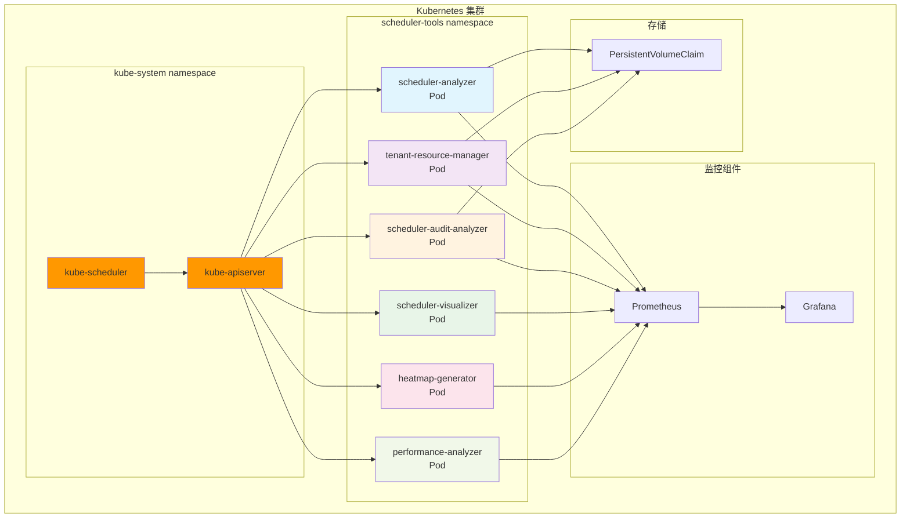
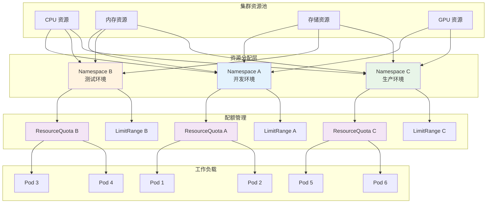
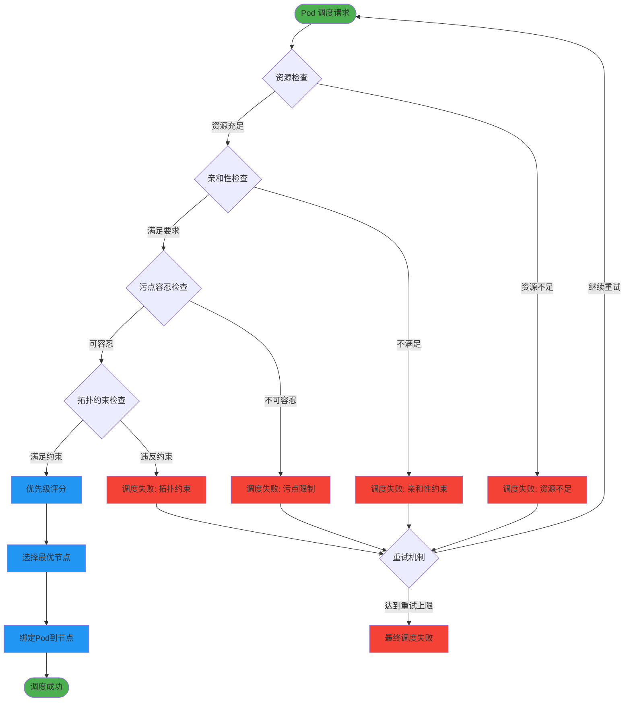
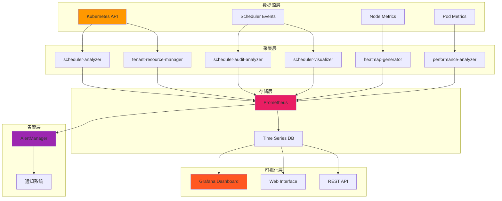
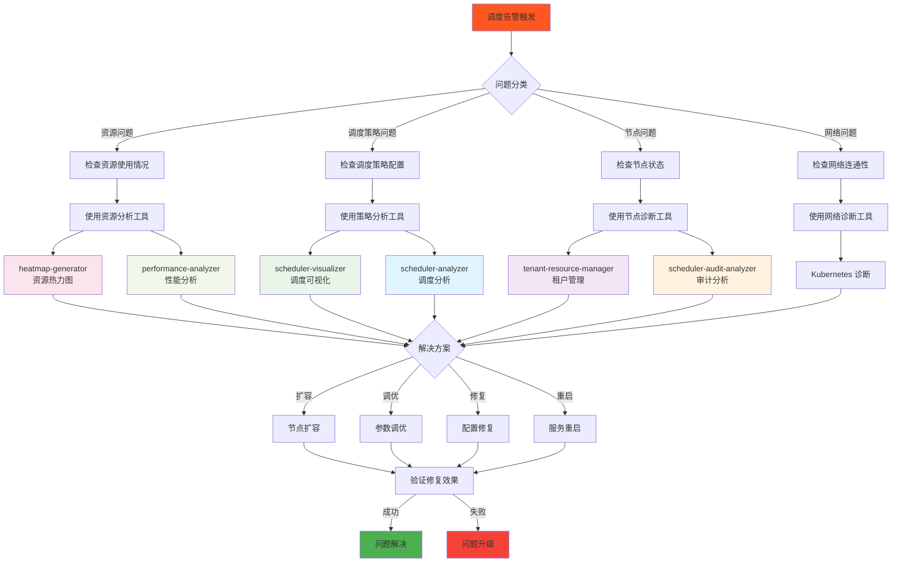
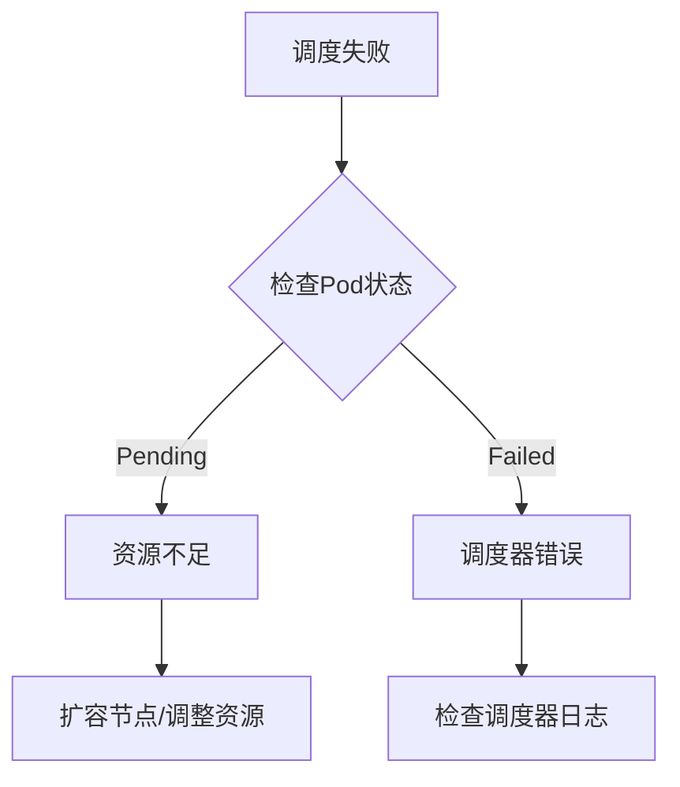
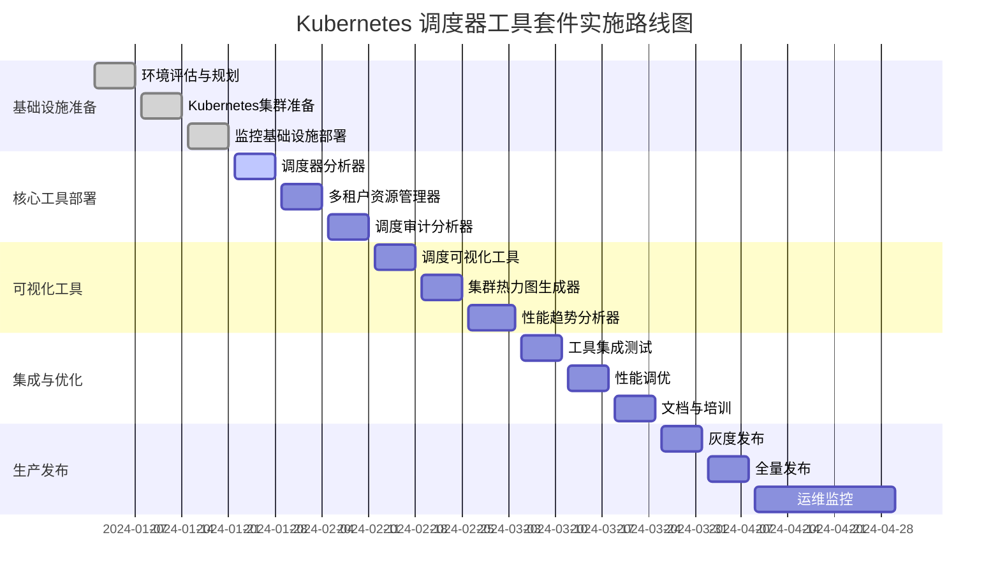
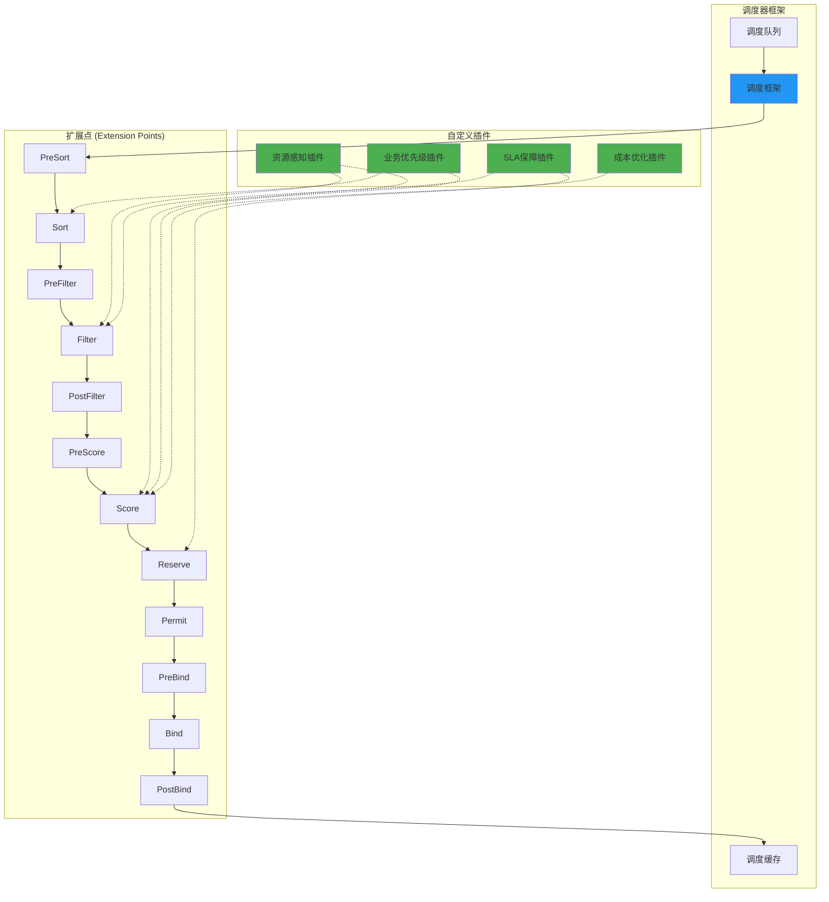
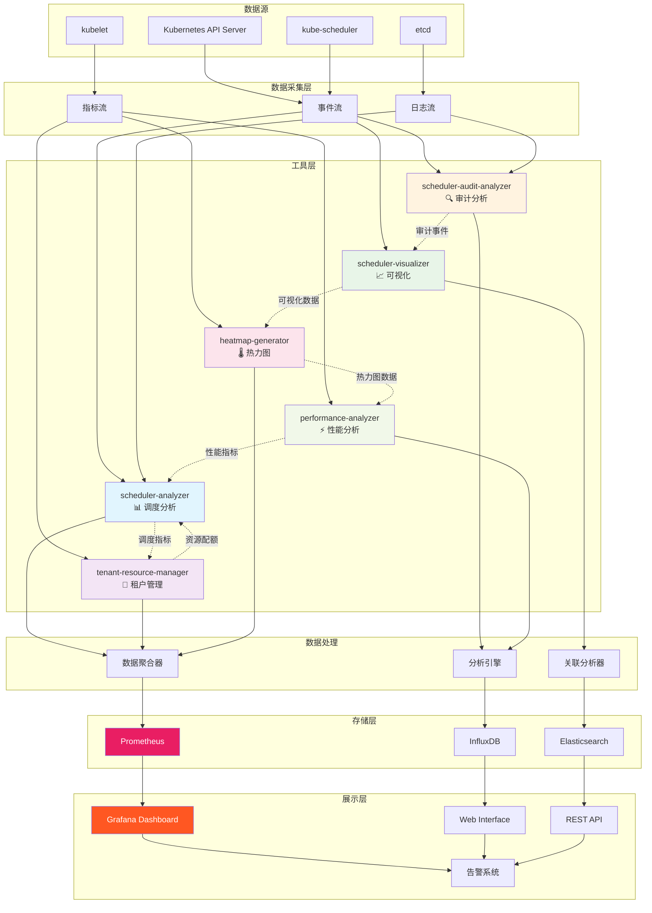
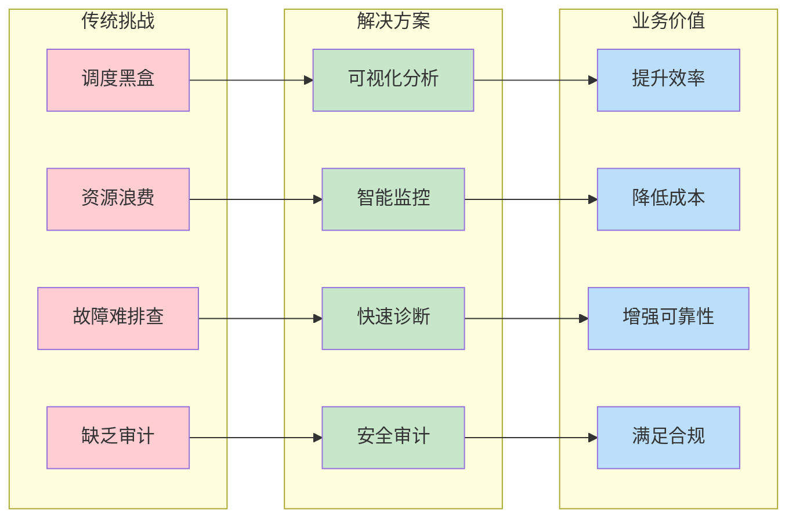

# Kubernetes 调度器生产最佳实践

本文将详细介绍如何通过部署和配置一套完整的Kubernetes调度器工具套件，系统性解决上述生产环境挑战，帮助企业构建高效、可靠、可观测的调度系统。

## 目录

- [Kubernetes 调度器生产最佳实践](#kubernetes-调度器生产最佳实践)
  - [目录](#目录)
  - [1. 生产环境调度挑战](#1-生产环境调度挑战)
    - [1.1 关键挑战](#11-关键挑战)
    - [1.2 业务影响量化](#12-业务影响量化)
    - [1.3 解决方案预期](#13-解决方案预期)
  - [2. 快速开始](#2-快速开始)
  - [3. 项目结构](#3-项目结构)
    - [3.1 核心目录说明](#31-核心目录说明)
    - [3.2 构建项目](#32-构建项目)
      - [3.2.1 方式一：使用Makefile（推荐）](#321-方式一使用makefile推荐)
      - [3.2.2 方式二：使用构建脚本](#322-方式二使用构建脚本)
      - [3.2.3 方式三：直接使用Go命令](#323-方式三直接使用go命令)
    - [3.3 部署到 Kubernetes](#33-部署到-kubernetes)
      - [3.3.1 部署架构图](#331-部署架构图)
      - [3.3.2 方式一：使用Makefile（推荐）](#332-方式一使用makefile推荐)
      - [3.3.3 方式二：直接使用kubectl](#333-方式二直接使用kubectl)
      - [3.3.4 方式三：使用构建脚本部署](#334-方式三使用构建脚本部署)
      - [3.3.5 验证部署](#335-验证部署)
    - [3.4 快速访问](#34-快速访问)
  - [4. 生产环境调度器配置](#4-生产环境调度器配置)
    - [4.1 高可用调度器部署](#41-高可用调度器部署)
      - [4.1.1 多实例部署](#411-多实例部署)
      - [4.1.2 生产级调度器配置](#412-生产级调度器配置)
    - [4.2 调度器性能调优](#42-调度器性能调优)
      - [4.2.1 调度延迟优化](#421-调度延迟优化)
      - [4.2.2 内存使用优化](#422-内存使用优化)
    - [4.3 多调度器策略](#43-多调度器策略)
      - [4.3.1 工作负载专用调度器](#431-工作负载专用调度器)
      - [4.3.2 调度器选择策略](#432-调度器选择策略)
  - [5. 资源管理与优化](#5-资源管理与优化)
    - [5.1 资源管理架构](#51-资源管理架构)
    - [5.2 资源配额与限制](#52-资源配额与限制)
      - [5.2.1 动态资源配额管理](#521-动态资源配额管理)
      - [5.2.2 优先级资源分配](#522-优先级资源分配)
    - [5.3 节点资源优化](#53-节点资源优化)
      - [5.3.1 节点资源监控与调优](#531-节点资源监控与调优)
    - [5.4 工作负载分类调度](#54-工作负载分类调度)
      - [5.4.1 智能工作负载分类器](#541-智能工作负载分类器)
      - [5.4.2 工作负载调度策略配置](#542-工作负载调度策略配置)
  - [6. 高级调度策略](#6-高级调度策略)
    - [调度策略决策流程](#调度策略决策流程)
    - [6.1 自定义调度器插件](#61-自定义调度器插件)
      - [6.1.1 延迟感知调度插件](#611-延迟感知调度插件)
      - [6.1.2 成本优化调度插件](#612-成本优化调度插件)
    - [6.2 批处理调度优化](#62-批处理调度优化)
      - [6.2.1 批处理调度器实现](#621-批处理调度器实现)
      - [6.2.2 批处理调度配置](#622-批处理调度配置)
    - [6.3 边缘计算调度](#63-边缘计算调度)
      - [6.3.1 边缘节点调度器](#631-边缘节点调度器)
      - [6.3.2 边缘调度配置](#632-边缘调度配置)
      - [6.3.3 边缘节点标签配置](#633-边缘节点标签配置)
      - [6.3.4 边缘工作负载示例](#634-边缘工作负载示例)
  - [7. 监控与可观测性](#7-监控与可观测性)
    - [7.1 监控架构总览](#71-监控架构总览)
    - [7.2 调度器指标监控](#72-调度器指标监控)
      - [7.2.1 Prometheus 指标收集](#721-prometheus-指标收集)
      - [7.2.2 监控配置部署](#722-监控配置部署)
    - [7.3 性能分析与诊断](#73-性能分析与诊断)
      - [7.3.1 调度器性能分析工具](#731-调度器性能分析工具)
    - [7.4 告警与自动化](#74-告警与自动化)
      - [7.4.1 Prometheus 告警规则](#741-prometheus-告警规则)
      - [7.4.2 自动化响应系统](#742-自动化响应系统)
  - [8. 故障排除与恢复](#8-故障排除与恢复)
    - [8.1 故障排除流程图](#81-故障排除流程图)
    - [8.2 常见调度问题](#82-常见调度问题)
      - [8.2.1 快速诊断流程](#821-快速诊断流程)
    - [8.3 故障检测与自动恢复](#83-故障检测与自动恢复)
      - [8.3.1 健康检查配置](#831-健康检查配置)
      - [8.3.2 自动恢复策略](#832-自动恢复策略)
    - [8.4 监控和告警集成](#84-监控和告警集成)
  - [9. 最佳实践与配置](#9-最佳实践与配置)
    - [9.1 实施路线图](#91-实施路线图)
    - [9.2 生产环境配置](#92-生产环境配置)
      - [9.2.1 高可用部署](#921-高可用部署)
      - [9.2.2 核心配置优化](#922-核心配置优化)
    - [9.3 资源管理与多租户](#93-资源管理与多租户)
      - [9.3.1 分层资源配额](#931-分层资源配额)
      - [9.3.2 多租户资源管理](#932-多租户资源管理)
    - [9.4 性能调优与监控](#94-性能调优与监控)
      - [9.4.1 性能指标监控](#941-性能指标监控)
      - [9.4.2 批量调度优化](#942-批量调度优化)
    - [9.5 安全配置](#95-安全配置)
      - [9.5.1 RBAC权限控制](#951-rbac权限控制)
  - [10. 高级特性与扩展](#10-高级特性与扩展)
    - [10.1 自定义插件开发](#101-自定义插件开发)
      - [10.1.1 插件架构与扩展点](#1011-插件架构与扩展点)
      - [10.1.2 插件开发框架](#1012-插件开发框架)
      - [10.1.3 边缘计算调度](#1013-边缘计算调度)
    - [10.2 多集群与AI/ML支持](#102-多集群与aiml支持)
      - [10.2.1 多集群调度](#1021-多集群调度)
      - [10.2.2 AI/ML工作负载优化](#1022-aiml工作负载优化)
    - [10.3 安全与审计](#103-安全与审计)
      - [10.3.1 安全配置](#1031-安全配置)
      - [10.3.2 审计分析](#1032-审计分析)
  - [11. 可视化和分析工具](#11-可视化和分析工具)
    - [11.1 工具间关系与数据流](#111-工具间关系与数据流)
    - [11.2 工具协作模式](#112-工具协作模式)
    - [11.3 可视化工具](#113-可视化工具)
      - [11.3.1 调度器可视化](#1131-调度器可视化)
      - [11.3.2 集群热力图](#1132-集群热力图)
    - [11.4 性能分析](#114-性能分析)
      - [11.4.1 性能分析器](#1141-性能分析器)
  - [12. 详细使用指南](#12-详细使用指南)
    - [12.1 工具架构与通用功能](#121-工具架构与通用功能)
    - [12.2 多租户资源管理器](#122-多租户资源管理器)
    - [12.3 调度器安全审计分析器](#123-调度器安全审计分析器)
    - [12.4 调度器分析器](#124-调度器分析器)
    - [12.5 调度决策可视化工具](#125-调度决策可视化工具)
    - [12.6 集群资源热力图生成器](#126-集群资源热力图生成器)
    - [12.7 调度性能趋势分析器](#127-调度性能趋势分析器)
    - [12.8 工具配置参考](#128-工具配置参考)
  - [13. API 接口说明](#13-api-接口说明)
    - [13.1 通用API规范](#131-通用api规范)
    - [13.2 各工具API接口总览](#132-各工具api接口总览)
    - [13.3 详细API文档](#133-详细api文档)
  - [14. 总结与展望](#14-总结与展望)
    - [14.1 工具套件价值体现](#141-工具套件价值体现)
    - [14.2 核心能力总结](#142-核心能力总结)
    - [14.3 技术亮点](#143-技术亮点)
    - [14.4 适用场景](#144-适用场景)
    - [14.5 最佳实践建议](#145-最佳实践建议)

---

## 1. 生产环境调度挑战

在企业级Kubernetes生产环境中，调度器面临着前所未有的复杂挑战：

### 1.1 关键挑战

**1. 调度决策不透明：**

- 为什么Pod被调度到特定节点？调度器的决策逻辑对运维团队来说是个"黑盒"
- 当调度失败时，缺乏有效的诊断工具快速定位根因
- 无法量化不同调度策略对业务性能的实际影响

**2. 资源利用率持续低下：**

- 集群整体CPU利用率常年徘徊在30-40%，但仍频繁出现资源不足
- 资源碎片化严重，大型Pod无法调度，小型Pod却能正常运行
- 缺乏实时的资源使用热力图，无法直观了解集群负载分布

**3. 多租户管理复杂度激增：**

- 不同业务团队共享集群，资源配额管理成为运维噩梦
- 突发流量时，关键业务无法获得优先资源保障
- 租户间资源隔离不彻底，影响业务稳定性

**4. 性能瓶颈难以识别：**

- 调度延迟随着集群规模增长而恶化，但无法精确定位瓶颈点
- 缺乏调度器性能趋势分析，无法预测何时需要扩容或优化
- 自定义调度策略的性能影响无法量化评估

**5. 安全合规要求严格：**

- 金融、医疗等行业要求完整的调度行为审计日志
- 需要证明调度决策符合数据本地化和合规性要求
- 缺乏自动化的安全策略验证机制

### 1.2 业务影响量化

根据行业调研数据：

- **成本浪费**：资源利用率每提升10%，可节省云成本15-25%
- **效率损失**：调度问题导致的应用部署延迟，平均影响开发效率20%
- **运维负担**：手动排查调度问题，运维团队60%时间消耗在重复性诊断工作
- **合规风险**：缺乏审计能力可能导致合规检查失败，面临监管处罚

### 1.3 解决方案预期

企业迫切需要一套**企业级调度器工具套件**，能够：

- **透明化调度过程**：实时可视化调度决策链路
- **优化资源配置**：基于数据驱动的资源分配策略
- **简化多租户管理**：自动化的配额管理和隔离机制
- **提升调度性能**：持续的性能监控和优化建议
- **满足合规要求**：完整的审计追踪和安全保障

---

## 2. 快速开始

**前置条件：** Kubernetes 1.28+ 集群，kubectl 已配置，Go 1.23+

**环境要求：**

- **Kubernetes**: 1.28+ 集群
- **Go**: 1.23+ (用于本地构建)
- **Docker**: 最新版本 (用于容器化部署)
- **kubectl**: 已配置并可访问集群
- **Make**: 可选，用于使用Makefile构建

**推荐配置：**

- 集群节点：至少3个节点
- 内存：每个节点至少4GB可用内存
- CPU：每个节点至少2核CPU
- 存储：支持动态存储卷供应

---

## 3. 项目结构

```bash
code-examples/
├── cmd/                          # 主程序入口
│   ├── performance-analyzer/     # 性能分析器 (HTTP: 8081)
│   │   └── main.go
│   ├── heatmap-generator/        # 热力图生成器 (HTTP: 8082, Metrics: 8081)
│   │   └── main.go
│   ├── scheduler-analyzer/       # 调度器分析器 (HTTP: 8080, Metrics: 8081)
│   │   └── main.go
│   ├── scheduler-visualizer/     # 调度器可视化 (HTTP: 8080, Metrics: 8081)
│   │   └── main.go
│   ├── tenant-resource-manager/  # 多租户资源管理器 (HTTP: 8080, Metrics: 8081)
│   │   └── main.go
│   └── scheduler-audit-analyzer/ # 调度审计分析器 (HTTP: 8080, Metrics: 8081)
│       └── main.go
├── pkg/                          # 共享包
│   ├── analyzer/                 # 分析器核心逻辑
│   │   ├── performance/          # 性能分析
│   │   ├── scheduler/            # 调度分析
│   │   └── audit/                # 审计分析
│   ├── metrics/                  # 指标收集和Prometheus集成
│   │   ├── collector.go
│   │   └── server.go
│   ├── scheduler/                # 调度器相关功能
│   │   ├── client.go
│   │   └── types.go
│   ├── visualizer/               # 可视化组件
│   │   ├── heatmap/              # 热力图生成
│   │   ├── charts/               # 图表组件
│   │   └── web/                  # Web界面
│   ├── tenant/                   # 多租户管理
│   │   ├── manager.go
│   │   └── resource.go
│   └── utils/                    # 工具函数
│       ├── k8s/                  # Kubernetes客户端
│       ├── http/                 # HTTP服务器
│       └── config/               # 配置管理
├── configs/                      # 配置文件
│   ├── scheduler/                # 调度器配置
│   │   ├── scheduler-config.yaml
│   │   └── scheduler-ha-deployment.yaml
│   └── monitoring/               # 监控配置
│       ├── prometheus.yaml
│       └── scheduler-monitoring.yaml
├── deployments/                  # 部署文件
│   ├── kubernetes/               # Kubernetes部署文件
│   │   ├── rbac.yaml             # RBAC权限配置
│   │   ├── scheduler-analyzer-deployment.yaml
│   │   ├── heatmap-generator-deployment.yaml
│   │   ├── performance-analyzer-deployment.yaml
│   │   ├── scheduler-visualizer-deployment.yaml
│   │   ├── tenant-resource-manager-deployment.yaml
│   │   └── scheduler-audit-analyzer-deployment.yaml
│   └── docker/                   # Docker相关文件
│       └── Dockerfile
├── web/                          # Web静态资源
│   ├── static/                   # 静态文件 (CSS, JS, 图片)
│   └── templates/                # HTML模板
├── docs/                         # 文档
│   ├── README.md                 # 详细使用文档
│   ├── API.md                    # API接口文档
│   └── examples/                 # 使用示例
├── examples/                     # 示例代码和配置
│   ├── workloads/                # 示例工作负载
│   └── configs/                  # 示例配置
├── scripts/                      # 脚本文件
│   ├── build.sh                  # 构建脚本
│   ├── build-local.sh            # 本地构建脚本
│   └── deploy.sh                 # 部署脚本
├── tests/                        # 测试文件
│   ├── unit/                     # 单元测试
│   ├── integration/              # 集成测试
│   └── e2e/                      # 端到端测试
├── bin/                          # 构建输出目录
├── Makefile                      # Make构建文件
├── go.mod                        # Go模块文件
├── go.sum                        # Go依赖校验
├── README.md                     # 项目说明
└── .gitignore                    # Git忽略文件
```

### 3.1 核心目录说明

- **cmd/**: 每个工具的主程序入口，包含main.go文件
- **pkg/**: 共享的Go包，按功能模块组织
- **deployments/kubernetes/**: Kubernetes部署文件，包含所有工具的Deployment和Service配置
- **web/**: Web界面的静态资源和模板文件
- **configs/**: 调度器和监控相关的配置文件
- **scripts/**: 构建、部署和管理脚本
- **docs/**: 详细的使用文档和API说明

### 3.2 构建项目

#### 3.2.1 方式一：使用Makefile（推荐）

```bash
# 检查环境
make check-env

# 下载依赖
make deps

# 构建所有工具
make build-all

# 单独构建特定工具
make build TOOL=scheduler-analyzer
make build TOOL=heatmap-generator
make build TOOL=performance-analyzer
make build TOOL=scheduler-visualizer
make build TOOL=tenant-resource-manager
make build TOOL=scheduler-audit-analyzer

# 运行测试
make test

# 代码格式化和检查
make fmt
make lint
```

#### 3.2.2 方式二：使用构建脚本

```bash
# 构建所有工具的Docker镜像
./build.sh --all

# 构建特定工具
./build.sh scheduler-analyzer
./build.sh heatmap-generator

# 构建并推送到镜像仓库
./build.sh -r docker.io/myorg -t v1.0.0 --push --all
```

#### 3.2.3 方式三：直接使用Go命令

```bash
# 构建所有工具的二进制文件
go build -o bin/scheduler-analyzer ./cmd/scheduler-analyzer
go build -o bin/heatmap-generator ./cmd/heatmap-generator
go build -o bin/performance-analyzer ./cmd/performance-analyzer
go build -o bin/scheduler-visualizer ./cmd/scheduler-visualizer
go build -o bin/tenant-resource-manager ./cmd/tenant-resource-manager
go build -o bin/scheduler-audit-analyzer ./cmd/scheduler-audit-analyzer

# 或使用本地构建脚本
./build-local.sh --all
```

> **注意**: 如果在Docker构建过程中遇到网络连接问题（如TLS握手超时），构建脚本已配置使用 `--network=host` 参数来解决网络连接问题。

### 3.3 部署到 Kubernetes

#### 3.3.1 部署架构图



#### 3.3.2 方式一：使用Makefile（推荐）

```bash
# 部署所有工具
make deploy-all

# 单独部署特定工具
make deploy TOOL=scheduler-analyzer
make deploy TOOL=heatmap-generator
make deploy TOOL=performance-analyzer

# 使用自定义镜像仓库和标签
make deploy-all REGISTRY=docker.io/myorg TAG=v1.0.0

# 查看部署状态
make status

# 卸载工具
make undeploy TOOL=scheduler-analyzer
make undeploy-all
```

#### 3.3.3 方式二：直接使用kubectl

```bash
# 部署所有工具和RBAC配置
kubectl apply -f deployments/kubernetes/

# 单独部署特定工具
kubectl apply -f deployments/kubernetes/scheduler-analyzer-deployment.yaml
kubectl apply -f deployments/kubernetes/heatmap-generator-deployment.yaml
kubectl apply -f deployments/kubernetes/performance-analyzer-deployment.yaml
kubectl apply -f deployments/kubernetes/scheduler-visualizer-deployment.yaml
kubectl apply -f deployments/kubernetes/tenant-resource-manager-deployment.yaml
kubectl apply -f deployments/kubernetes/scheduler-audit-analyzer-deployment.yaml

# 应用RBAC权限配置
kubectl apply -f deployments/kubernetes/rbac.yaml

# 应用调度器和监控配置
kubectl apply -f configs/scheduler/
kubectl apply -f configs/monitoring/
```

#### 3.3.4 方式三：使用构建脚本部署

```bash
# 构建并部署所有工具
./build.sh --deploy --all

# 构建并部署特定工具
./build.sh --deploy scheduler-analyzer
```

#### 3.3.5 验证部署

```bash
# 检查Pod状态
kubectl get pods -l app.kubernetes.io/component=scheduler-tools

# 检查服务状态
kubectl get services -l app.kubernetes.io/component=scheduler-tools

# 查看日志
kubectl logs -l app.kubernetes.io/name=scheduler-analyzer -f

# 检查健康状态
kubectl get pods -l app.kubernetes.io/component=scheduler-tools -o wide
```

### 3.4 快速访问

```bash
# 1. 克隆项目并进入目录
cd code-examples/

# 2. 构建所有工具
make build-all
# 或使用构建脚本
./build.sh --all

# 3. 部署所有工具到Kubernetes
kubectl apply -f deployments/kubernetes/

# 4. 验证部署状态
kubectl get pods -l app.kubernetes.io/component=scheduler-tools
kubectl get services -l app.kubernetes.io/component=scheduler-tools

# 5. 访问Web界面（示例）
# 调度器分析器
kubectl port-forward service/scheduler-analyzer 8080:8080 &
open http://localhost:8080

# 集群热力图
kubectl port-forward service/heatmap-generator 8082:8082 &
open http://localhost:8082
```

**核心配置检查清单：**

- ✅ 所有工具Pod运行正常
- ✅ 服务端点可访问
- ✅ Web界面正常显示
- ✅ API接口响应正常
- ✅ Prometheus指标可访问

> **详细配置信息**：完整的工具端口配置、API接口说明和高级使用方法请参考 [第12章 详细使用指南](#12-详细使用指南)。

---

## 4. 生产环境调度器配置

**本章核心要点：**

- 高可用多实例部署策略
- 性能调优和内存优化
- 多调度器协同工作模式
- 生产级配置模板

### 4.1 高可用调度器部署

在生产环境中，调度器的高可用性至关重要。以下是推荐的高可用部署配置：

#### 4.1.1 多实例部署

参考配置文件：[scheduler-ha-deployment.yaml](code-examples/configs/scheduler/scheduler-ha-deployment.yaml)

#### 4.1.2 生产级调度器配置

参考配置文件：[scheduler-config.yaml](code-examples/configs/scheduler/scheduler-config.yaml)

### 4.2 调度器性能调优

#### 4.2.1 调度延迟优化

参考代码文件：[performance-tuning.go](code-examples/pkg/scheduler/performance-tuning.go)

#### 4.2.2 内存使用优化

参考配置文件：[scheduler-memory-optimization.yaml](code-examples/configs/scheduler/scheduler-memory-optimization.yaml)

### 4.3 多调度器策略

#### 4.3.1 工作负载专用调度器

参考配置文件：[workload-scheduling-policies.yaml](code-examples/configs/scheduler/workload-scheduling-policies.yaml)

#### 4.3.2 调度器选择策略

参考代码文件：[scheduler-selector.go](code-examples/pkg/scheduler/scheduler-selector.go)

---

## 5. 资源管理与优化

**本章核心要点：**

- 动态资源配额管理
- 智能工作负载分类
- 节点资源监控与调优
- 优先级资源分配策略

### 5.1 资源管理架构



### 5.2 资源配额与限制

#### 5.2.1 动态资源配额管理

参考代码文件：[dynamic-resource-quota.go](code-examples/pkg/scheduler/dynamic-resource-quota.go)

#### 5.2.2 优先级资源分配

参考配置文件：[priority-resource-allocation.yaml](code-examples/configs/scheduler/priority-resource-allocation.yaml)

### 5.3 节点资源优化

#### 5.3.1 节点资源监控与调优

参考代码文件：[node-resource-optimizer.go](code-examples/pkg/scheduler/node-resource-optimizer.go)

### 5.4 工作负载分类调度

#### 5.4.1 智能工作负载分类器

参考代码文件：[workload-classifier.go](code-examples/pkg/scheduler/workload-classifier.go)

#### 5.4.2 工作负载调度策略配置

参考配置文件：[workload-scheduling-policies.yaml](code-examples/configs/scheduler/workload-scheduling-policies.yaml)

---

## 6. 高级调度策略

**本章核心要点：**

- 延迟感知和成本优化插件
- 批处理调度优化
- 边缘计算调度策略
- 自定义插件开发框架

### 调度策略决策流程



### 6.1 自定义调度器插件

#### 6.1.1 延迟感知调度插件

延迟感知调度插件通过监控网络延迟指标，优先选择延迟较低的节点进行调度。

**核心实现要点：**

- 实现 `FilterPlugin` 和 `ScorePlugin` 接口
- 在 Filter 阶段过滤延迟超过阈值的节点
- 在 Score 阶段基于延迟指标进行评分

**参考实现模式：**

详细的插件开发指南和代码示例请参考：[k8s-scheduler-intro-basic.md](../调度/k8s-scheduler-intro-basic.md) 第 3.2.2 节的自定义插件开发部分。

#### 6.1.2 成本优化调度插件

成本优化调度插件根据节点的成本效益比进行调度决策，优先选择性价比高的节点。

**核心实现要点：**

- 集成云服务商的定价 API 获取实时成本信息
- 结合资源利用率计算成本效益比
- 支持多维度成本优化策略（计算、存储、网络）

**开发框架参考：**

插件开发的基础框架、接口定义和配置方法请参考：[k8s-scheduler-intro-basic.md](../调度/k8s-scheduler-intro-basic.md) 第 3.2 节的调度插件框架部分。

### 6.2 批处理调度优化

#### 6.2.1 批处理调度器实现

参考代码文件：[batch-scheduler.go](code-examples/pkg/scheduler/batch-scheduler.go)

#### 6.2.2 批处理调度配置

参考配置文件：[batch-scheduler-config.yaml](code-examples/configs/scheduler/batch-scheduler-config.yaml)

### 6.3 边缘计算调度

#### 6.3.1 边缘节点调度器

参考实现代码：[edge-scheduler.go](code-examples/pkg/scheduler/edge-scheduler.go)

#### 6.3.2 边缘调度配置

参考配置文件：[edge-scheduler-config.yaml](code-examples/configs/scheduler/edge-scheduler-config.yaml)

#### 6.3.3 边缘节点标签配置

参考配置文件：[edge-node-labels.yaml](code-examples/configs/scheduler/edge-node-labels.yaml)

#### 6.3.4 边缘工作负载示例

参考配置文件：[edge-workload-example.yaml](code-examples/configs/scheduler/edge-workload-example.yaml)

---

## 7. 监控与可观测性

**本章核心要点：**

- Prometheus指标收集体系
- 性能分析和诊断工具
- 自动化告警和响应
- 实时健康状态监控

### 7.1 监控架构总览



### 7.2 调度器指标监控

#### 7.2.1 Prometheus 指标收集

参考代码文件：[scheduler-metrics.go](code-examples/pkg/scheduler/scheduler-metrics.go)

#### 7.2.2 监控配置部署

参考配置文件：[scheduler-monitoring.yaml](code-examples/configs/monitoring/scheduler-monitoring.yaml)

### 7.3 性能分析与诊断

#### 7.3.1 调度器性能分析工具

参考实现代码：[scheduler-analyzer.go](code-examples/pkg/scheduler/scheduler-analyzer.go)

**调度器分析工具：** [code-examples/cmd/scheduler-analyzer/main.go](code-examples/cmd/scheduler-analyzer/main.go)

该工具提供了完整的调度器分析功能，包括：

- 调度器性能指标收集和分析
- 资源利用率统计和报告生成
- HTTP API 接口和 Web 界面（端口8080）
- Prometheus指标端点（端口8081）
- JSON 和文本格式的分析报告输出
- 实时调度器健康状态监控

**Web界面访问：**

```bash
# 本地运行
go run code-examples/cmd/scheduler-analyzer/main.go
# 访问: http://localhost:8080

# Kubernetes部署
kubectl port-forward service/scheduler-analyzer 8080:8080
# 访问: http://localhost:8080
```

### 7.4 告警与自动化

#### 7.4.1 Prometheus 告警规则

参考配置文件：[scheduler-alerts.yaml](code-examples/configs/monitoring/scheduler-alerts.yaml)

#### 7.4.2 自动化响应系统

自动化响应系统的完整实现请参考：[scheduler-analyzer](code-examples/cmd/scheduler-analyzer/main.go)

该实现提供了调度器分析和自动化响应功能，包括性能指标收集、资源分析和健康监控。

---

## 8. 故障排除与恢复

**本章核心要点：**

- 常见调度问题快速诊断
- 自动故障检测和恢复
- 监控告警集成方案
- 故障排除工具和流程

### 8.1 故障排除流程图



### 8.2 常见调度问题

#### 8.2.1 快速诊断流程

**调度问题诊断决策树：**



**故障排除工具：** [health-checker.go](code-examples/pkg/scheduler/health-checker.go)

**常见问题类型：**

- 资源不足导致的调度失败
- 节点亲和性配置错误
- 调度器插件异常
- Leader选举问题

### 8.3 故障检测与自动恢复

#### 8.3.1 健康检查配置

**配置文件：** [scheduler-health-config.yaml](code-examples/configs/scheduler-health-config.yaml)

**核心功能：**

- API健康检查
- 指标收集状态监控
- Leader选举状态检测
- 自动重试和恢复机制

#### 8.3.2 自动恢复策略

**恢复管理器：** [recovery-manager.go](code-examples/pkg/scheduler/recovery-manager.go)

**恢复策略：**

- 调度器重启
- Leader选举恢复
- Pod重新调度
- 升级回退机制

### 8.4 监控和告警集成

**监控配置：** [monitoring-config.yaml](code-examples/configs/monitoring-config.yaml)

**核心告警规则：**

- 高待调度Pod数量（>100个）
- 调度失败率过高（>5%）
- 调度延迟过高（>1秒）
- 调度吞吐量过低（<10个/秒）

**分析工具：** [scheduler-analyzer](code-examples/cmd/scheduler-analyzer/main.go)

- 性能指标收集和分析
- HTTP API和Web UI界面（端口8080）
- Prometheus指标端点（端口8081）
- 实时健康监控

**快速访问：**

```bash
# 启动工具
go run code-examples/cmd/scheduler-analyzer/main.go
# Web界面: http://localhost:8080
# 指标端点: http://localhost:8081/metrics
```

---

## 9. 最佳实践与配置

**本章核心要点:**

- 生产环境配置模板
- 资源配额和多租户管理
- 性能调优策略
- 安全配置要点

### 9.1 实施路线图



### 9.2 生产环境配置

#### 9.2.1 高可用部署

**部署配置：** [scheduler-ha-deployment.yaml](code-examples/configs/scheduler/scheduler-ha-deployment.yaml)

**核心特性：**

- 3副本部署确保高可用
- Leader选举机制
- Pod反亲和性分布
- 健康检查和资源限制

#### 9.2.2 核心配置优化

**配置文件：** [scheduler-config.yaml](code-examples/configs/scheduler/scheduler-config.yaml)

**性能参数：**

- 并行度：16
- 节点评分百分比：50%
- QPS：100，Burst：200
- 插件权重优化

### 9.3 资源管理与多租户

#### 9.3.1 分层资源配额

**配置文件：** [priority-resource-allocation.yaml](code-examples/configs/scheduler/priority-resource-allocation.yaml)

**管理策略：**

- 高/中/低优先级ResourceQuota
- PriorityClass定义
- GPU等扩展资源配额

#### 9.3.2 多租户资源管理

**管理器：** [tenant-resource-manager](code-examples/cmd/tenant-resource-manager/main.go)

**核心功能：**

- 租户注册和配置
- 动态资源配额控制
- 突发使用策略
- 多环境配额管理

### 9.4 性能调优与监控

#### 9.4.1 性能指标监控

**指标收集：** [scheduler-metrics.go](code-examples/pkg/scheduler/scheduler-metrics.go)

**监控内容：**

- 调度延迟和吞吐量
- 插件执行时间
- 队列长度和资源利用率

#### 9.4.2 批量调度优化

**批量调度器：** [batch-scheduler.go](code-examples/pkg/scheduler/batch-scheduler.go)

**优化特性：**

- 批量Pod优先级排序
- 并发调度处理
- 负载均衡评分

### 9.5 安全配置

#### 9.5.1 RBAC权限控制

**安全配置文件：**

- [batch-scheduler-config.yaml](code-examples/configs/scheduler/batch-scheduler-config.yaml)
- [edge-scheduler-config.yaml](code-examples/configs/scheduler/edge-scheduler-config.yaml)

**安全要点：**

- 最小权限原则
- 网络策略隔离
- 审计配置

---

## 10. 高级特性与扩展

**本章核心要点：**

- 自定义调度器插件开发
- 边缘计算和多集群调度
- AI/ML工作负载优化
- 安全与合规配置

### 10.1 自定义插件开发

#### 10.1.1 插件架构与扩展点

**插件架构：**



#### 10.1.2 插件开发框架

**自定义插件：** [custom-scheduler-plugin.go](code-examples/pkg/scheduler/custom-scheduler-plugin.go)

- 自定义过滤和评分插件
- 插件配置和注册机制

#### 10.1.3 边缘计算调度

**边缘调度器：** [edge-scheduler.go](code-examples/pkg/scheduler/edge-scheduler.go)

- 边缘节点感知调度
- 网络延迟优化
- 离线/在线节点处理

### 10.2 多集群与AI/ML支持

#### 10.2.1 多集群调度

**多集群调度器：** [multi-cluster-scheduler.go](code-examples/pkg/scheduler/multi-cluster-scheduler.go)

- 跨集群资源发现
- 集群间负载均衡
- 故障转移机制

#### 10.2.2 AI/ML工作负载优化

**GPU调度器：** [gpu-scheduler.go](code-examples/pkg/scheduler/gpu-scheduler.go)
**ML任务调度器：** [ml-scheduler.go](code-examples/pkg/scheduler/ml-scheduler.go)

### 10.3 安全与审计

#### 10.3.1 安全配置

**核心配置文件：**

- [scheduler-ha-deployment.yaml](code-examples/configs/scheduler/scheduler-ha-deployment.yaml)
- [scheduler-health-config.yaml](code-examples/configs/scheduler-health-config.yaml)
- [scheduler-recovery-config.yaml](code-examples/configs/scheduler-recovery-config.yaml)
- [preemption-config.yaml](code-examples/configs/scheduler/preemption-config.yaml)

#### 10.3.2 审计分析

**审计工具：** [scheduler-audit-analyzer](code-examples/cmd/scheduler-audit-analyzer/main.go)
**监控配置：**

- [scheduler-alerts.yaml](code-examples/configs/scheduler-alerts.yaml)
- [scheduler-monitoring.yaml](code-examples/configs/scheduler-monitoring.yaml)

---

## 11. 可视化和分析工具

**本章核心要点：**

- 实时调度状态可视化
- 集群热力图生成
- 性能分析和优化建议

### 11.1 工具间关系与数据流



### 11.2 工具协作模式

| 协作场景 | 涉及工具 | 数据流向 | 应用价值 |
|----------|----------|----------|----------|
| **调度性能优化** | SA + PA + HG | 调度指标 → 性能分析 → 热力图展示 | 识别性能瓶颈，优化调度策略 |
| **多租户资源治理** | TRM + SA + SAA | 资源配额 → 调度分析 → 审计检查 | 确保资源公平分配和合规性 |
| **故障根因分析** | SV + SAA + PA | 可视化展示 → 审计追踪 → 性能关联 | 快速定位问题根本原因 |
| **容量规划** | HG + PA + TRM | 热力图 → 趋势分析 → 配额调整 | 科学制定扩容和配额策略 |
| **安全合规监控** | SAA + SV + SA | 审计日志 → 可视化 → 调度分析 | 满足企业安全和合规要求 |

### 11.3 可视化工具

#### 11.3.1 调度器可视化

**可视化工具：** [scheduler-visualizer](code-examples/cmd/scheduler-visualizer/main.go)

- 实时调度状态展示
- 调度决策流程可视化
- 性能指标仪表板
- Web界面（端口8080）
- Prometheus指标（端口8081）

**快速访问：**

```bash
# 启动工具
go run code-examples/cmd/scheduler-visualizer/main.go
# Web界面: http://localhost:8080
```

#### 11.3.2 集群热力图

**热力图生成器：** [heatmap-generator](code-examples/cmd/heatmap-generator/main.go)

- 节点资源使用热力图
- 调度密度分布图
- 负载均衡可视化
- Web界面（端口8082）
- Prometheus指标（端口8081）

**快速访问：**

```bash
# 启动工具
go run code-examples/cmd/heatmap-generator/main.go
# Web界面: http://localhost:8082
```

### 11.4 性能分析

#### 11.4.1 性能分析器

**部署配置：** [performance-analyzer-deployment.yaml](code-examples/deployments/kubernetes/performance-analyzer-deployment.yaml)
**分析工具：** [performance-analyzer](code-examples/cmd/performance-analyzer/main.go)

**分析功能：**

- 调度延迟分析
- 吞吐量统计
- 瓶颈识别和优化建议
- Web界面（端口8081）

**快速访问：**

```bash
# 启动工具
go run code-examples/cmd/performance-analyzer/main.go
# Web界面: http://localhost:8081
```

---

## 12. 详细使用指南

### 12.1 工具架构与通用功能

所有工具都基于统一的架构设计，提供以下核心功能：

- **仪表板**: 实时监控和关键指标展示
- **数据可视化**: 图表、热力图、流程图等多种可视化方式
- **API接口**: RESTful API支持程序化访问
- **健康检查**: `/health` 端点用于监控服务状态
- **指标导出**: Prometheus格式指标（端口8081，performance-analyzer除外）
- **配置管理**: 通过ConfigMap进行配置
- **日志记录**: 结构化日志输出

**运维管理命令**:

```bash
# 查看服务状态
kubectl get pods -n kube-system -l app.kubernetes.io/component=scheduler-tools

# 查看服务日志
kubectl logs -n kube-system deployment/[tool-name] -f

# 访问指标端点（除performance-analyzer外）
curl http://localhost:8081/metrics

# 健康检查
curl http://localhost:[port]/health
```

### 12.2 多租户资源管理器

**工具文件**: `cmd/tenant-resource-manager/main.go` | **端口**: 8080 (HTTP), 8081 (Metrics)

**核心功能**:

- 租户注册和配置验证
- 动态资源配额检查
- 突发使用策略支持
- 配额违规监控和告警
- Web界面管理和监控

**高级配置参数**:

```bash
# 本地运行（开发模式）
go run cmd/tenant-resource-manager/main.go \
  --port=8080 \
  --config-path=/etc/tenant-config \
  --quota-refresh-interval=30s \
  --burst-threshold=1.5
```

**API接口参考**:

- `GET /api/tenants` - 获取租户列表
- `GET /api/tenants/{id}/quota` - 获取租户资源配额
- `POST /api/tenants/{id}/validate` - 验证租户资源使用
- `GET /api/tenants/{id}/usage` - 获取租户资源使用情况

### 12.3 调度器安全审计分析器

**工具文件**: `cmd/scheduler-audit-analyzer/main.go` | **端口**: 8080 (HTTP), 8081 (Metrics)

**核心功能**:

- 调度事件提取和分析
- 安全违规检测
- 调度模式识别
- 异常行为告警
- Web界面展示和分析

**高级配置参数**:

```bash
# 本地运行（开发模式）
go run cmd/scheduler-audit-analyzer/main.go \
  --port=8080 \
  --audit-log=/var/log/audit/audit.log \
  --analysis-interval=60s \
  --violation-threshold=10
```

**API接口参考**:

- `GET /api/audit/events` - 获取审计事件列表
- `GET /api/audit/violations` - 获取安全违规事件
- `GET /api/audit/patterns` - 获取调度模式分析
- `POST /api/audit/analyze` - 触发审计日志分析

### 12.4 调度器分析器

**工具文件**: `cmd/scheduler-analyzer/main.go` | **端口**: 8080 (HTTP), 8081 (Metrics)

**核心功能**:

- 调度器性能分析
- 调度决策路径分析
- 资源利用率统计
- 调度器健康状态监控
- Web界面深度分析

**高级配置参数**:

```bash
# 本地运行（开发模式）
go run cmd/scheduler-analyzer/main.go \
  --port=8080 \
  --scheduler-name=default-scheduler \
  --analysis-depth=detailed \
  --cache-size=1000
```

**API接口参考**:

- `GET /api/analysis/performance` - 获取调度器性能分析
- `GET /api/analysis/decisions` - 获取调度决策路径分析
- `GET /api/analysis/utilization` - 获取资源利用率统计
- `GET /api/analysis/health` - 获取调度器健康状态
- `POST /api/analysis/run` - 触发深度分析

### 12.5 调度决策可视化工具

**工具文件**: `cmd/scheduler-visualizer/main.go` | **端口**: 8080 (HTTP), 8081 (Metrics)

**核心功能**:

- 实时调度决策收集
- Mermaid 流程图生成
- 调度统计分析
- Web 界面展示

**高级配置参数**:

```bash
# 本地运行（开发模式）
go run cmd/scheduler-visualizer/main.go \
  --port=8080 \
  --update-interval=5s \
  --max-decisions=500 \
  --chart-theme=dark
```

**API接口参考**:

- `GET /` - Web 界面主页
- `GET /api/decisions` - 获取调度决策数据 (JSON)
- `GET /api/stats` - 获取调度统计信息 (JSON)
- `GET /api/flowchart` - 获取 Mermaid 流程图 (文本)

### 12.6 集群资源热力图生成器

**工具文件**: `cmd/heatmap-generator/main.go` | **端口**: 8082 (HTTP), 8081 (Metrics)

**核心功能**:

- 节点资源使用率可视化
- D3.js 交互式热力图
- 集群健康状态监控
- 资源分布分析

**高级配置参数**:

```bash
# 本地运行（开发模式）
go run cmd/heatmap-generator/main.go \
  --port=8082 \
  --refresh-interval=10s \
  --color-scheme=viridis \
  --grid-size=auto
```

**API接口参考**:

- `GET /` - Web 界面主页
- `GET /api/heatmap` - 获取热力图数据 (JSON)
- `GET /?format=json` - 获取 JSON 格式数据

### 12.7 调度性能趋势分析器

**工具文件**: `cmd/performance-analyzer/main.go` | **端口**: 8081 (HTTP)

**核心功能**:

- 多维度性能指标收集
- 趋势分析和预测
- 异常检测和告警
- 优化建议生成

**高级配置参数**:

```bash
# 本地运行（开发模式）
go run cmd/performance-analyzer/main.go \
  --port=8081 \
  --analysis-window=1h \
  --prediction-horizon=24h \
  --alert-threshold=0.8
```

**API接口参考**:

- `GET /` - Web 界面主页
- `GET /api/analysis` - 获取性能分析数据 (JSON)

> **注意**: performance-analyzer 不提供单独的 Metrics 端口，指标集成在主服务中。

### 12.8 工具配置参考

**端口配置总览**:

| 工具 | HTTP端口 | Metrics端口 | 部署文件 |
|------|----------|-------------|----------|
| scheduler-analyzer | 8080 | 8081 | scheduler-analyzer-deployment.yaml |
| tenant-resource-manager | 8080 | 8081 | tenant-resource-manager-deployment.yaml |
| scheduler-audit-analyzer | 8080 | 8081 | scheduler-audit-analyzer-deployment.yaml |
| scheduler-visualizer | 8080 | 8081 | scheduler-visualizer-deployment.yaml |
| heatmap-generator | 8082 | 8081 | heatmap-generator-deployment.yaml |
| performance-analyzer | 8081 | - | performance-analyzer-deployment.yaml |

**通用访问命令**:

```bash
# 部署所有工具
kubectl apply -f deployments/kubernetes/

# 端口转发（示例）
kubectl port-forward service/[tool-name] [port]:[port]

# 访问Web界面
open http://localhost:[port]
```

---

## 13. API 接口说明

### 13.1 通用API规范

所有工具都遵循统一的API设计规范：

- **响应格式**: JSON
- **HTTP状态码**: 标准HTTP状态码
- **健康检查**: 所有工具都提供 `/health` 端点
- **指标端点**: 除performance-analyzer外，其他工具都在8081端口提供 `/metrics` 端点
- **CORS支持**: 支持跨域请求
- **错误处理**: 统一的错误响应格式

### 13.2 各工具API接口总览

| 工具 | 主要API端点 | 功能描述 |
|------|-------------|----------|
| **scheduler-analyzer** | `/api/analysis/*` | 调度器性能和决策分析 |
| **tenant-resource-manager** | `/api/tenants/*` | 多租户资源管理 |
| **scheduler-audit-analyzer** | `/api/audit/*` | 安全审计分析 |
| **scheduler-visualizer** | `/api/decisions`, `/api/stats` | 调度决策可视化 |
| **heatmap-generator** | `/api/heatmap` | 集群资源热力图 |
| **performance-analyzer** | `/api/analysis` | 性能趋势分析 |

### 13.3 详细API文档

完整的API文档和使用示例请参考各工具的使用指南章节（10.1-10.6），每个工具都包含了详细的API接口说明和curl示例。

---

## 14. 总结与展望

### 14.1 工具套件价值体现



### 14.2 核心能力总结

**企业级调度器工具套件核心能力：**

通过本实践指南，我们构建了一套完整的 Kubernetes 调度器高级实践体系，包含六个核心工具：

1. **scheduler-analyzer** (8080)：深度调度分析和决策优化
2. **tenant-resource-manager** (8080)：多租户资源管理和配额控制
3. **scheduler-audit-analyzer** (8080)：调度审计分析和合规检查
4. **scheduler-visualizer** (8080)：调度流程可视化和实时监控
5. **heatmap-generator** (8082)：集群资源热力图生成
6. **performance-analyzer** (8081)：性能分析和瓶颈识别

**技术架构特性：**

- **统一Web界面**：所有工具提供现代化的Web界面，支持实时数据展示
- **Prometheus集成**：内置指标导出功能，支持监控和告警
- **Kubernetes原生**：完全基于Kubernetes API，无需额外依赖
- **微服务架构**：每个工具独立部署，支持水平扩展
- **RESTful API**：提供完整的API接口，支持自动化集成

### 14.3 技术亮点

- **实时可视化**：集群资源热力图和调度流程图
- **智能分析**：多维度的调度决策分析和性能瓶颈识别
- **多租户管理**：细粒度的资源配额和隔离控制
- **审计合规**：完整的调度决策审计和合规检查
- **性能优化**：基于历史数据的动态调优建议
- **容器化部署**：支持Docker和Kubernetes原生部署

### 14.4 适用场景

- **大规模容器平台**：支持数千节点的企业级部署监控
- **多租户SaaS平台**：提供资源隔离和配额管理
- **DevOps团队**：调度器性能分析和故障排查
- **平台运维**：集群资源可视化和容量规划
- **合规审计**：调度决策审计和安全合规检查
- **性能调优**：调度器性能分析和优化建议

### 14.5 最佳实践建议

1. **工具选择**：根据具体需求选择合适的工具组合
2. **端口规划**：合理规划HTTP和Metrics端口，避免冲突
3. **资源配置**：为每个工具分配适当的CPU和内存资源
4. **监控集成**：将Prometheus指标集成到现有监控系统
5. **权限管理**：使用RBAC确保工具的安全访问
6. **渐进式部署**：从小规模开始，逐步扩展到生产环境
7. **持续优化**：基于监控数据持续优化调度策略

**未来发展方向：**

- **AI驱动调度**：集成机器学习算法优化调度决策
- **多云支持**：扩展到多云环境的统一调度管理
- **边缘计算**：支持边缘节点的调度和管理
- **成本优化**：基于成本模型的智能资源分配
- **自动化运维**：增强自动化运维和故障自愈能力

通过本工具套件，企业可以构建一个高效、可靠、可观测的Kubernetes调度系统，满足现代云原生应用的复杂调度需求。

---
